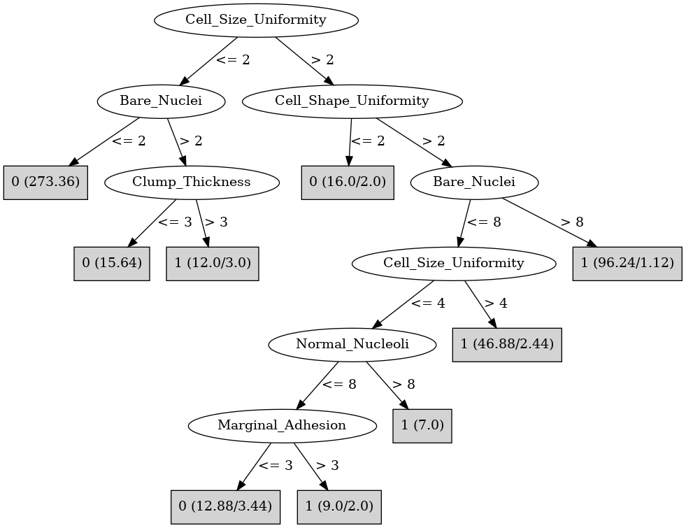

# J48

# SimpleCart Decision Tree

Cell_Size_Uniformity < 2.5

* Bare_Nuclei < 5.5: 0(290.85/4.0)

* Bare_Nuclei >= 5.5: 1(5.0/1.14)

Cell_Size_Uniformity >= 2.5

* Cell_Shape_Uniformity < 2.5: 0(14.0/2.0)

* Cell_Shape_Uniformity >= 2.5

*   * Cell_Size_Uniformity < 4.5

*   *   * Bare_Nuclei < 7.5

*   *   *   * Normal_Nucleoli < 1.5: 0(5.0/0.0)

*   *   *   * Normal_Nucleoli >= 1.5

*   *   *   *   * Clump_Thickness < 4.5: 0(3.0/1.0)

*   *   *   *   * Clump_Thickness >= 4.5

*   *   *   *   *   * Normal_Nucleoli < 8.5: 1(8.51/3.51)

*   *   *   *   *   * Normal_Nucleoli >= 8.5: 1(7.0/0.0)

*   *   * Bare_Nuclei >= 7.5

*   *   *   * Bland_Chromatin < 2.5: 1(3.0/0.48)

*   *   *   * Bland_Chromatin >= 2.5: 1(22.48/0.0)

*   * Cell_Size_Uniformity >= 4.5

*   *   * Bland_Chromatin < 4.5

*   *   *   * Clump_Thickness < 6.5

*   *   *   *   * Bare_Nuclei < 9.0: 0(2.36/1.99)

*   *   *   *   * Bare_Nuclei >= 9.0: 1(7.0/0.63)

*   *   *   * Clump_Thickness >= 6.5: 1(18.0/0.0)

*   *   * Bland_Chromatin >= 4.5: 1(88.0/0.0)

# PART

Decision list:

conditions|predicted class
---|---
Cell_Size_Uniformity <= 2 AND Bare_Nuclei <= 2| 0 (273.36)
Cell_Shape_Uniformity > 2 AND Bare_Nuclei > 8| 1 (97.33/1.24)
Cell_Shape_Uniformity <= 2| 0 (37.37/5.0)
Cell_Shape_Uniformity > 7| 1 (26.45)
Mitoses <= 2 AND Normal_Nucleoli <= 9 AND Clump_Thickness > 6| 1 (13.45/2.0)
Mitoses > 1| 1 (14.0)
Normal_Nucleoli <= 9 AND Normal_Nucleoli > 2| 1 (11.91/4.91)
Normal_Nucleoli <= 6| 0 (8.13/1.0)
| 1 (7.0)

# JRip

Decision list:

conditions|predicted class
---|---
(Cell_Shape_Uniformity >= 3) and (Bare_Nuclei >= 4)|1 (142.0/5.0)
(Normal_Nucleoli >= 3) and (Clump_Thickness >= 6)|1 (15.0/1.0)
(Cell_Shape_Uniformity >= 3) and (Single_Epi_Cell_Size >= 3) and (Bland_Chromatin >= 7)|1 (6.0/0.0)
(Bare_Nuclei >= 3) and (Clump_Thickness >= 5)|1 (10.0/2.0)
|0 (316.0/3.0)

# Decision Table

Non matches covered by IB1

cell_shape_uniformity|bare_nuclei|target
---|---|---
(1.5-2.5]|(8.5-inf)|1
(2.5-4.5]|(8.5-inf)|1
(4.5-7.5]|(8.5-inf)|1
(7.5-inf)|(8.5-inf)|1
(-inf-1.5]|(8.5-inf)|0
(7.5-inf)|(3.5-8.5]|1
(1.5-2.5]|(3.5-8.5]|0
(2.5-4.5]|(3.5-8.5]|1
(-inf-1.5]|(3.5-8.5]|0
(4.5-7.5]|(3.5-8.5]|1
(4.5-7.5]|?|0
(7.5-inf)|?|0
(-inf-1.5]|?|0
(1.5-2.5]|?|0
(2.5-4.5]|?|0
(7.5-inf)|(1.5-3.5]|1
(2.5-4.5]|(1.5-3.5]|1
(1.5-2.5]|(1.5-3.5]|0
(-inf-1.5]|(1.5-3.5]|0
(4.5-7.5]|(1.5-3.5]|1
(7.5-inf)|(-inf-1.5]|1
(4.5-7.5]|(-inf-1.5]|1
(2.5-4.5]|(-inf-1.5]|0
(1.5-2.5]|(-inf-1.5]|0
(-inf-1.5]|(-inf-1.5]|0

