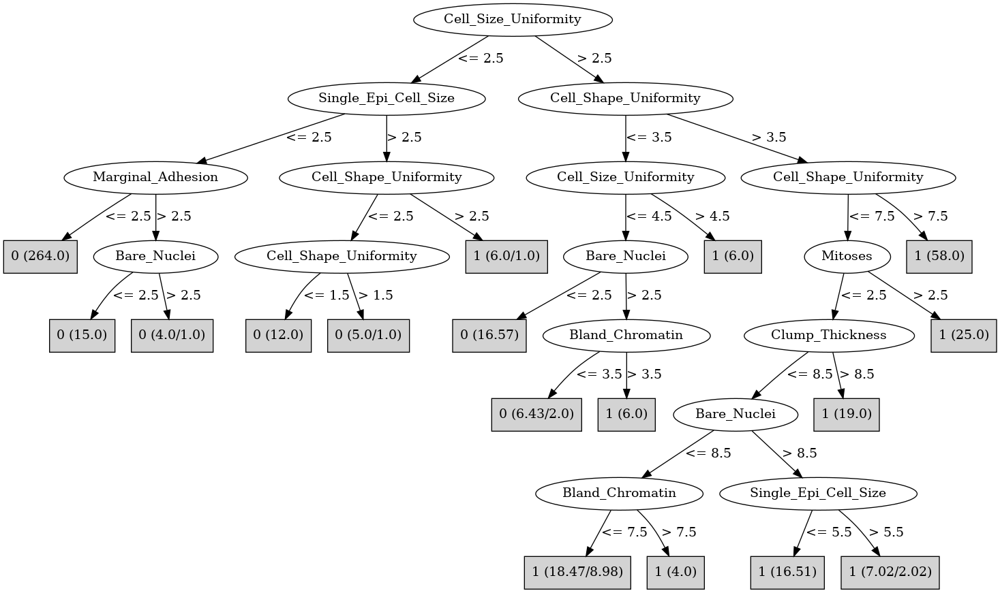

# J48

# SimpleCart Decision Tree

Cell_Shape_Uniformity < 3.5

* Bland_Chromatin < 3.5

*   * Bare_Nuclei < 3.5: 0(295.58/0.0)

*   * Bare_Nuclei >= 3.5: 0(11.41/3.0)

* Bland_Chromatin >= 3.5

*   * Bare_Nuclei < 2.5: 0(9.0/1.0)

*   * Bare_Nuclei >= 2.5: 1(15.0/0.0)

Cell_Shape_Uniformity >= 3.5: 1(139.0/15.0)

# PART

Decision list:

conditions|predicted class
---|---
Cell_Size_Uniformity <= 2 AND Single_Epi_Cell_Size <= 2 AND Marginal_Adhesion <= 2| 0 (264.0)
Cell_Shape_Uniformity <= 2 AND Bland_Chromatin <= 3 AND Single_Epi_Cell_Size > 1| 0 (42.0)
Cell_Size_Uniformity > 4 AND Clump_Thickness > 6| 1 (72.0)
Bare_Nuclei > 3 AND Bland_Chromatin > 4 AND Normal_Nucleoli <= 7| 1 (30.74)
Normal_Nucleoli > 9| 1 (21.0)
Clump_Thickness <= 8 AND Bare_Nuclei > 3 AND Cell_Shape_Uniformity > 2 AND Bare_Nuclei > 8 AND Single_Epi_Cell_Size <= 6 AND Cell_Shape_Uniformity > 3 AND Bland_Chromatin <= 6| 1 (9.0)
Clump_Thickness <= 8 AND Mitoses <= 3 AND Bare_Nuclei <= 2 AND Single_Epi_Cell_Size <= 4 AND Clump_Thickness <= 7| 0 (8.37)
Clump_Thickness > 8| 1 (6.0)
Bland_Chromatin > 1 AND Mitoses <= 3 AND Cell_Shape_Uniformity <= 7 AND Normal_Nucleoli <= 1 AND Single_Epi_Cell_Size > 2| 1 (5.0)
Mitoses > 3| 1 (3.0)
Cell_Shape_Uniformity <= 7 AND Normal_Nucleoli > 8 AND Clump_Thickness <= 5| 0 (2.0/1.0)
Cell_Shape_Uniformity <= 7 AND Normal_Nucleoli <= 8 AND Single_Epi_Cell_Size > 3| 0 (9.0)
Bland_Chromatin > 1 AND Clump_Thickness <= 7 AND Bland_Chromatin > 3| 1 (5.0)
Bland_Chromatin > 1 AND Cell_Size_Uniformity <= 3 AND Clump_Thickness <= 5| 1 (3.0)
Cell_Shape_Uniformity <= 3| 0 (4.63)
Marginal_Adhesion <= 1| 1 (2.26)
| 0 (2.0)

# JRip

Decision list:

conditions|predicted class
---|---
(Cell_Shape_Uniformity >= 4) and (Cell_Size_Uniformity >= 5) and (Bare_Nuclei >= 9)|1 (71.0/0.0)
(Cell_Size_Uniformity >= 3) and (Clump_Thickness >= 9)|1 (34.0/0.0)
(Normal_Nucleoli >= 3) and (Bare_Nuclei >= 2) and (Bland_Chromatin >= 5) and (Cell_Size_Uniformity >= 5)|1 (17.0/0.0)
(Cell_Shape_Uniformity >= 3) and (Normal_Nucleoli >= 9) and (Clump_Thickness >= 5)|1 (13.0/0.0)
(Bare_Nuclei >= 3) and (Cell_Shape_Uniformity >= 3) and (Clump_Thickness >= 7) and (Marginal_Adhesion <= 4)|1 (7.0/0.0)
(Marginal_Adhesion >= 2) and (Clump_Thickness <= 4) and (Bare_Nuclei >= 5)|1 (6.0/0.0)
(Cell_Size_Uniformity >= 3) and (Bare_Nuclei >= 4)|1 (12.0/7.0)
(Bland_Chromatin >= 4) and (Clump_Thickness >= 8) and (Cell_Shape_Uniformity <= 5)|1 (3.0/0.0)
|0 (326.0/2.0)

# Decision Table

Non matches covered by IB1

cell_shape_uniformity|bland_chromatin|target
---|---|---
(4.5-7.5]|(7.5-inf)|1
(7.5-inf)|(7.5-inf)|1
(3.5-4.5]|(7.5-inf)|1
(-inf-1.5]|(3.5-7.5]|0
(2.5-3.5]|(3.5-7.5]|1
(1.5-2.5]|(3.5-7.5]|0
(7.5-inf)|(3.5-7.5]|1
(3.5-4.5]|(3.5-7.5]|1
(4.5-7.5]|(3.5-7.5]|1
(2.5-3.5]|(2.5-3.5]|0
(1.5-2.5]|(2.5-3.5]|0
(7.5-inf)|(2.5-3.5]|1
(4.5-7.5]|(2.5-3.5]|1
(3.5-4.5]|(2.5-3.5]|1
(-inf-1.5]|(2.5-3.5]|0
(4.5-7.5]|(-inf-2.5]|0
(7.5-inf)|(-inf-2.5]|1
(1.5-2.5]|(-inf-2.5]|0
(2.5-3.5]|(-inf-2.5]|0
(-inf-1.5]|(-inf-2.5]|0
(3.5-4.5]|(-inf-2.5]|0

