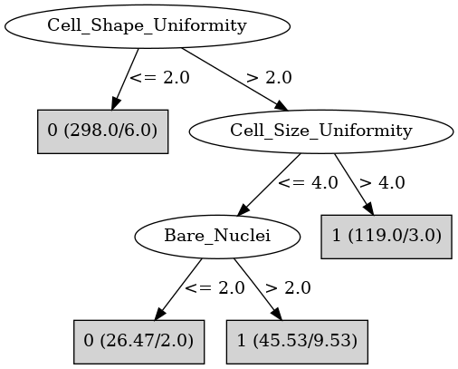

# J48

# SimpleCart Decision Tree

Cell_Size_Uniformity < 3.5

* Clump_Thickness < 6.5

*   * Bare_Nuclei < 6.0: 0(315.87/6.0)

*   * Bare_Nuclei >= 6.0: 1(4.0/0.12)

* Clump_Thickness >= 6.5

*   * Bare_Nuclei < 2.5: 0(2.0/1.0)

*   * Bare_Nuclei >= 2.5: 1(15.0/0.0)

Cell_Size_Uniformity >= 3.5

* Cell_Size_Uniformity < 4.5

*   * Clump_Thickness < 6.0

*   *   * Marginal_Adhesion < 5.5: 0(7.0/1.0)

*   *   * Marginal_Adhesion >= 5.5: 1(4.0/0.0)

*   * Clump_Thickness >= 6.0

*   *   * Normal_Nucleoli < 7.0: 1(9.0/0.0)

*   *   * Normal_Nucleoli >= 7.0: 1(3.0/1.0)

* Cell_Size_Uniformity >= 4.5

*   * Clump_Thickness < 6.5

*   *   * Marginal_Adhesion < 1.5: 1(2.0/1.0)

*   *   * Marginal_Adhesion >= 1.5

*   *   *   * Cell_Size_Uniformity < 6.5

*   *   *   *   * Single_Epi_Cell_Size < 5.5: 1(10.0/0.0)

*   *   *   *   * Single_Epi_Cell_Size >= 5.5: 1(6.0/2.0)

*   *   *   * Cell_Size_Uniformity >= 6.5: 1(28.0/0.0)

*   * Clump_Thickness >= 6.5: 1(71.0/0.0)

# PART

Decision list:

conditions|predicted class
---|---
Cell_Size_Uniformity <= 2| 0 (226.0/3.0)
Cell_Shape_Uniformity > 2 AND Cell_Size_Uniformity > 4| 1 (94.0/2.0)
Bare_Nuclei > 1| 1 (35.0/10.0)
| 0 (12.0)

# JRip

Decision list:

conditions|predicted class
---|---
(Cell_Shape_Uniformity >= 3) and (Bare_Nuclei >= 3)|1 (146.0/8.0)
(Normal_Nucleoli >= 4) and (Clump_Thickness >= 6)|1 (16.0/1.0)
(Cell_Size_Uniformity >= 6) and (Bare_Nuclei >= 1)|1 (5.0/0.0)
|0 (322.0/2.0)

# Decision Table

Non matches covered by Majority class

clump_thickness|cell_size_uniformity|target
---|---|---
(-inf-4.5]|(4.5-inf)|1
(5.5-6.5]|(4.5-inf)|1
(4.5-5.5]|(4.5-inf)|1
(6.5-inf)|(4.5-inf)|1
(4.5-5.5]|(2.5-4.5]|0
(5.5-6.5]|(2.5-4.5]|0
(-inf-4.5]|(2.5-4.5]|0
(6.5-inf)|(2.5-4.5]|1
(-inf-4.5]|(1.5-2.5]|0
(6.5-inf)|(1.5-2.5]|1
(4.5-5.5]|(1.5-2.5]|0
(5.5-6.5]|(-inf-1.5]|0
(6.5-inf)|(-inf-1.5]|1
(4.5-5.5]|(-inf-1.5]|0
(-inf-4.5]|(-inf-1.5]|0

