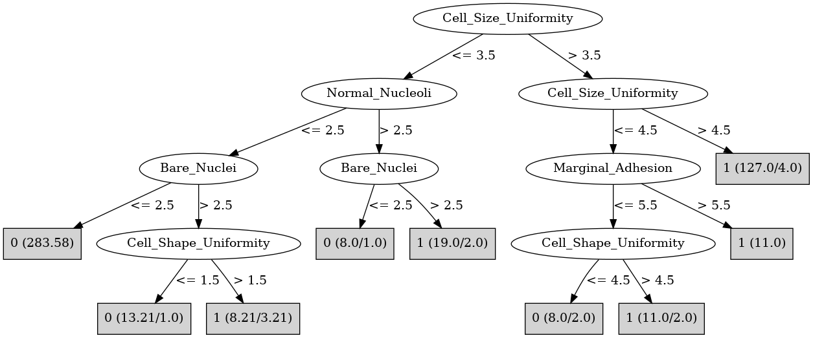

# J48

# SimpleCart Decision Tree

Cell_Size_Uniformity < 3.5

* Bare_Nuclei < 2.5

*   * Normal_Nucleoli < 3.5: 0(289.26/0.0)

*   * Normal_Nucleoli >= 3.5: 1(1.0/0.99)

* Bare_Nuclei >= 2.5

*   * Clump_Thickness < 3.5

*   *   * Cell_Shape_Uniformity < 3.5: 0(13.61/0.0)

*   *   * Cell_Shape_Uniformity >= 3.5: 1(3.0/0.12)

*   * Clump_Thickness >= 3.5

*   *   * Bland_Chromatin < 1.5: 0(2.0/1.0)

*   *   * Bland_Chromatin >= 1.5

*   *   *   * Normal_Nucleoli < 4.5: 1(12.0/0.0)

*   *   *   * Normal_Nucleoli >= 4.5

*   *   *   *   * Clump_Thickness < 7.5

*   *   *   *   *   * Cell_Size_Uniformity < 2.5: 1(2.0/0.0)

*   *   *   *   *   * Cell_Size_Uniformity >= 2.5: 0(2.0/1.0)

*   *   *   *   * Clump_Thickness >= 7.5: 1(4.0/0.0)

Cell_Size_Uniformity >= 3.5

* Cell_Size_Uniformity < 4.5

*   * Marginal_Adhesion < 5.5

*   *   * Clump_Thickness < 6.0: 0(6.0/0.0)

*   *   * Clump_Thickness >= 6.0

*   *   *   * Bare_Nuclei < 7.5: 1(4.0/2.0)

*   *   *   * Bare_Nuclei >= 7.5: 1(7.0/0.0)

*   * Marginal_Adhesion >= 5.5: 1(11.0/0.0)

* Cell_Size_Uniformity >= 4.5

*   * Marginal_Adhesion < 1.5

*   *   * Clump_Thickness < 7.0

*   *   *   * Cell_Shape_Uniformity < 6.5: 1(2.0/0.0)

*   *   *   * Cell_Shape_Uniformity >= 6.5: 0(2.0/0.0)

*   *   * Clump_Thickness >= 7.0: 1(8.0/0.0)

*   * Marginal_Adhesion >= 1.5

*   *   * Clump_Thickness < 6.5

*   *   *   * Clump_Thickness < 5.5: 1(37.0/0.0)

*   *   *   * Clump_Thickness >= 5.5: 1(11.0/2.0)

*   *   * Clump_Thickness >= 6.5: 1(65.0/0.0)

# PART

Decision list:

conditions|predicted class
---|---
Cell_Size_Uniformity <= 3.0 AND Normal_Nucleoli <= 2.0| 0 (305.0/6.0)
Bland_Chromatin > 2.0| 1 (170.0/13.0)
| 0 (14.0/6.0)

# JRip

Decision list:

conditions|predicted class
---|---
(Cell_Shape_Uniformity >= 4) and (Cell_Size_Uniformity >= 5)|1 (122.0/4.0)
(Bare_Nuclei >= 3) and (Normal_Nucleoli >= 3)|1 (40.0/4.0)
(Bare_Nuclei >= 6)|1 (10.0/1.0)
|0 (317.0/6.0)

# Decision Table

Non matches covered by IB1

cell_size_uniformity|normal_nucleoli|target
---|---|---
(-inf-1.5]|(8.5-inf)|0
(3.5-4.5]|(8.5-inf)|1
(1.5-3.5]|(8.5-inf)|1
(4.5-inf)|(8.5-inf)|1
(1.5-3.5]|(2.5-8.5]|1
(3.5-4.5]|(2.5-8.5]|1
(4.5-inf)|(2.5-8.5]|1
(-inf-1.5]|(2.5-8.5]|0
(3.5-4.5]|(-inf-2.5]|0
(1.5-3.5]|(-inf-2.5]|0
(4.5-inf)|(-inf-2.5]|1
(-inf-1.5]|(-inf-2.5]|0

