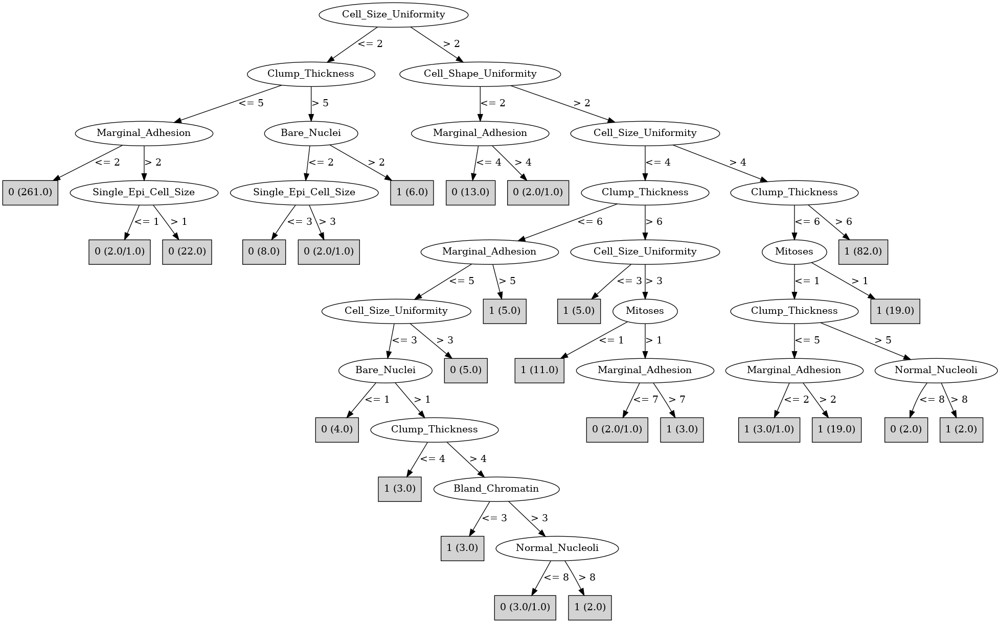

# J48

# SimpleCart Decision Tree

Cell_Size_Uniformity < 3.5

* Bare_Nuclei < 2.5: 0(293.02/2.0)

* Bare_Nuclei >= 2.5

*   * Clump_Thickness < 3.5

*   *   * Cell_Shape_Uniformity < 3.5: 0(16.73/0.0)

*   *   * Cell_Shape_Uniformity >= 3.5: 1(3.0/0.12)

*   * Clump_Thickness >= 3.5

*   *   * Bland_Chromatin < 2.5: 0(2.0/2.0)

*   *   * Bland_Chromatin >= 2.5

*   *   *   * Clump_Thickness < 5.5: 1(5.0/1.12)

*   *   *   * Clump_Thickness >= 5.5: 1(11.0/0.0)

Cell_Size_Uniformity >= 3.5

* Cell_Size_Uniformity < 4.5

*   * Single_Epi_Cell_Size < 6.5: 1(19.0/3.0)

*   * Single_Epi_Cell_Size >= 6.5: 0(3.0/1.0)

* Cell_Size_Uniformity >= 4.5

*   * Clump_Thickness < 6.5: 1(42.0/3.0)

*   * Clump_Thickness >= 6.5: 1(82.0/0.0)

# PART

Decision list:

conditions|predicted class
---|---
Cell_Size_Uniformity <= 2.5 AND Clump_Thickness <= 5.5| 0 (285.0/1.0)
Cell_Shape_Uniformity > 2.5 AND Cell_Size_Uniformity > 4.5 AND Clump_Thickness > 6.5| 1 (82.0)
Cell_Shape_Uniformity <= 2.5 AND Bare_Nuclei <= 4.5| 0 (20.0)
Bare_Nuclei > 8.5| 1 (51.0/1.5)
Normal_Nucleoli > 8.5| 1 (14.0)
Mitoses <= 2.5 AND Cell_Size_Uniformity <= 9.5 AND Clump_Thickness <= 6.5 AND Marginal_Adhesion <= 2.5| 0 (10.0)
Normal_Nucleoli <= 5.5 AND Normal_Nucleoli > 3.5| 1 (9.0)
Bland_Chromatin > 3.5 AND Mitoses <= 2.5 AND Marginal_Adhesion > 2.5 AND Cell_Shape_Uniformity <= 5.5| 0 (5.0)
| 1 (13.0/1.5)

# JRip

Decision list:

conditions|predicted class
---|---
(Cell_Size_Uniformity >= 5)|1 (127.0/3.0)
(Bare_Nuclei >= 3) and (Clump_Thickness >= 7)|1 (25.0/1.0)
(Normal_Nucleoli >= 3) and (Cell_Shape_Uniformity >= 3)|1 (21.0/6.0)
|0 (316.0/4.0)

# Decision Table

Non matches covered by Majority class

cell_size_uniformity|bare_nuclei|target
---|---|---
(2.5-3.5]|(5.5-inf)|1
(3.5-4.5]|(5.5-inf)|1
(1.5-2.5]|(5.5-inf)|1
(-inf-1.5]|(5.5-inf)|0
(4.5-inf)|(5.5-inf)|1
(1.5-2.5]|(2.5-5.5]|0
(3.5-4.5]|(2.5-5.5]|0
(4.5-inf)|(2.5-5.5]|1
(-inf-1.5]|(2.5-5.5]|0
(2.5-3.5]|(2.5-5.5]|1
(4.5-inf)|?|1
(-inf-1.5]|?|0
(3.5-4.5]|?|0
(4.5-inf)|(1.5-2.5]|1
(2.5-3.5]|(1.5-2.5]|0
(-inf-1.5]|(1.5-2.5]|0
(1.5-2.5]|(1.5-2.5]|0
(3.5-4.5]|(-inf-1.5]|0
(4.5-inf)|(-inf-1.5]|1
(1.5-2.5]|(-inf-1.5]|0
(2.5-3.5]|(-inf-1.5]|0
(-inf-1.5]|(-inf-1.5]|0

