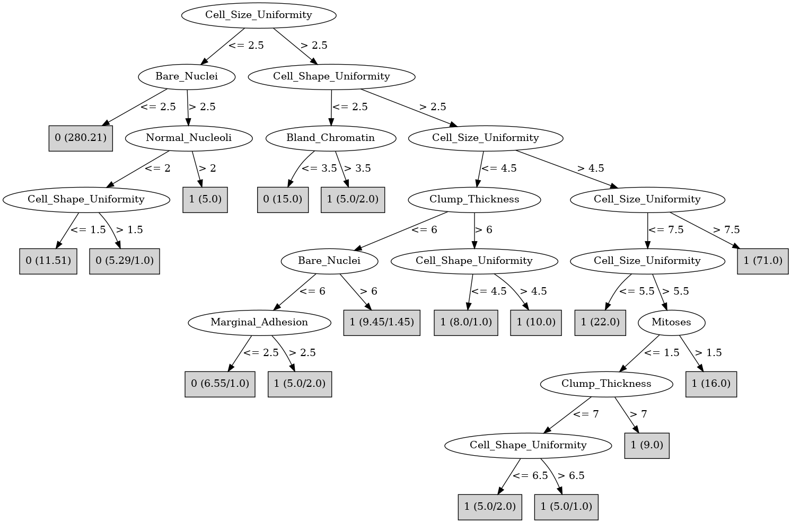

# J48

# SimpleCart Decision Tree

Cell_Size_Uniformity < 3.5

* Bare_Nuclei < 6.0: 0(314.49/7.0)

* Bare_Nuclei >= 6.0

*   * Clump_Thickness < 2.0: 0(1.27/0.0)

*   * Clump_Thickness >= 2.0: 1(14.0/0.23)

Cell_Size_Uniformity >= 3.5

* Cell_Size_Uniformity < 4.5

*   * Bland_Chromatin < 3.5: 0(5.0/2.0)

*   * Bland_Chromatin >= 3.5

*   *   * Normal_Nucleoli < 5.5: 1(12.0/0.0)

*   *   * Normal_Nucleoli >= 5.5: 1(3.0/2.0)

* Cell_Size_Uniformity >= 4.5

*   * Marginal_Adhesion < 1.5: 1(6.0/1.0)

*   * Marginal_Adhesion >= 1.5

*   *   * Cell_Shape_Uniformity < 6.5

*   *   *   * Single_Epi_Cell_Size < 5.5: 1(28.0/0.0)

*   *   *   * Single_Epi_Cell_Size >= 5.5

*   *   *   *   * Normal_Nucleoli < 7.5: 1(7.0/0.0)

*   *   *   *   * Normal_Nucleoli >= 7.5: 1(5.0/2.0)

*   *   * Cell_Shape_Uniformity >= 6.5: 1(79.0/0.0)

# PART

Decision list:

conditions|predicted class
---|---
Cell_Size_Uniformity <= 2.5 AND Bare_Nuclei <= 2.5| 0 (280.21)
Cell_Shape_Uniformity > 2.5 AND Cell_Size_Uniformity > 4.5| 1 (128.0/3.0)
Clump_Thickness <= 5.5 AND Cell_Shape_Uniformity <= 2.5| 0 (31.58)
Bland_Chromatin > 2.5 AND Bare_Nuclei > 1.5| 1 (38.97/4.07)
| 0 (10.25/3.1)

# JRip

Decision list:

conditions|predicted class
---|---
(Cell_Size_Uniformity >= 5) and (Bare_Nuclei >= 1) and (Marginal_Adhesion >= 2)|1 (119.0/0.0)
(Bare_Nuclei >= 3) and (Clump_Thickness >= 6) and (Normal_Nucleoli <= 7)|1 (19.0/0.0)
(Cell_Size_Uniformity >= 3) and (Cell_Shape_Uniformity >= 5) and (Bare_Nuclei >= 4) and (Cell_Size_Uniformity <= 4)|1 (10.0/0.0)
(Normal_Nucleoli >= 3) and (Cell_Shape_Uniformity >= 3) and (Single_Epi_Cell_Size <= 3) and (Bland_Chromatin >= 3)|1 (6.0/0.0)
(Single_Epi_Cell_Size >= 6) and (Single_Epi_Cell_Size <= 6) and (Marginal_Adhesion <= 4)|1 (5.0/0.0)
|0 (330.0/4.0)

# Decision Table

Non matches covered by Majority class

clump_thickness|cell_size_uniformity|bare_nuclei|target
---|---|---|---
(5.5-6.5]|(4.5-inf)|(5.5-inf)|1
(-inf-4.5]|(4.5-inf)|(5.5-inf)|1
(6.5-inf)|(4.5-inf)|(5.5-inf)|1
(4.5-5.5]|(4.5-inf)|(5.5-inf)|1
(-inf-4.5]|(2.5-4.5]|(5.5-inf)|1
(6.5-inf)|(2.5-4.5]|(5.5-inf)|1
(4.5-5.5]|(2.5-4.5]|(5.5-inf)|1
(6.5-inf)|(1.5-2.5]|(5.5-inf)|0
(-inf-4.5]|(4.5-inf)|(2.5-5.5]|1
(4.5-5.5]|(1.5-2.5]|(5.5-inf)|1
(4.5-5.5]|(4.5-inf)|(2.5-5.5]|1
(5.5-6.5]|(4.5-inf)|(2.5-5.5]|0
(6.5-inf)|(4.5-inf)|(2.5-5.5]|1
(6.5-inf)|(4.5-inf)|?|0
(5.5-6.5]|(4.5-inf)|?|0
(-inf-4.5]|(4.5-inf)|?|0
(-inf-4.5]|(-inf-1.5]|(5.5-inf)|0
(5.5-6.5]|(2.5-4.5]|(2.5-5.5]|0
(6.5-inf)|(-inf-1.5]|(5.5-inf)|1
(6.5-inf)|(2.5-4.5]|(2.5-5.5]|1
(-inf-4.5]|(2.5-4.5]|(2.5-5.5]|0
(4.5-5.5]|(2.5-4.5]|(2.5-5.5]|1
(4.5-5.5]|(2.5-4.5]|?|0
(6.5-inf)|(2.5-4.5]|?|0
(4.5-5.5]|(1.5-2.5]|(2.5-5.5]|0
(-inf-4.5]|(1.5-2.5]|(2.5-5.5]|0
(6.5-inf)|(4.5-inf)|(1.5-2.5]|1
(6.5-inf)|(1.5-2.5]|(2.5-5.5]|0
(4.5-5.5]|(-inf-1.5]|(2.5-5.5]|0
(-inf-4.5]|(2.5-4.5]|(1.5-2.5]|0
(6.5-inf)|(2.5-4.5]|(1.5-2.5]|0
(-inf-4.5]|(-inf-1.5]|(2.5-5.5]|0
(4.5-5.5]|(-inf-1.5]|?|0
(-inf-4.5]|(-inf-1.5]|?|0
(-inf-4.5]|(4.5-inf)|(-inf-1.5]|0
(4.5-5.5]|(1.5-2.5]|(1.5-2.5]|0
(-inf-4.5]|(1.5-2.5]|(1.5-2.5]|0
(4.5-5.5]|(4.5-inf)|(-inf-1.5]|1
(6.5-inf)|(4.5-inf)|(-inf-1.5]|1
(6.5-inf)|(2.5-4.5]|(-inf-1.5]|0
(-inf-4.5]|(-inf-1.5]|(1.5-2.5]|0
(4.5-5.5]|(-inf-1.5]|(1.5-2.5]|0
(4.5-5.5]|(2.5-4.5]|(-inf-1.5]|0
(-inf-4.5]|(2.5-4.5]|(-inf-1.5]|0
(6.5-inf)|(1.5-2.5]|(-inf-1.5]|0
(5.5-6.5]|(1.5-2.5]|(-inf-1.5]|0
(-inf-4.5]|(1.5-2.5]|(-inf-1.5]|0
(4.5-5.5]|(1.5-2.5]|(-inf-1.5]|0
(6.5-inf)|(-inf-1.5]|(-inf-1.5]|0
(5.5-6.5]|(-inf-1.5]|(-inf-1.5]|0
(4.5-5.5]|(-inf-1.5]|(-inf-1.5]|0
(-inf-4.5]|(-inf-1.5]|(-inf-1.5]|0

