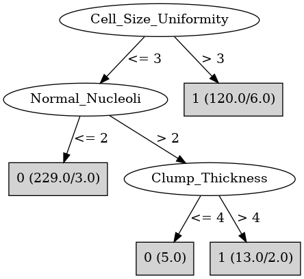

# J48

# SimpleCart Decision Tree

Cell_Size_Uniformity < 3.5

* Clump_Thickness < 6.5: 0(308.0/8.0)

* Clump_Thickness >= 6.5: 1(12.0/3.0)

Cell_Size_Uniformity >= 3.5

* Bland_Chromatin < 3.5

*   * Clump_Thickness < 6.5: 1(7.0/6.0)

*   * Clump_Thickness >= 6.5: 1(19.0/0.0)

* Bland_Chromatin >= 3.5

*   * Clump_Thickness < 6.5

*   *   * Cell_Size_Uniformity < 6.5: 1(12.0/2.0)

*   *   * Cell_Size_Uniformity >= 6.5: 1(30.0/0.0)

*   * Clump_Thickness >= 6.5: 1(82.0/0.0)

# PART

Decision list:

conditions|predicted class
---|---
Cell_Shape_Uniformity <= 3 AND Bland_Chromatin <= 3 AND Bare_Nuclei <= 2| 0 (280.5)
Cell_Shape_Uniformity > 2 AND Clump_Thickness > 6| 1 (110.0)
Single_Epi_Cell_Size <= 2 AND Marginal_Adhesion <= 2 AND Cell_Size_Uniformity <= 1| 0 (15.5)
Single_Epi_Cell_Size > 2 AND Bland_Chromatin > 3 AND Cell_Size_Uniformity > 6| 1 (30.0)
Marginal_Adhesion > 5 AND Marginal_Adhesion > 8| 1 (10.0/2.0)
Marginal_Adhesion <= 5 AND Clump_Thickness > 3 AND Bland_Chromatin > 3| 1 (11.0/3.0)
Marginal_Adhesion <= 5 AND Clump_Thickness <= 3| 0 (8.0)
Marginal_Adhesion <= 5 AND Cell_Shape_Uniformity <= 3| 1 (8.0/3.0)
Marginal_Adhesion <= 5| 0 (8.0/1.0)
| 1 (8.0)

# JRip

Decision list:

conditions|predicted class
---|---
(Cell_Size_Uniformity >= 3) and (Bland_Chromatin >= 4)|1 (135.0/4.0)
(Cell_Shape_Uniformity >= 4) and (Clump_Thickness >= 7)|1 (24.0/0.0)
(Normal_Nucleoli >= 3) and (Cell_Shape_Uniformity >= 3)|1 (14.0/4.0)
|0 (316.0/5.0)

# Decision Table

Non matches covered by Majority class

clump_thickness|cell_shape_uniformity|target
---|---|---
(2.5-3.5]|(4.5-inf)|1
(5.5-6.5]|(4.5-inf)|1
(6.5-inf)|(4.5-inf)|1
(3.5-5.5]|(4.5-inf)|1
(2.5-3.5]|(3.5-4.5]|0
(5.5-6.5]|(3.5-4.5]|1
(3.5-5.5]|(3.5-4.5]|0
(6.5-inf)|(3.5-4.5]|1
(2.5-3.5]|(2.5-3.5]|1
(5.5-6.5]|(2.5-3.5]|0
(-inf-2.5]|(2.5-3.5]|0
(3.5-5.5]|(2.5-3.5]|0
(6.5-inf)|(2.5-3.5]|1
(5.5-6.5]|(1.5-2.5]|0
(6.5-inf)|(1.5-2.5]|1
(2.5-3.5]|(1.5-2.5]|0
(3.5-5.5]|(1.5-2.5]|0
(-inf-2.5]|(1.5-2.5]|0
(6.5-inf)|(-inf-1.5]|0
(5.5-6.5]|(-inf-1.5]|0
(2.5-3.5]|(-inf-1.5]|0
(-inf-2.5]|(-inf-1.5]|0
(3.5-5.5]|(-inf-1.5]|0

