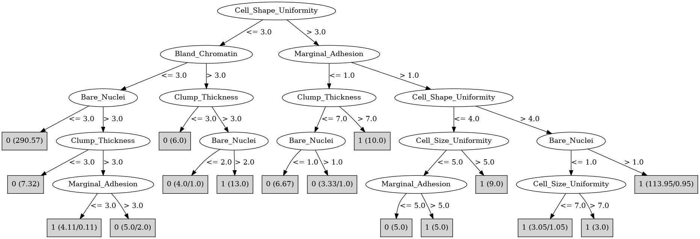

# J48

# SimpleCart Decision Tree

Cell_Shape_Uniformity < 3.5

* Bare_Nuclei < 5.5: 0(307.62/7.0)

* Bare_Nuclei >= 5.5

*   * Clump_Thickness < 3.5: 0(1.27/0.0)

*   * Clump_Thickness >= 3.5: 1(13.0/1.09)

Cell_Shape_Uniformity >= 3.5

* Cell_Size_Uniformity < 2.5: 0(5.0/1.0)

* Cell_Size_Uniformity >= 2.5

*   * Marginal_Adhesion < 1.5

*   *   * Clump_Thickness < 7.0: 0(5.0/1.0)

*   *   * Clump_Thickness >= 7.0: 1(9.0/0.0)

*   * Marginal_Adhesion >= 1.5

*   *   * Cell_Shape_Uniformity < 4.5

*   *   *   * Cell_Size_Uniformity < 5.0: 1(5.0/4.0)

*   *   *   * Cell_Size_Uniformity >= 5.0: 1(9.0/0.0)

*   *   * Cell_Shape_Uniformity >= 4.5

*   *   *   * Bare_Nuclei < 1.5: 1(5.0/1.05)

*   *   *   * Bare_Nuclei >= 1.5

*   *   *   *   * Clump_Thickness < 4.5: 1(16.0/0.94)

*   *   *   *   * Clump_Thickness >= 4.5: 1(97.0/0.0)

# PART

Decision list:

conditions|predicted class
---|---
Cell_Shape_Uniformity <= 3.5 AND Bland_Chromatin <= 3.5 AND Bare_Nuclei <= 3.5| 0 (218.69)
Cell_Size_Uniformity > 4.5| 1 (86.0/2.0)
Clump_Thickness <= 8.5 AND Clump_Thickness > 2 AND Bare_Nuclei > 6| 1 (21.61/3.61)
Clump_Thickness <= 8.5 AND Normal_Nucleoli <= 8| 0 (22.7/3.0)
| 1 (18.0)

# JRip

Decision list:

conditions|predicted class
---|---
(Cell_Size_Uniformity >= 5)|1 (116.0/3.0)
(Bare_Nuclei >= 6)|1 (39.0/4.0)
(Normal_Nucleoli >= 9)|1 (7.0/0.0)
|0 (327.0/8.0)

# Decision Table

Non matches covered by IB1

clump_thickness|cell_size_uniformity|target
---|---|---
(-inf-3.5]|(4.5-inf)|1
(5.5-6.5]|(4.5-inf)|1
(6.5-inf)|(4.5-inf)|1
(3.5-5.5]|(4.5-inf)|1
(-inf-3.5]|(3.5-4.5]|1
(3.5-5.5]|(3.5-4.5]|0
(6.5-inf)|(3.5-4.5]|1
(5.5-6.5]|(2.5-3.5]|0
(6.5-inf)|(2.5-3.5]|1
(3.5-5.5]|(2.5-3.5]|0
(-inf-3.5]|(2.5-3.5]|0
(5.5-6.5]|(1.5-2.5]|0
(6.5-inf)|(1.5-2.5]|1
(-inf-3.5]|(1.5-2.5]|0
(3.5-5.5]|(1.5-2.5]|0
(5.5-6.5]|(-inf-1.5]|0
(6.5-inf)|(-inf-1.5]|0
(3.5-5.5]|(-inf-1.5]|0
(-inf-3.5]|(-inf-1.5]|0

