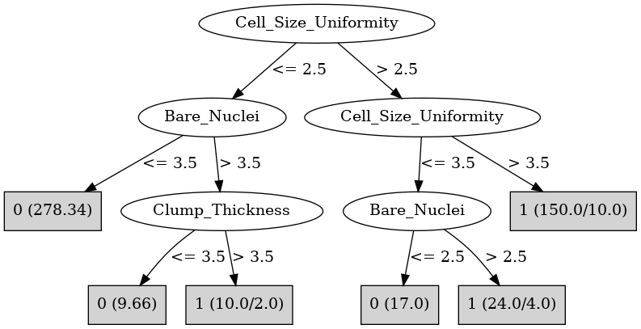

# J48

# SimpleCart Decision Tree

Cell_Size_Uniformity < 2.5

* Bare_Nuclei < 5.5: 0(288.75/2.0)

* Bare_Nuclei >= 5.5: 1(6.0/1.24)

Cell_Size_Uniformity >= 2.5

* Cell_Shape_Uniformity < 2.5: 0(13.0/4.0)

* Cell_Shape_Uniformity >= 2.5

*   * Cell_Size_Uniformity < 4.5

*   *   * Bare_Nuclei < 2.5: 0(7.15/1.15)

*   *   * Bare_Nuclei >= 2.5

*   *   *   * Cell_Shape_Uniformity < 4.5

*   *   *   *   * Clump_Thickness < 6.5: 1(6.0/4.84)

*   *   *   *   * Clump_Thickness >= 6.5: 1(13.0/1.0)

*   *   *   * Cell_Shape_Uniformity >= 4.5: 1(21.84/0.0)

*   * Cell_Size_Uniformity >= 4.5

*   *   * Clump_Thickness < 6.5

*   *   *   * Bland_Chromatin < 4.5: 1(9.0/4.0)

*   *   *   * Bland_Chromatin >= 4.5

*   *   *   *   * Clump_Thickness < 5.5: 1(28.0/0.0)

*   *   *   *   * Clump_Thickness >= 5.5: 1(7.0/1.0)

*   *   * Clump_Thickness >= 6.5: 1(70.0/0.0)

# PART

Decision list:

conditions|predicted class
---|---
Cell_Size_Uniformity <= 2 AND Bare_Nuclei <= 3| 0 (278.34)
Cell_Shape_Uniformity > 2 AND Bare_Nuclei > 8| 1 (96.25/2.72)
Bland_Chromatin <= 2 AND Cell_Shape_Uniformity <= 3| 0 (20.85/2.0)
Clump_Thickness > 8| 1 (28.0)
Cell_Shape_Uniformity > 1 AND Mitoses <= 2 AND Normal_Nucleoli > 3 AND Marginal_Adhesion > 1 AND Cell_Shape_Uniformity > 6| 1 (13.0)
Mitoses <= 2 AND Bland_Chromatin <= 7 AND Cell_Shape_Uniformity > 1 AND Normal_Nucleoli > 3| 1 (19.93/6.93)
Mitoses <= 2 AND Bland_Chromatin <= 7| 0 (17.63/3.46)
| 1 (15.0)

# JRip

Decision list:

conditions|predicted class
---|---
(Cell_Size_Uniformity >= 3) and (Bare_Nuclei >= 9) and (Cell_Shape_Uniformity >= 4)|1 (84.0/0.0)
(Clump_Thickness >= 7) and (Cell_Size_Uniformity >= 5)|1 (35.0/0.0)
(Bland_Chromatin >= 4) and (Clump_Thickness >= 5) and (Cell_Shape_Uniformity <= 3)|1 (14.0/0.0)
(Marginal_Adhesion >= 4) and (Bare_Nuclei <= 6) and (Cell_Shape_Uniformity >= 5)|1 (10.0/0.0)
(Bare_Nuclei >= 3) and (Cell_Shape_Uniformity >= 3) and (Normal_Nucleoli >= 9)|1 (6.0/0.0)
(Bare_Nuclei >= 3) and (Cell_Shape_Uniformity >= 3) and (Normal_Nucleoli <= 6) and (Marginal_Adhesion >= 3) and (Clump_Thickness <= 5) and (Single_Epi_Cell_Size <= 5)|1 (7.0/0.0)
|0 (333.0/12.0)

# Decision Table

Non matches covered by IB1

cell_size_uniformity|bare_nuclei|mitoses|target
---|---|---|---
(-inf-1.5]|(5.5-inf)|(1.5-inf)|0
(1.5-2.5]|(5.5-inf)|(1.5-inf)|0
(2.5-3.5]|(5.5-inf)|(1.5-inf)|1
(9.5-inf)|(5.5-inf)|(1.5-inf)|1
(3.5-9.5]|(5.5-inf)|(1.5-inf)|1
(-inf-1.5]|(1.5-5.5]|(1.5-inf)|0
(9.5-inf)|(1.5-5.5]|(1.5-inf)|1
(3.5-9.5]|(1.5-5.5]|(1.5-inf)|1
(2.5-3.5]|(1.5-5.5]|(1.5-inf)|1
(1.5-2.5]|(-inf-1.5]|(1.5-inf)|0
(-inf-1.5]|(-inf-1.5]|(1.5-inf)|0
(1.5-2.5]|(5.5-inf)|(-inf-1.5]|1
(-inf-1.5]|(5.5-inf)|(-inf-1.5]|1
(2.5-3.5]|(-inf-1.5]|(1.5-inf)|0
(2.5-3.5]|(5.5-inf)|(-inf-1.5]|1
(3.5-9.5]|(-inf-1.5]|(1.5-inf)|1
(9.5-inf)|(5.5-inf)|(-inf-1.5]|1
(3.5-9.5]|(5.5-inf)|(-inf-1.5]|1
(9.5-inf)|(-inf-1.5]|(1.5-inf)|1
(3.5-9.5]|?|(-inf-1.5]|0
(-inf-1.5]|?|(-inf-1.5]|0
(-inf-1.5]|(1.5-5.5]|(-inf-1.5]|0
(1.5-2.5]|(1.5-5.5]|(-inf-1.5]|0
(2.5-3.5]|(1.5-5.5]|(-inf-1.5]|0
(3.5-9.5]|(1.5-5.5]|(-inf-1.5]|1
(9.5-inf)|(1.5-5.5]|(-inf-1.5]|1
(2.5-3.5]|(-inf-1.5]|(-inf-1.5]|0
(1.5-2.5]|(-inf-1.5]|(-inf-1.5]|0
(-inf-1.5]|(-inf-1.5]|(-inf-1.5]|0
(9.5-inf)|(-inf-1.5]|(-inf-1.5]|1
(3.5-9.5]|(-inf-1.5]|(-inf-1.5]|1

