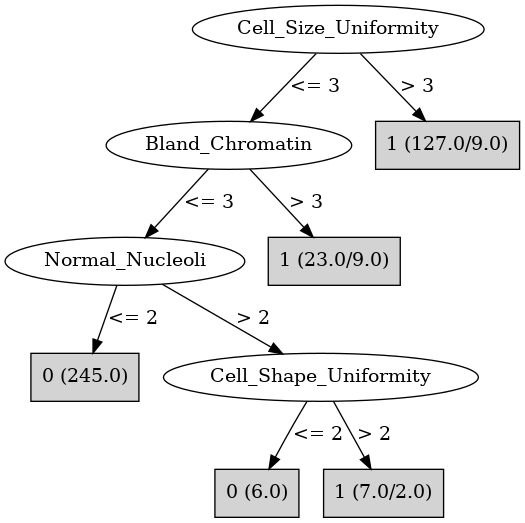

# J48

# SimpleCart Decision Tree

Cell_Size_Uniformity < 3.5

* Bare_Nuclei < 6.0

*   * Normal_Nucleoli < 9.0: 0(311.65/5.0)

*   * Normal_Nucleoli >= 9.0: 1(3.0/0.0)

* Bare_Nuclei >= 6.0: 1(17.0/2.34)

Cell_Size_Uniformity >= 3.5: 1(139.0/11.0)

# PART

Decision list:

conditions|predicted class
---|---
Cell_Shape_Uniformity <= 2.0 AND Single_Epi_Cell_Size <= 2.0 AND Bare_Nuclei <= 2.0| 0 (251.77)
Bland_Chromatin <= 2.0 AND Normal_Nucleoli <= 1.0| 0 (42.17)
Cell_Shape_Uniformity > 3.0 AND Clump_Thickness > 6.0 AND Bare_Nuclei > 2.0| 1 (81.8)
Cell_Size_Uniformity > 4.0 AND Mitoses > 1.0| 1 (28.0)
Cell_Shape_Uniformity <= 2.0 AND Marginal_Adhesion > 1.0| 0 (9.0/2.0)
Bland_Chromatin > 4.0 AND Bare_Nuclei > 6.0 AND Normal_Nucleoli <= 6.0| 1 (16.07)
Normal_Nucleoli > 2.0 AND Cell_Size_Uniformity > 6.0| 1 (13.1)
Cell_Size_Uniformity > 1.0 AND Clump_Thickness <= 6.0 AND Marginal_Adhesion <= 3.0| 0 (12.0/4.0)
Cell_Size_Uniformity <= 1.0| 0 (9.06/1.0)
Single_Epi_Cell_Size <= 5.0 AND Clump_Thickness > 5.0| 1 (9.04/4.0)
Single_Epi_Cell_Size <= 5.0| 1 (9.0)
| 0 (8.0/4.0)

# JRip

Decision list:

conditions|predicted class
---|---
(Cell_Size_Uniformity >= 3) and (Bare_Nuclei >= 6)|1 (114.0/3.0)
(Cell_Shape_Uniformity >= 4) and (Clump_Thickness >= 7)|1 (30.0/1.0)
(Normal_Nucleoli >= 3) and (Bare_Nuclei >= 2)|1 (23.0/5.0)
|0 (322.0/6.0)

# Decision Table

Non matches covered by Majority class

cell_shape_uniformity|bare_nuclei|target
---|---|---
(1.5-2.5]|(5.5-inf)|1
(2.5-4.5]|(5.5-inf)|1
(7.5-inf)|(5.5-inf)|1
(-inf-1.5]|(5.5-inf)|0
(4.5-7.5]|(5.5-inf)|1
(1.5-2.5]|(2.5-5.5]|0
(-inf-1.5]|(2.5-5.5]|0
(4.5-7.5]|(2.5-5.5]|1
(7.5-inf)|(2.5-5.5]|1
(2.5-4.5]|(2.5-5.5]|1
(7.5-inf)|?|0
(2.5-4.5]|?|0
(1.5-2.5]|?|0
(-inf-1.5]|?|0
(4.5-7.5]|?|0
(4.5-7.5]|(1.5-2.5]|0
(-inf-1.5]|(1.5-2.5]|0
(2.5-4.5]|(1.5-2.5]|0
(7.5-inf)|(1.5-2.5]|1
(1.5-2.5]|(1.5-2.5]|0
(4.5-7.5]|(-inf-1.5]|0
(1.5-2.5]|(-inf-1.5]|0
(-inf-1.5]|(-inf-1.5]|0
(2.5-4.5]|(-inf-1.5]|0
(7.5-inf)|(-inf-1.5]|1

