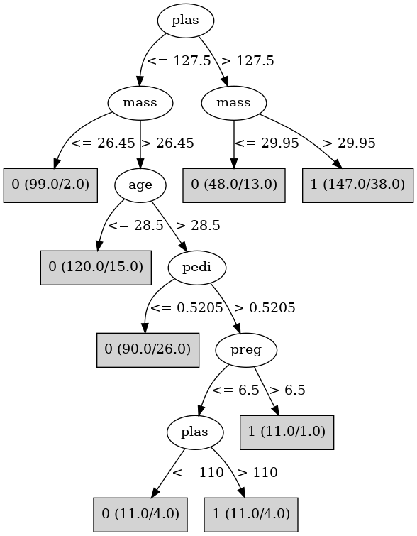

# J48

# SimpleCart Decision Tree

plas < 127.5: 0(278.0/64.0)

plas >= 127.5

* mass < 29.95: 0(35.0/13.0)

* mass >= 29.95: 1(109.0/38.0)

# PART

Decision list:

conditions|predicted class
---|---
plas <= 127 AND mass <= 26.4| 0 (99.0/2.0)
plas <= 127 AND age <= 28 AND preg <= 2 AND preg > 0 AND skin <= 31| 0 (40.0)
plas <= 166 AND plas > 89 AND preg <= 6| 0 (219.0/81.0)
plas > 89 AND plas > 142 AND mass > 29.2| 1 (72.0/8.0)
plas <= 89| 0 (42.0/4.0)
mass <= 39 AND age > 47 AND pedi <= 0.554 AND preg > 7| 0 (10.0)
mass <= 38.9| 1 (47.0/20.0)
| 1 (8.0)

# JRip

Decision list:

conditions|predicted class
---|---
(plas >= 128) and (mass >= 30)|1 (147.0/38.0)
(age >= 29) and (insu >= 144)|1 (25.0/9.0)
|0 (365.0/61.0)

# Decision Table

Non matches covered by Majority class

plas|mass|age|target
---|---|---|---
(166.5-inf)|(26.45-inf)|(28.5-inf)|1
(101.5-127.5]|(26.45-inf)|(28.5-inf)|0
(-inf-101.5]|(26.45-inf)|(28.5-inf)|0
(127.5-166.5]|(26.45-inf)|(28.5-inf)|1
(166.5-inf)|(-inf-26.45]|(28.5-inf)|1
(127.5-166.5]|(-inf-26.45]|(28.5-inf)|0
(-inf-101.5]|(-inf-26.45]|(28.5-inf)|0
(101.5-127.5]|(-inf-26.45]|(28.5-inf)|0
(166.5-inf)|(26.45-inf)|(-inf-28.5]|1
(127.5-166.5]|(26.45-inf)|(-inf-28.5]|1
(-inf-101.5]|(26.45-inf)|(-inf-28.5]|0
(101.5-127.5]|(26.45-inf)|(-inf-28.5]|0
(166.5-inf)|(-inf-26.45]|(-inf-28.5]|0
(101.5-127.5]|(-inf-26.45]|(-inf-28.5]|0
(127.5-166.5]|(-inf-26.45]|(-inf-28.5]|0
(-inf-101.5]|(-inf-26.45]|(-inf-28.5]|0

