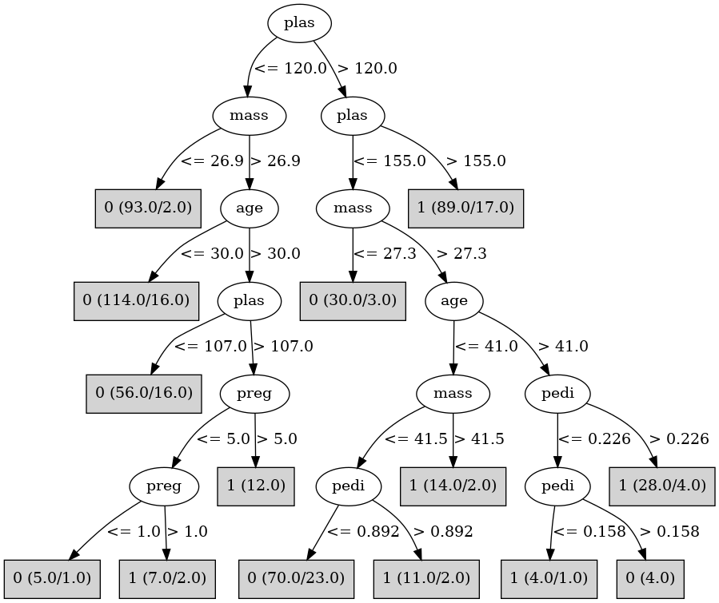

# J48

# SimpleCart Decision Tree

plas < 127.5: 0(257.0/66.0)

plas >= 127.5

* mass < 29.95

*   * plas < 160.0: 0(34.0/9.0)

*   * plas >= 160.0: 1(10.0/4.0)

* mass >= 29.95: 1(113.0/44.0)

# PART

Decision list:

conditions|predicted class
---|---
plas <= 127.5| 0 (292.0/61.0)
mass <= 27.45 AND plas <= 160| 0 (25.0/2.0)
| 1 (161.0/48.0)

# JRip

Decision list:

conditions|predicted class
---|---
(plas >= 156)|1 (89.0/17.0)
(age >= 31) and (mass >= 27.4) and (plas >= 108)|1 (101.0/34.0)
|0 (347.0/59.0)

# Decision Table

Non matches covered by Majority class

plas|skin|mass|age|target
---|---|---|---|---
(155.5-inf)|all|(27.35-inf)|(30.5-inf)|1
(-inf-99.5]|all|(27.35-inf)|(30.5-inf)|0
(120.5-155.5]|all|(27.35-inf)|(30.5-inf)|1
(99.5-120.5]|all|(27.35-inf)|(30.5-inf)|1
(-inf-99.5]|all|(-inf-27.35]|(30.5-inf)|0
(155.5-inf)|all|(-inf-27.35]|(30.5-inf)|1
(99.5-120.5]|all|(-inf-27.35]|(30.5-inf)|0
(120.5-155.5]|all|(-inf-27.35]|(30.5-inf)|0
(155.5-inf)|all|(27.35-inf)|(-inf-30.5]|1
(-inf-99.5]|all|(27.35-inf)|(-inf-30.5]|0
(99.5-120.5]|all|(27.35-inf)|(-inf-30.5]|0
(120.5-155.5]|all|(27.35-inf)|(-inf-30.5]|0
(155.5-inf)|all|(-inf-27.35]|(-inf-30.5]|0
(-inf-99.5]|all|(-inf-27.35]|(-inf-30.5]|0
(120.5-155.5]|all|(-inf-27.35]|(-inf-30.5]|0
(99.5-120.5]|all|(-inf-27.35]|(-inf-30.5]|0

