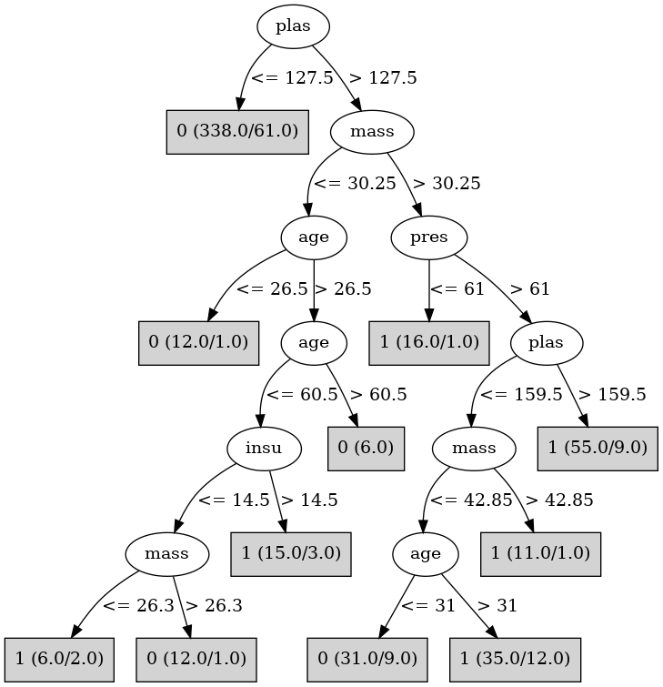

# J48

# SimpleCart Decision Tree

plas < 127.5

* age < 28.5

*   * mass < 31.4

*   *   * pedi < 0.672: 0(93.0/0.0)

*   *   * pedi >= 0.672: 0(11.0/1.0)

*   * mass >= 31.4: 0(71.0/17.0)

* age >= 28.5

*   * plas < 91.5: 0(30.0/1.0)

*   * plas >= 91.5

*   *   * mass < 26.35: 0(23.0/2.0)

*   *   * mass >= 26.35

*   *   *   * pedi < 0.5205

*   *   *   *   * pres < 73.0

*   *   *   *   *   * insu < 27.0: 1(13.0/5.0)

*   *   *   *   *   * insu >= 27.0: 0(8.0/1.0)

*   *   *   *   * pres >= 73.0

*   *   *   *   *   * insu < 126.5: 0(25.0/5.0)

*   *   *   *   *   * insu >= 126.5: 1(2.0/1.0)

*   *   *   * pedi >= 0.5205

*   *   *   *   * preg < 6.5

*   *   *   *   *   * pedi < 0.7244999999999999: 1(6.0/1.0)

*   *   *   *   *   * pedi >= 0.7244999999999999

*   *   *   *   *   *   * mass < 33.05

*   *   *   *   *   *   *   * plas < 108.5: 0(2.0/1.0)

*   *   *   *   *   *   *   * plas >= 108.5: 1(3.0/0.0)

*   *   *   *   *   *   * mass >= 33.05: 0(7.0/1.0)

*   *   *   *   * preg >= 6.5: 1(8.0/0.0)

plas >= 127.5

* mass < 30.25

*   * plas < 146.5

*   *   * pedi < 0.4065

*   *   *   * pedi < 0.258: 0(9.0/1.0)

*   *   *   * pedi >= 0.258

*   *   *   *   * plas < 132.0: 0(2.0/1.0)

*   *   *   *   * plas >= 132.0: 1(4.0/0.0)

*   *   * pedi >= 0.4065: 0(11.0/0.0)

*   * plas >= 146.5

*   *   * insu < 14.5

*   *   *   * pedi < 0.18: 1(3.0/0.0)

*   *   *   * pedi >= 0.18: 0(10.0/1.0)

*   *   * insu >= 14.5: 1(8.0/1.0)

* mass >= 30.25

*   * plas < 154.5

*   *   * mass < 42.849999999999994

*   *   *   * age < 42.5

*   *   *   *   * pres < 61.0: 1(6.0/1.0)

*   *   *   *   * pres >= 61.0

*   *   *   *   *   * pedi < 0.73

*   *   *   *   *   *   * skin < 31.5

*   *   *   *   *   *   *   * pres < 73.0

*   *   *   *   *   *   *   *   * plas < 139.0: 1(3.0/2.0)

*   *   *   *   *   *   *   *   * plas >= 139.0: 0(3.0/0.0)

*   *   *   *   *   *   *   * pres >= 73.0: 0(12.0/0.0)

*   *   *   *   *   *   * skin >= 31.5

*   *   *   *   *   *   *   * insu < 261.0: 1(7.0/4.0)

*   *   *   *   *   *   *   * insu >= 261.0: 0(4.0/0.0)

*   *   *   *   *   * pedi >= 0.73

*   *   *   *   *   *   * mass < 39.55: 1(6.0/0.0)

*   *   *   *   *   *   * mass >= 39.55: 0(3.0/1.0)

*   *   *   * age >= 42.5

*   *   *   *   * insu < 105.0

*   *   *   *   *   * pedi < 0.2375: 0(3.0/0.0)

*   *   *   *   *   * pedi >= 0.2375: 1(4.0/1.0)

*   *   *   *   * insu >= 105.0: 1(9.0/0.0)

*   *   * mass >= 42.849999999999994: 1(11.0/1.0)

*   * plas >= 154.5: 1(56.0/11.0)

# PART

Decision list:

conditions|predicted class
---|---
plas <= 127.0 AND mass > 27.0 AND age <= 26.0| 0 (91.0/9.0)
plas > 123.0| 1 (204.0/83.0)
| 0 (189.0/34.0)

# JRip

Decision list:

conditions|predicted class
---|---
(plas >= 161) and (age <= 53) and (pres <= 86) and (pedi >= 0.345)|1 (27.0/0.0)
(plas >= 128) and (mass >= 31.6) and (age >= 31) and (skin >= 25) and (age <= 38)|1 (15.0/0.0)
(plas >= 124) and (age >= 41) and (insu >= 110) and (pedi <= 0.615)|1 (18.0/0.0)
(plas >= 155) and (mass >= 29.9) and (insu <= 0) and (pres <= 92) and (preg <= 9)|1 (15.0/0.0)
(plas >= 104) and (age >= 28) and (mass >= 26.4) and (pedi >= 0.323) and (plas <= 119) and (pres >= 70) and (pres <= 86)|1 (11.0/0.0)
(plas >= 124) and (preg >= 3) and (pedi >= 0.323) and (plas <= 125)|1 (5.0/0.0)
(plas >= 128) and (mass >= 31.6) and (pres <= 60) and (age <= 40)|1 (7.0/0.0)
(plas >= 129) and (preg >= 3) and (mass >= 35.2) and (preg <= 5)|1 (6.0/0.0)
(plas >= 109) and (age >= 31) and (age <= 54) and (preg <= 3) and (mass <= 32.5) and (plas <= 169)|1 (6.0/0.0)
|0 (427.0/72.0)

# Decision Table

Non matches covered by IB1

plas|pres|insu|mass|pedi|age|target
---|---|---|---|---|---|---
(-inf-101.5]|all|(121-inf)|(29.85-inf)|all|(28.5-inf)|0
(101.5-127.5]|all|(121-inf)|(29.85-inf)|all|(28.5-inf)|0
(127.5-160]|all|(121-inf)|(29.85-inf)|all|(28.5-inf)|1
(160-inf)|all|(121-inf)|(29.85-inf)|all|(28.5-inf)|1
(-inf-101.5]|all|(-inf-121]|(29.85-inf)|all|(28.5-inf)|0
(127.5-160]|all|(-inf-121]|(29.85-inf)|all|(28.5-inf)|1
(160-inf)|all|(-inf-121]|(29.85-inf)|all|(28.5-inf)|1
(101.5-127.5]|all|(-inf-121]|(29.85-inf)|all|(28.5-inf)|0
(160-inf)|all|(121-inf)|(-inf-29.85]|all|(28.5-inf)|1
(127.5-160]|all|(121-inf)|(-inf-29.85]|all|(28.5-inf)|1
(101.5-127.5]|all|(121-inf)|(-inf-29.85]|all|(28.5-inf)|1
(-inf-101.5]|all|(121-inf)|(-inf-29.85]|all|(28.5-inf)|0
(-inf-101.5]|all|(121-inf)|(29.85-inf)|all|(-inf-28.5]|0
(127.5-160]|all|(-inf-121]|(-inf-29.85]|all|(28.5-inf)|0
(101.5-127.5]|all|(121-inf)|(29.85-inf)|all|(-inf-28.5]|0
(-inf-101.5]|all|(-inf-121]|(-inf-29.85]|all|(28.5-inf)|0
(101.5-127.5]|all|(-inf-121]|(-inf-29.85]|all|(28.5-inf)|0
(127.5-160]|all|(121-inf)|(29.85-inf)|all|(-inf-28.5]|0
(160-inf)|all|(121-inf)|(29.85-inf)|all|(-inf-28.5]|1
(160-inf)|all|(-inf-121]|(-inf-29.85]|all|(28.5-inf)|0
(101.5-127.5]|all|(-inf-121]|(29.85-inf)|all|(-inf-28.5]|0
(127.5-160]|all|(-inf-121]|(29.85-inf)|all|(-inf-28.5]|0
(160-inf)|all|(-inf-121]|(29.85-inf)|all|(-inf-28.5]|1
(-inf-101.5]|all|(-inf-121]|(29.85-inf)|all|(-inf-28.5]|0
(-inf-101.5]|all|(121-inf)|(-inf-29.85]|all|(-inf-28.5]|0
(127.5-160]|all|(121-inf)|(-inf-29.85]|all|(-inf-28.5]|0
(101.5-127.5]|all|(121-inf)|(-inf-29.85]|all|(-inf-28.5]|0
(160-inf)|all|(-inf-121]|(-inf-29.85]|all|(-inf-28.5]|0
(127.5-160]|all|(-inf-121]|(-inf-29.85]|all|(-inf-28.5]|0
(-inf-101.5]|all|(-inf-121]|(-inf-29.85]|all|(-inf-28.5]|0
(101.5-127.5]|all|(-inf-121]|(-inf-29.85]|all|(-inf-28.5]|0

