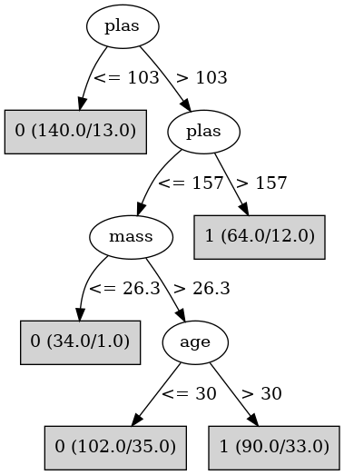

# J48

# SimpleCart Decision Tree

plas < 123.5

* age < 28.5: 0(154.0/17.0)

* age >= 28.5

*   * plas < 99.5: 0(43.0/6.0)

*   * plas >= 99.5

*   *   * mass < 26.35: 0(15.0/1.0)

*   *   * mass >= 26.35

*   *   *   * pedi < 0.2: 0(11.0/1.0)

*   *   *   * pedi >= 0.2: 1(32.0/21.0)

plas >= 123.5

* plas < 154.5

*   * mass < 26.25: 0(20.0/0.0)

*   * mass >= 26.25

*   *   * pedi < 0.3115

*   *   *   * pres < 77.0: 1(10.0/9.0)

*   *   *   * pres >= 77.0

*   *   *   *   * age < 36.5: 0(9.0/0.0)

*   *   *   *   * age >= 36.5: 0(10.0/6.0)

*   *   * pedi >= 0.3115

*   *   *   * age < 39.5: 1(29.0/26.0)

*   *   *   * age >= 39.5: 1(21.0/4.0)

* plas >= 154.5: 1(74.0/18.0)

# PART

Decision list:

conditions|predicted class
---|---
plas <= 127.5 AND mass > 26.95 AND pedi <= 0.823| 0 (143.0/28.0)
mass <= 28.1| 0 (75.0/8.0)
plas <= 165.5 AND preg > 2.5| 1 (61.0/18.0)
plas <= 165.5| 0 (41.0/19.0)
| 1 (38.0/5.0)

# JRip

Decision list:

conditions|predicted class
---|---
(plas >= 155)|1 (92.0/18.0)
(age >= 31) and (plas >= 107) and (mass >= 27)|1 (96.0/33.0)
|0 (349.0/60.0)

# Decision Table

Non matches covered by IB1

plas|pres|skin|mass|age|target
---|---|---|---|---|---
(-inf-99.5]|all|all|(26.35-inf)|(28.5-inf)|0
(99.5-123.5]|all|all|(26.35-inf)|(28.5-inf)|0
(123.5-154.5]|all|all|(26.35-inf)|(28.5-inf)|1
(154.5-inf)|all|all|(26.35-inf)|(28.5-inf)|1
(-inf-99.5]|all|all|(-inf-26.35]|(28.5-inf)|0
(123.5-154.5]|all|all|(-inf-26.35]|(28.5-inf)|0
(99.5-123.5]|all|all|(-inf-26.35]|(28.5-inf)|0
(154.5-inf)|all|all|(-inf-26.35]|(28.5-inf)|1
(154.5-inf)|all|all|(26.35-inf)|(-inf-28.5]|1
(99.5-123.5]|all|all|(26.35-inf)|(-inf-28.5]|0
(123.5-154.5]|all|all|(26.35-inf)|(-inf-28.5]|0
(-inf-99.5]|all|all|(26.35-inf)|(-inf-28.5]|0
(123.5-154.5]|all|all|(-inf-26.35]|(-inf-28.5]|0
(154.5-inf)|all|all|(-inf-26.35]|(-inf-28.5]|0
(-inf-99.5]|all|all|(-inf-26.35]|(-inf-28.5]|0
(99.5-123.5]|all|all|(-inf-26.35]|(-inf-28.5]|0

