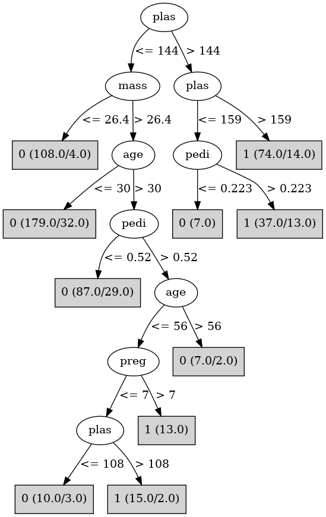

# J48

# SimpleCart Decision Tree

plas < 144.5: 0(323.0/96.0)

plas >= 144.5: 1(84.0/34.0)

# PART

Decision list:

conditions|predicted class
---|---
plas <= 144.5 AND mass > 26.45 AND age <= 30.5 AND mass <= 42.400000000000006 AND preg <= 5.5 AND preg > 0.5| 0 (118.0/11.0)
mass <= 26.45 AND plas <= 153.5| 0 (110.0/4.0)
plas > 159.5| 1 (74.0/14.0)
plas <= 99.5 AND skin > 20.5 AND insu > 38.0| 0 (17.0/1.0)
pedi <= 0.729 AND mass <= 45.4| 0 (166.0/61.0)
| 1 (52.0/9.0)

# JRip

Decision list:

conditions|predicted class
---|---
(plas >= 144)|1 (123.0/37.0)
(mass >= 27.9) and (age >= 31) and (pedi >= 0.528)|1 (40.0/11.0)
|0 (374.0/65.0)

# Decision Table

Non matches covered by Majority class

preg|plas|mass|age|target
---|---|---|---|---
(-inf-6.5]|(144.5-inf)|(42.85-inf)|(30.5-inf)|1
(6.5-inf)|(144.5-inf)|(42.85-inf)|(30.5-inf)|1
(-inf-6.5]|(99.5-144.5]|(42.85-inf)|(30.5-inf)|1
(6.5-inf)|(99.5-144.5]|(42.85-inf)|(30.5-inf)|1
(-inf-6.5]|(-inf-99.5]|(42.85-inf)|(30.5-inf)|0
(6.5-inf)|(-inf-99.5]|(42.85-inf)|(30.5-inf)|0
(6.5-inf)|(144.5-inf)|(27.85-42.85]|(30.5-inf)|1
(-inf-6.5]|(144.5-inf)|(27.85-42.85]|(30.5-inf)|1
(-inf-6.5]|(144.5-inf)|(42.85-inf)|(-inf-30.5]|1
(-inf-6.5]|(99.5-144.5]|(27.85-42.85]|(30.5-inf)|0
(6.5-inf)|(99.5-144.5]|(27.85-42.85]|(30.5-inf)|1
(-inf-6.5]|(99.5-144.5]|(42.85-inf)|(-inf-30.5]|1
(-inf-6.5]|(-inf-99.5]|(27.85-42.85]|(30.5-inf)|0
(-inf-6.5]|(144.5-inf)|(-inf-27.85]|(30.5-inf)|0
(6.5-inf)|(-inf-99.5]|(27.85-42.85]|(30.5-inf)|0
(6.5-inf)|(144.5-inf)|(-inf-27.85]|(30.5-inf)|1
(-inf-6.5]|(-inf-99.5]|(42.85-inf)|(-inf-30.5]|0
(-inf-6.5]|(144.5-inf)|(27.85-42.85]|(-inf-30.5]|1
(6.5-inf)|(99.5-144.5]|(-inf-27.85]|(30.5-inf)|0
(-inf-6.5]|(99.5-144.5]|(-inf-27.85]|(30.5-inf)|0
(6.5-inf)|(99.5-144.5]|(27.85-42.85]|(-inf-30.5]|0
(6.5-inf)|(-inf-99.5]|(-inf-27.85]|(30.5-inf)|0
(-inf-6.5]|(-inf-99.5]|(-inf-27.85]|(30.5-inf)|0
(-inf-6.5]|(99.5-144.5]|(27.85-42.85]|(-inf-30.5]|0
(-inf-6.5]|(144.5-inf)|(-inf-27.85]|(-inf-30.5]|0
(-inf-6.5]|(-inf-99.5]|(27.85-42.85]|(-inf-30.5]|0
(6.5-inf)|(99.5-144.5]|(-inf-27.85]|(-inf-30.5]|0
(-inf-6.5]|(99.5-144.5]|(-inf-27.85]|(-inf-30.5]|0
(-inf-6.5]|(-inf-99.5]|(-inf-27.85]|(-inf-30.5]|0

