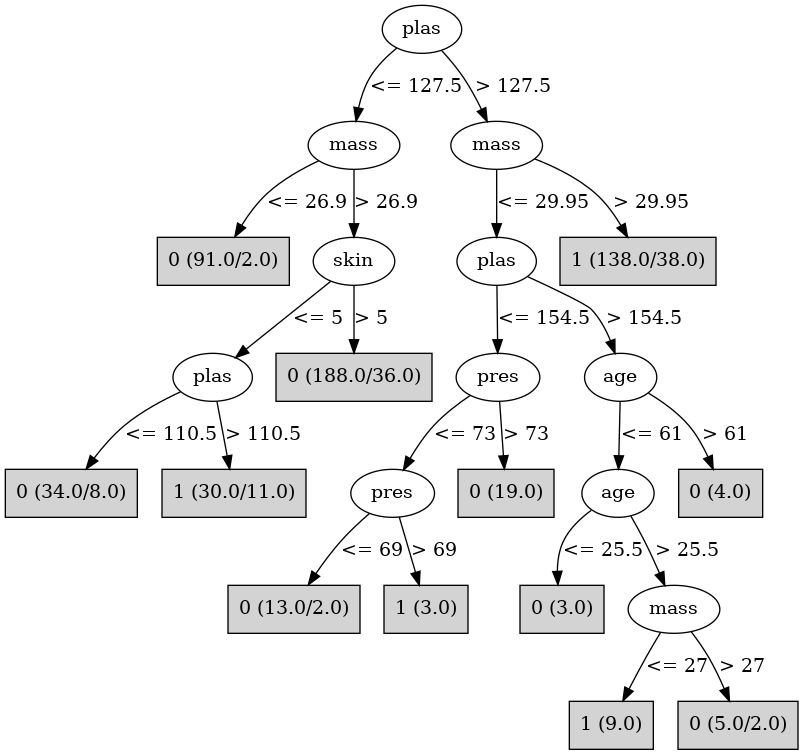

# J48

# SimpleCart Decision Tree

plas < 127.5

* age < 28.5: 0(176.0/20.0)

* age >= 28.5

*   * plas < 99.5: 0(46.0/5.0)

*   * plas >= 99.5

*   *   * mass < 26.6: 0(16.0/1.0)

*   *   * mass >= 26.6

*   *   *   * pedi < 0.5555

*   *   *   *   * skin < 25.5

*   *   *   *   *   * pres < 84.0: 1(17.0/8.0)

*   *   *   *   *   * pres >= 84.0: 0(7.0/1.0)

*   *   *   *   * skin >= 25.5: 0(19.0/4.0)

*   *   *   * pedi >= 0.5555: 1(17.0/6.0)

plas >= 127.5

* mass < 29.95: 0(40.0/16.0)

* mass >= 29.95

*   * plas < 158.5

*   *   * pedi < 0.421

*   *   *   * mass < 41.8: 0(20.0/10.0)

*   *   *   * mass >= 41.8: 1(9.0/1.0)

*   *   * pedi >= 0.421: 1(34.0/11.0)

*   * plas >= 158.5: 1(47.0/6.0)

# PART

Decision list:

conditions|predicted class
---|---
plas <= 127.5 AND mass > 26.9 AND plas <= 99.5| 0 (94.0/10.0)
mass <= 27.85 AND plas > 106.5 AND plas <= 153.0| 0 (68.0/9.0)
plas <= 127.5 AND mass <= 27.85| 0 (61.0)
plas > 129.5 AND age <= 62.5 AND preg <= 7.5 AND plas > 159.5| 1 (47.0/8.0)
preg > 7.5 AND pedi > 0.554| 1 (20.0)
plas <= 127.5 AND skin > 5.5 AND pedi <= 0.2555| 0 (23.0)
mass <= 42.849999999999994 AND age <= 28.5 AND pres > 51.0 AND skin > 20.5| 0 (61.0/12.0)
mass > 39.05| 1 (26.0/6.0)
pedi > 0.737| 1 (15.0/3.0)
age <= 62.0 AND plas > 141.0 AND age > 42.5| 1 (14.0/1.0)
age <= 54.5 AND pres <= 83.0 AND age > 26.5 AND age > 32.5 AND mass <= 36.2 AND insu <= 11.0| 1 (21.0/8.0)
mass <= 37.75 AND age <= 53.5 AND pres <= 87.0 AND insu <= 193.5 AND insu <= 128.0 AND skin > 17.5| 0 (16.0/4.0)
pres <= 83.0 AND age <= 53.5 AND insu <= 193.5 AND pedi > 0.226| 1 (26.0/6.0)
| 0 (45.0/9.0)

# JRip

Decision list:

conditions|predicted class
---|---
(plas >= 128) and (mass >= 30)|1 (138.0/38.0)
|0 (399.0/81.0)

# Decision Table

Non matches covered by IB1

plas|skin|pedi|target
---|---|---|---
(166.5-inf)|(31.5-inf)|(0.3245-inf)|1
(127.5-166.5]|(31.5-inf)|(0.3245-inf)|1
(-inf-99.5]|(31.5-inf)|(0.3245-inf)|0
(99.5-127.5]|(31.5-inf)|(0.3245-inf)|1
(-inf-99.5]|(4-31.5]|(0.3245-inf)|0
(166.5-inf)|(4-31.5]|(0.3245-inf)|1
(127.5-166.5]|(4-31.5]|(0.3245-inf)|0
(99.5-127.5]|(4-31.5]|(0.3245-inf)|0
(166.5-inf)|(31.5-inf)|(-inf-0.3245]|1
(166.5-inf)|(-inf-4]|(0.3245-inf)|1
(127.5-166.5]|(31.5-inf)|(-inf-0.3245]|1
(99.5-127.5]|(-inf-4]|(0.3245-inf)|0
(-inf-99.5]|(31.5-inf)|(-inf-0.3245]|0
(-inf-99.5]|(-inf-4]|(0.3245-inf)|0
(127.5-166.5]|(-inf-4]|(0.3245-inf)|1
(99.5-127.5]|(31.5-inf)|(-inf-0.3245]|0
(166.5-inf)|(4-31.5]|(-inf-0.3245]|1
(99.5-127.5]|(4-31.5]|(-inf-0.3245]|0
(-inf-99.5]|(4-31.5]|(-inf-0.3245]|0
(127.5-166.5]|(4-31.5]|(-inf-0.3245]|0
(127.5-166.5]|(-inf-4]|(-inf-0.3245]|0
(99.5-127.5]|(-inf-4]|(-inf-0.3245]|0
(-inf-99.5]|(-inf-4]|(-inf-0.3245]|0
(166.5-inf)|(-inf-4]|(-inf-0.3245]|1

