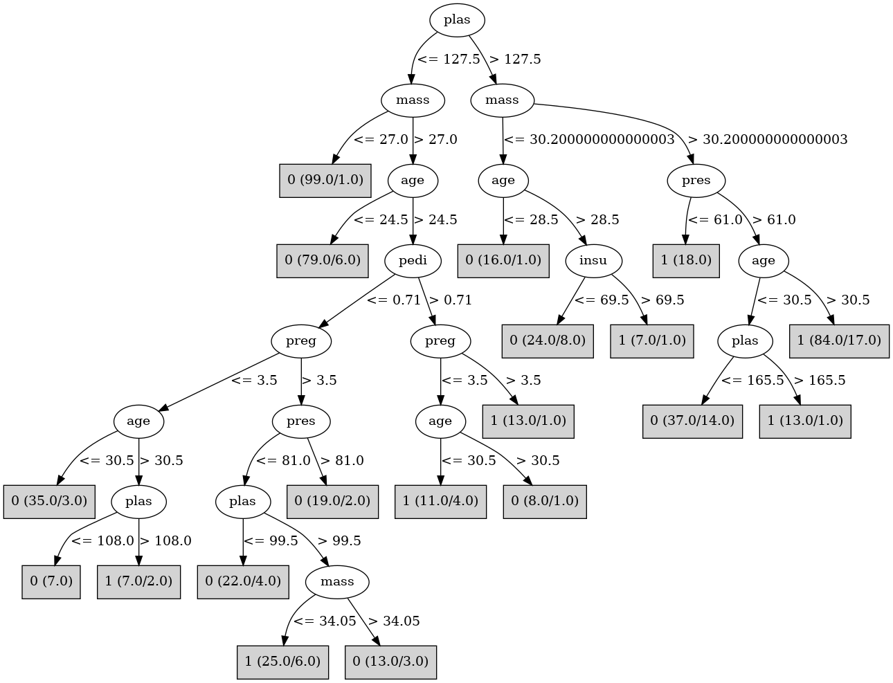

# J48

# SimpleCart Decision Tree

plas < 127.5: 0(275.0/63.0)

plas >= 127.5

* mass < 30.200000000000003: 0(32.0/15.0)

* mass >= 30.200000000000003: 1(111.0/41.0)

# PART

Decision list:

conditions|predicted class
---|---
plas <= 127 AND mass > 26.9 AND preg <= 4| 0 (143.0/24.0)
mass > 26.9 AND pedi <= 0.718 AND plas <= 165 AND plas > 96| 1 (130.0/63.0)
mass <= 26.9| 0 (113.0/8.0)
plas > 98| 1 (75.0/9.0)
| 0 (23.0/5.0)

# JRip

Decision list:

conditions|predicted class
---|---
(plas >= 128) and (mass >= 33.3)|1 (108.0/26.0)
(preg >= 4) and (plas >= 139) and (mass >= 30)|1 (20.0/2.0)
(age >= 28) and (pedi >= 0.323) and (insu >= 127)|1 (25.0/8.0)
|0 (384.0/72.0)

# Decision Table

Non matches covered by Majority class

plas|mass|age|target
---|---|---|---
(-inf-99.5]|(27.35-inf)|(30.5-inf)|0
(99.5-127.5]|(27.35-inf)|(30.5-inf)|1
(127.5-inf)|(27.35-inf)|(30.5-inf)|1
(127.5-inf)|(-inf-27.35]|(30.5-inf)|0
(99.5-127.5]|(-inf-27.35]|(30.5-inf)|0
(-inf-99.5]|(-inf-27.35]|(30.5-inf)|0
(-inf-99.5]|(27.35-inf)|(24.5-30.5]|0
(99.5-127.5]|(27.35-inf)|(24.5-30.5]|0
(127.5-inf)|(27.35-inf)|(24.5-30.5]|1
(-inf-99.5]|(-inf-27.35]|(24.5-30.5]|0
(99.5-127.5]|(-inf-27.35]|(24.5-30.5]|0
(127.5-inf)|(27.35-inf)|(-inf-24.5]|0
(-inf-99.5]|(27.35-inf)|(-inf-24.5]|0
(99.5-127.5]|(27.35-inf)|(-inf-24.5]|0
(127.5-inf)|(-inf-27.35]|(-inf-24.5]|0
(99.5-127.5]|(-inf-27.35]|(-inf-24.5]|0
(-inf-99.5]|(-inf-27.35]|(-inf-24.5]|0

