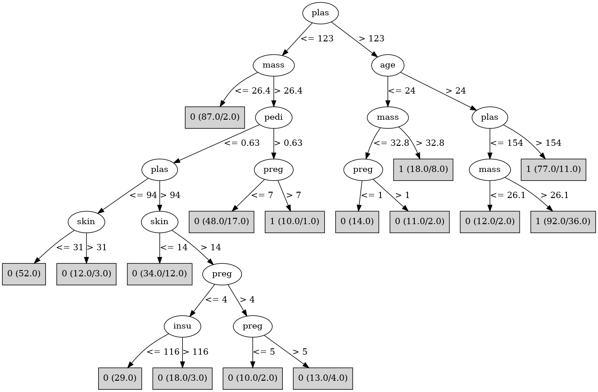

# J48

# SimpleCart Decision Tree

plas < 127.5: 0(278.0/63.0)

plas >= 127.5

* mass < 29.95: 0(35.0/18.0)

* mass >= 29.95: 1(107.0/36.0)

# PART

Decision list:

conditions|predicted class
---|---
plas <= 127.5 AND age <= 28.5| 0 (175.0/15.0)
plas > 154.5| 1 (77.0/14.0)
mass > 26.3 AND plas <= 103.5| 0 (47.0/10.0)
mass <= 26.3| 0 (39.0/4.0)
mass <= 42.65 AND age <= 24.5| 0 (14.0/3.0)
mass > 42.2| 1 (14.0/2.0)
plas <= 149.5 AND pedi > 0.516 AND pres <= 83 AND preg > 1.5 AND pres > 75.5| 1 (10.0/1.0)
mass <= 38.2 AND pedi <= 0.847 AND mass > 27.55 AND mass <= 30.2| 0 (25.0/7.0)
mass <= 34.6| 1 (54.0/17.0)
plas <= 126.5| 0 (13.0/2.0)
insu <= 115| 1 (9.0/3.0)
| 0 (7.0/2.0)

# JRip

Decision list:

conditions|predicted class
---|---
(plas >= 155) and (pedi >= 0.328) and (pres <= 76) and (pedi <= 1.893)|1 (34.0/0.0)
(plas >= 124) and (mass >= 30.3) and (age >= 32) and (pedi >= 0.423) and (pedi <= 1.154)|1 (29.0/0.0)
(pedi <= 0.268) and (plas >= 164) and (preg <= 6)|1 (9.0/0.0)
(plas >= 115) and (mass >= 30) and (age >= 31) and (insu <= 90) and (mass <= 33.7) and (preg <= 9) and (preg >= 4)|1 (12.0/0.0)
(plas >= 124) and (age >= 25) and (skin >= 41) and (pres >= 82)|1 (8.0/0.0)
(age >= 41) and (preg >= 6) and (age <= 43) and (plas >= 125)|1 (8.0/0.0)
(pedi >= 0.63) and (insu <= 182) and (mass >= 42.3) and (plas >= 111)|1 (8.0/0.0)
|0 (429.0/80.0)

# Decision Table

Non matches covered by Majority class

plas|skin|mass|age|target
---|---|---|---|---
(-inf-99.5]|all|(29.65-inf)|(28.5-inf)|0
(99.5-123.5]|all|(29.65-inf)|(28.5-inf)|0
(123.5-154.5]|all|(29.65-inf)|(28.5-inf)|1
(154.5-inf)|all|(29.65-inf)|(28.5-inf)|1
(-inf-99.5]|all|(-inf-29.65]|(28.5-inf)|0
(99.5-123.5]|all|(-inf-29.65]|(28.5-inf)|0
(123.5-154.5]|all|(-inf-29.65]|(28.5-inf)|0
(154.5-inf)|all|(-inf-29.65]|(28.5-inf)|1
(123.5-154.5]|all|(29.65-inf)|(24.5-28.5]|0
(154.5-inf)|all|(29.65-inf)|(24.5-28.5]|1
(-inf-99.5]|all|(29.65-inf)|(24.5-28.5]|0
(99.5-123.5]|all|(29.65-inf)|(24.5-28.5]|0
(123.5-154.5]|all|(-inf-29.65]|(24.5-28.5]|0
(154.5-inf)|all|(-inf-29.65]|(24.5-28.5]|0
(-inf-99.5]|all|(-inf-29.65]|(24.5-28.5]|0
(99.5-123.5]|all|(-inf-29.65]|(24.5-28.5]|0
(99.5-123.5]|all|(29.65-inf)|(-inf-24.5]|0
(123.5-154.5]|all|(29.65-inf)|(-inf-24.5]|0
(-inf-99.5]|all|(29.65-inf)|(-inf-24.5]|0
(154.5-inf)|all|(29.65-inf)|(-inf-24.5]|1
(154.5-inf)|all|(-inf-29.65]|(-inf-24.5]|0
(123.5-154.5]|all|(-inf-29.65]|(-inf-24.5]|0
(-inf-99.5]|all|(-inf-29.65]|(-inf-24.5]|0
(99.5-123.5]|all|(-inf-29.65]|(-inf-24.5]|0

