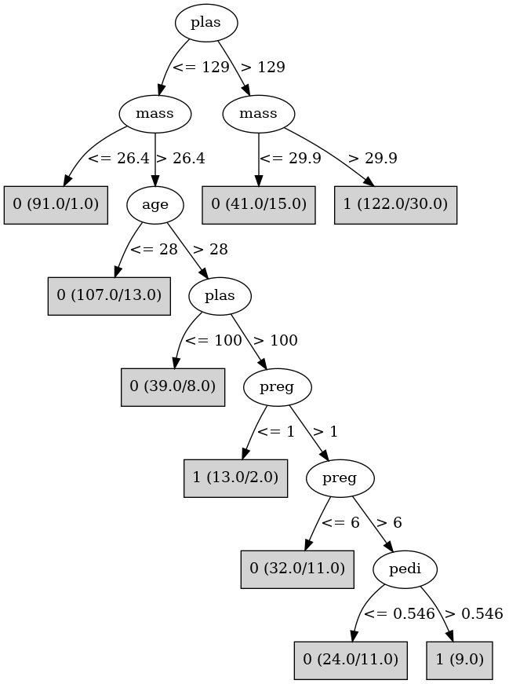

# J48

# SimpleCart Decision Tree

plas < 129.5: 0(280.0/70.0)

plas >= 129.5

* mass < 29.95: 0(29.0/15.0)

* mass >= 29.95: 1(107.0/36.0)

# PART

Decision list:

conditions|predicted class
---|---
plas <= 129.5 AND age <= 28.5| 0 (190.0/13.0)
plas > 154.5 AND mass > 29.25| 1 (71.0/8.0)
plas <= 100.5| 0 (54.0/10.0)
mass <= 43.0 AND mass <= 26.35 AND plas <= 153.5| 0 (28.0/2.0)
mass <= 43.0 AND age > 31.5| 1 (117.0/50.0)
mass <= 43.0| 0 (59.0/21.0)
| 1 (18.0/2.0)

# JRip

Decision list:

conditions|predicted class
---|---
(plas >= 130)|1 (187.0/65.0)
|0 (350.0/70.0)

# Decision Table

Non matches covered by IB1

plas|pres|mass|age|target
---|---|---|---|---
(166-inf)|all|(26.45-inf)|(28.5-inf)|1
(103.5-129.5]|all|(26.45-inf)|(28.5-inf)|1
(-inf-103.5]|all|(26.45-inf)|(28.5-inf)|0
(129.5-166]|all|(26.45-inf)|(28.5-inf)|1
(129.5-166]|all|(-inf-26.45]|(28.5-inf)|0
(-inf-103.5]|all|(-inf-26.45]|(28.5-inf)|0
(103.5-129.5]|all|(-inf-26.45]|(28.5-inf)|0
(166-inf)|all|(-inf-26.45]|(28.5-inf)|1
(166-inf)|all|(26.45-inf)|(-inf-28.5]|1
(-inf-103.5]|all|(26.45-inf)|(-inf-28.5]|0
(103.5-129.5]|all|(26.45-inf)|(-inf-28.5]|0
(129.5-166]|all|(26.45-inf)|(-inf-28.5]|0
(166-inf)|all|(-inf-26.45]|(-inf-28.5]|0
(129.5-166]|all|(-inf-26.45]|(-inf-28.5]|0
(-inf-103.5]|all|(-inf-26.45]|(-inf-28.5]|0
(103.5-129.5]|all|(-inf-26.45]|(-inf-28.5]|0

