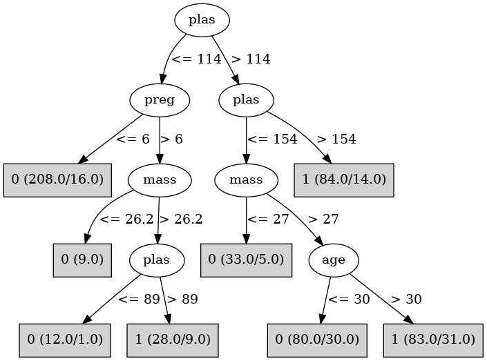

# J48

# SimpleCart Decision Tree

plas < 123.5

* preg < 6.5

*   * plas < 114.5

*   *   * pedi < 0.6735: 0(163.0/7.0)

*   *   * pedi >= 0.6735

*   *   *   * pedi < 0.9245

*   *   *   *   * pres < 67.0

*   *   *   *   *   * pres < 61.0: 0(3.0/0.0)

*   *   *   *   *   * pres >= 61.0: 1(5.0/1.0)

*   *   *   *   * pres >= 67.0

*   *   *   *   *   * age < 35.0: 0(9.0/0.0)

*   *   *   *   *   * age >= 35.0: 1(3.0/2.0)

*   *   *   * pedi >= 0.9245: 0(14.0/1.0)

*   * plas >= 114.5

*   *   * plas < 115.5: 1(4.0/0.0)

*   *   * plas >= 115.5

*   *   *   * insu < 140.0: 0(24.0/5.0)

*   *   *   * insu >= 140.0

*   *   *   *   * plas < 122.5

*   *   *   *   *   * skin < 40.0: 1(5.0/0.0)

*   *   *   *   *   * skin >= 40.0: 0(3.0/1.0)

*   *   *   *   * plas >= 122.5: 0(4.0/0.0)

* preg >= 6.5

*   * plas < 99.5: 0(18.0/3.0)

*   * plas >= 99.5

*   *   * pedi < 0.238

*   *   *   * plas < 110.5: 0(6.0/0.0)

*   *   *   * plas >= 110.5: 1(2.0/1.0)

*   *   * pedi >= 0.238

*   *   *   * mass < 26.95: 0(4.0/2.0)

*   *   *   * mass >= 26.95: 1(18.0/3.0)

plas >= 123.5

* mass < 29.95

*   * plas < 160.0

*   *   * plas < 125.5

*   *   *   * age < 33.0: 0(3.0/0.0)

*   *   *   * age >= 33.0: 1(5.0/0.0)

*   *   * plas >= 125.5

*   *   *   * pres < 55.0: 1(2.0/1.0)

*   *   *   * pres >= 55.0

*   *   *   *   * pres < 74.5

*   *   *   *   *   * preg < 1.5: 0(9.0/0.0)

*   *   *   *   *   * preg >= 1.5

*   *   *   *   *   *   * preg < 2.5: 1(3.0/0.0)

*   *   *   *   *   *   * preg >= 2.5: 0(12.0/2.0)

*   *   *   *   * pres >= 74.5: 0(15.0/0.0)

*   * plas >= 160.0

*   *   * pres < 79.0: 1(8.0/2.0)

*   *   * pres >= 79.0: 0(3.0/0.0)

* mass >= 29.95

*   * plas < 154.5

*   *   * mass < 40.95

*   *   *   * age < 40.5

*   *   *   *   * pedi < 0.8395

*   *   *   *   *   * pres < 53.0: 1(3.0/0.0)

*   *   *   *   *   * pres >= 53.0: 0(31.0/9.0)

*   *   *   *   * pedi >= 0.8395: 1(7.0/0.0)

*   *   *   * age >= 40.5

*   *   *   *   * insu < 109.0

*   *   *   *   *   * pres < 81.0: 1(6.0/1.0)

*   *   *   *   *   * pres >= 81.0: 0(4.0/2.0)

*   *   *   *   * insu >= 109.0: 1(12.0/0.0)

*   *   * mass >= 40.95: 1(17.0/1.0)

*   * plas >= 154.5

*   *   * pedi < 0.3425

*   *   *   * mass < 35.8

*   *   *   *   * plas < 180.5

*   *   *   *   *   * plas < 177.0: 1(5.0/2.0)

*   *   *   *   *   * plas >= 177.0: 0(3.0/0.0)

*   *   *   *   * plas >= 180.5: 1(4.0/0.0)

*   *   *   * mass >= 35.8: 1(11.0/0.0)

*   *   * pedi >= 0.3425: 1(41.0/2.0)

# PART

Decision list:

conditions|predicted class
---|---
plas <= 114 AND preg <= 6| 0 (208.0/16.0)
plas <= 154 AND mass > 27 AND plas > 89 AND age > 30| 1 (110.0/40.0)
plas <= 154 AND pres > 0| 0 (126.0/30.0)
| 1 (93.0/16.0)

# JRip

Decision list:

conditions|predicted class
---|---
(plas >= 155)|1 (84.0/14.0)
(plas >= 115) and (mass >= 30.1) and (age >= 31)|1 (66.0/21.0)
(preg >= 7) and (plas >= 100) and (age <= 43)|1 (24.0/7.0)
|0 (363.0/61.0)

# Decision Table

Non matches covered by Majority class

preg|plas|mass|age|target
---|---|---|---|---
(6.5-inf)|(154.5-inf)|(27.35-inf)|(28.5-inf)|1
(-inf-6.5]|(154.5-inf)|(27.35-inf)|(28.5-inf)|1
(-inf-6.5]|(114.5-154.5]|(27.35-inf)|(28.5-inf)|1
(6.5-inf)|(114.5-154.5]|(27.35-inf)|(28.5-inf)|1
(6.5-inf)|(154.5-inf)|(-inf-27.35]|(28.5-inf)|1
(6.5-inf)|(99.5-114.5]|(27.35-inf)|(28.5-inf)|1
(-inf-6.5]|(154.5-inf)|(-inf-27.35]|(28.5-inf)|1
(-inf-6.5]|(99.5-114.5]|(27.35-inf)|(28.5-inf)|0
(6.5-inf)|(114.5-154.5]|(-inf-27.35]|(28.5-inf)|0
(-inf-6.5]|(114.5-154.5]|(-inf-27.35]|(28.5-inf)|0
(6.5-inf)|(-inf-99.5]|(27.35-inf)|(28.5-inf)|0
(-inf-6.5]|(-inf-99.5]|(27.35-inf)|(28.5-inf)|0
(-inf-6.5]|(154.5-inf)|(27.35-inf)|(-inf-28.5]|1
(6.5-inf)|(114.5-154.5]|(27.35-inf)|(-inf-28.5]|0
(6.5-inf)|(99.5-114.5]|(-inf-27.35]|(28.5-inf)|0
(-inf-6.5]|(99.5-114.5]|(-inf-27.35]|(28.5-inf)|0
(-inf-6.5]|(114.5-154.5]|(27.35-inf)|(-inf-28.5]|0
(-inf-6.5]|(99.5-114.5]|(27.35-inf)|(-inf-28.5]|0
(-inf-6.5]|(-inf-99.5]|(-inf-27.35]|(28.5-inf)|0
(6.5-inf)|(-inf-99.5]|(-inf-27.35]|(28.5-inf)|0
(-inf-6.5]|(154.5-inf)|(-inf-27.35]|(-inf-28.5]|0
(-inf-6.5]|(114.5-154.5]|(-inf-27.35]|(-inf-28.5]|0
(-inf-6.5]|(-inf-99.5]|(27.35-inf)|(-inf-28.5]|0
(-inf-6.5]|(99.5-114.5]|(-inf-27.35]|(-inf-28.5]|0
(-inf-6.5]|(-inf-99.5]|(-inf-27.35]|(-inf-28.5]|0

