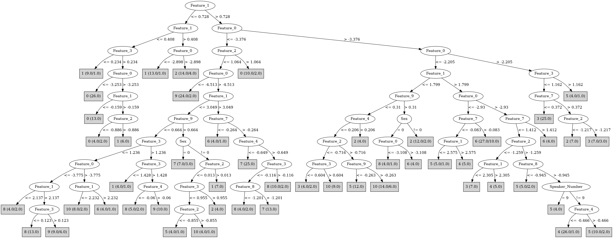

# J48

# SimpleCart Decision Tree

Feature_1 < 0.40700000000000003

* Feature_3 < 0.3295: 1(14.0/2.0)

* Feature_3 >= 0.3295

*   * Speaker_Number=(14)|(12)|(11)|(10)|(9)|(8)|(5)|(3)|(2)|(1)|(7)|(13): 0(47.0/1.0)

*   * Speaker_Number!=(14)|(12)|(11)|(10)|(9)|(8)|(5)|(3)|(2)|(1)|(7)|(13)

*   *   * Feature_0 < -3.1955: 0(13.0/0.0)

*   *   * Feature_0 >= -3.1955: 1(8.0/1.0)

Feature_1 >= 0.40700000000000003

* Feature_0 < -3.473

*   * Feature_4 < -1.1145: 7(32.0/5.0)

*   * Feature_4 >= -1.1145

*   *   * Feature_1 < 3.51

*   *   *   * Feature_0 < -4.275

*   *   *   *   * Speaker_Number=(13)|(7): 0(10.0/7.0)

*   *   *   *   * Speaker_Number!=(13)|(7): 9(35.0/1.0)

*   *   *   * Feature_0 >= -4.275

*   *   *   *   * Feature_3 < 1.1720000000000002

*   *   *   *   *   * Speaker_Number=(13)|(10)|(9)|(7)|(3)|(2)

*   *   *   *   *   *   * Feature_1 < 2.3175

*   *   *   *   *   *   *   * Feature_9 < 0.5345: 10(11.0/3.0)

*   *   *   *   *   *   *   * Feature_9 >= 0.5345: 3(3.0/7.0)

*   *   *   *   *   *   * Feature_1 >= 2.3175: 8(9.0/7.0)

*   *   *   *   *   * Speaker_Number!=(13)|(10)|(9)|(7)|(3)|(2): 8(28.0/6.0)

*   *   *   *   * Feature_3 >= 1.1720000000000002

*   *   *   *   *   * Speaker_Number=(14)|(9)|(7)|(5)|(4): 1(7.0/5.0)

*   *   *   *   *   * Speaker_Number!=(14)|(9)|(7)|(5)|(4): 9(13.0/3.0)

*   *   * Feature_1 >= 3.51: 7(30.0/19.0)

* Feature_0 >= -3.473

*   * Feature_0 < -2.19

*   *   * Feature_1 < 2.047

*   *   *   * Feature_1 < 0.764

*   *   *   *   * Feature_0 < -2.8705: 1(18.0/1.0)

*   *   *   *   * Feature_0 >= -2.8705: 2(8.0/2.0)

*   *   *   * Feature_1 >= 0.764

*   *   *   *   * Speaker_Number=(14)|(13)|(12)|(10)

*   *   *   *   *   * Feature_2 < -0.6445000000000001

*   *   *   *   *   *   * Feature_8 < -0.492: 2(5.0/5.0)

*   *   *   *   *   *   * Feature_8 >= -0.492: 3(11.0/0.0)

*   *   *   *   *   * Feature_2 >= -0.6445000000000001: 2(11.0/1.0)

*   *   *   *   * Speaker_Number!=(14)|(13)|(12)|(10)

*   *   *   *   *   * Feature_0 < -2.9065000000000003: 10(24.0/18.0)

*   *   *   *   *   * Feature_0 >= -2.9065000000000003

*   *   *   *   *   *   * Feature_6 < -0.21

*   *   *   *   *   *   *   * Feature_5 < 0.355: 4(8.0/8.0)

*   *   *   *   *   *   *   * Feature_5 >= 0.355: 10(7.0/7.0)

*   *   *   *   *   *   * Feature_6 >= -0.21: 5(23.0/13.0)

*   *   * Feature_1 >= 2.047

*   *   *   * Feature_0 < -3.005

*   *   *   *   * Speaker_Number=(11)|(10)|(9)|(5)|(4)|(1): 6(21.0/0.0)

*   *   *   *   * Speaker_Number!=(11)|(10)|(9)|(5)|(4)|(1)

*   *   *   *   *   * Feature_5 < 0.6865: 10(10.0/3.0)

*   *   *   *   *   * Feature_5 >= 0.6865: 6(6.0/10.0)

*   *   *   * Feature_0 >= -3.005

*   *   *   *   * Speaker_Number=(14)|(12)|(10)|(9)|(6)|(2)

*   *   *   *   *   * Feature_1 < 2.535: 5(12.0/3.0)

*   *   *   *   *   * Feature_1 >= 2.535: 4(19.0/21.0)

*   *   *   *   * Speaker_Number!=(14)|(12)|(10)|(9)|(6)|(2): 4(25.0/0.0)

*   * Feature_0 >= -2.19

*   *   * Feature_7 < 0.34650000000000003: 3(31.0/0.0)

*   *   * Feature_7 >= 0.34650000000000003

*   *   *   * Feature_1 < 1.313: 2(19.0/4.0)

*   *   *   * Feature_1 >= 1.313: 3(7.0/5.0)

# PART

Decision list:

conditions|predicted class
---|---
Feature_0 <= -3.347 AND Feature_1 > 2.138 AND Feature_0 <= -4.513 AND Feature_2 <= 1.216 AND Feature_3 > -0.699| 9 (22.0)
Feature_0 > -3.137 AND Feature_1 <= 0.785 AND Feature_1 > -0.159 AND Feature_5 > 1.229 AND Feature_3 <= 1.458| 1 (21.0)
Feature_0 > -3.137 AND Feature_1 > 1.411 AND Feature_0 > -2.205 AND Feature_3 <= 1.299| 3 (32.0)
Feature_0 > -3.137 AND Feature_1 > 1.413 AND Feature_1 > 2.126 AND Feature_0 > -2.715 AND Feature_4 > -0.956 AND Feature_1 <= 2.91| 5 (17.0/1.0)
Feature_1 > 2.138 AND Feature_0 > -3.62 AND Feature_0 > -3.091 AND Feature_7 <= -0.158 AND Feature_2 <= -1.15| 4 (14.0/1.0)
Feature_1 > 2.138 AND Feature_0 <= -3.62 AND Feature_4 <= -1.103| 7 (30.0/1.0)
Feature_1 > 2.138 AND Feature_0 > -3.62 AND Feature_4 <= -0.281 AND Feature_0 > -2.918 AND Feature_2 <= 0.466 AND Feature_3 > -0.934| 4 (25.0)
Feature_1 > 2.138 AND Feature_0 > -3.725 AND Feature_6 > 0.775 AND Feature_1 > 2.946| 7 (8.0)
Feature_1 > 2.138 AND Feature_0 > -3.725 AND Feature_9 > 0.585 AND Feature_0 <= -3.108| 10 (6.0)
Feature_1 > 2.138 AND Feature_0 > -3.725 AND Feature_6 > -0.066 AND Feature_9 <= 0.472 AND Feature_1 > 2.372| 6 (38.0)
Feature_1 <= 0.785 AND Feature_1 <= 0.406 AND Feature_3 > 0.067 AND Feature_5 > 1.051| 0 (49.0)
Feature_0 <= -3.478 AND Feature_3 > 1.065 AND Feature_7 > 0.4 AND Feature_2 <= 0.192 AND Feature_4 > -0.06| 9 (8.0)
Feature_0 > -3.141 AND Feature_4 > 0.174 AND Feature_1 > 0.463 AND Feature_1 <= 1.628 AND Feature_6 <= 0.456| 2 (24.0/1.0)
Feature_0 > -3.141 AND Feature_4 <= 0.466 AND Feature_0 > -2.431 AND Feature_1 <= 1.088 AND Feature_2 <= -0.773| 2 (15.0/1.0)
Feature_0 > -3.141 AND Feature_4 <= 0.466 AND Feature_9 > 0.625 AND Sex = 0| 6 (8.0)
Feature_0 > -3.141 AND Feature_4 <= 0.466 AND Feature_1 <= 1.799 AND Feature_9 > 0.327 AND Feature_6 <= 0.087| 2 (10.0/1.0)
Feature_0 > -3.141 AND Feature_1 > 0.742 AND Feature_0 > -2.434 AND Feature_3 <= 1.505 AND Feature_4 > -0.341| 3 (12.0)
Feature_0 > -3.141 AND Feature_1 > 0.742 AND Feature_2 > -0.682 AND Feature_1 <= 1.52 AND Feature_9 > -0.263 AND Feature_2 <= 0.35| 10 (16.0/1.0)
Feature_0 > -3.141 AND Feature_1 > 0.742 AND Feature_2 > -0.653 AND Feature_4 > -1.371 AND Feature_0 > -2.918 AND Feature_3 <= 1.505 AND Feature_5 > 0.267| 5 (17.0)
Feature_0 <= -3.461 AND Feature_3 <= 1.065 AND Feature_0 > -3.74 AND Feature_4 > -0.733 AND Sex = 0| 10 (8.0/1.0)
Feature_0 <= -3.461 AND Feature_3 <= 1.065 AND Feature_1 > 3.32 AND Feature_0 > -4.805 AND Feature_0 <= -3.941 AND Feature_7 > 0.328 AND Feature_1 > 3.589| 7 (16.0/1.0)
Feature_0 <= -3.461 AND Feature_3 <= 1.065 AND Feature_7 > 0.127 AND Feature_0 <= -4.16 AND Feature_7 > 0.46 AND Feature_1 <= 3.203| 9 (9.0)
Feature_0 > -3.141 AND Feature_1 > 0.913 AND Feature_2 > -0.653 AND Feature_1 <= 2.204 AND Feature_0 <= -2.561| 4 (10.0/1.0)
Feature_0 > -3.415 AND Feature_1 <= 1.021 AND Feature_1 > -0.159 AND Feature_4 > -0.855 AND Feature_8 <= -0.183| 1 (19.0)
Feature_0 > -3.415 AND Feature_2 > -0.312 AND Feature_5 <= 0.597 AND Feature_4 <= -0.869 AND Feature_0 <= -2.612| 6 (5.0)
Feature_0 > -3.389 AND Feature_2 > -0.307 AND Feature_5 <= 0.597 AND Feature_6 > -0.327| 5 (10.0/1.0)
Feature_0 > -3.415 AND Feature_2 > -0.273 AND Feature_0 <= -3.092 AND Speaker_Number = 3| 8 (5.0)
Feature_0 > -3.415 AND Feature_7 <= -0.153 AND Feature_5 <= 0.957 AND Feature_3 <= 1.273 AND Feature_1 > 1.784 AND Feature_0 <= -2.733| 5 (12.0/1.0)
Feature_0 > -3.415 AND Feature_7 > 0.044 AND Feature_0 <= -2.511 AND Feature_1 <= 1.957| 10 (21.0)
Feature_0 > -3.387 AND Feature_8 > -0.346 AND Feature_1 > 1.188 AND Feature_8 <= -0.06 AND Feature_7 <= 0.097| 3 (12.0)
Feature_0 > -3.322 AND Feature_1 <= 1.631 AND Feature_6 <= -0.09| 2 (6.0/1.0)
Feature_3 <= 0.823 AND Feature_1 > 2.713 AND Feature_0 <= -3.896 AND Feature_0 > -4.805 AND Feature_6 <= 0.734 AND Feature_3 > -0.761| 8 (23.0/1.0)
Feature_3 > 0.902 AND Feature_4 > -0.777 AND Feature_1 <= 0.539| 0 (13.0)
Feature_3 > 1.173 AND Feature_7 > 0.477 AND Feature_0 <= -2.852 AND Feature_2 <= 0.192| 8 (5.0)
Feature_3 > 1.173 AND Feature_7 > 0.507 AND Speaker_Number = 2| 4 (4.0/1.0)
Feature_3 > 1.173 AND Feature_2 > 0.701 AND Sex = 1| 0 (11.0)
Feature_3 > 1.173 AND Feature_4 <= -0.312 AND Feature_0 <= -3.869| 9 (8.0)
Feature_3 > 1.193 AND Feature_2 <= 0.781 AND Feature_1 <= 2.204 AND Feature_5 <= 1.765 AND Feature_4 > 0.223| 1 (13.0)
Feature_0 > -3.478 AND Feature_8 <= -0.447 AND Feature_3 <= 0.955 AND Feature_1 <= 2.216 AND Feature_8 > -1.131| 5 (5.0)
Feature_4 <= -0.125 AND Feature_1 > 3.291| 7 (12.0/1.0)
Feature_3 > 1.193 AND Feature_3 <= 1.581 AND Sex = 1| 2 (6.0)
Feature_0 <= -3.857 AND Feature_7 > 0.3 AND Feature_4 > -0.416| 8 (16.0/1.0)
Feature_0 <= -3.857 AND Feature_6 > 0.185 AND Feature_7 <= 0.465| 9 (5.0/1.0)
Feature_4 <= -0.466 AND Speaker_Number = 3| 7 (4.0)
Feature_4 <= -0.291 AND Feature_3 <= 0.556 AND Feature_1 > 2.014 AND Feature_1 <= 2.665| 4 (5.0/1.0)
Feature_2 <= -0.931 AND Feature_7 <= 0.488 AND Feature_0 > -3.687 AND Feature_5 <= 1.076| 3 (7.0/1.0)
Feature_3 > 0.556 AND Feature_3 <= 1.52 AND Feature_0 <= -3.5 AND Feature_3 <= 1.028 AND Feature_4 <= 0.584| 8 (10.0)
Feature_4 <= -0.378 AND Feature_1 > 2.096| 6 (3.0)
Feature_3 > 0.677 AND Feature_0 <= -4.001| 9 (7.0)
Feature_3 > 0.677 AND Feature_2 > -0.896| 1 (6.0/1.0)
Feature_4 <= -0.378 AND Sex = 0| 4 (2.0)
Feature_1 > 2.946 AND Feature_0 <= -3.813| 8 (3.0)
Feature_6 <= 0.142 AND Feature_1 <= 3.48 AND Feature_7 <= 0.539| 10 (13.0/1.0)
Feature_1 > 2.135| 7 (3.0/1.0)
Feature_4 <= -0.273| 5 (2.0)
| 3 (2.0)

# JRip

Decision list:

conditions|predicted class
---|---
(Feature_1 >= 2.319) and (Feature_0 >= -3.582) and (Feature_0 <= -2.919) and (Feature_9 <= 0.123) and (Feature_6 <= 0.756) and (Feature_3 <= 0.247)|6 (28.0/0.0)
(Feature_4 <= -0.572) and (Feature_2 >= 0.532) and (Feature_0 >= -3.062)|6 (9.0/1.0)
(Feature_8 <= -0.93) and (Feature_1 >= 2.876) and (Feature_1 <= 3.685) and (Feature_0 <= -2.776)|6 (10.0/0.0)
(Feature_4 <= -1.052) and (Feature_3 >= 1.048) and (Feature_3 <= 1.162)|6 (5.0/1.0)
(Feature_6 >= 0.775) and (Feature_9 <= -0.899)|6 (4.0/1.0)
(Feature_7 >= 1.341) and (Feature_3 >= 1.641)|6 (3.0/0.0)
(Feature_1 <= 1.272) and (Feature_1 >= 0.486) and (Feature_2 <= -0.754) and (Feature_0 >= -2.817)|2 (29.0/2.0)
(Feature_1 <= 1.561) and (Feature_5 <= 0.152) and (Feature_3 >= 1.047) and (Feature_6 >= -0.581)|2 (13.0/0.0)
(Feature_6 <= -0.337) and (Feature_0 >= -3.441) and (Feature_7 <= 0.261) and (Feature_4 <= 0.437) and (Feature_0 <= -2.594) and (Feature_1 <= 1.975)|2 (12.0/0.0)
(Feature_0 >= -2.817) and (Feature_1 >= 0.328) and (Feature_1 <= 0.632)|2 (5.0/0.0)
(Feature_0 >= -3.074) and (Feature_1 >= 1.804) and (Feature_4 <= -0.562) and (Feature_0 <= -2.559)|4 (45.0/6.0)
(Feature_0 >= -3.074) and (Feature_1 >= 2.781) and (Feature_5 >= 0.724)|4 (12.0/1.0)
(Feature_6 >= 0.913) and (Speaker_Number = 7)|4 (3.0/0.0)
(Feature_4 <= -1.089) and (Feature_0 >= -2.54) and (Feature_1 >= 1.804)|4 (4.0/0.0)
(Feature_1 <= 0.757) and (Feature_1 >= -0.101) and (Feature_0 >= -3.426)|1 (47.0/6.0)
(Feature_3 >= 1.281) and (Feature_3 <= 1.505) and (Feature_7 <= 0.377) and (Feature_8 <= -0.546)|1 (9.0/1.0)
(Feature_7 <= -0.234) and (Feature_5 <= -0.024) and (Feature_1 <= 2.138)|1 (7.0/1.0)
(Feature_0 <= -4.283) and (Feature_2 <= 0.96) and (Feature_3 >= -0.274)|9 (39.0/3.0)
(Feature_0 <= -3.601) and (Feature_5 >= 1.393) and (Feature_2 <= -1.378)|9 (6.0/0.0)
(Feature_0 <= -4.001) and (Feature_8 <= -0.783) and (Feature_5 <= 0.496)|9 (14.0/2.0)
(Feature_8 >= 1.206)|9 (2.0/0.0)
(Feature_0 <= -3.824) and (Feature_5 >= 0.393) and (Feature_1 <= 3.586) and (Feature_3 <= 1.133)|8 (40.0/5.0)
(Feature_0 <= -3.145) and (Feature_8 >= 0.129) and (Feature_5 >= 0.656) and (Feature_3 >= 0.423)|8 (10.0/0.0)
(Feature_1 >= 2.626) and (Feature_4 >= -0.612) and (Feature_3 >= -0.089) and (Feature_0 <= -3.741) and (Feature_2 >= -1.593)|8 (8.0/0.0)
(Feature_0 <= -2.711) and (Feature_0 >= -3.451) and (Feature_7 >= -0.031) and (Feature_5 <= 0.721) and (Feature_2 >= -0.875)|10 (24.0/0.0)
(Feature_9 <= -0.325) and (Feature_0 <= -2.52) and (Feature_7 >= 0.679)|10 (23.0/7.0)
(Feature_3 <= 0.529) and (Feature_5 >= 0.666) and (Feature_1 <= 2.204) and (Feature_1 >= 0.81) and (Feature_4 >= -0.917)|10 (13.0/0.0)
(Feature_4 >= -0.077) and (Feature_5 <= 0.362) and (Feature_8 <= -0.786)|10 (4.0/0.0)
(Speaker_Number = 7) and (Feature_4 >= 0.103) and (Feature_0 >= -4.261)|10 (4.0/0.0)
(Feature_0 >= -2.303) and (Feature_7 <= 0.53)|3 (34.0/0.0)
(Feature_2 <= -0.716) and (Feature_6 <= 0.049) and (Feature_8 >= -0.452) and (Feature_1 <= 2.091)|3 (20.0/1.0)
(Feature_2 <= -0.686) and (Feature_9 >= 0.348) and (Feature_1 <= 1.4)|3 (5.0/0.0)
(Speaker_Number = 13) and (Feature_4 <= -0.976)|3 (3.0/0.0)
(Speaker_Number = 10) and (Feature_0 >= -2.395)|3 (2.0/0.0)
(Feature_0 >= -3.253) and (Feature_1 >= 1.025)|5 (52.0/2.0)
(Feature_9 >= 0.652) and (Feature_2 <= -0.862)|5 (4.0/0.0)
(Feature_1 >= 2.25)|7 (66.0/6.0)
(Feature_4 <= -1.224)|7 (5.0/1.0)
|0 (70.0/10.0)

# Decision Table

Non matches covered by Majority class

feature_0|feature_1|feature_4|target
---|---|---|---
(-4.591--3.7375]|(3.1765-inf)|(0.5035-inf)|8
(-inf--4.591]|(2.1435-3.1765]|(0.5035-inf)|0
(-4.591--3.7375]|(2.1435-3.1765]|(0.5035-inf)|9
(-inf--4.591]|(1.339-2.1435]|(0.5035-inf)|0
(-3.344--2.8825]|(3.1765-inf)|(-0.396-0.5035]|6
(-3.7375--3.344]|(1.339-2.1435]|(0.5035-inf)|0
(-4.591--3.7375]|(1.339-2.1435]|(0.5035-inf)|1
(-2.8825--2.19]|(3.1765-inf)|(-0.396-0.5035]|4
(-inf--4.591]|(3.1765-inf)|(-0.396-0.5035]|9
(-4.591--3.7375]|(3.1765-inf)|(-0.396-0.5035]|7
(-3.7375--3.344]|(3.1765-inf)|(-0.396-0.5035]|6
(-4.591--3.7375]|(0.7175-1.339]|(0.5035-inf)|0
(-3.7375--3.344]|(0.7175-1.339]|(0.5035-inf)|1
(-2.19--1.4625]|(0.7175-1.339]|(0.5035-inf)|2
(-3.7375--3.344]|(2.1435-3.1765]|(-0.396-0.5035]|10
(-2.8825--2.19]|(2.1435-3.1765]|(-0.396-0.5035]|5
(-inf--4.591]|(2.1435-3.1765]|(-0.396-0.5035]|9
(-2.8825--2.19]|(0.7175-1.339]|(0.5035-inf)|2
(-4.591--3.7375]|(2.1435-3.1765]|(-0.396-0.5035]|8
(-2.19--1.4625]|(2.1435-3.1765]|(-0.396-0.5035]|3
(-3.344--2.8825]|(2.1435-3.1765]|(-0.396-0.5035]|10
(-2.8825--2.19]|(3.1765-inf)|(-0.992--0.396]|6
(-3.344--2.8825]|(3.1765-inf)|(-0.992--0.396]|6
(-4.591--3.7375]|(3.1765-inf)|(-0.992--0.396]|7
(-3.344--2.8825]|(1.339-2.1435]|(-0.396-0.5035]|10
(-inf--4.591]|(3.1765-inf)|(-0.992--0.396]|9
(-3.7375--3.344]|(1.339-2.1435]|(-0.396-0.5035]|10
(-3.7375--3.344]|(3.1765-inf)|(-0.992--0.396]|7
(-2.8825--2.19]|(1.339-2.1435]|(-0.396-0.5035]|3
(-3.7375--3.344]|(0.407-0.7175]|(0.5035-inf)|1
(-4.591--3.7375]|(1.339-2.1435]|(-0.396-0.5035]|1
(-2.19--1.4625]|(1.339-2.1435]|(-0.396-0.5035]|3
(-3.344--2.8825]|(0.407-0.7175]|(0.5035-inf)|1
(-2.8825--2.19]|(-0.1035-0.407]|(0.5035-inf)|0
(-inf--4.591]|(-0.1035-0.407]|(0.5035-inf)|0
(-3.344--2.8825]|(-0.1035-0.407]|(0.5035-inf)|1
(-3.7375--3.344]|(2.1435-3.1765]|(-0.992--0.396]|4
(-3.344--2.8825]|(0.7175-1.339]|(-0.396-0.5035]|2
(-4.591--3.7375]|(-0.1035-0.407]|(0.5035-inf)|0
(-inf--4.591]|(0.7175-1.339]|(-0.396-0.5035]|0
(-4.591--3.7375]|(0.7175-1.339]|(-0.396-0.5035]|2
(-inf--4.591]|(2.1435-3.1765]|(-0.992--0.396]|9
(-4.591--3.7375]|(2.1435-3.1765]|(-0.992--0.396]|8
(-3.7375--3.344]|(0.7175-1.339]|(-0.396-0.5035]|3
(-3.344--2.8825]|(2.1435-3.1765]|(-0.992--0.396]|6
(-2.19--1.4625]|(0.7175-1.339]|(-0.396-0.5035]|3
(-2.8825--2.19]|(2.1435-3.1765]|(-0.992--0.396]|4
(-2.8825--2.19]|(0.7175-1.339]|(-0.396-0.5035]|2
(-3.7375--3.344]|(1.339-2.1435]|(-0.992--0.396]|0
(-2.8825--2.19]|(-inf--0.1035]|(0.5035-inf)|0
(-4.591--3.7375]|(0.407-0.7175]|(-0.396-0.5035]|0
(-4.591--3.7375]|(-inf--0.1035]|(0.5035-inf)|0
(-4.591--3.7375]|(1.339-2.1435]|(-0.992--0.396]|8
(-1.4625-inf)|(0.407-0.7175]|(-0.396-0.5035]|0
(-3.344--2.8825]|(3.1765-inf)|(-inf--0.992]|0
(-3.344--2.8825]|(0.407-0.7175]|(-0.396-0.5035]|1
(-3.344--2.8825]|(-inf--0.1035]|(0.5035-inf)|0
(-inf--4.591]|(1.339-2.1435]|(-0.992--0.396]|0
(-4.591--3.7375]|(3.1765-inf)|(-inf--0.992]|7
(-3.7375--3.344]|(-inf--0.1035]|(0.5035-inf)|0
(-2.19--1.4625]|(1.339-2.1435]|(-0.992--0.396]|3
(-2.8825--2.19]|(0.407-0.7175]|(-0.396-0.5035]|2
(-3.344--2.8825]|(1.339-2.1435]|(-0.992--0.396]|10
(-2.19--1.4625]|(0.407-0.7175]|(-0.396-0.5035]|2
(-2.8825--2.19]|(1.339-2.1435]|(-0.992--0.396]|5
(-2.8825--2.19]|(-0.1035-0.407]|(-0.396-0.5035]|0
(-1.4625-inf)|(0.7175-1.339]|(-0.992--0.396]|2
(-inf--4.591]|(0.7175-1.339]|(-0.992--0.396]|9
(-2.19--1.4625]|(-0.1035-0.407]|(-0.396-0.5035]|1
(-3.7375--3.344]|(0.7175-1.339]|(-0.992--0.396]|9
(-4.591--3.7375]|(-0.1035-0.407]|(-0.396-0.5035]|0
(-3.344--2.8825]|(0.7175-1.339]|(-0.992--0.396]|2
(-2.8825--2.19]|(0.7175-1.339]|(-0.992--0.396]|10
(-3.344--2.8825]|(2.1435-3.1765]|(-inf--0.992]|6
(-3.7375--3.344]|(2.1435-3.1765]|(-inf--0.992]|6
(-1.4625-inf)|(-0.1035-0.407]|(-0.396-0.5035]|1
(-4.591--3.7375]|(2.1435-3.1765]|(-inf--0.992]|7
(-2.19--1.4625]|(0.7175-1.339]|(-0.992--0.396]|2
(-3.7375--3.344]|(-0.1035-0.407]|(-0.396-0.5035]|0
(-2.8825--2.19]|(2.1435-3.1765]|(-inf--0.992]|4
(-3.344--2.8825]|(-0.1035-0.407]|(-0.396-0.5035]|0
(-3.344--2.8825]|(0.407-0.7175]|(-0.992--0.396]|0
(-4.591--3.7375]|(1.339-2.1435]|(-inf--0.992]|0
(-2.19--1.4625]|(-inf--0.1035]|(-0.396-0.5035]|0
(-1.4625-inf)|(0.407-0.7175]|(-0.992--0.396]|1
(-2.8825--2.19]|(-inf--0.1035]|(-0.396-0.5035]|0
(-1.4625-inf)|(-inf--0.1035]|(-0.396-0.5035]|0
(-3.7375--3.344]|(-inf--0.1035]|(-0.396-0.5035]|0
(-3.344--2.8825]|(-inf--0.1035]|(-0.396-0.5035]|0
(-3.344--2.8825]|(1.339-2.1435]|(-inf--0.992]|3
(-3.7375--3.344]|(1.339-2.1435]|(-inf--0.992]|8
(-2.19--1.4625]|(1.339-2.1435]|(-inf--0.992]|3
(-2.8825--2.19]|(0.407-0.7175]|(-0.992--0.396]|6
(-2.8825--2.19]|(1.339-2.1435]|(-inf--0.992]|4
(-3.7375--3.344]|(0.7175-1.339]|(-inf--0.992]|7
(-2.19--1.4625]|(-0.1035-0.407]|(-0.992--0.396]|0
(-2.8825--2.19]|(0.7175-1.339]|(-inf--0.992]|0
(-1.4625-inf)|(-0.1035-0.407]|(-0.992--0.396]|1
(-3.344--2.8825]|(0.7175-1.339]|(-inf--0.992]|8

