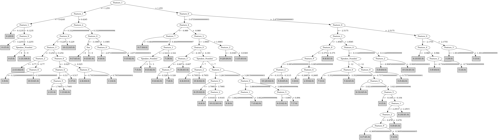

# J48

# SimpleCart Decision Tree

Feature_1 < 0.519

* Feature_1 < -0.1235: 0(29.0/0.0)

* Feature_1 >= -0.1235

*   * Feature_0 < -3.4325: 0(14.0/0.0)

*   * Feature_0 >= -3.4325: 1(36.0/14.0)

Feature_1 >= 0.519

* Feature_0 < -3.525

*   * Feature_4 < -0.989: 7(43.0/8.0)

*   * Feature_4 >= -0.989

*   *   * Feature_0 < -4.1845

*   *   *   * Feature_3 < -0.607: 7(8.0/6.0)

*   *   *   * Feature_3 >= -0.607: 9(45.0/10.0)

*   *   * Feature_0 >= -4.1845

*   *   *   * Feature_3 < 1.0065

*   *   *   *   * Feature_1 < 3.5875

*   *   *   *   *   * Feature_1 < 2.099

*   *   *   *   *   *   * Feature_2 < -0.9025: 8(5.0/5.0)

*   *   *   *   *   *   * Feature_2 >= -0.9025: 10(13.0/4.0)

*   *   *   *   *   * Feature_1 >= 2.099: 8(40.0/11.0)

*   *   *   *   * Feature_1 >= 3.5875: 7(11.0/4.0)

*   *   *   * Feature_3 >= 1.0065

*   *   *   *   * Feature_2 < -0.1055: 9(11.0/6.0)

*   *   *   *   * Feature_2 >= -0.1055: 1(12.0/3.0)

* Feature_0 >= -3.525

*   * Feature_0 < -2.1755

*   *   * Feature_1 < 1.8585

*   *   *   * Feature_9 < 0.346: 10(34.0/44.0)

*   *   *   * Feature_9 >= 0.346

*   *   *   *   * Sex=(1)

*   *   *   *   *   * Feature_6 < -0.08099999999999999: 2(19.0/5.0)

*   *   *   *   *   * Feature_6 >= -0.08099999999999999: 3(7.0/2.0)

*   *   *   *   * Sex!=(1): 6(9.0/8.0)

*   *   * Feature_1 >= 1.8585

*   *   *   * Feature_0 < -3.005

*   *   *   *   * Feature_4 < -0.11449999999999999: 6(31.0/11.0)

*   *   *   *   * Feature_4 >= -0.11449999999999999: 10(14.0/8.0)

*   *   *   * Feature_0 >= -3.005

*   *   *   *   * Feature_4 < -0.5545: 4(50.0/13.0)

*   *   *   *   * Feature_4 >= -0.5545

*   *   *   *   *   * Feature_1 < 2.0975: 3(5.0/3.0)

*   *   *   *   *   * Feature_1 >= 2.0975: 5(15.0/6.0)

*   * Feature_0 >= -2.1755

*   *   * Feature_1 < 1.16

*   *   *   * Feature_2 < -0.77: 2(20.0/1.0)

*   *   *   * Feature_2 >= -0.77: 3(8.0/0.0)

*   *   * Feature_1 >= 1.16: 3(37.0/5.0)

# PART

Decision list:

conditions|predicted class
---|---
Feature_1 <= 1.3215 AND Feature_8 > 0.2185 AND Feature_0 <= -2.3885 AND Feature_2 <= 0.4455| 10 (9.0/2.0)
Feature_1 <= 1.3215 AND Feature_2 <= 0.2445 AND Feature_1 <= 0.4245 AND Feature_3 <= 1.24 AND Feature_1 > -0.1235| 1 (21.0/3.0)
Feature_0 <= -3.344 AND Feature_1 <= 1.3215 AND Feature_9 <= 1.0335 AND Feature_1 <= 0.462| 0 (17.0)
Feature_0 <= -3.3455 AND Feature_4 <= -0.983 AND Feature_0 <= -3.5645| 7 (31.0/1.0)
Feature_0 <= -3.3455 AND Feature_0 <= -4.196 AND Feature_3 > -0.607| 9 (33.0/6.0)
Feature_1 <= 1.083 AND Feature_1 > 0.251 AND Feature_8 <= 0.0545 AND Feature_4 <= 0.6 AND Feature_6 <= -0.025| 2 (25.0)
Feature_0 <= -3.3455 AND Feature_3 > 1.012 AND Feature_4 > 0.0255 AND Feature_2 <= -0.093| 9 (11.0/3.0)
Feature_0 <= -3.3455 AND Feature_9 <= 0.4165 AND Feature_6 <= 0.793 AND Feature_1 <= 4.198 AND Feature_0 <= -3.8085| 8 (35.0/3.0)
Feature_1 > 2.6205 AND Feature_0 > -3.0545| 4 (35.0/12.0)
Feature_1 > 2.634 AND Feature_1 > 3.171| 7 (18.0/3.0)
Feature_1 <= 0.777 AND Feature_1 > 0.251| 1 (18.0/6.0)
Feature_1 > 0.467 AND Feature_0 > -2.6475 AND Feature_0 > -2.19| 3 (38.0/6.0)
Feature_1 <= 0.467| 0 (16.0/1.0)
Feature_3 > 0.9855 AND Feature_4 > -0.4205| 1 (14.0/4.0)
Feature_4 > -0.263 AND Feature_0 <= -2.8315 AND Feature_7 > -0.0055| 10 (23.0/1.0)
Feature_0 > -3.0045 AND Feature_7 <= -0.133| 3 (11.0/3.0)
Feature_1 <= 2.6285 AND Feature_2 <= 0.5295 AND Feature_0 > -3.1435 AND Feature_1 <= 1.718 AND Feature_0 <= -2.5195| 10 (14.0/8.0)
Feature_1 <= 2.6285 AND Feature_2 <= 0.5295 AND Feature_7 <= 0.8375 AND Feature_0 > -3.297 AND Feature_0 > -2.5305| 5 (15.0/2.0)
Feature_1 > 2.6285| 6 (13.0)
Feature_8 <= -0.3765 AND Feature_6 <= 0.2235| 10 (11.0/4.0)
Feature_2 <= 0.5295 AND Feature_0 > -3.0165| 4 (19.0/2.0)
Feature_2 > 0.5295| 6 (14.0/4.0)
Feature_6 <= 0.2765| 8 (11.0/2.0)
| 5 (10.0/5.0)

# JRip

Decision list:

conditions|predicted class
---|---
(Feature_1 <= 0.418) and (Feature_3 >= 0.955) and (Feature_5 >= 0.542)|0 (37.0/1.0)
(Feature_1 <= -0.159)|0 (9.0/0.0)
(Feature_2 >= 1.089)|0 (7.0/1.0)
(Feature_1 <= 0.373) and (Feature_0 <= -3.661)|0 (3.0/0.0)
(Feature_1 >= 2.319) and (Feature_0 >= -3.57) and (Feature_0 <= -2.969) and (Feature_9 <= 0.147)|6 (42.0/10.0)
(Feature_6 <= -1.024) and (Feature_0 >= -3.24)|6 (8.0/0.0)
(Feature_6 >= 0.356) and (Feature_4 <= -1.693)|6 (4.0/0.0)
(Feature_8 <= -1.023) and (Feature_1 >= 3.018) and (Feature_0 >= -3.975)|6 (6.0/1.0)
(Feature_7 >= 1.38) and (Feature_5 <= 0.062) and (Feature_0 >= -2.922)|6 (5.0/0.0)
(Feature_1 <= 1.151) and (Feature_0 >= -2.689) and (Feature_6 <= -0.061) and (Feature_8 <= 0.018)|2 (27.0/1.0)
(Feature_1 <= 1.268) and (Feature_5 <= 0.949) and (Feature_2 <= -0.74)|2 (19.0/3.0)
(Feature_9 >= 0.71) and (Feature_3 >= 1.136) and (Feature_2 <= 0.157) and (Feature_4 <= 0.21)|2 (11.0/0.0)
(Feature_0 <= -2.314) and (Feature_0 >= -2.521) and (Feature_7 <= 0.596) and (Feature_1 >= 1.415)|5 (16.0/0.0)
(Feature_0 >= -2.924) and (Feature_3 >= 0.008) and (Feature_5 <= 0.751) and (Feature_5 >= 0.213) and (Feature_8 <= -0.218)|5 (18.0/3.0)
(Feature_9 >= 0.652) and (Feature_2 <= -0.862)|5 (15.0/6.0)
(Feature_0 <= -4.693)|9 (26.0/0.0)
(Feature_0 <= -4.211) and (Feature_6 <= -0.14) and (Feature_5 >= 0.261)|9 (13.0/0.0)
(Feature_3 >= 1.017) and (Feature_0 <= -3.985) and (Feature_2 <= -0.149) and (Feature_1 <= 2.542)|9 (11.0/0.0)
(Feature_1 <= 0.757) and (Feature_5 >= 1.251)|1 (30.0/0.0)
(Feature_4 >= 0.453) and (Feature_3 >= 1.193)|1 (18.0/0.0)
(Feature_4 >= 0.273) and (Feature_3 >= 0.832) and (Feature_1 <= 0.766)|1 (6.0/0.0)
(Feature_3 >= 1.034) and (Feature_8 <= -0.307) and (Feature_0 <= -3.339)|1 (9.0/0.0)
(Feature_0 >= -2.175) and (Feature_0 <= -1.475)|3 (42.0/0.0)
(Feature_1 <= 1.929) and (Feature_7 <= -0.002) and (Feature_2 <= -0.773)|3 (9.0/0.0)
(Feature_1 <= 2.014) and (Feature_8 <= -0.15) and (Feature_9 <= -0.189) and (Feature_2 >= -1.261)|10 (21.0/0.0)
(Feature_1 <= 2.561) and (Feature_5 >= 0.574) and (Feature_2 >= -0.389) and (Feature_0 >= -3.108)|10 (15.0/1.0)
(Feature_1 <= 2.535) and (Feature_8 <= -0.339) and (Feature_9 >= 0.697)|10 (9.0/1.0)
(Feature_1 <= 1.856) and (Feature_2 <= -0.738) and (Feature_2 >= -0.959)|10 (7.0/0.0)
(Feature_2 <= -0.615) and (Feature_1 <= 2.549) and (Feature_4 >= -0.221) and (Feature_3 <= 0.505) and (Feature_2 >= -0.898)|10 (8.0/0.0)
(Feature_8 <= -0.782) and (Feature_5 <= 0.076)|10 (3.0/0.0)
(Feature_0 >= -3.052) and (Feature_1 >= 2.023)|4 (51.0/3.0)
(Feature_0 >= -2.723) and (Feature_6 <= -0.214)|4 (13.0/2.0)
(Feature_7 <= -0.135) and (Feature_2 <= -0.836) and (Feature_1 <= 3.062)|4 (6.0/0.0)
(Feature_5 >= 0.339) and (Feature_0 <= -3.857) and (Feature_0 >= -4.142) and (Feature_4 >= -1.023)|8 (37.0/3.0)
(Feature_8 >= 0.235) and (Feature_4 >= -1.251) and (Feature_0 <= -3.05)|8 (27.0/9.0)
(Feature_8 <= -1.248)|8 (7.0/2.0)
(Feature_2 <= -0.607) and (Feature_7 >= 0.92)|8 (6.0/0.0)
|7 (92.0/38.0)

# Decision Table

Non matches covered by Majority class

feature_0|feature_1|target
---|---|---
(-3.525--3.0185]|(3.1715-inf)|7
(-4.271--3.525]|(3.1715-inf)|7
(-4.5985--4.271]|(3.1715-inf)|7
(-3.0185--2.1755]|(3.1715-inf)|4
(-inf--4.5985]|(3.1715-inf)|9
(-4.5985--4.271]|(2.6205-3.1715]|9
(-3.525--3.0185]|(2.6205-3.1715]|6
(-4.271--3.525]|(2.6205-3.1715]|8
(-inf--4.5985]|(2.6205-3.1715]|9
(-3.0185--2.1755]|(2.6205-3.1715]|4
(-4.271--3.525]|(1.255-2.6205]|8
(-inf--4.5985]|(1.255-2.6205]|9
(-4.5985--4.271]|(1.255-2.6205]|9
(-3.525--3.0185]|(1.255-2.6205]|10
(-2.1755--1.4625]|(1.255-2.6205]|3
(-3.0185--2.1755]|(1.255-2.6205]|4
(-4.5985--4.271]|(0.4245-1.255]|0
(-inf--4.5985]|(0.4245-1.255]|9
(-2.1755--1.4625]|(0.4245-1.255]|2
(-3.525--3.0185]|(0.4245-1.255]|1
(-1.4625-inf)|(0.4245-1.255]|1
(-4.271--3.525]|(0.4245-1.255]|1
(-3.0185--2.1755]|(0.4245-1.255]|2
(-4.5985--4.271]|(-0.1235-0.4245]|0
(-3.0185--2.1755]|(-0.1235-0.4245]|1
(-4.271--3.525]|(-0.1235-0.4245]|0
(-3.525--3.0185]|(-0.1235-0.4245]|0
(-2.1755--1.4625]|(-0.1235-0.4245]|1
(-1.4625-inf)|(-0.1235-0.4245]|1
(-1.4625-inf)|(-inf--0.1235]|0
(-4.271--3.525]|(-inf--0.1235]|0
(-2.1755--1.4625]|(-inf--0.1235]|0
(-3.0185--2.1755]|(-inf--0.1235]|0
(-3.525--3.0185]|(-inf--0.1235]|0

