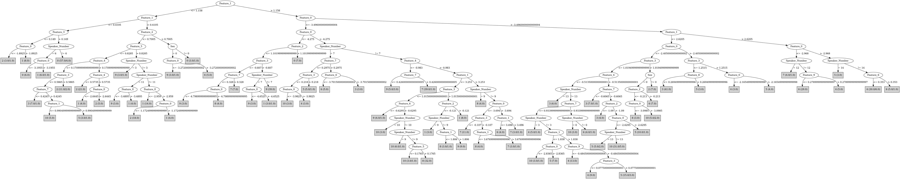

# J48

# SimpleCart Decision Tree

Feature_1 < 0.4105

* Feature_3 < 0.149

*   * Feature_0 < -1.92: 2(2.0/0.0)

*   * Feature_0 >= -1.92: 1(9.0/0.0)

* Feature_3 >= 0.149

*   * Speaker_Number=(14)|(12)|(11)|(10)|(9)|(8)|(5)|(3)|(2)|(1)|(7)|(13)

*   *   * Feature_3 < 0.502

*   *   *   * Feature_6 < 0.465: 1(2.0/0.0)

*   *   *   * Feature_6 >= 0.465: 0(4.0/0.0)

*   *   * Feature_3 >= 0.502: 0(44.0/0.0)

*   * Speaker_Number!=(14)|(12)|(11)|(10)|(9)|(8)|(5)|(3)|(2)|(1)|(7)|(13)

*   *   * Feature_0 < -3.1955: 0(11.0/0.0)

*   *   * Feature_0 >= -3.1955: 1(7.0/1.0)

Feature_1 >= 0.4105

* Feature_0 < -3.6365

*   * Feature_4 < -0.983

*   *   * Feature_1 < 2.2800000000000002

*   *   *   * Speaker_Number=(8): 8(2.0/0.0)

*   *   *   * Speaker_Number!=(8): 9(2.0/1.0)

*   *   * Feature_1 >= 2.2800000000000002: 7(34.0/0.0)

*   * Feature_4 >= -0.983

*   *   * Feature_0 < -4.275

*   *   *   * Feature_2 < 1.0765

*   *   *   *   * Feature_3 < -0.607

*   *   *   *   *   * Feature_7 < 0.328

*   *   *   *   *   *   * Feature_0 < -4.7989999999999995: 9(3.0/0.0)

*   *   *   *   *   *   * Feature_0 >= -4.7989999999999995: 8(4.0/0.0)

*   *   *   *   *   * Feature_7 >= 0.328: 7(7.0/0.0)

*   *   *   *   * Feature_3 >= -0.607

*   *   *   *   *   * Feature_5 < -0.472: 1(2.0/0.0)

*   *   *   *   *   * Feature_5 >= -0.472

*   *   *   *   *   *   * Feature_7 < -0.4555: 9(2.0/1.0)

*   *   *   *   *   *   * Feature_7 >= -0.4555: 9(43.0/0.0)

*   *   *   * Feature_2 >= 1.0765: 0(9.0/0.0)

*   *   * Feature_0 >= -4.275

*   *   *   * Feature_3 < 1.0150000000000001

*   *   *   *   * Feature_1 < 3.5934999999999997

*   *   *   *   *   * Speaker_Number=(14)|(10)|(9)|(7)|(3)|(2)

*   *   *   *   *   *   * Feature_1 < 2.1595

*   *   *   *   *   *   *   * Feature_2 < -0.8865: 5(4.0/0.0)

*   *   *   *   *   *   *   * Feature_2 >= -0.8865

*   *   *   *   *   *   *   *   * Feature_1 < 1.321: 3(1.0/1.0)

*   *   *   *   *   *   *   *   * Feature_1 >= 1.321: 10(10.0/0.0)

*   *   *   *   *   *   * Feature_1 >= 2.1595

*   *   *   *   *   *   *   * Feature_8 < -1.198: 6(5.0/0.0)

*   *   *   *   *   *   *   * Feature_8 >= -1.198

*   *   *   *   *   *   *   *   * Feature_3 < 0.629

*   *   *   *   *   *   *   *   *   * Feature_0 < -3.898: 8(8.0/0.0)

*   *   *   *   *   *   *   *   *   * Feature_0 >= -3.898: 4(2.0/1.0)

*   *   *   *   *   *   *   *   * Feature_3 >= 0.629: 9(3.0/0.0)

*   *   *   *   *   * Speaker_Number!=(14)|(10)|(9)|(7)|(3)|(2): 8(29.0/3.0)

*   *   *   *   * Feature_1 >= 3.5934999999999997

*   *   *   *   *   * Speaker_Number=(14)|(13)|(11)|(10)|(0)|(1)|(2)|(3)|(5)|(6)|(7)|(8): 7(13.0/1.0)

*   *   *   *   *   * Speaker_Number!=(14)|(13)|(11)|(10)|(0)|(1)|(2)|(3)|(5)|(6)|(7)|(8): 8(2.0/1.0)

*   *   *   * Feature_3 >= 1.0150000000000001

*   *   *   *   * Feature_3 < 1.4475

*   *   *   *   *   * Feature_1 < 1.2530000000000001: 2(4.0/0.0)

*   *   *   *   *   * Feature_1 >= 1.2530000000000001

*   *   *   *   *   *   * Speaker_Number=(13)|(9)|(7)|(0)|(1)|(2)|(3)|(4)|(6)|(8)|(10)|(11)|(12): 1(8.0/0.0)

*   *   *   *   *   *   * Speaker_Number!=(13)|(9)|(7)|(0)|(1)|(2)|(3)|(4)|(6)|(8)|(10)|(11)|(12): 8(2.0/1.0)

*   *   *   *   * Feature_3 >= 1.4475

*   *   *   *   *   * Speaker_Number=(14)|(5): 1(2.0/0.0)

*   *   *   *   *   * Speaker_Number!=(14)|(5): 9(12.0/0.0)

* Feature_0 >= -3.6365

*   * Feature_1 < 1.1585

*   *   * Feature_0 < -2.8895

*   *   *   * Speaker_Number=(13)|(7)|(5)|(4)|(3)|(1)|(2)|(6)|(8)

*   *   *   *   * Feature_4 < 0.495

*   *   *   *   *   * Speaker_Number=(13)|(5)|(4)|(0)|(1)|(2)|(6)|(8)|(9)|(10)|(11)|(12)|(14)

*   *   *   *   *   *   * Feature_3 < 1.012: 5(2.0/1.0)

*   *   *   *   *   *   * Feature_3 >= 1.012: 2(8.0/0.0)

*   *   *   *   *   * Speaker_Number!=(13)|(5)|(4)|(0)|(1)|(2)|(6)|(8)|(9)|(10)|(11)|(12)|(14)

*   *   *   *   *   *   * Speaker_Number=(7): 3(2.0/0.0)

*   *   *   *   *   *   * Speaker_Number!=(7)

*   *   *   *   *   *   *   * Feature_0 < -3.1085: 7(1.0/1.0)

*   *   *   *   *   *   *   * Feature_0 >= -3.1085: 6(2.0/0.0)

*   *   *   *   * Feature_4 >= 0.495: 1(6.0/0.0)

*   *   *   * Speaker_Number!=(13)|(7)|(5)|(4)|(3)|(1)|(2)|(6)|(8): 1(16.0/0.0)

*   *   * Feature_0 >= -2.8895

*   *   *   * Feature_2 < -0.2915

*   *   *   *   * Feature_0 < -1.1724999999999999

*   *   *   *   *   * Feature_3 < -0.018500000000000003: 2(1.0/1.0)

*   *   *   *   *   * Feature_3 >= -0.018500000000000003: 2(36.0/0.0)

*   *   *   *   * Feature_0 >= -1.1724999999999999: 1(4.0/0.0)

*   *   *   * Feature_2 >= -0.2915

*   *   *   *   * Feature_0 < -1.9994999999999998

*   *   *   *   *   * Feature_1 < 0.67: 2(4.0/0.0)

*   *   *   *   *   * Feature_1 >= 0.67

*   *   *   *   *   *   * Feature_2 < 0.3095: 10(5.0/0.0)

*   *   *   *   *   *   * Feature_2 >= 0.3095

*   *   *   *   *   *   *   * Speaker_Number=(8)|(0)|(2)|(4)|(5)|(6)|(7)|(9)|(10)|(11)|(12)|(13)|(14): 6(3.0/0.0)

*   *   *   *   *   *   *   * Speaker_Number!=(8)|(0)|(2)|(4)|(5)|(6)|(7)|(9)|(10)|(11)|(12)|(13)|(14): 5(2.0/0.0)

*   *   *   *   * Feature_0 >= -1.9994999999999998: 3(4.0/0.0)

*   * Feature_1 >= 1.1585

*   *   * Feature_0 < -2.169

*   *   *   * Feature_1 < 2.6205

*   *   *   *   * Feature_4 < -0.5135000000000001

*   *   *   *   *   * Feature_1 < 1.8585

*   *   *   *   *   *   * Speaker_Number=(8)|(5)|(1)

*   *   *   *   *   *   *   * Feature_0 < -2.9595: 6(1.0/1.0)

*   *   *   *   *   *   *   * Feature_0 >= -2.9595: 5(9.0/0.0)

*   *   *   *   *   *   * Speaker_Number!=(8)|(5)|(1)

*   *   *   *   *   *   *   * Feature_7 < 0.346: 3(10.0/1.0)

*   *   *   *   *   *   *   * Feature_7 >= 0.346

*   *   *   *   *   *   *   *   * Feature_0 < -3.1885

*   *   *   *   *   *   *   *   *   * Feature_2 < 0.6475: 8(7.0/0.0)

*   *   *   *   *   *   *   *   *   * Feature_2 >= 0.6475: 7(4.0/0.0)

*   *   *   *   *   *   *   *   * Feature_0 >= -3.1885

*   *   *   *   *   *   *   *   *   * Feature_2 < -0.492: 10(7.0/0.0)

*   *   *   *   *   *   *   *   *   * Feature_2 >= -0.492

*   *   *   *   *   *   *   *   *   *   * Feature_0 < -2.564: 6(4.0/0.0)

*   *   *   *   *   *   *   *   *   *   * Feature_0 >= -2.564: 4(4.0/1.0)

*   *   *   *   *   * Feature_1 >= 1.8585

*   *   *   *   *   *   * Speaker_Number=(11)|(8)|(5)|(4)|(2)|(1)

*   *   *   *   *   *   *   * Feature_7 < 1.3795000000000002: 4(18.0/0.0)

*   *   *   *   *   *   *   * Feature_7 >= 1.3795000000000002: 6(3.0/1.0)

*   *   *   *   *   *   * Speaker_Number!=(11)|(8)|(5)|(4)|(2)|(1)

*   *   *   *   *   *   *   * Feature_5 < 0.9815

*   *   *   *   *   *   *   *   * Feature_2 < -0.6665

*   *   *   *   *   *   *   *   *   * Feature_3 < -0.013000000000000005: 4(2.0/0.0)

*   *   *   *   *   *   *   *   *   * Feature_3 >= -0.013000000000000005

*   *   *   *   *   *   *   *   *   *   * Feature_3 < 0.829: 5(10.0/0.0)

*   *   *   *   *   *   *   *   *   *   * Feature_3 >= 0.829: 3(1.0/1.0)

*   *   *   *   *   *   *   *   * Feature_2 >= -0.6665

*   *   *   *   *   *   *   *   *   * Feature_0 < -2.618: 6(5.0/0.0)

*   *   *   *   *   *   *   *   *   * Feature_0 >= -2.618: 5(2.0/0.0)

*   *   *   *   *   *   *   * Feature_5 >= 0.9815: 4(6.0/0.0)

*   *   *   *   * Feature_4 >= -0.5135000000000001

*   *   *   *   *   * Feature_0 < -2.8810000000000002

*   *   *   *   *   *   * Feature_3 < 1.0194999999999999

*   *   *   *   *   *   *   * Speaker_Number=(7)|(4)

*   *   *   *   *   *   *   *   * Feature_5 < 0.5125: 3(3.0/0.0)

*   *   *   *   *   *   *   *   * Feature_5 >= 0.5125: 4(1.0/1.0)

*   *   *   *   *   *   *   * Speaker_Number!=(7)|(4)

*   *   *   *   *   *   *   *   * Feature_2 < -0.9095: 5(3.0/0.0)

*   *   *   *   *   *   *   *   * Feature_2 >= -0.9095: 10(28.0/3.0)

*   *   *   *   *   *   * Feature_3 >= 1.0194999999999999

*   *   *   *   *   *   *   * Feature_0 < -3.4695: 1(3.0/0.0)

*   *   *   *   *   *   *   * Feature_0 >= -3.4695: 2(3.0/0.0)

*   *   *   *   *   * Feature_0 >= -2.8810000000000002

*   *   *   *   *   *   * Feature_2 < -0.755: 3(12.0/0.0)

*   *   *   *   *   *   * Feature_2 >= -0.755

*   *   *   *   *   *   *   * Feature_9 < 0.1455: 5(12.0/1.0)

*   *   *   *   *   *   *   * Feature_9 >= 0.1455

*   *   *   *   *   *   *   *   * Speaker_Number=(12)|(0)|(1)|(2)|(3)|(4)|(5)|(7)|(8)|(9)|(10)|(11)|(13)|(14): 2(3.0/0.0)

*   *   *   *   *   *   *   *   * Speaker_Number!=(12)|(0)|(1)|(2)|(3)|(4)|(5)|(7)|(8)|(9)|(10)|(11)|(13)|(14): 10(2.0/0.0)

*   *   *   * Feature_1 >= 2.6205

*   *   *   *   * Feature_0 < -2.968

*   *   *   *   *   * Feature_9 < 0.27899999999999997

*   *   *   *   *   *   * Speaker_Number=(12): 7(3.0/1.0)

*   *   *   *   *   *   * Speaker_Number!=(12): 6(31.0/0.0)

*   *   *   *   *   * Feature_9 >= 0.27899999999999997

*   *   *   *   *   *   * Speaker_Number=(14)|(0)|(1)|(2)|(3)|(4)|(5)|(6)|(7)|(8)|(9)|(10)|(11)|(12): 4(5.0/0.0)

*   *   *   *   *   *   * Speaker_Number!=(14)|(0)|(1)|(2)|(3)|(4)|(5)|(6)|(7)|(8)|(9)|(10)|(11)|(12): 6(1.0/1.0)

*   *   *   *   * Feature_0 >= -2.968

*   *   *   *   *   * Feature_4 < -0.27849999999999997

*   *   *   *   *   *   * Feature_8 < -1.1145: 5(2.0/0.0)

*   *   *   *   *   *   * Feature_8 >= -1.1145

*   *   *   *   *   *   *   * Feature_2 < 0.149

*   *   *   *   *   *   *   *   * Feature_3 < -0.9319999999999999: 6(2.0/0.0)

*   *   *   *   *   *   *   *   * Feature_3 >= -0.9319999999999999: 4(24.0/0.0)

*   *   *   *   *   *   *   * Feature_2 >= 0.149: 6(2.0/0.0)

*   *   *   *   *   * Feature_4 >= -0.27849999999999997

*   *   *   *   *   *   * Speaker_Number=(12): 6(2.0/1.0)

*   *   *   *   *   *   * Speaker_Number!=(12): 5(5.0/0.0)

*   *   * Feature_0 >= -2.169

*   *   *   * Feature_3 < 1.2505: 3(34.0/0.0)

*   *   *   * Feature_3 >= 1.2505: 5(4.0/0.0)

# PART

Decision list:

conditions|predicted class
---|---
Feature_1 <= 1.154 AND Feature_1 <= 0.406 AND Feature_3 > 0.147 AND Feature_1 <= -0.137| 0 (39.0)
Feature_0 <= -3.478 AND Feature_4 <= -0.994| 7 (46.0/6.0)
Feature_0 <= -3.642 AND Feature_1 > 2.236 AND Feature_0 <= -4.275 AND Feature_3 > -0.625| 9 (36.0/1.0)
Feature_1 <= 1.412 AND Feature_1 <= 0.716 AND Feature_0 <= -2.986 AND Feature_1 <= 0.415| 0 (25.0/5.0)
Feature_0 <= -3.642 AND Feature_5 <= -0.102 AND Feature_7 <= -0.234| 1 (13.0/5.0)
Feature_0 <= -3.642 AND Feature_3 > 1.133 AND Feature_5 > -0.044| 9 (21.0/6.0)
Feature_0 <= -3.66 AND Feature_1 > 2.85 AND Feature_3 <= -0.108 AND Feature_8 > -1.113| 7 (23.0/5.0)
Feature_0 <= -3.772 AND Feature_3 <= 1.133 AND Feature_1 > 1.88| 8 (59.0/16.0)
Feature_1 <= 1.162 AND Feature_8 <= 0.223 AND Feature_5 > 0.792 AND Feature_6 > -0.125| 1 (29.0/4.0)
Feature_1 > 1.856 AND Feature_0 > -3.005 AND Feature_0 <= -2.12 AND Feature_4 <= -0.558 AND Feature_2 <= -0.218 AND Feature_0 <= -2.565| 4 (37.0/7.0)
Feature_1 <= 1.162 AND Feature_8 <= 0.161 AND Feature_0 > -2.703| 2 (42.0/5.0)
Feature_1 > 2.62 AND Feature_0 <= -3.086| 6 (29.0/6.0)
Feature_2 > 0.474 AND Feature_0 > -3.209| 6 (16.0/4.0)
Feature_3 <= 1.245 AND Feature_1 > 2.62 AND Feature_6 <= 0.348 AND Feature_1 <= 2.91| 5 (13.0/6.0)
Feature_3 <= 1.245 AND Feature_1 > 2.665 AND Feature_6 <= 0.348| 4 (12.0/1.0)
Feature_1 <= 0.944 AND Feature_1 <= 0.728| 1 (15.0/2.0)
Feature_3 <= 1.245 AND Feature_1 <= 2.665 AND Feature_0 <= -2.415| 10 (140.0/88.0)
Feature_0 > -2.441 AND Feature_7 <= 0.934| 3 (43.0/4.0)
Feature_0 > -3.462 AND Feature_1 > 1.633 AND Feature_0 <= -2.441| 6 (17.0/3.0)
Sex = 1 AND Feature_0 <= -3.396| 0 (12.0/4.0)
Sex = 0| 4 (14.0/10.0)
| 2 (12.0)

# JRip

Decision list:

conditions|predicted class
---|---
(Feature_0 <= -3.775) and (Feature_5 >= 0.6) and (Feature_0 >= -4.235) and (Feature_7 >= 0.498) and (Feature_1 <= 3.651)|8 (20.0/1.0)
(Feature_0 <= -3.828) and (Feature_5 >= 0.387) and (Feature_4 >= 0.118) and (Feature_5 <= 0.65) and (Feature_9 >= -0.27)|8 (10.0/0.0)
(Feature_0 <= -3.155) and (Feature_4 <= -0.612) and (Feature_1 <= 1.816) and (Feature_2 <= 0.83) and (Sex = 0)|8 (10.0/0.0)
(Feature_0 <= -3.818) and (Feature_9 <= -0.456) and (Feature_0 >= -4.174) and (Feature_1 >= 2.542)|8 (11.0/1.0)
(Feature_1 <= 2.78) and (Feature_3 <= 1.015) and (Feature_0 <= -2.665) and (Feature_4 >= -0.591) and (Feature_1 >= 1.29) and (Feature_0 >= -3.789) and (Feature_7 >= 0.044)|10 (31.0/2.0)
(Feature_1 <= 2.069) and (Feature_0 <= -2.704) and (Feature_3 <= 0.111)|10 (11.0/1.0)
(Feature_6 <= -0.031) and (Feature_4 <= -0.756) and (Feature_5 >= 0.73) and (Feature_1 <= 1.56)|10 (8.0/0.0)
(Feature_1 >= 1.102) and (Feature_8 >= 0.207) and (Feature_0 >= -2.505)|5 (11.0/0.0)
(Feature_0 >= -3.015) and (Feature_1 >= 1.102) and (Feature_5 >= 0.351) and (Feature_2 >= -0.755) and (Feature_1 <= 2.003)|5 (17.0/1.0)
(Feature_8 <= -0.473) and (Feature_5 <= 0.683) and (Feature_2 <= -0.915) and (Feature_9 >= -0.092) and (Feature_7 <= 0.146)|5 (12.0/0.0)
(Feature_0 >= -2.691) and (Feature_1 >= 2.027) and (Feature_8 <= -0.396) and (Feature_7 >= -0.028)|5 (15.0/2.0)
(Feature_1 <= 0.757) and (Feature_1 >= -0.11) and (Feature_7 >= 0.775)|1 (19.0/2.0)
(Feature_4 >= 0.45) and (Feature_9 >= 0.423) and (Feature_1 >= 0.086)|1 (18.0/1.0)
(Feature_4 >= 0.38) and (Feature_0 >= -3.498) and (Feature_9 >= -0.638) and (Feature_7 >= 0.01) and (Feature_1 <= 0.757)|1 (12.0/0.0)
(Feature_3 >= 1.264) and (Feature_3 <= 1.428) and (Feature_9 <= 0.172)|1 (10.0/2.0)
(Feature_1 >= 2.621) and (Feature_0 >= -3.682) and (Feature_0 <= -2.969) and (Feature_4 <= -0.162)|6 (31.0/3.0)
(Feature_4 <= -0.548) and (Feature_2 >= 0.532) and (Feature_0 >= -3.406) and (Feature_0 <= -2.71)|6 (11.0/0.0)
(Feature_8 <= -0.93) and (Feature_1 >= 2.91) and (Feature_1 <= 3.685)|6 (11.0/0.0)
(Feature_8 >= 0.058) and (Feature_0 >= -3.559) and (Feature_3 >= 0.937) and (Feature_5 >= 0.038)|6 (9.0/1.0)
(Feature_1 >= 3.289) and (Feature_7 >= 0.237) and (Feature_0 >= -4.497)|7 (44.0/0.0)
(Feature_4 <= -1.26) and (Feature_0 <= -3.482)|7 (14.0/0.0)
(Feature_4 <= -0.737) and (Feature_3 <= 0.508)|4 (34.0/3.0)
(Feature_1 >= 1.867) and (Feature_0 >= -3.141) and (Feature_5 >= 0.357)|4 (25.0/3.0)
(Feature_1 <= 1.272) and (Feature_1 >= 0.431) and (Feature_0 >= -3.249)|2 (54.0/7.0)
(Feature_9 >= 0.691) and (Feature_5 <= -0.044) and (Feature_2 <= -0.008)|2 (8.0/0.0)
(Feature_0 <= -3.972) and (Feature_1 >= 2.223)|9 (53.0/5.0)
(Feature_0 <= -3.648) and (Sex = 0) and (Feature_1 >= 0.904)|9 (16.0/0.0)
(Feature_1 <= 0.406)|0 (60.0/3.0)
|3 (108.0/46.0)

# Decision Table

Non matches covered by Majority class

sex|feature_0|feature_2|feature_3|feature_5|feature_6|feature_9|target
---|---|---|---|---|---|---|---
0|(-3.381--2.405]|all|(1.5145-inf)|(1.061-inf)|(0.478-inf)|(-0.9615-inf)|0
0|(-4.271--3.381]|all|(1.5145-inf)|(1.061-inf)|(0.478-inf)|(-0.9615-inf)|0
0|(-1.897-inf)|all|(0.83-1.5145]|(1.061-inf)|(0.478-inf)|(-0.9615-inf)|0
0|(-1.897-inf)|all|(0.149-0.83]|(1.061-inf)|(0.478-inf)|(-0.9615-inf)|0
0|(-3.381--2.405]|all|(1.5145-inf)|(1.061-inf)|(-0.6605-0.478]|(-0.9615-inf)|0
0|(-2.405--1.897]|all|(0.149-0.83]|(1.061-inf)|(0.478-inf)|(-0.9615-inf)|0
0|(-inf--4.271]|all|(0.83-1.5145]|(1.061-inf)|(0.478-inf)|(-0.9615-inf)|0
1|(-3.381--2.405]|all|(0.149-0.83]|(1.061-inf)|(0.478-inf)|(-0.9615-inf)|0
0|(-4.271--3.381]|all|(1.5145-inf)|(1.061-inf)|(-0.6605-0.478]|(-0.9615-inf)|9
1|(-4.271--3.381]|all|(1.5145-inf)|(1.061-inf)|(-0.6605-0.478]|(-0.9615-inf)|1
0|(-inf--4.271]|all|(1.5145-inf)|(-inf-1.061]|(0.478-inf)|(-0.9615-inf)|0
0|(-1.897-inf)|all|(0.83-1.5145]|(1.061-inf)|(-0.6605-0.478]|(-0.9615-inf)|0
0|(-3.381--2.405]|all|(0.83-1.5145]|(-inf-1.061]|(0.478-inf)|(-0.9615-inf)|1
0|(-inf--4.271]|all|(1.5145-inf)|(1.061-inf)|(-0.6605-0.478]|(-0.9615-inf)|9
0|(-2.405--1.897]|all|(0.83-1.5145]|(1.061-inf)|(-0.6605-0.478]|(-0.9615-inf)|0
0|(-4.271--3.381]|all|(0.149-0.83]|(1.061-inf)|(0.478-inf)|(-0.9615-inf)|0
1|(-3.381--2.405]|all|(0.83-1.5145]|(-inf-1.061]|(0.478-inf)|(-0.9615-inf)|0
0|(-1.897-inf)|all|(-inf-0.149]|(1.061-inf)|(0.478-inf)|(-0.9615-inf)|1
1|(-3.381--2.405]|all|(0.83-1.5145]|(1.061-inf)|(-0.6605-0.478]|(-0.9615-inf)|0
0|(-4.271--3.381]|all|(0.83-1.5145]|(-inf-1.061]|(0.478-inf)|(-0.9615-inf)|9
1|(-4.271--3.381]|all|(0.83-1.5145]|(-inf-1.061]|(0.478-inf)|(-0.9615-inf)|7
0|(-2.405--1.897]|all|(1.5145-inf)|(-inf-1.061]|(-0.6605-0.478]|(-0.9615-inf)|4
0|(-3.381--2.405]|all|(0.83-1.5145]|(1.061-inf)|(-0.6605-0.478]|(-0.9615-inf)|1
0|(-inf--4.271]|all|(0.149-0.83]|(1.061-inf)|(0.478-inf)|(-0.9615-inf)|0
1|(-3.381--2.405]|all|(-inf-0.149]|(1.061-inf)|(0.478-inf)|(-0.9615-inf)|6
0|(-4.271--3.381]|all|(0.83-1.5145]|(1.061-inf)|(-0.6605-0.478]|(-0.9615-inf)|1
0|(-inf--4.271]|all|(0.83-1.5145]|(-inf-1.061]|(0.478-inf)|(-0.9615-inf)|9
1|(-4.271--3.381]|all|(0.83-1.5145]|(1.061-inf)|(-0.6605-0.478]|(-0.9615-inf)|0
0|(-1.897-inf)|all|(0.149-0.83]|(1.061-inf)|(-0.6605-0.478]|(-0.9615-inf)|1
0|(-3.381--2.405]|all|(1.5145-inf)|(-inf-1.061]|(-0.6605-0.478]|(-0.9615-inf)|6
1|(-3.381--2.405]|all|(1.5145-inf)|(-inf-1.061]|(-0.6605-0.478]|(-0.9615-inf)|2
0|(-4.271--3.381]|all|(-inf-0.149]|(1.061-inf)|(0.478-inf)|(-0.9615-inf)|0
1|(-4.271--3.381]|all|(1.5145-inf)|(-inf-1.061]|(-0.6605-0.478]|(-0.9615-inf)|9
0|(-4.271--3.381]|all|(1.5145-inf)|(-inf-1.061]|(-0.6605-0.478]|(-0.9615-inf)|7
1|(-4.271--3.381]|all|(-inf-0.149]|(1.061-inf)|(0.478-inf)|(-0.9615-inf)|7
0|(-1.897-inf)|all|(0.83-1.5145]|(-inf-1.061]|(-0.6605-0.478]|(-0.9615-inf)|3
0|(-2.405--1.897]|all|(0.149-0.83]|(1.061-inf)|(-0.6605-0.478]|(-0.9615-inf)|2
1|(-3.381--2.405]|all|(1.5145-inf)|(1.061-inf)|(-inf--0.6605]|(-0.9615-inf)|0
0|(-3.381--2.405]|all|(0.149-0.83]|(-inf-1.061]|(0.478-inf)|(-0.9615-inf)|0
1|(-inf--4.271]|all|(1.5145-inf)|(-inf-1.061]|(-0.6605-0.478]|(-0.9615-inf)|0
1|(-4.271--3.381]|all|(0.149-0.83]|(-inf-1.061]|(0.478-inf)|(-0.9615-inf)|8
0|(-3.381--2.405]|all|(1.5145-inf)|(1.061-inf)|(-0.6605-0.478]|(-inf--0.9615]|0
0|(-2.405--1.897]|all|(0.83-1.5145]|(-inf-1.061]|(-0.6605-0.478]|(-0.9615-inf)|3
0|(-inf--4.271]|all|(1.5145-inf)|(-inf-1.061]|(-0.6605-0.478]|(-0.9615-inf)|9
0|(-4.271--3.381]|all|(0.149-0.83]|(-inf-1.061]|(0.478-inf)|(-0.9615-inf)|8
0|(-3.381--2.405]|all|(0.149-0.83]|(1.061-inf)|(-0.6605-0.478]|(-0.9615-inf)|10
1|(-3.381--2.405]|all|(0.149-0.83]|(1.061-inf)|(-0.6605-0.478]|(-0.9615-inf)|4
1|(-2.405--1.897]|all|(0.83-1.5145]|(-inf-1.061]|(-0.6605-0.478]|(-0.9615-inf)|2
1|(-4.271--3.381]|all|(1.5145-inf)|(1.061-inf)|(-inf--0.6605]|(-0.9615-inf)|0
1|(-4.271--3.381]|all|(0.149-0.83]|(1.061-inf)|(-0.6605-0.478]|(-0.9615-inf)|6
0|(-4.271--3.381]|all|(0.149-0.83]|(1.061-inf)|(-0.6605-0.478]|(-0.9615-inf)|8
0|(-3.381--2.405]|all|(0.83-1.5145]|(-inf-1.061]|(-0.6605-0.478]|(-0.9615-inf)|1
0|(-4.271--3.381]|all|(1.5145-inf)|(1.061-inf)|(-0.6605-0.478]|(-inf--0.9615]|0
0|(-1.897-inf)|all|(-inf-0.149]|(1.061-inf)|(-0.6605-0.478]|(-0.9615-inf)|1
1|(-3.381--2.405]|all|(0.83-1.5145]|(-inf-1.061]|(-0.6605-0.478]|(-0.9615-inf)|2
0|(-2.405--1.897]|all|(0.83-1.5145]|(1.061-inf)|(-0.6605-0.478]|(-inf--0.9615]|0
1|(-1.897-inf)|all|(0.149-0.83]|(-inf-1.061]|(-0.6605-0.478]|(-0.9615-inf)|3
0|(-2.405--1.897]|all|(-inf-0.149]|(1.061-inf)|(-0.6605-0.478]|(-0.9615-inf)|0
0|(-1.897-inf)|all|(0.149-0.83]|(-inf-1.061]|(-0.6605-0.478]|(-0.9615-inf)|2
0|(-inf--4.271]|all|(0.149-0.83]|(1.061-inf)|(-0.6605-0.478]|(-0.9615-inf)|9
1|(-3.381--2.405]|all|(-inf-0.149]|(-inf-1.061]|(0.478-inf)|(-0.9615-inf)|4
0|(-3.381--2.405]|all|(-inf-0.149]|(-inf-1.061]|(0.478-inf)|(-0.9615-inf)|6
0|(-4.271--3.381]|all|(0.83-1.5145]|(-inf-1.061]|(-0.6605-0.478]|(-0.9615-inf)|0
1|(-4.271--3.381]|all|(0.83-1.5145]|(-inf-1.061]|(-0.6605-0.478]|(-0.9615-inf)|1
0|(-inf--4.271]|all|(0.83-1.5145]|(-inf-1.061]|(-0.6605-0.478]|(-0.9615-inf)|9
1|(-3.381--2.405]|all|(-inf-0.149]|(1.061-inf)|(-0.6605-0.478]|(-0.9615-inf)|4
1|(-4.271--3.381]|all|(0.83-1.5145]|(1.061-inf)|(-inf--0.6605]|(-0.9615-inf)|0
1|(-2.405--1.897]|all|(0.149-0.83]|(-inf-1.061]|(-0.6605-0.478]|(-0.9615-inf)|3
1|(-inf--4.271]|all|(0.83-1.5145]|(-inf-1.061]|(-0.6605-0.478]|(-0.9615-inf)|2
1|(-4.271--3.381]|all|(-inf-0.149]|(-inf-1.061]|(0.478-inf)|(-0.9615-inf)|6
0|(-2.405--1.897]|all|(0.149-0.83]|(-inf-1.061]|(-0.6605-0.478]|(-0.9615-inf)|2
0|(-3.381--2.405]|all|(-inf-0.149]|(1.061-inf)|(-0.6605-0.478]|(-0.9615-inf)|5
0|(-4.271--3.381]|all|(-inf-0.149]|(-inf-1.061]|(0.478-inf)|(-0.9615-inf)|7
0|(-3.381--2.405]|all|(1.5145-inf)|(-inf-1.061]|(-inf--0.6605]|(-0.9615-inf)|6
1|(-4.271--3.381]|all|(-inf-0.149]|(1.061-inf)|(-0.6605-0.478]|(-0.9615-inf)|0
0|(-4.271--3.381]|all|(1.5145-inf)|(-inf-1.061]|(-inf--0.6605]|(-0.9615-inf)|7
1|(-inf--4.271]|all|(-inf-0.149]|(-inf-1.061]|(0.478-inf)|(-0.9615-inf)|9
1|(-4.271--3.381]|all|(1.5145-inf)|(-inf-1.061]|(-inf--0.6605]|(-0.9615-inf)|9
1|(-3.381--2.405]|all|(0.149-0.83]|(-inf-1.061]|(-0.6605-0.478]|(-0.9615-inf)|3
0|(-3.381--2.405]|all|(0.149-0.83]|(-inf-1.061]|(-0.6605-0.478]|(-0.9615-inf)|4
1|(-inf--4.271]|all|(1.5145-inf)|(-inf-1.061]|(-inf--0.6605]|(-0.9615-inf)|0
1|(-1.897-inf)|all|(-inf-0.149]|(-inf-1.061]|(-0.6605-0.478]|(-0.9615-inf)|3
0|(-1.897-inf)|all|(-inf-0.149]|(-inf-1.061]|(-0.6605-0.478]|(-0.9615-inf)|2
0|(-4.271--3.381]|all|(0.149-0.83]|(-inf-1.061]|(-0.6605-0.478]|(-0.9615-inf)|8
1|(-4.271--3.381]|all|(0.149-0.83]|(-inf-1.061]|(-0.6605-0.478]|(-0.9615-inf)|3
0|(-3.381--2.405]|all|(0.83-1.5145]|(-inf-1.061]|(-inf--0.6605]|(-0.9615-inf)|6
1|(-3.381--2.405]|all|(0.83-1.5145]|(-inf-1.061]|(-inf--0.6605]|(-0.9615-inf)|1
0|(-2.405--1.897]|all|(-inf-0.149]|(-inf-1.061]|(-0.6605-0.478]|(-0.9615-inf)|3
1|(-2.405--1.897]|all|(-inf-0.149]|(-inf-1.061]|(-0.6605-0.478]|(-0.9615-inf)|3
0|(-inf--4.271]|all|(0.149-0.83]|(-inf-1.061]|(-0.6605-0.478]|(-0.9615-inf)|9
0|(-inf--4.271]|all|(0.149-0.83]|(1.061-inf)|(-inf--0.6605]|(-0.9615-inf)|0
0|(-4.271--3.381]|all|(0.83-1.5145]|(-inf-1.061]|(-inf--0.6605]|(-0.9615-inf)|0
1|(-4.271--3.381]|all|(0.149-0.83]|(1.061-inf)|(-0.6605-0.478]|(-inf--0.9615]|0
1|(-4.271--3.381]|all|(0.83-1.5145]|(-inf-1.061]|(-inf--0.6605]|(-0.9615-inf)|1
1|(-3.381--2.405]|all|(0.83-1.5145]|(-inf-1.061]|(-0.6605-0.478]|(-inf--0.9615]|10
1|(-3.381--2.405]|all|(-inf-0.149]|(-inf-1.061]|(-0.6605-0.478]|(-0.9615-inf)|5
0|(-3.381--2.405]|all|(-inf-0.149]|(-inf-1.061]|(-0.6605-0.478]|(-0.9615-inf)|4
1|(-4.271--3.381]|all|(0.83-1.5145]|(-inf-1.061]|(-0.6605-0.478]|(-inf--0.9615]|0
1|(-inf--4.271]|all|(0.83-1.5145]|(-inf-1.061]|(-inf--0.6605]|(-0.9615-inf)|1
1|(-3.381--2.405]|all|(-inf-0.149]|(-inf-1.061]|(0.478-inf)|(-inf--0.9615]|6
0|(-4.271--3.381]|all|(-inf-0.149]|(-inf-1.061]|(-0.6605-0.478]|(-0.9615-inf)|7
1|(-4.271--3.381]|all|(-inf-0.149]|(-inf-1.061]|(-0.6605-0.478]|(-0.9615-inf)|8
0|(-3.381--2.405]|all|(0.149-0.83]|(-inf-1.061]|(-inf--0.6605]|(-0.9615-inf)|0
1|(-inf--4.271]|all|(-inf-0.149]|(-inf-1.061]|(-0.6605-0.478]|(-0.9615-inf)|9
0|(-4.271--3.381]|all|(0.149-0.83]|(-inf-1.061]|(-inf--0.6605]|(-0.9615-inf)|0
1|(-4.271--3.381]|all|(0.149-0.83]|(-inf-1.061]|(-inf--0.6605]|(-0.9615-inf)|0
0|(-3.381--2.405]|all|(0.149-0.83]|(-inf-1.061]|(-0.6605-0.478]|(-inf--0.9615]|0
1|(-inf--4.271]|all|(0.149-0.83]|(-inf-1.061]|(-0.6605-0.478]|(-inf--0.9615]|9
0|(-4.271--3.381]|all|(-inf-0.149]|(-inf-1.061]|(-inf--0.6605]|(-0.9615-inf)|7
0|(-3.381--2.405]|all|(-inf-0.149]|(-inf-1.061]|(-0.6605-0.478]|(-inf--0.9615]|0
1|(-4.271--3.381]|all|(-inf-0.149]|(-inf-1.061]|(-0.6605-0.478]|(-inf--0.9615]|0
1|(-inf--4.271]|all|(-inf-0.149]|(-inf-1.061]|(-0.6605-0.478]|(-inf--0.9615]|9

