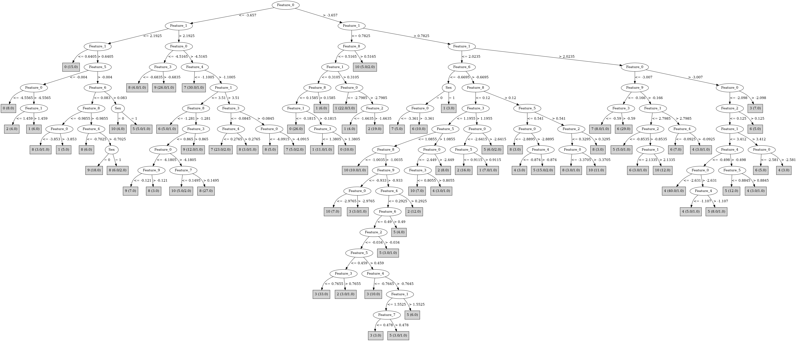

# J48

# SimpleCart Decision Tree

Feature_1 < 0.4245

* Feature_0 < -3.295: 0(30.0/0.0)

* Feature_0 >= -3.295

*   * Feature_1 < -0.1815: 0(16.0/0.0)

*   * Feature_1 >= -0.1815

*   *   * Speaker_Number=(9)|(5): 0(6.0/0.0)

*   *   * Speaker_Number!=(9)|(5): 1(21.0/1.0)

Feature_1 >= 0.4245

* Feature_0 < -3.6845

*   * Feature_0 < -4.275

*   *   * Speaker_Number=(13)|(7)|(6)

*   *   *   * Feature_2 < 1.0765

*   *   *   *   * Feature_0 < -4.781499999999999: 9(8.0/0.0)

*   *   *   *   * Feature_0 >= -4.781499999999999

*   *   *   *   *   * Feature_7 < 0.38249999999999995

*   *   *   *   *   *   * Feature_0 < -4.447: 8(5.0/0.0)

*   *   *   *   *   *   * Feature_0 >= -4.447

*   *   *   *   *   *   *   * Feature_1 < 1.568: 2(2.0/0.0)

*   *   *   *   *   *   *   * Feature_1 >= 1.568: 1(2.0/0.0)

*   *   *   *   *   * Feature_7 >= 0.38249999999999995: 7(8.0/0.0)

*   *   *   * Feature_2 >= 1.0765: 0(9.0/0.0)

*   *   * Speaker_Number!=(13)|(7)|(6): 9(40.0/1.0)

*   * Feature_0 >= -4.275

*   *   * Feature_4 < -1.0915

*   *   *   * Feature_1 < 2.001: 8(2.0/0.0)

*   *   *   * Feature_1 >= 2.001: 7(29.0/1.0)

*   *   * Feature_4 >= -1.0915

*   *   *   * Feature_3 < 1.0550000000000002

*   *   *   *   * Feature_1 < 3.5839999999999996

*   *   *   *   *   * Speaker_Number=(7)|(3)|(2)

*   *   *   *   *   *   * Feature_1 < 2.645

*   *   *   *   *   *   *   * Feature_2 < -0.788: 5(4.0/0.0)

*   *   *   *   *   *   *   * Feature_2 >= -0.788

*   *   *   *   *   *   *   *   * Speaker_Number=(7)|(0)|(1)|(4)|(5)|(6)|(8)|(9)|(10)|(11)|(12)|(13)|(14): 10(3.0/0.0)

*   *   *   *   *   *   *   *   * Speaker_Number!=(7)|(0)|(1)|(4)|(5)|(6)|(8)|(9)|(10)|(11)|(12)|(13)|(14): 9(2.0/0.0)

*   *   *   *   *   *   * Feature_1 >= 2.645: 6(4.0/0.0)

*   *   *   *   *   * Speaker_Number!=(7)|(3)|(2)

*   *   *   *   *   *   * Feature_6 < -0.7745: 9(3.0/0.0)

*   *   *   *   *   *   * Feature_6 >= -0.7745

*   *   *   *   *   *   *   * Feature_0 < -3.7655: 8(44.0/2.0)

*   *   *   *   *   *   *   * Feature_0 >= -3.7655

*   *   *   *   *   *   *   *   * Speaker_Number=(10)|(9)|(1)|(2)|(3)|(4)|(6)|(7)|(8)|(11)|(12)|(13)|(14): 10(4.0/0.0)

*   *   *   *   *   *   *   *   * Speaker_Number!=(10)|(9)|(1)|(2)|(3)|(4)|(6)|(7)|(8)|(11)|(12)|(13)|(14): 8(2.0/0.0)

*   *   *   *   * Feature_1 >= 3.5839999999999996

*   *   *   *   *   * Feature_3 < -0.08449999999999999: 7(12.0/0.0)

*   *   *   *   *   * Feature_3 >= -0.08449999999999999

*   *   *   *   *   *   * Feature_0 < -4.0915: 8(3.0/0.0)

*   *   *   *   *   *   * Feature_0 >= -4.0915: 7(2.0/1.0)

*   *   *   * Feature_3 >= 1.0550000000000002

*   *   *   *   * Feature_2 < -0.195

*   *   *   *   *   * Speaker_Number=(9)|(5): 1(2.0/1.0)

*   *   *   *   *   * Speaker_Number!=(9)|(5): 9(10.0/0.0)

*   *   *   *   * Feature_2 >= -0.195

*   *   *   *   *   * Feature_4 < 0.42000000000000004: 2(2.0/1.0)

*   *   *   *   *   * Feature_4 >= 0.42000000000000004: 1(7.0/0.0)

* Feature_0 >= -3.6845

*   * Feature_1 < 2.0235

*   *   * Feature_1 < 1.1865

*   *   *   * Feature_0 < -2.6995

*   *   *   *   * Speaker_Number=(13)|(8)|(7)|(5)|(4)|(3)|(1)|(2)|(6)

*   *   *   *   *   * Feature_3 < 0.3805: 10(10.0/2.0)

*   *   *   *   *   * Feature_3 >= 0.3805

*   *   *   *   *   *   * Feature_4 < 0.504

*   *   *   *   *   *   *   * Feature_7 < -0.0305: 2(9.0/0.0)

*   *   *   *   *   *   *   * Feature_7 >= -0.0305

*   *   *   *   *   *   *   *   * Feature_0 < -3.1035

*   *   *   *   *   *   *   *   *   * Feature_0 < -3.364: 3(2.0/1.0)

*   *   *   *   *   *   *   *   *   * Feature_0 >= -3.364: 8(3.0/0.0)

*   *   *   *   *   *   *   *   * Feature_0 >= -3.1035: 6(5.0/1.0)

*   *   *   *   *   *   * Feature_4 >= 0.504: 1(5.0/0.0)

*   *   *   *   * Speaker_Number!=(13)|(8)|(7)|(5)|(4)|(3)|(1)|(2)|(6): 1(17.0/0.0)

*   *   *   * Feature_0 >= -2.6995

*   *   *   *   * Feature_2 < -0.2915

*   *   *   *   *   * Feature_0 < -1.0905

*   *   *   *   *   *   * Feature_3 < -0.018500000000000003: 3(2.0/1.0)

*   *   *   *   *   *   * Feature_3 >= -0.018500000000000003: 2(31.0/0.0)

*   *   *   *   *   * Feature_0 >= -1.0905: 1(2.0/0.0)

*   *   *   *   * Feature_2 >= -0.2915

*   *   *   *   *   * Feature_0 < -1.992

*   *   *   *   *   *   * Feature_1 < 0.6595: 2(4.0/0.0)

*   *   *   *   *   *   * Feature_1 >= 0.6595

*   *   *   *   *   *   *   * Feature_2 < 0.26849999999999996: 10(3.0/0.0)

*   *   *   *   *   *   *   * Feature_2 >= 0.26849999999999996: 5(3.0/1.0)

*   *   *   *   *   * Feature_0 >= -1.992: 3(5.0/0.0)

*   *   * Feature_1 >= 1.1865

*   *   *   * Feature_0 < -2.5215

*   *   *   *   * Speaker_Number=(14)|(13)|(12)|(10)|(9)|(7)|(3)

*   *   *   *   *   * Speaker_Number=(14)|(12)|(10)|(9)

*   *   *   *   *   *   * Feature_0 < -3.483: 1(4.0/1.0)

*   *   *   *   *   *   * Feature_0 >= -3.483

*   *   *   *   *   *   *   * Feature_1 < 1.8765: 2(12.0/0.0)

*   *   *   *   *   *   *   * Feature_1 >= 1.8765: 3(2.0/0.0)

*   *   *   *   *   * Speaker_Number!=(14)|(12)|(10)|(9)

*   *   *   *   *   *   * Feature_6 < -0.0735

*   *   *   *   *   *   *   * Feature_0 < -3.385: 7(4.0/0.0)

*   *   *   *   *   *   *   * Feature_0 >= -3.385

*   *   *   *   *   *   *   *   * Speaker_Number=(13): 5(2.0/0.0)

*   *   *   *   *   *   *   *   * Speaker_Number!=(13)

*   *   *   *   *   *   *   *   *   * Feature_2 < 0.849: 4(1.0/1.0)

*   *   *   *   *   *   *   *   *   * Feature_2 >= 0.849: 6(2.0/0.0)

*   *   *   *   *   *   * Feature_6 >= -0.0735: 3(8.0/2.0)

*   *   *   *   * Speaker_Number!=(14)|(13)|(12)|(10)|(9)|(7)|(3)

*   *   *   *   *   * Feature_9 < -0.7195: 10(13.0/0.0)

*   *   *   *   *   * Feature_9 >= -0.7195

*   *   *   *   *   *   * Speaker_Number=(11)|(5)|(4)

*   *   *   *   *   *   *   * Feature_5 < 0.16899999999999998: 3(3.0/1.0)

*   *   *   *   *   *   *   * Feature_5 >= 0.16899999999999998: 5(7.0/0.0)

*   *   *   *   *   *   * Speaker_Number!=(11)|(5)|(4)

*   *   *   *   *   *   *   * Feature_3 < 0.6865

*   *   *   *   *   *   *   *   * Feature_2 < 0.1575: 10(13.0/1.0)

*   *   *   *   *   *   *   *   * Feature_2 >= 0.1575: 5(2.0/0.0)

*   *   *   *   *   *   *   * Feature_3 >= 0.6865

*   *   *   *   *   *   *   *   * Feature_2 < -0.334

*   *   *   *   *   *   *   *   *   * Feature_7 < 0.264: 4(2.0/0.0)

*   *   *   *   *   *   *   *   *   * Feature_7 >= 0.264

*   *   *   *   *   *   *   *   *   *   * Feature_0 < -3.0145: 8(6.0/0.0)

*   *   *   *   *   *   *   *   *   *   * Feature_0 >= -3.0145: 10(2.0/0.0)

*   *   *   *   *   *   *   *   * Feature_2 >= -0.334: 6(3.0/0.0)

*   *   *   * Feature_0 >= -2.5215

*   *   *   *   * Feature_2 < -0.8215: 3(20.0/0.0)

*   *   *   *   * Feature_2 >= -0.8215

*   *   *   *   *   * Feature_4 < -0.1355

*   *   *   *   *   *   * Feature_6 < -0.366

*   *   *   *   *   *   *   * Feature_1 < 1.4555: 3(1.0/1.0)

*   *   *   *   *   *   *   * Feature_1 >= 1.4555: 4(3.0/1.0)

*   *   *   *   *   *   * Feature_6 >= -0.366

*   *   *   *   *   *   *   * Speaker_Number=(11): 3(1.0/1.0)

*   *   *   *   *   *   *   * Speaker_Number!=(11): 5(12.0/0.0)

*   *   *   *   *   * Feature_4 >= -0.1355: 3(6.0/0.0)

*   * Feature_1 >= 2.0235

*   *   * Feature_0 < -3.0069999999999997

*   *   *   * Speaker_Number=(14)|(13)|(12)|(7)|(2)

*   *   *   *   * Feature_1 < 2.7984999999999998

*   *   *   *   *   * Feature_1 < 2.1109999999999998: 5(2.0/0.0)

*   *   *   *   *   * Feature_1 >= 2.1109999999999998: 10(12.0/1.0)

*   *   *   *   * Feature_1 >= 2.7984999999999998

*   *   *   *   *   * Feature_3 < -0.4995: 7(8.0/0.0)

*   *   *   *   *   * Feature_3 >= -0.4995

*   *   *   *   *   *   * Feature_5 < 0.758: 4(2.0/1.0)

*   *   *   *   *   *   * Feature_5 >= 0.758: 6(8.0/0.0)

*   *   *   * Speaker_Number!=(14)|(13)|(12)|(7)|(2)

*   *   *   *   * Feature_7 < -0.171: 5(3.0/0.0)

*   *   *   *   * Feature_7 >= -0.171: 6(33.0/0.0)

*   *   * Feature_0 >= -3.0069999999999997

*   *   *   * Speaker_Number=(14)|(12)|(10)|(9)|(6)|(2)|(3)

*   *   *   *   * Feature_0 < -2.098

*   *   *   *   *   * Feature_5 < 0.6935

*   *   *   *   *   *   * Feature_4 < -1.107

*   *   *   *   *   *   *   * Feature_2 < -0.1295: 4(5.0/0.0)

*   *   *   *   *   *   *   * Feature_2 >= -0.1295: 6(5.0/0.0)

*   *   *   *   *   *   * Feature_4 >= -1.107: 5(19.0/1.0)

*   *   *   *   *   * Feature_5 >= 0.6935

*   *   *   *   *   *   * Feature_6 < 0.27249999999999996: 4(12.0/1.0)

*   *   *   *   *   *   * Feature_6 >= 0.27249999999999996

*   *   *   *   *   *   *   * Feature_1 < 3.036: 4(1.0/1.0)

*   *   *   *   *   *   *   * Feature_1 >= 3.036: 6(6.0/0.0)

*   *   *   *   * Feature_0 >= -2.098: 3(7.0/0.0)

*   *   *   * Speaker_Number!=(14)|(12)|(10)|(9)|(6)|(2)|(3): 4(30.0/0.0)

# PART

Decision list:

conditions|predicted class
---|---
Feature_0 <= -3.53 AND Feature_1 <= 1.222 AND Speaker_Number = 7 AND Feature_0 > -3.81| 3 (3.0)
Feature_0 <= -3.53 AND Feature_4 <= -1.036 AND Feature_7 > 0.426| 7 (26.0/3.0)
Feature_0 <= -3.601 AND Feature_3 > 1.028 AND Feature_1 <= 0.632| 0 (11.0)
Feature_0 <= -3.601 AND Feature_3 > 1.028 AND Feature_2 > 0.996| 0 (5.0)
Feature_0 <= -3.601 AND Feature_3 > 1.028 AND Speaker_Number = 7 AND Feature_1 <= 1.446| 2 (3.0)
Feature_0 <= -3.601 AND Feature_1 > 2.272 AND Feature_0 <= -4.275 AND Feature_3 > -0.69| 9 (23.0/1.0)
Feature_0 <= -3.601 AND Feature_1 > 2.272 AND Feature_1 <= 3.506 AND Speaker_Number != 7 AND Feature_4 <= 0.538| 8 (27.0/1.0)
Feature_1 <= 0.772 AND Feature_8 <= 0.469 AND Feature_1 <= 0.373 AND Feature_1 <= -0.253| 0 (22.0)
Feature_0 <= -3.601 AND Feature_1 > 2.811 AND Feature_1 > 3.286 AND Feature_5 > 0.057 AND Feature_4 <= 0.241 AND Feature_1 > 3.674| 7 (15.0)
Feature_1 <= 1.195 AND Feature_8 <= 0.366 AND Feature_1 <= 0.418 AND Feature_0 > -3.39 AND Feature_8 > -1.004| 1 (16.0)
Feature_0 > -3.095 AND Feature_1 > 1.568 AND Feature_0 > -2.509 AND Feature_0 > -2.46 AND Speaker_Number != 2 AND Feature_1 <= 2.463| 3 (20.0)
Feature_0 > -3.095 AND Feature_1 > 1.568 AND Feature_9 <= 0.746 AND Feature_0 > -2.6 AND Feature_4 > -1.09 AND Feature_0 <= -2.321| 5 (14.0)
Feature_0 <= -3.601 AND Feature_1 > 2.811 AND Feature_1 > 3.286 AND Feature_5 > 0.112 AND Feature_0 <= -3.869| 8 (12.0/1.0)
Feature_4 > 0.183 AND Feature_1 <= 1.727 AND Feature_1 > 0.373 AND Feature_0 <= -2.895| 1 (18.0/4.0)
Feature_0 > -3.012 AND Feature_1 > 1.652 AND Feature_9 <= 0.654 AND Feature_0 <= -2.175 AND Feature_7 <= 1.353 AND Feature_3 > -0.387 AND Speaker_Number != 12 AND Feature_8 > -1.201| 4 (40.0/4.0)
Feature_0 <= -3.601 AND Feature_1 <= 2.811 AND Feature_3 > 1.028| 9 (24.0/7.0)
Feature_1 > 2.193 AND Feature_4 > 0.155 AND Feature_0 > -3.772| 10 (5.0)
Feature_1 > 2.193 AND Feature_7 > -0.035 AND Feature_4 <= -0.14 AND Feature_5 <= 1.076 AND Feature_9 > -0.909| 6 (32.0/2.0)
Feature_6 > 0.638 AND Feature_1 > 2.463 AND Feature_5 > 0.945| 7 (7.0)
Feature_4 > 0.189 AND Feature_0 > -2.924| 2 (18.0)
Feature_1 <= 0.702| 0 (22.0/13.0)
Feature_6 <= -0.752| 6 (11.0/2.0)
Feature_0 <= -3.53 AND Feature_9 <= 0.838 AND Feature_0 > -4.181 AND Feature_1 > 1.222 AND Feature_2 > -1.361 AND Feature_9 > -0.366| 8 (11.0/2.0)
Feature_0 <= -3.601 AND Feature_7 > 0.119 AND Speaker_Number != 9| 9 (10.0/1.0)
Feature_1 > 2.143 AND Feature_6 > -0.111 AND Feature_3 <= -0.099| 4 (9.0/3.0)
Feature_1 <= 2.545 AND Feature_9 <= -0.434| 10 (20.0/7.0)
Feature_1 > 2.545| 5 (12.0/6.0)
Feature_4 <= -0.811 AND Speaker_Number != 13 AND Feature_8 <= 0.188| 5 (8.0)
Feature_4 <= -0.811 AND Speaker_Number != 13| 8 (4.0)
Feature_3 > 0.964| 2 (13.0)
Feature_0 > -2.335 AND Feature_3 <= 0.273| 3 (11.0)
Feature_0 <= -2.335 AND Feature_9 <= 0.062 AND Feature_0 <= -2.624| 10 (11.0)
Feature_5 <= 1.134 AND Feature_4 > -0.261 AND Feature_8 > -1.13 AND Feature_1 <= 2.165| 5 (8.0)
Feature_0 > -2.415 AND Feature_2 <= -0.558| 2 (5.0)
Feature_4 <= -0.23 AND Sex != 0| 3 (12.0/2.0)
Feature_2 <= 0.172| 10 (8.0)
| 5 (4.0)

# JRip

Decision list:

conditions|predicted class
---|---
(Feature_0 >= -2.316) and (Feature_7 <= 0.336)|3 (36.0/4.0)
(Feature_2 <= -0.671) and (Feature_5 <= 0.545) and (Feature_1 <= 2.021) and (Feature_8 >= -0.484) and (Feature_1 >= 0.835)|3 (20.0/4.0)
(Speaker_Number = 7) and (Feature_1 <= 1.222) and (Feature_0 >= -3.654)|3 (6.0/0.0)
(Feature_0 >= -3.002) and (Feature_1 >= 1.802) and (Feature_9 <= -0.093)|4 (53.0/14.0)
(Feature_2 <= -1.199) and (Feature_9 >= 0.41) and (Feature_5 >= 0.752)|4 (12.0/1.0)
(Feature_3 >= 0.697) and (Feature_1 >= -0.101) and (Feature_0 >= -3.844) and (Feature_4 >= 0.538) and (Feature_6 <= 0.568)|1 (28.0/0.0)
(Feature_0 >= -3.327) and (Feature_5 >= 1.464) and (Feature_1 >= 0.119) and (Feature_1 <= 0.716)|1 (14.0/1.0)
(Feature_4 >= -0.378) and (Feature_1 <= 2.138) and (Feature_5 <= -0.024) and (Feature_1 >= 1.646)|1 (8.0/1.0)
(Feature_5 >= 0.977) and (Feature_0 >= -1.895) and (Feature_3 <= -0.152)|1 (5.0/0.0)
(Speaker_Number = 9) and (Feature_3 >= 1.34)|1 (9.0/4.0)
(Feature_0 >= -3.51) and (Feature_7 >= 0.563) and (Feature_0 <= -2.434) and (Feature_5 >= 0.816) and (Feature_6 <= -0.085)|10 (15.0/0.0)
(Feature_0 >= -3.756) and (Feature_4 >= -0.491) and (Feature_1 >= 1.288) and (Feature_1 <= 2.628) and (Feature_0 <= -2.922) and (Feature_7 >= -0.175)|10 (26.0/1.0)
(Feature_9 >= 0.098) and (Feature_3 <= 0.946) and (Feature_6 <= -0.031) and (Feature_7 <= 0.705) and (Feature_2 >= -0.383)|10 (10.0/1.0)
(Feature_8 <= -1.012) and (Feature_5 <= 0.265) and (Feature_0 >= -3.02)|10 (7.0/0.0)
(Feature_1 <= 0.418)|0 (49.0/2.0)
(Feature_2 >= 1.089)|0 (10.0/1.0)
(Feature_1 >= 1.146) and (Feature_0 >= -2.592) and (Feature_6 >= -0.293)|5 (21.0/0.0)
(Feature_7 <= -0.017) and (Feature_3 <= 0.887) and (Feature_9 >= 0.664)|5 (16.0/1.0)
(Feature_0 >= -3.065) and (Feature_3 <= 0.61) and (Feature_7 <= -0.017) and (Feature_5 <= 0.86)|5 (10.0/1.0)
(Feature_1 <= 1.615) and (Feature_0 >= -2.875) and (Feature_2 <= 0.252)|2 (41.0/1.0)
(Feature_9 >= 0.616) and (Sex = 1) and (Feature_1 <= 1.615)|2 (16.0/1.0)
(Feature_0 <= -4.283) and (Feature_3 >= -0.536)|9 (48.0/1.0)
(Feature_4 >= 0.514) and (Feature_2 >= -0.426)|9 (10.0/2.0)
(Feature_1 <= 1.128) and (Feature_0 <= -3.601)|9 (5.0/0.0)
(Feature_7 >= 0.46) and (Feature_1 >= 3.684)|7 (23.0/0.0)
(Feature_4 <= -1.188) and (Feature_0 <= -3.565)|7 (21.0/2.0)
(Feature_1 >= 3.177) and (Feature_3 <= -0.125) and (Feature_8 >= -0.942)|7 (28.0/7.0)
(Feature_3 <= -0.182) and (Feature_0 >= -3.975)|6 (25.0/0.0)
(Feature_0 >= -3.559) and (Feature_1 >= 2.026) and (Feature_0 <= -3.054)|6 (19.0/2.0)
(Feature_6 <= -0.527) and (Feature_0 >= -3.24)|6 (16.0/3.0)
|8 (86.0/24.0)

# Decision Table

Non matches covered by IB1

feature_0|feature_1|feature_9|target
---|---|---|---
(-2.405--1.557]|(3.0005-inf)|all|4
(-3.0085--2.405]|(3.0005-inf)|all|4
(-4.672--4.271]|(3.0005-inf)|all|7
(-inf--4.672]|(3.0005-inf)|all|9
(-4.271--3.657]|(3.0005-inf)|all|7
(-3.657--3.0085]|(3.0005-inf)|all|6
(-4.672--4.271]|(2.1435-3.0005]|all|9
(-inf--4.672]|(2.1435-3.0005]|all|9
(-3.657--3.0085]|(2.1435-3.0005]|all|6
(-2.405--1.557]|(2.1435-3.0005]|all|3
(-4.271--3.657]|(2.1435-3.0005]|all|8
(-3.0085--2.405]|(2.1435-3.0005]|all|4
(-inf--4.672]|(1.28-2.1435]|all|0
(-2.405--1.557]|(1.28-2.1435]|all|3
(-4.672--4.271]|(1.28-2.1435]|all|9
(-4.271--3.657]|(1.28-2.1435]|all|8
(-3.0085--2.405]|(1.28-2.1435]|all|10
(-3.657--3.0085]|(1.28-2.1435]|all|10
(-4.672--4.271]|(0.518-1.28]|all|9
(-2.405--1.557]|(0.518-1.28]|all|2
(-inf--4.672]|(0.518-1.28]|all|9
(-1.557-inf)|(0.518-1.28]|all|2
(-3.0085--2.405]|(0.518-1.28]|all|2
(-3.657--3.0085]|(0.518-1.28]|all|1
(-4.271--3.657]|(0.518-1.28]|all|9
(-inf--4.672]|(-0.1815-0.518]|all|0
(-4.271--3.657]|(-0.1815-0.518]|all|0
(-2.405--1.557]|(-0.1815-0.518]|all|1
(-3.0085--2.405]|(-0.1815-0.518]|all|1
(-4.672--4.271]|(-0.1815-0.518]|all|0
(-3.657--3.0085]|(-0.1815-0.518]|all|1
(-1.557-inf)|(-0.1815-0.518]|all|1
(-3.0085--2.405]|(-inf--0.1815]|all|0
(-1.557-inf)|(-inf--0.1815]|all|0
(-4.271--3.657]|(-inf--0.1815]|all|0
(-2.405--1.557]|(-inf--0.1815]|all|0
(-3.657--3.0085]|(-inf--0.1815]|all|0

