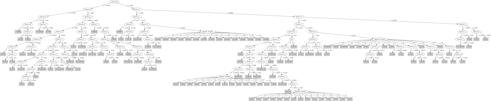

# J48

# SimpleCart Decision Tree

Feature_1 < 0.426

* Feature_1 < -0.1235: 0(30.0/0.0)

* Feature_1 >= -0.1235

*   * Feature_0 < -3.3695: 0(18.0/0.0)

*   * Feature_0 >= -3.3695

*   *   * Feature_8 < -1.003: 0(5.0/0.0)

*   *   * Feature_8 >= -1.003: 1(23.0/3.0)

Feature_1 >= 0.426

* Feature_0 < -3.596

*   * Feature_4 < -1.1005: 7(32.0/2.0)

*   * Feature_4 >= -1.1005

*   *   * Feature_0 < -4.275

*   *   *   * Feature_2 < 1.03

*   *   *   *   * Feature_3 < -0.6675: 7(8.0/6.0)

*   *   *   *   * Feature_3 >= -0.6675: 9(43.0/7.0)

*   *   *   * Feature_2 >= 1.03: 0(9.0/0.0)

*   *   * Feature_0 >= -4.275

*   *   *   * Feature_3 < 0.8975

*   *   *   *   * Feature_1 < 3.5875

*   *   *   *   *   * Feature_1 < 1.891: 10(8.0/5.0)

*   *   *   *   *   * Feature_1 >= 1.891: 8(40.0/18.0)

*   *   *   *   * Feature_1 >= 3.5875: 7(13.0/4.0)

*   *   *   * Feature_3 >= 0.8975

*   *   *   *   * Feature_9 < 0.32399999999999995: 9(17.0/4.0)

*   *   *   *   * Feature_9 >= 0.32399999999999995: 1(10.0/7.0)

* Feature_0 >= -3.596

*   * Feature_0 < -2.3305

*   *   * Feature_1 < 2.0235

*   *   *   * Feature_3 < 0.8665

*   *   *   *   * Feature_7 < -0.4135: 3(7.0/1.0)

*   *   *   *   * Feature_7 >= -0.4135

*   *   *   *   *   * Feature_0 < -2.892

*   *   *   *   *   *   * Feature_9 < 0.6335: 10(22.0/5.0)

*   *   *   *   *   *   * Feature_9 >= 0.6335: 5(6.0/5.0)

*   *   *   *   *   * Feature_0 >= -2.892

*   *   *   *   *   *   * Feature_4 < 0.174: 5(27.0/20.0)

*   *   *   *   *   *   * Feature_4 >= 0.174: 2(7.0/3.0)

*   *   *   * Feature_3 >= 0.8665

*   *   *   *   * Feature_7 < -0.0275: 2(21.0/4.0)

*   *   *   *   * Feature_7 >= -0.0275

*   *   *   *   *   * Feature_4 < -0.3255

*   *   *   *   *   *   * Feature_2 < -0.3585

*   *   *   *   *   *   *   * Feature_0 < -3.025: 8(5.0/1.0)

*   *   *   *   *   *   *   * Feature_0 >= -3.025: 10(7.0/0.0)

*   *   *   *   *   *   * Feature_2 >= -0.3585: 6(8.0/2.0)

*   *   *   *   *   * Feature_4 >= -0.3255: 1(13.0/2.0)

*   *   * Feature_1 >= 2.0235

*   *   *   * Feature_0 < -3.021

*   *   *   *   * Feature_4 < -0.1055

*   *   *   *   *   * Feature_3 < -0.59: 7(5.0/1.0)

*   *   *   *   *   * Feature_3 >= -0.59: 6(28.0/5.0)

*   *   *   *   * Feature_4 >= -0.1055: 10(13.0/4.0)

*   *   *   * Feature_0 >= -3.021

*   *   *   *   * Feature_4 < -0.481

*   *   *   *   *   * Speaker_Number=(10)|(3)|(5)|(4)|(1)|(12)|(8)|(11)|(6)|(14)|(2)|(13)|(7): 4(37.0/11.0)

*   *   *   *   *   * Speaker_Number!=(10)|(3)|(5)|(4)|(1)|(12)|(8)|(11)|(6)|(14)|(2)|(13)|(7): 5(7.0/3.0)

*   *   *   *   * Feature_4 >= -0.481

*   *   *   *   *   * Feature_2 < -1.335: 4(4.0/2.0)

*   *   *   *   *   * Feature_2 >= -1.335: 5(12.0/1.0)

*   * Feature_0 >= -2.3305

*   *   * Feature_1 < 1.2595

*   *   *   * Feature_2 < -0.7685: 2(22.0/4.0)

*   *   *   * Feature_2 >= -0.7685: 3(9.0/3.0)

*   *   * Feature_1 >= 1.2595

*   *   *   * Feature_3 < 1.3014999999999999: 3(35.0/2.0)

*   *   *   * Feature_3 >= 1.3014999999999999: 5(4.0/3.0)

# PART

Decision list:

conditions|predicted class
---|---
Feature_0 <= -3.3295 AND Feature_1 > 2.2385 AND Feature_0 <= -3.918 AND Feature_4 <= -1.1005 AND Sex = 0| 7 (16.0/1.0)
Feature_0 <= -3.3295 AND Feature_1 > 2.2385 AND Feature_0 <= -3.918 AND Feature_0 <= -4.591 AND Sex = 1| 9 (15.0/1.0)
Feature_0 <= -3.3295 AND Feature_1 > 2.8345 AND Feature_0 <= -4.4935 AND Feature_0 <= -4.614| 9 (7.0)
Feature_0 <= -3.3295 AND Feature_1 > 2.8345 AND Feature_3 <= -0.1085 AND Feature_1 > 3.276 AND Feature_8 > -0.8515 AND Sex = 1| 7 (21.0/1.0)
Feature_0 <= -3.4755 AND Feature_1 <= 1.3475 AND Feature_1 <= 0.612| 0 (25.0)
Feature_0 <= -3.4755 AND Feature_3 <= 1.0065 AND Feature_1 > 2.8645 AND Speaker_Number = 7| 6 (11.0/6.0)
Feature_0 <= -3.596 AND Feature_3 <= 1.0065 AND Feature_0 <= -4.2625 AND Sex = 0| 9 (8.0/2.0)
Feature_0 <= -3.4755 AND Feature_3 <= 1.0065 AND Feature_1 > 3.0825 AND Feature_4 <= -0.8995| 7 (10.0/1.0)
Feature_0 > -3.143 AND Feature_1 > 1.4125 AND Feature_0 > -2.1755 AND Feature_3 <= 1.179| 3 (30.0)
Feature_0 <= -3.4755 AND Feature_3 <= 1.0065 AND Feature_0 <= -3.7655 AND Feature_2 > -1.036 AND Feature_0 > -4.1435 AND Feature_9 <= 0.433 AND Feature_3 <= 0.7775| 8 (29.0)
Feature_1 <= 1.415 AND Feature_1 <= 0.2675 AND Feature_1 <= -0.1345| 0 (23.0)
Feature_0 > -3.1025 AND Feature_1 > 1.415 AND Feature_1 > 2.1185 AND Speaker_Number = 9| 5 (7.0/2.0)
Feature_0 > -3.1025 AND Feature_1 > 1.415 AND Feature_1 > 2.1185 AND Feature_7 > 0.2735 AND Feature_0 <= -2.921 AND Feature_0 <= -3.0245| 6 (6.0)
Feature_0 > -3.1025 AND Feature_1 > 1.415 AND Feature_1 > 2.1185 AND Feature_7 > 0.277 AND Feature_4 > -1.176| 4 (19.0/1.0)
Feature_0 > -3.1025 AND Feature_1 > 1.415 AND Feature_1 > 2.0975 AND Feature_2 <= -0.1825 AND Feature_1 <= 3.001 AND Feature_2 > -1.165 AND Feature_9 > -0.3205| 5 (16.0)
Feature_0 <= -3.596 AND Feature_3 > 1.0065 AND Feature_1 <= 3.0145 AND Feature_2 <= 1.024 AND Sex = 0 AND Feature_0 <= -3.9465| 9 (14.0)
Feature_1 > 2.1395 AND Feature_0 > -3.668 AND Feature_0 > -3.0955 AND Feature_2 <= -0.1855 AND Feature_3 > -0.522| 4 (21.0)
Feature_1 > 2.1395 AND Feature_0 > -3.668 AND Feature_4 <= -0.2575 AND Sex = 0| 6 (14.0)
Feature_0 > -3.1025 AND Feature_1 <= 0.7865 AND Feature_5 > 1.1295 AND Speaker_Number = 2| 1 (7.0/1.0)
Feature_0 > -2.892 AND Feature_1 <= 1.23 AND Feature_1 > 0.2675 AND Feature_8 <= 0.283 AND Feature_0 <= -1.8035 AND Feature_3 > 0.0795| 2 (34.0)
Feature_1 > 2.1395 AND Feature_0 > -3.668 AND Feature_3 > 0.2035 AND Speaker_Number = 13| 10 (7.0/2.0)
Feature_1 > 2.1395 AND Feature_0 > -3.668 AND Feature_3 <= 0.2035 AND Feature_5 <= 1.046| 6 (11.0/2.0)
Feature_1 > 2.1395 AND Feature_0 <= -3.937 AND Feature_2 > -0.37 AND Feature_9 <= 0.1245| 9 (16.0)
Feature_1 <= 0.767 AND Feature_8 <= 0.5165 AND Feature_8 > -1.003 AND Feature_3 > -0.19| 1 (27.0)
Feature_0 > -3.2575 AND Feature_8 > 0.0655 AND Feature_6 <= -0.7215| 6 (8.0)
Feature_1 > 2.846 AND Sex = 1| 7 (9.0/3.0)
Feature_3 <= 1.0195 AND Feature_0 > -2.892 AND Feature_0 > -2.3085 AND Feature_5 > 0.53| 2 (11.0/5.0)
Feature_3 <= 1.0195 AND Feature_0 > -3.143 AND Feature_5 > 0.5195 AND Feature_1 <= 1.76 AND Feature_0 <= -2.892| 10 (14.0)
Feature_3 <= 0.9475 AND Feature_0 > -3.143 AND Feature_4 > -0.6245 AND Feature_8 <= -0.8535| 10 (9.0/1.0)
Feature_0 > -3.143 AND Feature_4 > -0.6245 AND Feature_3 > 0.992 AND Feature_1 <= 0.9725| 0 (6.0/2.0)
Feature_0 > -3.143 AND Feature_4 > -0.6245 AND Feature_3 <= 0.992 AND Feature_8 <= 0.2215 AND Speaker_Number = 4| 3 (9.0/3.0)
Feature_0 > -3.143 AND Feature_4 > -0.6245 AND Feature_3 <= 0.992 AND Feature_8 <= 0.2215 AND Feature_0 > -2.6495| 3 (15.0)
Feature_0 > -3.143 AND Speaker_Number = 11| 5 (9.0/4.0)
Feature_0 > -3.143 AND Speaker_Number = 13| 2 (9.0/4.0)
Feature_0 > -3.143 AND Feature_4 > -0.409 AND Feature_3 > 0.4945| 2 (9.0/2.0)
Feature_0 > -3.143 AND Feature_6 > -0.207 AND Feature_9 <= 0.1005 AND Feature_6 <= 0.231| 5 (18.0)
Feature_3 <= 0.844 AND Feature_6 <= 0.294 AND Feature_5 <= 0.047| 4 (7.0/3.0)
Feature_3 <= 0.844 AND Feature_6 <= 0.294 AND Feature_5 <= 0.6295 AND Speaker_Number = 7| 10 (7.0/2.0)
Speaker_Number = 9| 1 (11.0/7.0)
Feature_7 > 0.2185 AND Feature_0 > -3.0145 AND Feature_0 <= -2.3885 AND Feature_0 <= -2.541| 10 (6.0)
Feature_4 > -0.128 AND Feature_3 <= 1.01 AND Feature_7 > -0.049 AND Sex = 0| 10 (11.0)
Feature_0 > -3.46 AND Speaker_Number = 14| 10 (10.0/4.0)
Feature_0 > -3.375 AND Feature_1 > 1.688 AND Feature_5 > 0.458 AND Feature_1 > 1.951| 5 (7.0)
Feature_4 > 0.037 AND Feature_1 <= 1.369 AND Feature_2 > 0.3555| 0 (7.0)
Feature_4 > 0.037 AND Feature_3 > 1.015 AND Feature_2 > -0.235 AND Feature_4 > 0.42| 1 (15.0)
Feature_0 > -3.372 AND Speaker_Number = 2| 4 (11.0/8.0)
Feature_5 <= 0.0465 AND Sex = 1 AND Feature_2 <= 0.33| 2 (8.0/2.0)
Feature_7 > 0.2185 AND Feature_0 <= -3.3875 AND Feature_4 > -1.231 AND Feature_4 <= -0.2235 AND Feature_8 <= 0.466| 8 (11.0/1.0)
Feature_7 > 0.2185 AND Feature_0 > -3.442 AND Feature_3 <= 0.4215| 10 (6.0)
Feature_7 > 0.2185 AND Feature_5 > 0.6205 AND Feature_4 <= -0.7645| 8 (8.0/1.0)
Feature_7 > 0.2605 AND Feature_4 > -0.993| 9 (10.0/4.0)
Feature_7 <= 0.2605 AND Feature_4 <= 0.267 AND Feature_0 <= -3.2| 5 (11.0/5.0)
Feature_4 > -0.317| 1 (11.0/6.0)
Feature_3 <= 1.291| 4 (9.0/3.0)
| 7 (7.0)

# JRip

Decision list:

conditions|predicted class
---|---
(Feature_3 <= -0.182) and (Feature_4 <= -0.416) and (Feature_8 <= -0.58) and (Feature_0 <= -2.898) and (Feature_1 <= 3.48)|6 (16.0/0.0)
(Feature_8 >= 0.365) and (Feature_7 <= 0.468) and (Feature_0 >= -3.582) and (Feature_0 <= -2.71)|6 (16.0/0.0)
(Feature_1 >= 2.396) and (Feature_0 >= -3.682) and (Feature_2 >= -0.147) and (Feature_4 <= -0.905)|6 (9.0/0.0)
(Feature_1 >= 2.733) and (Feature_0 >= -3.57) and (Feature_0 <= -3.124) and (Feature_3 >= -0.394)|6 (7.0/0.0)
(Feature_1 >= -0.11) and (Feature_7 >= 0.723) and (Feature_1 <= 0.516) and (Feature_0 >= -2.441)|1 (14.0/0.0)
(Feature_4 >= 0.45) and (Feature_9 >= 0.557) and (Feature_7 >= -0.45) and (Feature_1 <= 2.138)|1 (15.0/0.0)
(Feature_1 <= 0.757) and (Feature_4 >= 0.389) and (Feature_7 >= -0.016) and (Feature_6 <= 0.568)|1 (11.0/0.0)
(Feature_3 >= 0.931) and (Feature_8 <= -0.343) and (Feature_1 >= 0.28) and (Feature_3 <= 1.528) and (Feature_1 <= 0.487)|1 (7.0/0.0)
(Feature_3 >= 1.292) and (Feature_8 <= -0.512) and (Feature_1 >= 0.956)|1 (21.0/13.0)
(Feature_4 <= -0.739) and (Feature_0 >= -3.001) and (Feature_1 >= 2.07) and (Feature_0 <= -2.563) and (Feature_3 <= 0.676)|4 (27.0/0.0)
(Feature_0 >= -3.141) and (Feature_1 >= 1.802) and (Feature_3 <= -0.105) and (Feature_4 <= -0.297) and (Feature_4 >= -0.643)|4 (9.0/0.0)
(Feature_4 <= -0.656) and (Feature_0 >= -2.758) and (Feature_1 >= 1.802) and (Feature_8 >= -0.067) and (Feature_7 <= 1.362)|4 (13.0/0.0)
(Feature_2 <= -1.055) and (Feature_7 <= 0.016)|4 (31.0/23.0)
(Feature_0 >= -2.316) and (Feature_1 >= 1.413) and (Feature_7 <= 0.814)|3 (30.0/0.0)
(Feature_5 <= 0.098) and (Feature_6 >= 0.022) and (Feature_0 >= -2.395)|3 (8.0/0.0)
(Feature_2 <= -0.619) and (Feature_9 >= 0.007) and (Feature_4 <= -0.275) and (Feature_7 <= 0.04)|3 (10.0/0.0)
(Feature_1 >= 3.067) and (Feature_4 <= -1.01)|7 (28.0/0.0)
(Feature_1 >= 3.236) and (Feature_6 >= 0.579) and (Feature_3 <= -0.603)|7 (15.0/0.0)
(Feature_4 <= -1.262) and (Feature_3 >= 1.158)|7 (8.0/0.0)
(Feature_1 >= 3.536) and (Feature_2 <= -1.069)|7 (8.0/0.0)
(Feature_0 <= -3.712) and (Feature_0 >= -4.142) and (Feature_7 >= 0.308) and (Feature_8 >= -0.507)|8 (22.0/0.0)
(Feature_0 <= -3.828) and (Feature_3 <= 0.082) and (Feature_5 >= 0.387) and (Feature_7 <= 0.689)|8 (16.0/0.0)
(Feature_4 <= -0.769) and (Feature_0 <= -3.05) and (Feature_1 <= 1.905)|8 (9.0/0.0)
(Feature_0 <= -3.828) and (Feature_0 >= -4.232)|8 (39.0/26.0)
(Feature_1 <= 0.088)|0 (37.0/0.0)
(Feature_3 >= 1.705) and (Feature_3 <= 1.936)|0 (13.0/0.0)
(Feature_1 <= 1.272) and (Feature_2 <= -0.74) and (Feature_5 <= 1.46) and (Feature_0 >= -3.047)|2 (31.0/0.0)
(Feature_1 <= 1.515) and (Feature_9 >= 0.347) and (Feature_0 >= -3.097) and (Sex = 1)|2 (15.0/0.0)
(Feature_0 <= -3.601) and (Feature_1 >= 2.216) and (Feature_4 >= -0.913)|9 (32.0/0.0)
(Feature_0 <= -3.601) and (Feature_5 >= 1.275)|9 (8.0/0.0)
(Feature_0 <= -2.895) and (Feature_7 >= -0.102) and (Feature_2 >= -0.898) and (Feature_2 <= 0.048) and (Feature_9 <= 0.794) and (Feature_1 <= 2.713)|10 (39.0/0.0)
(Feature_8 <= -0.786) and (Feature_5 <= 0.366) and (Feature_6 <= 0.187)|10 (9.0/0.0)
(Feature_5 >= 0.965) and (Feature_4 <= -0.834) and (Feature_2 <= -0.908)|10 (8.0/0.0)
|5 (112.0/53.0)

# Decision Table

Non matches covered by Majority class

feature_0|feature_1|feature_2|feature_3|feature_8|target
---|---|---|---|---|---
(-inf--4.672]|(1.4125-2.1925]|(1.077-inf)|(0.829-inf)|(0.048-inf)|0
(-4.2625--3.3295]|(3.065-inf)|(-inf-0.5295]|(0.829-inf)|(0.048-inf)|7
(-inf--4.672]|(2.1925-3.065]|(1.077-inf)|(0.829-inf)|(-inf-0.048]|0
(-4.672--4.2625]|(2.1925-3.065]|(-inf-0.5295]|(0.829-inf)|(0.048-inf)|9
(-3.3295--3.021]|(0.625-1.4125]|(0.5295-1.077]|(0.829-inf)|(0.048-inf)|0
(-3.021--2.3305]|(0.625-1.4125]|(0.5295-1.077]|(0.829-inf)|(0.048-inf)|6
(-4.2625--3.3295]|(0.625-1.4125]|(0.5295-1.077]|(0.829-inf)|(0.048-inf)|7
(-4.2625--3.3295]|(2.1925-3.065]|(-inf-0.5295]|(0.829-inf)|(0.048-inf)|7
(-3.3295--3.021]|(1.4125-2.1925]|(-inf-0.5295]|(0.829-inf)|(0.048-inf)|0
(-2.3305--1.557]|(1.4125-2.1925]|(-inf-0.5295]|(0.829-inf)|(0.048-inf)|0
(-4.2625--3.3295]|(1.4125-2.1925]|(-inf-0.5295]|(0.829-inf)|(0.048-inf)|8
(-3.021--2.3305]|(1.4125-2.1925]|(-inf-0.5295]|(0.829-inf)|(0.048-inf)|4
(-4.2625--3.3295]|(1.4125-2.1925]|(0.5295-1.077]|(-0.1215-0.829]|(0.048-inf)|0
(-3.3295--3.021]|(1.4125-2.1925]|(0.5295-1.077]|(-0.1215-0.829]|(0.048-inf)|0
(-3.021--2.3305]|(3.065-inf)|(-inf-0.5295]|(-0.1215-0.829]|(0.048-inf)|4
(-3.021--2.3305]|(1.4125-2.1925]|(0.5295-1.077]|(-0.1215-0.829]|(0.048-inf)|4
(-3.021--2.3305]|(0.625-1.4125]|(-inf-0.5295]|(0.829-inf)|(0.048-inf)|10
(-inf--4.672]|(0.625-1.4125]|(1.077-inf)|(0.829-inf)|(-inf-0.048]|0
(-4.2625--3.3295]|(3.065-inf)|(-inf-0.5295]|(-0.1215-0.829]|(0.048-inf)|7
(-inf--4.672]|(3.065-inf)|(-inf-0.5295]|(-0.1215-0.829]|(0.048-inf)|9
(-4.672--4.2625]|(1.4125-2.1925]|(0.5295-1.077]|(0.829-inf)|(-inf-0.048]|1
(-3.3295--3.021]|(2.1925-3.065]|(-inf-0.5295]|(-0.1215-0.829]|(0.048-inf)|5
(-4.672--4.2625]|(2.1925-3.065]|(-inf-0.5295]|(-0.1215-0.829]|(0.048-inf)|8
(-4.2625--3.3295]|(1.4125-2.1925]|(0.5295-1.077]|(0.829-inf)|(-inf-0.048]|0
(-inf--4.672]|(2.1925-3.065]|(-inf-0.5295]|(-0.1215-0.829]|(0.048-inf)|9
(-3.021--2.3305]|(2.1925-3.065]|(-inf-0.5295]|(-0.1215-0.829]|(0.048-inf)|4
(-4.2625--3.3295]|(2.1925-3.065]|(-inf-0.5295]|(-0.1215-0.829]|(0.048-inf)|8
(-4.2625--3.3295]|(0.625-1.4125]|(0.5295-1.077]|(0.829-inf)|(-inf-0.048]|0
(-4.672--4.2625]|(0.625-1.4125]|(0.5295-1.077]|(0.829-inf)|(-inf-0.048]|0
(-3.021--2.3305]|(2.1925-3.065]|(0.5295-1.077]|(-inf--0.1215]|(0.048-inf)|6
(-4.672--4.2625]|(-0.1235-0.426]|(1.077-inf)|(0.829-inf)|(-inf-0.048]|0
(-4.672--4.2625]|(1.4125-2.1925]|(-inf-0.5295]|(-0.1215-0.829]|(0.048-inf)|0
(-inf--4.672]|(0.625-1.4125]|(0.5295-1.077]|(0.829-inf)|(-inf-0.048]|9
(-4.2625--3.3295]|(2.1925-3.065]|(-inf-0.5295]|(0.829-inf)|(-inf-0.048]|9
(-3.021--2.3305]|(1.4125-2.1925]|(-inf-0.5295]|(-0.1215-0.829]|(0.048-inf)|5
(-2.3305--1.557]|(1.4125-2.1925]|(-inf-0.5295]|(-0.1215-0.829]|(0.048-inf)|3
(-3.021--2.3305]|(2.1925-3.065]|(-inf-0.5295]|(0.829-inf)|(-inf-0.048]|0
(-4.2625--3.3295]|(1.4125-2.1925]|(-inf-0.5295]|(-0.1215-0.829]|(0.048-inf)|8
(-4.672--4.2625]|(2.1925-3.065]|(0.5295-1.077]|(-0.1215-0.829]|(-inf-0.048]|0
(-3.021--2.3305]|(3.065-inf)|(-inf-0.5295]|(-inf--0.1215]|(0.048-inf)|0
(-4.672--4.2625]|(0.625-1.4125]|(-inf-0.5295]|(-0.1215-0.829]|(0.048-inf)|9
(-4.2625--3.3295]|(0.625-1.4125]|(-inf-0.5295]|(-0.1215-0.829]|(0.048-inf)|9
(-3.021--2.3305]|(2.1925-3.065]|(0.5295-1.077]|(-0.1215-0.829]|(-inf-0.048]|0
(-3.021--2.3305]|(1.4125-2.1925]|(-inf-0.5295]|(0.829-inf)|(-inf-0.048]|3
(-3.3295--3.021]|(0.625-1.4125]|(-inf-0.5295]|(-0.1215-0.829]|(0.048-inf)|8
(-1.557-inf)|(1.4125-2.1925]|(-inf-0.5295]|(0.829-inf)|(-inf-0.048]|3
(-4.2625--3.3295]|(0.426-0.625]|(0.5295-1.077]|(0.829-inf)|(-inf-0.048]|0
(-3.3295--3.021]|(1.4125-2.1925]|(-inf-0.5295]|(0.829-inf)|(-inf-0.048]|2
(-4.2625--3.3295]|(2.1925-3.065]|(0.5295-1.077]|(-0.1215-0.829]|(-inf-0.048]|9
(-4.2625--3.3295]|(3.065-inf)|(-inf-0.5295]|(-inf--0.1215]|(0.048-inf)|7
(-3.3295--3.021]|(0.426-0.625]|(0.5295-1.077]|(0.829-inf)|(-inf-0.048]|0
(-3.021--2.3305]|(0.625-1.4125]|(-inf-0.5295]|(-0.1215-0.829]|(0.048-inf)|5
(-2.3305--1.557]|(1.4125-2.1925]|(-inf-0.5295]|(0.829-inf)|(-inf-0.048]|5
(-3.3295--3.021]|(3.065-inf)|(-inf-0.5295]|(-inf--0.1215]|(0.048-inf)|6
(-4.672--4.2625]|(1.4125-2.1925]|(-inf-0.5295]|(0.829-inf)|(-inf-0.048]|9
(-4.2625--3.3295]|(1.4125-2.1925]|(-inf-0.5295]|(0.829-inf)|(-inf-0.048]|1
(-inf--4.672]|(-0.1235-0.426]|(0.5295-1.077]|(0.829-inf)|(-inf-0.048]|0
(-4.672--4.2625]|(0.625-1.4125]|(-inf-0.5295]|(0.829-inf)|(-inf-0.048]|2
(-3.3295--3.021]|(2.1925-3.065]|(-inf-0.5295]|(-inf--0.1215]|(0.048-inf)|6
(-1.557-inf)|(0.625-1.4125]|(-inf-0.5295]|(0.829-inf)|(-inf-0.048]|2
(-3.021--2.3305]|(0.426-0.625]|(-inf-0.5295]|(-0.1215-0.829]|(0.048-inf)|10
(-3.3295--3.021]|(-0.1235-0.426]|(0.5295-1.077]|(0.829-inf)|(-inf-0.048]|1
(-2.3305--1.557]|(0.625-1.4125]|(-inf-0.5295]|(0.829-inf)|(-inf-0.048]|2
(-4.672--4.2625]|(3.065-inf)|(-inf-0.5295]|(-0.1215-0.829]|(-inf-0.048]|9
(-inf--4.672]|(3.065-inf)|(-inf-0.5295]|(-0.1215-0.829]|(-inf-0.048]|9
(-3.3295--3.021]|(3.065-inf)|(-inf-0.5295]|(-0.1215-0.829]|(-inf-0.048]|0
(-4.672--4.2625]|(-0.1235-0.426]|(0.5295-1.077]|(0.829-inf)|(-inf-0.048]|0
(-3.021--2.3305]|(0.625-1.4125]|(-inf-0.5295]|(0.829-inf)|(-inf-0.048]|2
(-4.2625--3.3295]|(2.1925-3.065]|(-inf-0.5295]|(-inf--0.1215]|(0.048-inf)|0
(-4.2625--3.3295]|(3.065-inf)|(-inf-0.5295]|(-0.1215-0.829]|(-inf-0.048]|8
(-4.2625--3.3295]|(-0.1235-0.426]|(0.5295-1.077]|(0.829-inf)|(-inf-0.048]|0
(-3.021--2.3305]|(2.1925-3.065]|(-inf-0.5295]|(-inf--0.1215]|(0.048-inf)|4
(-4.2625--3.3295]|(0.625-1.4125]|(-inf-0.5295]|(0.829-inf)|(-inf-0.048]|1
(-3.3295--3.021]|(0.625-1.4125]|(-inf-0.5295]|(0.829-inf)|(-inf-0.048]|1
(-inf--4.672]|(2.1925-3.065]|(-inf-0.5295]|(-0.1215-0.829]|(-inf-0.048]|0
(-4.2625--3.3295]|(0.426-0.625]|(-inf-0.5295]|(0.829-inf)|(-inf-0.048]|0
(-3.3295--3.021]|(1.4125-2.1925]|(-inf-0.5295]|(-inf--0.1215]|(0.048-inf)|10
(-4.2625--3.3295]|(-inf--0.1235]|(0.5295-1.077]|(0.829-inf)|(-inf-0.048]|0
(-4.672--4.2625]|(2.1925-3.065]|(-inf-0.5295]|(-0.1215-0.829]|(-inf-0.048]|9
(-4.2625--3.3295]|(3.065-inf)|(0.5295-1.077]|(-inf--0.1215]|(-inf-0.048]|6
(-3.021--2.3305]|(1.4125-2.1925]|(-inf-0.5295]|(-inf--0.1215]|(0.048-inf)|0
(-2.3305--1.557]|(-0.1235-0.426]|(-inf-0.5295]|(-0.1215-0.829]|(0.048-inf)|0
(-3.3295--3.021]|(0.426-0.625]|(-inf-0.5295]|(0.829-inf)|(-inf-0.048]|1
(-3.3295--3.021]|(2.1925-3.065]|(-inf-0.5295]|(-0.1215-0.829]|(-inf-0.048]|10
(-1.557-inf)|(-0.1235-0.426]|(-inf-0.5295]|(-0.1215-0.829]|(0.048-inf)|0
(-3.021--2.3305]|(0.426-0.625]|(-inf-0.5295]|(0.829-inf)|(-inf-0.048]|2
(-4.2625--3.3295]|(2.1925-3.065]|(-inf-0.5295]|(-0.1215-0.829]|(-inf-0.048]|8
(-2.3305--1.557]|(1.4125-2.1925]|(-inf-0.5295]|(-inf--0.1215]|(0.048-inf)|0
(-2.3305--1.557]|(2.1925-3.065]|(-inf-0.5295]|(-0.1215-0.829]|(-inf-0.048]|3
(-3.021--2.3305]|(2.1925-3.065]|(-inf-0.5295]|(-0.1215-0.829]|(-inf-0.048]|4
(-2.3305--1.557]|(0.625-1.4125]|(-inf-0.5295]|(-inf--0.1215]|(0.048-inf)|3
(-3.021--2.3305]|(-0.1235-0.426]|(-inf-0.5295]|(0.829-inf)|(-inf-0.048]|0
(-1.557-inf)|(-0.1235-0.426]|(-inf-0.5295]|(0.829-inf)|(-inf-0.048]|0
(-inf--4.672]|(2.1925-3.065]|(0.5295-1.077]|(-inf--0.1215]|(-inf-0.048]|9
(-3.3295--3.021]|(0.625-1.4125]|(-inf-0.5295]|(-inf--0.1215]|(0.048-inf)|0
(-4.2625--3.3295]|(1.4125-2.1925]|(-inf-0.5295]|(-0.1215-0.829]|(-inf-0.048]|10
(-1.557-inf)|(-inf--0.1235]|(-inf-0.5295]|(-0.1215-0.829]|(0.048-inf)|0
(-3.3295--3.021]|(-0.1235-0.426]|(-inf-0.5295]|(0.829-inf)|(-inf-0.048]|1
(-2.3305--1.557]|(1.4125-2.1925]|(-inf-0.5295]|(-0.1215-0.829]|(-inf-0.048]|3
(-3.021--2.3305]|(1.4125-2.1925]|(-inf-0.5295]|(-0.1215-0.829]|(-inf-0.048]|3
(-4.2625--3.3295]|(-0.1235-0.426]|(-inf-0.5295]|(0.829-inf)|(-inf-0.048]|0
(-3.3295--3.021]|(1.4125-2.1925]|(-inf-0.5295]|(-0.1215-0.829]|(-inf-0.048]|10
(-3.3295--3.021]|(0.625-1.4125]|(-inf-0.5295]|(-0.1215-0.829]|(-inf-0.048]|2
(-4.2625--3.3295]|(-inf--0.1235]|(-inf-0.5295]|(0.829-inf)|(-inf-0.048]|0
(-inf--4.672]|(1.4125-2.1925]|(0.5295-1.077]|(-inf--0.1215]|(-inf-0.048]|0
(-2.3305--1.557]|(3.065-inf)|(-inf-0.5295]|(-inf--0.1215]|(-inf-0.048]|0
(-3.3295--3.021]|(-inf--0.1235]|(-inf-0.5295]|(0.829-inf)|(-inf-0.048]|0
(-3.3295--3.021]|(3.065-inf)|(-inf-0.5295]|(-inf--0.1215]|(-inf-0.048]|6
(-3.021--2.3305]|(3.065-inf)|(-inf-0.5295]|(-inf--0.1215]|(-inf-0.048]|6
(-4.672--4.2625]|(-0.1235-0.426]|(0.5295-1.077]|(-0.1215-0.829]|(-inf-0.048]|0
(-4.2625--3.3295]|(0.625-1.4125]|(-inf-0.5295]|(-0.1215-0.829]|(-inf-0.048]|3
(-4.672--4.2625]|(3.065-inf)|(-inf-0.5295]|(-inf--0.1215]|(-inf-0.048]|7
(-4.2625--3.3295]|(3.065-inf)|(-inf-0.5295]|(-inf--0.1215]|(-inf-0.048]|7
(-inf--4.672]|(3.065-inf)|(-inf-0.5295]|(-inf--0.1215]|(-inf-0.048]|9
(-1.557-inf)|(-inf--0.1235]|(-inf-0.5295]|(0.829-inf)|(-inf-0.048]|0
(-3.021--2.3305]|(-inf--0.1235]|(-inf-0.5295]|(0.829-inf)|(-inf-0.048]|0
(-3.021--2.3305]|(0.625-1.4125]|(-inf-0.5295]|(-0.1215-0.829]|(-inf-0.048]|2
(-2.3305--1.557]|(0.625-1.4125]|(-inf-0.5295]|(-0.1215-0.829]|(-inf-0.048]|2
(-2.3305--1.557]|(2.1925-3.065]|(-inf-0.5295]|(-inf--0.1215]|(-inf-0.048]|0
(-3.021--2.3305]|(0.426-0.625]|(-inf-0.5295]|(-0.1215-0.829]|(-inf-0.048]|0
(-2.3305--1.557]|(0.426-0.625]|(-inf-0.5295]|(-0.1215-0.829]|(-inf-0.048]|0
(-1.557-inf)|(0.426-0.625]|(-inf-0.5295]|(-0.1215-0.829]|(-inf-0.048]|1
(-1.557-inf)|(-0.1235-0.426]|(-inf-0.5295]|(-inf--0.1215]|(0.048-inf)|1
(-3.021--2.3305]|(2.1925-3.065]|(-inf-0.5295]|(-inf--0.1215]|(-inf-0.048]|4
(-4.2625--3.3295]|(2.1925-3.065]|(-inf-0.5295]|(-inf--0.1215]|(-inf-0.048]|8
(-3.3295--3.021]|(2.1925-3.065]|(-inf-0.5295]|(-inf--0.1215]|(-inf-0.048]|6
(-1.557-inf)|(-0.1235-0.426]|(-inf-0.5295]|(-0.1215-0.829]|(-inf-0.048]|0
(-4.2625--3.3295]|(-0.1235-0.426]|(-inf-0.5295]|(-0.1215-0.829]|(-inf-0.048]|0
(-3.3295--3.021]|(-0.1235-0.426]|(-inf-0.5295]|(-0.1215-0.829]|(-inf-0.048]|0
(-3.021--2.3305]|(-0.1235-0.426]|(-inf-0.5295]|(-0.1215-0.829]|(-inf-0.048]|1
(-4.2625--3.3295]|(1.4125-2.1925]|(-inf-0.5295]|(-inf--0.1215]|(-inf-0.048]|8
(-2.3305--1.557]|(1.4125-2.1925]|(-inf-0.5295]|(-inf--0.1215]|(-inf-0.048]|3
(-3.021--2.3305]|(1.4125-2.1925]|(-inf-0.5295]|(-inf--0.1215]|(-inf-0.048]|4
(-2.3305--1.557]|(-inf--0.1235]|(-inf-0.5295]|(-0.1215-0.829]|(-inf-0.048]|0
(-2.3305--1.557]|(0.625-1.4125]|(-inf-0.5295]|(-inf--0.1215]|(-inf-0.048]|0
(-3.021--2.3305]|(0.625-1.4125]|(-inf-0.5295]|(-inf--0.1215]|(-inf-0.048]|10
(-1.557-inf)|(-inf--0.1235]|(-inf-0.5295]|(-0.1215-0.829]|(-inf-0.048]|0
(-2.3305--1.557]|(0.426-0.625]|(-inf-0.5295]|(-inf--0.1215]|(-inf-0.048]|0
(-2.3305--1.557]|(-0.1235-0.426]|(-inf-0.5295]|(-inf--0.1215]|(-inf-0.048]|1

