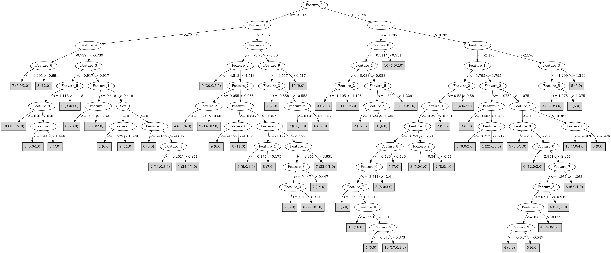

# J48

# SimpleCart Decision Tree

Feature_1 < 0.4245

* Feature_1 < -0.10350000000000001: 0(32.0/0.0)

* Feature_1 >= -0.10350000000000001

*   * Feature_0 < -3.3695: 0(16.0/0.0)

*   * Feature_0 >= -3.3695

*   *   * Feature_8 < -0.98: 0(6.0/0.0)

*   *   * Feature_8 >= -0.98

*   *   *   * Feature_5 < 0.976

*   *   *   *   * Feature_0 < -2.7504999999999997: 1(6.0/0.0)

*   *   *   *   * Feature_0 >= -2.7504999999999997: 2(4.0/0.0)

*   *   *   * Feature_5 >= 0.976: 1(23.0/0.0)

Feature_1 >= 0.4245

* Feature_0 < -3.6420000000000003

*   * Feature_4 < -0.921

*   *   * Feature_7 < 0.38949999999999996: 8(5.0/1.0)

*   *   * Feature_7 >= 0.38949999999999996: 7(35.0/1.0)

*   * Feature_4 >= -0.921

*   *   * Feature_0 < -4.283

*   *   *   * Feature_2 < 1.0765

*   *   *   *   * Feature_3 < -0.607

*   *   *   *   *   * Feature_7 < 0.38249999999999995

*   *   *   *   *   *   * Feature_1 < 4.348000000000001: 8(5.0/0.0)

*   *   *   *   *   *   * Feature_1 >= 4.348000000000001: 9(3.0/1.0)

*   *   *   *   *   * Feature_7 >= 0.38249999999999995: 7(9.0/0.0)

*   *   *   *   * Feature_3 >= -0.607

*   *   *   *   *   * Feature_5 < -0.47250000000000003: 1(4.0/0.0)

*   *   *   *   *   * Feature_5 >= -0.47250000000000003: 9(36.0/1.0)

*   *   *   * Feature_2 >= 1.0765: 0(9.0/0.0)

*   *   * Feature_0 >= -4.283

*   *   *   * Feature_3 < 1.0065

*   *   *   *   * Feature_1 < 3.602

*   *   *   *   *   * Feature_1 < 1.972

*   *   *   *   *   *   * Feature_6 < 0.264: 10(9.0/3.0)

*   *   *   *   *   *   * Feature_6 >= 0.264: 5(4.0/0.0)

*   *   *   *   *   * Feature_1 >= 1.972

*   *   *   *   *   *   * Feature_8 < -1.451: 6(5.0/0.0)

*   *   *   *   *   *   * Feature_8 >= -1.451

*   *   *   *   *   *   *   * Feature_6 < -0.4605: 9(4.0/1.0)

*   *   *   *   *   *   *   * Feature_6 >= -0.4605: 8(41.0/7.0)

*   *   *   *   * Feature_1 >= 3.602: 7(12.0/4.0)

*   *   *   * Feature_3 >= 1.0065

*   *   *   *   * Feature_2 < -0.055499999999999994

*   *   *   *   *   * Speaker_Number=(5)|(9): 1(3.0/2.0)

*   *   *   *   *   * Speaker_Number!=(5)|(9): 9(12.0/0.0)

*   *   *   *   * Feature_2 >= -0.055499999999999994: 1(6.0/3.0)

* Feature_0 >= -3.6420000000000003

*   * Feature_1 < 2.0185

*   *   * Feature_1 < 1.1855

*   *   *   * Feature_0 < -2.6925

*   *   *   *   * Feature_3 < 0.3805: 10(11.0/1.0)

*   *   *   *   * Feature_3 >= 0.3805

*   *   *   *   *   * Feature_5 < 0.908

*   *   *   *   *   *   * Feature_4 < 0.502

*   *   *   *   *   *   *   * Sex=(1): 2(9.0/3.0)

*   *   *   *   *   *   *   * Sex!=(1): 6(4.0/2.0)

*   *   *   *   *   *   * Feature_4 >= 0.502: 1(6.0/0.0)

*   *   *   *   *   * Feature_5 >= 0.908: 1(14.0/0.0)

*   *   *   * Feature_0 >= -2.6925

*   *   *   *   * Feature_2 < -0.2915: 2(33.0/4.0)

*   *   *   *   * Feature_2 >= -0.2915

*   *   *   *   *   * Feature_0 < -2.018: 2(3.0/5.0)

*   *   *   *   *   * Feature_0 >= -2.018: 3(4.0/0.0)

*   *   * Feature_1 >= 1.1855

*   *   *   * Feature_0 < -2.5175

*   *   *   *   * Feature_9 < -0.4435: 10(21.0/9.0)

*   *   *   *   * Feature_9 >= -0.4435

*   *   *   *   *   * Feature_3 < 0.994

*   *   *   *   *   *   * Feature_8 < -1.063: 10(4.0/0.0)

*   *   *   *   *   *   * Feature_8 >= -1.063

*   *   *   *   *   *   *   * Speaker_Number=(8)|(6)|(13)|(0)|(1)|(14)|(5)|(4)|(7)|(2)|(9)|(11)

*   *   *   *   *   *   *   *   * Feature_5 < 0.208: 3(6.0/0.0)

*   *   *   *   *   *   *   *   * Feature_5 >= 0.208

*   *   *   *   *   *   *   *   *   * Feature_1 < 1.764

*   *   *   *   *   *   *   *   *   *   * Speaker_Number=(13)|(7): 3(5.0/0.0)

*   *   *   *   *   *   *   *   *   *   * Speaker_Number!=(13)|(7): 5(4.0/3.0)

*   *   *   *   *   *   *   *   *   * Feature_1 >= 1.764: 5(7.0/0.0)

*   *   *   *   *   *   *   * Speaker_Number!=(8)|(6)|(13)|(0)|(1)|(14)|(5)|(4)|(7)|(2)|(9)|(11): 2(3.0/4.0)

*   *   *   *   *   * Feature_3 >= 0.994

*   *   *   *   *   *   * Sex=(1): 2(8.0/1.0)

*   *   *   *   *   *   * Sex!=(1)

*   *   *   *   *   *   *   * Feature_0 < -3.504: 7(4.0/0.0)

*   *   *   *   *   *   *   * Feature_0 >= -3.504: 6(3.0/2.0)

*   *   *   * Feature_0 >= -2.5175

*   *   *   *   * Feature_2 < -0.255

*   *   *   *   *   * Feature_3 < 1.3014999999999999: 3(36.0/3.0)

*   *   *   *   *   * Feature_3 >= 1.3014999999999999: 5(4.0/0.0)

*   *   *   *   * Feature_2 >= -0.255

*   *   *   *   *   * Feature_4 < -0.87: 4(6.0/0.0)

*   *   *   *   *   * Feature_4 >= -0.87: 5(6.0/0.0)

*   * Feature_1 >= 2.0185

*   *   * Feature_0 < -3.005

*   *   *   * Feature_4 < -0.11449999999999999: 6(29.0/4.0)

*   *   *   * Feature_4 >= -0.11449999999999999

*   *   *   *   * Feature_2 < -0.8565: 4(2.0/4.0)

*   *   *   *   * Feature_2 >= -0.8565: 10(13.0/1.0)

*   *   * Feature_0 >= -3.005

*   *   *   * Feature_0 < -2.118

*   *   *   *   * Feature_4 < -0.385

*   *   *   *   *   * Feature_2 < 0.149

*   *   *   *   *   *   * Feature_8 < -0.966

*   *   *   *   *   *   *   * Speaker_Number=(12)|(0)|(1)|(2)|(3)|(4)|(5)|(7)|(8)|(9)|(10)|(11)|(13)|(14): 6(3.0/2.0)

*   *   *   *   *   *   *   * Speaker_Number!=(12)|(0)|(1)|(2)|(3)|(4)|(5)|(7)|(8)|(9)|(10)|(11)|(13)|(14): 5(5.0/0.0)

*   *   *   *   *   *   * Feature_8 >= -0.966: 4(40.0/8.0)

*   *   *   *   *   * Feature_2 >= 0.149: 6(5.0/0.0)

*   *   *   *   * Feature_4 >= -0.385

*   *   *   *   *   * Feature_1 < 2.9204999999999997: 5(12.0/0.0)

*   *   *   *   *   * Feature_1 >= 2.9204999999999997: 4(4.0/2.0)

*   *   *   * Feature_0 >= -2.118: 3(8.0/0.0)

# PART

Decision list:

conditions|predicted class
---|---
Feature_0 > -3.143 AND Feature_1 <= 0.7865 AND Feature_5 > 1.231 AND Feature_1 > -0.179 AND Feature_3 <= 1.126| 1 (23.0)
Feature_0 > -3.143 AND Feature_1 > 1.315 AND Feature_0 > -2.169 AND Feature_3 <= 1.1035| 3 (29.0)
Feature_0 > -3.143 AND Feature_5 > 1.551 AND Feature_1 <= 0.05| 0 (14.0)
Feature_0 > -3.143 AND Feature_1 > 1.526 AND Feature_1 > 2.1185 AND Feature_8 <= 0.363 AND Feature_4 <= -0.385 AND Feature_8 > -0.966 AND Feature_2 > -0.8045 AND Feature_7 <= 0.947| 4 (17.0/2.0)
Feature_0 > -3.143 AND Feature_1 > 1.526 AND Feature_1 > 2.1185 AND Feature_8 <= 0.363 AND Feature_2 <= -1.1515 AND Feature_4 <= -0.385| 4 (12.0)
Feature_0 <= -3.3735 AND Feature_1 > 2.139 AND Feature_0 <= -4.505 AND Feature_0 > -4.9555 AND Feature_0 <= -4.706| 9 (12.0)
Feature_0 > -3.143 AND Feature_1 <= 1.4165 AND Feature_8 > 0.067 AND Feature_2 <= 0.2695| 10 (14.0/2.0)
Feature_0 > -3.143 AND Feature_1 <= 1.278 AND Feature_2 <= -0.2915 AND Feature_1 > 0.1835 AND Feature_0 > -2.8895 AND Feature_2 <= -0.7655| 2 (31.0)
Feature_0 <= -3.3735 AND Feature_1 > 2.139 AND Feature_7 > 0.0735 AND Feature_0 > -4.505 AND Feature_9 <= -0.845| 8 (17.0/6.0)
Feature_0 > -3.143 AND Feature_1 <= 0.7825 AND Feature_1 > 0.184 AND Feature_0 <= -2.8705| 1 (11.0/2.0)
Feature_0 > -3.143 AND Feature_4 > 0.168 AND Feature_1 > 0.261 AND Feature_2 > -0.6775| 2 (10.0)
Feature_0 > -3.143 AND Feature_1 > 1.7985 AND Feature_2 > -1.0745 AND Feature_1 <= 2.9065 AND Feature_5 > 0.1495 AND Feature_0 > -2.924 AND Feature_6 > -0.2415 AND Feature_6 <= 0.182| 5 (13.0)
Feature_0 > -3.143 AND Feature_1 > 1.7985 AND Feature_1 > 2.1515 AND Feature_0 <= -2.6265 AND Feature_2 > -1.0325 AND Feature_3 > -0.2735| 6 (13.0/6.0)
Feature_0 > -3.143 AND Feature_1 > 0.371 AND Feature_3 <= -0.3205 AND Feature_7 <= 0.243| 4 (14.0/6.0)
Feature_0 > -3.143 AND Feature_1 > 0.371 AND Feature_8 > 0.101 AND Feature_0 <= -2.7485| 6 (13.0/4.0)
Feature_0 > -3.143 AND Feature_1 > 0.4215 AND Feature_1 > 1.7985 AND Feature_8 > -0.3515 AND Feature_2 > -1.052| 4 (13.0/2.0)
Feature_0 > -3.143 AND Feature_1 > 0.4215 AND Feature_0 > -2.5175 AND Feature_2 <= -0.67| 3 (16.0/1.0)
Feature_1 > 2.139 AND Feature_0 > -3.648 AND Feature_0 <= -3.074 AND Feature_6 > 0.083 AND Feature_1 <= 3.058| 6 (13.0)
Feature_1 > 2.969 AND Feature_0 > -4.505 AND Feature_0 <= -3.976 AND Feature_7 > 0.334 AND Feature_9 > -0.3245| 7 (25.0)
Feature_1 <= 0.683 AND Feature_1 <= 0.407 AND Feature_0 <= -3.3125| 0 (29.0)
Feature_1 > 2.969 AND Feature_0 > -3.976 AND Feature_8 > -0.609 AND Feature_4 <= -0.782| 7 (14.0)
Feature_0 > -3.143 AND Feature_1 <= 0.4215| 0 (10.0/3.0)
Feature_0 > -3.143 AND Feature_5 > 0.8475 AND Feature_7 <= 0.634| 4 (9.0/5.0)
Feature_0 > -3.139 AND Feature_7 > 0.464 AND Feature_0 <= -2.5145 AND Feature_1 > 1.375| 10 (12.0/2.0)
Feature_0 > -3.139 AND Feature_8 > -0.89 AND Feature_8 <= 0.0345 AND Feature_5 <= 0.208| 3 (17.0/8.0)
Feature_0 > -3.139 AND Feature_8 > -0.89 AND Feature_2 > -0.613 AND Feature_4 > -0.7465| 5 (12.0)
Feature_3 > 1.0065 AND Feature_4 > -0.7835 AND Feature_2 <= 1.068 AND Feature_8 > -0.2085| 9 (14.0/4.0)
Feature_3 > 1.0205 AND Feature_4 > -0.7835 AND Feature_2 <= 1.068 AND Feature_0 > -3.9835 AND Feature_1 > 0.5805 AND Feature_4 > 0.3675| 1 (13.0)
Feature_1 > 2.9035 AND Feature_6 <= 0.775 AND Feature_0 <= -3.976 AND Feature_0 > -4.494 AND Feature_5 > 0.5745| 8 (14.0)
Feature_1 > 2.9035 AND Feature_0 > -4.444 AND Feature_1 > 3.267 AND Feature_0 <= -3.745| 7 (15.0/2.0)
Feature_3 > 1.0205 AND Feature_4 > -0.7835 AND Feature_2 <= 1.068 AND Feature_1 > 0.675 AND Feature_0 <= -3.981| 9 (17.0/8.0)
Feature_3 > 1.0205 AND Feature_4 > -0.7835 AND Feature_3 <= 1.7035 AND Feature_9 <= 0.259| 1 (10.0/1.0)
Feature_3 > 1.0205 AND Feature_4 > -0.7835 AND Feature_2 > 0.4725| 0 (10.0)
Feature_0 <= -3.7685 AND Feature_2 > -0.158 AND Feature_4 > -0.6865 AND Feature_0 <= -4.126| 9 (14.0)
Feature_0 > -3.139 AND Feature_1 > 1.3155 AND Feature_8 <= -0.2685 AND Feature_0 <= -2.911| 5 (9.0/2.0)
Feature_8 > 0.011 AND Feature_0 <= -3.1955 AND Feature_8 <= 0.5615 AND Feature_8 <= 0.4135| 8 (17.0/2.0)
Feature_4 <= -0.4285 AND Feature_0 > -3.1 AND Feature_7 <= 0.424| 3 (9.0/4.0)
Feature_1 > 2.828 AND Feature_0 > -4.02| 6 (17.0/4.0)
Feature_3 <= 1.0205 AND Feature_2 > 0.0225| 8 (17.0/6.0)
Feature_2 <= 0.0065 AND Feature_0 <= -3.7685 AND Feature_8 > -0.8685| 9 (16.0/10.0)
Feature_6 > -0.363 AND Feature_0 > -3.811 AND Feature_4 > -0.4955 AND Feature_7 > -0.0355 AND Feature_4 > -0.028 AND Feature_0 <= -3.2255| 10 (14.0)
Feature_6 > -0.363 AND Feature_0 <= -3.811| 8 (13.0/4.0)
Feature_8 <= 0.0035 AND Feature_6 > -0.363 AND Feature_9 <= 0.0865| 10 (15.0/2.0)
Feature_8 <= 0.0035 AND Feature_1 > 1.275 AND Feature_9 <= 0.8405| 5 (12.0/2.0)
Feature_4 > -0.4955 AND Feature_1 <= 1.38| 3 (13.0/8.0)
Sex = 0| 7 (12.0/6.0)
| 2 (9.0/5.0)

# JRip

Decision list:

conditions|predicted class
---|---
(Feature_1 >= 2.733) and (Feature_0 <= -2.969) and (Feature_0 >= -3.338) and (Feature_4 <= -0.19)|6 (20.0/0.0)
(Feature_2 >= 0.727) and (Feature_0 >= -3.439) and (Feature_8 >= 0.369)|6 (9.0/0.0)
(Feature_3 <= -0.508) and (Feature_9 >= -0.04) and (Feature_6 >= 0.249) and (Feature_0 >= -3.949)|6 (7.0/0.0)
(Feature_1 >= 2.178) and (Feature_0 >= -3.749) and (Feature_2 >= 0.041)|6 (8.0/1.0)
(Feature_4 <= -1.693) and (Feature_0 >= -3.635)|6 (4.0/0.0)
(Feature_8 <= -0.986) and (Feature_1 >= 3.018) and (Feature_1 <= 3.557)|6 (5.0/0.0)
(Feature_7 >= 1.397) and (Feature_3 >= 1.694)|6 (2.0/0.0)
(Feature_0 >= -2.937) and (Feature_2 >= -0.755) and (Feature_5 >= 0.411) and (Feature_1 >= 1.326) and (Feature_1 <= 2.584)|5 (21.0/1.0)
(Feature_5 <= 0.683) and (Feature_2 <= -0.905) and (Feature_9 >= 0.652) and (Feature_0 <= -2.904)|5 (14.0/2.0)
(Feature_0 >= -2.937) and (Feature_8 >= 0.182) and (Feature_5 <= 0.279)|5 (14.0/4.0)
(Feature_4 <= -0.351) and (Feature_0 <= -4.373) and (Feature_0 >= -4.944)|9 (19.0/0.0)
(Feature_0 <= -4.497) and (Feature_6 >= 0.144)|9 (12.0/0.0)
(Feature_0 <= -4.001) and (Feature_8 <= -0.783) and (Feature_6 <= -0.026) and (Feature_3 >= -0.343)|9 (14.0/0.0)
(Feature_5 >= 1.275) and (Feature_0 <= -3.601) and (Feature_8 >= -0.169) and (Feature_4 >= -0.561)|9 (9.0/0.0)
(Feature_5 >= 1.86) and (Feature_0 <= -4.138)|9 (3.0/0.0)
(Feature_9 <= -1.038) and (Feature_0 <= -4.299)|9 (3.0/0.0)
(Feature_4 <= -0.466) and (Feature_0 >= -2.967) and (Feature_1 >= 1.952)|4 (47.0/8.0)
(Feature_3 <= -0.302) and (Feature_7 <= -0.135)|4 (9.0/1.0)
(Feature_4 <= -0.759) and (Feature_0 >= -3.141) and (Feature_5 <= 0.536) and (Feature_2 >= -0.311)|4 (7.0/0.0)
(Feature_0 >= -2.851) and (Feature_1 <= 1.268) and (Feature_1 >= 0.279) and (Feature_8 <= 0.018) and (Feature_8 >= -0.567)|2 (32.0/2.0)
(Feature_1 <= 1.272) and (Feature_1 >= 0.777) and (Feature_2 <= -0.627)|2 (20.0/5.0)
(Feature_9 >= 0.691) and (Feature_2 <= 0.11) and (Feature_3 >= 1.157) and (Feature_4 <= 0.21)|2 (11.0/0.0)
(Feature_5 <= -0.167) and (Feature_0 >= -3.441) and (Feature_0 <= -2.814)|2 (4.0/0.0)
(Feature_0 >= -2.584) and (Feature_5 <= 1.044)|3 (51.0/4.0)
(Feature_7 <= -0.155) and (Feature_4 <= -0.275)|3 (8.0/2.0)
(Feature_0 >= -3.451) and (Feature_1 >= 0.839) and (Feature_4 >= -0.088)|10 (27.0/4.0)
(Feature_0 >= -3.088) and (Feature_4 <= -0.484) and (Feature_0 <= -2.52)|10 (21.0/3.0)
(Feature_5 <= 0.432) and (Feature_4 >= -0.092) and (Feature_2 <= -0.167)|10 (18.0/5.0)
(Feature_4 <= -0.329) and (Feature_4 >= -0.44) and (Feature_2 >= -0.866) and (Feature_5 >= 0.791)|10 (6.0/0.0)
(Feature_1 <= 0.418) and (Feature_0 <= -3.347)|0 (30.0/0.0)
(Feature_1 <= 0.088) and (Feature_2 <= -1.157)|0 (18.0/0.0)
(Feature_0 <= -4.687)|0 (8.0/0.0)
(Feature_1 <= -0.608)|0 (5.0/0.0)
(Feature_1 <= 1.925) and (Feature_4 >= -0.161)|1 (47.0/4.0)
(Feature_1 <= 0.539)|1 (16.0/1.0)
(Feature_5 >= 0.6) and (Feature_1 <= 3.586) and (Feature_0 <= -3.618)|8 (34.0/0.0)
(Feature_1 <= 3.035) and (Feature_3 <= 0.699) and (Feature_2 >= -0.068)|8 (13.0/0.0)
(Feature_4 >= -1.109) and (Feature_8 >= 0.126) and (Feature_3 >= -0.014)|8 (10.0/1.0)
(Feature_4 >= 0.288) and (Feature_8 <= -1.248)|8 (5.0/0.0)
|7 (82.0/18.0)

# Decision Table

Non matches covered by Majority class

feature_0|feature_1|feature_2|feature_4|feature_7|feature_8|feature_9|target
---|---|---|---|---|---|---|---
(-4.505--3.735]|(3.687-4.4755]|(-inf-0.4725]|(-0.7345-0.2865]|(0.1185-inf)|(0.191-inf)|all|0
(-4.505--3.735]|(4.4755-inf)|(-inf-0.4725]|(0.2865-inf)|(0.1185-inf)|(-inf-0.191]|all|0
(-4.505--3.735]|(2.945-3.687]|(0.4725-inf)|(0.2865-inf)|(0.1185-inf)|(-inf-0.191]|all|0
(-4.505--3.735]|(2.945-3.687]|(-inf-0.4725]|(-0.7345-0.2865]|(0.1185-inf)|(0.191-inf)|all|8
(-3.735--3.143]|(2.945-3.687]|(-inf-0.4725]|(-0.7345-0.2865]|(0.1185-inf)|(0.191-inf)|all|6
(-3.143--2.169]|(2.945-3.687]|(-inf-0.4725]|(-0.7345-0.2865]|(0.1185-inf)|(0.191-inf)|all|0
(-inf--4.505]|(2.945-3.687]|(0.4725-inf)|(0.2865-inf)|(0.1185-inf)|(-inf-0.191]|all|0
(-inf--4.505]|(2.945-3.687]|(-inf-0.4725]|(-0.7345-0.2865]|(0.1185-inf)|(0.191-inf)|all|9
(-3.143--2.169]|(0.4245-0.7165]|(0.4725-inf)|(-0.7345-0.2865]|(0.1185-inf)|(0.191-inf)|all|0
(-3.143--2.169]|(2.945-3.687]|(0.4725-inf)|(-1.4085--0.7345]|(0.1185-inf)|(0.191-inf)|all|0
(-4.505--3.735]|(2.0185-2.945]|(-inf-0.4725]|(-0.7345-0.2865]|(0.1185-inf)|(0.191-inf)|all|8
(-3.143--2.169]|(2.0185-2.945]|(-inf-0.4725]|(-0.7345-0.2865]|(0.1185-inf)|(0.191-inf)|all|5
(-3.735--3.143]|(2.0185-2.945]|(-inf-0.4725]|(-0.7345-0.2865]|(0.1185-inf)|(0.191-inf)|all|0
(-inf--4.505]|(2.0185-2.945]|(0.4725-inf)|(0.2865-inf)|(0.1185-inf)|(-inf-0.191]|all|9
(-inf--4.505]|(3.687-4.4755]|(-inf-0.4725]|(0.2865-inf)|(0.1185-inf)|(-inf-0.191]|all|8
(-4.505--3.735]|(3.687-4.4755]|(-inf-0.4725]|(0.2865-inf)|(0.1185-inf)|(-inf-0.191]|all|8
(-4.505--3.735]|(2.0185-2.945]|(0.4725-inf)|(0.2865-inf)|(0.1185-inf)|(-inf-0.191]|all|9
(-4.505--3.735]|(2.0185-2.945]|(0.4725-inf)|(-1.4085--0.7345]|(0.1185-inf)|(0.191-inf)|all|0
(-3.735--3.143]|(2.0185-2.945]|(0.4725-inf)|(-1.4085--0.7345]|(0.1185-inf)|(0.191-inf)|all|0
(-inf--4.505]|(0.7165-2.0185]|(-inf-0.4725]|(-0.7345-0.2865]|(0.1185-inf)|(0.191-inf)|all|0
(-4.505--3.735]|(0.7165-2.0185]|(-inf-0.4725]|(-0.7345-0.2865]|(0.1185-inf)|(0.191-inf)|all|9
(-4.505--3.735]|(3.687-4.4755]|(-inf-0.4725]|(-1.4085--0.7345]|(0.1185-inf)|(0.191-inf)|all|7
(-3.143--2.169]|(0.7165-2.0185]|(-inf-0.4725]|(-0.7345-0.2865]|(0.1185-inf)|(0.191-inf)|all|5
(-3.735--3.143]|(0.7165-2.0185]|(-inf-0.4725]|(-0.7345-0.2865]|(0.1185-inf)|(0.191-inf)|all|9
(-inf--4.505]|(2.945-3.687]|(-inf-0.4725]|(-1.4085--0.7345]|(0.1185-inf)|(0.191-inf)|all|0
(-4.505--3.735]|(2.945-3.687]|(-inf-0.4725]|(-1.4085--0.7345]|(0.1185-inf)|(0.191-inf)|all|7
(-4.505--3.735]|(0.7165-2.0185]|(0.4725-inf)|(-1.4085--0.7345]|(0.1185-inf)|(0.191-inf)|all|0
(-inf--4.505]|(2.0185-2.945]|(0.4725-inf)|(-0.7345-0.2865]|(-inf-0.1185]|(0.191-inf)|all|0
(-3.143--2.169]|(2.945-3.687]|(-inf-0.4725]|(-1.4085--0.7345]|(0.1185-inf)|(0.191-inf)|all|4
(-1.9035-inf)|(0.4245-0.7165]|(-inf-0.4725]|(-0.7345-0.2865]|(0.1185-inf)|(0.191-inf)|all|0
(-3.735--3.143]|(0.7165-2.0185]|(0.4725-inf)|(-1.4085--0.7345]|(0.1185-inf)|(0.191-inf)|all|7
(-4.505--3.735]|(2.0185-2.945]|(-inf-0.4725]|(0.2865-inf)|(0.1185-inf)|(-inf-0.191]|all|8
(-3.143--2.169]|(0.7165-2.0185]|(0.4725-inf)|(-1.4085--0.7345]|(0.1185-inf)|(0.191-inf)|all|6
(-4.505--3.735]|(4.4755-inf)|(-inf-0.4725]|(-0.7345-0.2865]|(0.1185-inf)|(-inf-0.191]|all|7
(-inf--4.505]|(4.4755-inf)|(-inf-0.4725]|(-0.7345-0.2865]|(0.1185-inf)|(-inf-0.191]|all|9
(-3.143--2.169]|(0.4245-0.7165]|(-inf-0.4725]|(-0.7345-0.2865]|(0.1185-inf)|(0.191-inf)|all|10
(-2.169--1.9035]|(-0.1035-0.4245]|(-inf-0.4725]|(-0.7345-0.2865]|(0.1185-inf)|(0.191-inf)|all|0
(-3.143--2.169]|(0.7165-2.0185]|(0.4725-inf)|(-0.7345-0.2865]|(-inf-0.1185]|(0.191-inf)|all|0
(-1.9035-inf)|(0.7165-2.0185]|(-inf-0.4725]|(0.2865-inf)|(0.1185-inf)|(-inf-0.191]|all|0
(-inf--4.505]|(2.0185-2.945]|(0.4725-inf)|(-0.7345-0.2865]|(0.1185-inf)|(-inf-0.191]|all|0
(-1.9035-inf)|(-0.1035-0.4245]|(-inf-0.4725]|(-0.7345-0.2865]|(0.1185-inf)|(0.191-inf)|all|1
(-3.143--2.169]|(2.0185-2.945]|(-inf-0.4725]|(-1.4085--0.7345]|(0.1185-inf)|(0.191-inf)|all|4
(-3.735--3.143]|(3.687-4.4755]|(-inf-0.4725]|(-0.7345-0.2865]|(0.1185-inf)|(-inf-0.191]|all|0
(-inf--4.505]|(2.945-3.687]|(-inf-0.4725]|(-0.7345-0.2865]|(-inf-0.1185]|(0.191-inf)|all|9
(-inf--4.505]|(0.7165-2.0185]|(0.4725-inf)|(-0.7345-0.2865]|(-inf-0.1185]|(0.191-inf)|all|0
(-3.735--3.143]|(2.945-3.687]|(-inf-0.4725]|(-0.7345-0.2865]|(-inf-0.1185]|(0.191-inf)|all|0
(-2.169--1.9035]|(0.7165-2.0185]|(-inf-0.4725]|(0.2865-inf)|(0.1185-inf)|(-inf-0.191]|all|0
(-4.505--3.735]|(3.687-4.4755]|(-inf-0.4725]|(-0.7345-0.2865]|(0.1185-inf)|(-inf-0.191]|all|7
(-3.143--2.169]|(0.7165-2.0185]|(-inf-0.4725]|(0.2865-inf)|(0.1185-inf)|(-inf-0.191]|all|2
(-3.735--3.143]|(0.7165-2.0185]|(-inf-0.4725]|(0.2865-inf)|(0.1185-inf)|(-inf-0.191]|all|10
(-4.505--3.735]|(2.0185-2.945]|(0.4725-inf)|(0.2865-inf)|(-inf-0.1185]|(-inf-0.191]|all|0
(-3.735--3.143]|(0.4245-0.7165]|(-inf-0.4725]|(0.2865-inf)|(0.1185-inf)|(-inf-0.191]|all|0
(-3.143--2.169]|(2.945-3.687]|(-inf-0.4725]|(-0.7345-0.2865]|(0.1185-inf)|(-inf-0.191]|all|6
(-4.505--3.735]|(3.687-4.4755]|(-inf-0.4725]|(0.2865-inf)|(-inf-0.1185]|(-inf-0.191]|all|8
(-inf--4.505]|(2.945-3.687]|(-inf-0.4725]|(-0.7345-0.2865]|(0.1185-inf)|(-inf-0.191]|all|9
(-3.735--3.143]|(0.7165-2.0185]|(-inf-0.4725]|(-1.4085--0.7345]|(0.1185-inf)|(0.191-inf)|all|8
(-4.505--3.735]|(2.945-3.687]|(-inf-0.4725]|(-0.7345-0.2865]|(0.1185-inf)|(-inf-0.191]|all|8
(-3.143--2.169]|(2.0185-2.945]|(0.4725-inf)|(-inf--1.4085]|(0.1185-inf)|(0.191-inf)|all|6
(-4.505--3.735]|(3.687-4.4755]|(-inf-0.4725]|(-inf--1.4085]|(0.1185-inf)|(0.191-inf)|all|7
(-3.735--3.143]|(2.945-3.687]|(-inf-0.4725]|(-0.7345-0.2865]|(0.1185-inf)|(-inf-0.191]|all|6
(-3.143--2.169]|(2.0185-2.945]|(-inf-0.4725]|(-0.7345-0.2865]|(-inf-0.1185]|(0.191-inf)|all|5
(-4.505--3.735]|(2.0185-2.945]|(-inf-0.4725]|(-0.7345-0.2865]|(-inf-0.1185]|(0.191-inf)|all|9
(-3.143--2.169]|(0.7165-2.0185]|(-inf-0.4725]|(-1.4085--0.7345]|(0.1185-inf)|(0.191-inf)|all|10
(-inf--4.505]|(2.0185-2.945]|(-inf-0.4725]|(-0.7345-0.2865]|(0.1185-inf)|(-inf-0.191]|all|0
(-4.505--3.735]|(0.7165-2.0185]|(0.4725-inf)|(0.2865-inf)|(-inf-0.1185]|(-inf-0.191]|all|0
(-3.735--3.143]|(2.945-3.687]|(-inf-0.4725]|(-inf--1.4085]|(0.1185-inf)|(0.191-inf)|all|7
(-2.169--1.9035]|(0.7165-2.0185]|(-inf-0.4725]|(-0.7345-0.2865]|(-inf-0.1185]|(0.191-inf)|all|0
(-inf--4.505]|(0.7165-2.0185]|(0.4725-inf)|(0.2865-inf)|(-inf-0.1185]|(-inf-0.191]|all|1
(-3.143--2.169]|(0.7165-2.0185]|(-inf-0.4725]|(-0.7345-0.2865]|(-inf-0.1185]|(0.191-inf)|all|5
(-3.735--3.143]|(2.945-3.687]|(0.4725-inf)|(-1.4085--0.7345]|(0.1185-inf)|(-inf-0.191]|all|0
(-3.143--2.169]|(-0.1035-0.4245]|(-inf-0.4725]|(0.2865-inf)|(0.1185-inf)|(-inf-0.191]|all|1
(-4.505--3.735]|(2.0185-2.945]|(-inf-0.4725]|(-0.7345-0.2865]|(0.1185-inf)|(-inf-0.191]|all|8
(-3.143--2.169]|(2.0185-2.945]|(-inf-0.4725]|(-0.7345-0.2865]|(0.1185-inf)|(-inf-0.191]|all|4
(-4.505--3.735]|(2.945-3.687]|(0.4725-inf)|(-1.4085--0.7345]|(0.1185-inf)|(-inf-0.191]|all|7
(-4.505--3.735]|(2.945-3.687]|(-inf-0.4725]|(-inf--1.4085]|(0.1185-inf)|(0.191-inf)|all|7
(-inf--4.505]|(2.945-3.687]|(-inf-0.4725]|(0.2865-inf)|(-inf-0.1185]|(-inf-0.191]|all|9
(-3.735--3.143]|(2.0185-2.945]|(-inf-0.4725]|(-0.7345-0.2865]|(0.1185-inf)|(-inf-0.191]|all|10
(-3.735--3.143]|(-inf--0.1035]|(-inf-0.4725]|(0.2865-inf)|(0.1185-inf)|(-inf-0.191]|all|0
(-inf--4.505]|(4.4755-inf)|(-inf-0.4725]|(-0.7345-0.2865]|(-inf-0.1185]|(-inf-0.191]|all|9
(-inf--4.505]|(2.945-3.687]|(-inf-0.4725]|(-1.4085--0.7345]|(-inf-0.1185]|(0.191-inf)|all|0
(-3.735--3.143]|(2.0185-2.945]|(0.4725-inf)|(-1.4085--0.7345]|(0.1185-inf)|(-inf-0.191]|all|6
(-3.735--3.143]|(2.0185-2.945]|(-inf-0.4725]|(0.2865-inf)|(-inf-0.1185]|(-inf-0.191]|all|10
(-3.143--2.169]|(-inf--0.1035]|(-inf-0.4725]|(0.2865-inf)|(0.1185-inf)|(-inf-0.191]|all|0
(-3.735--3.143]|(0.4245-0.7165]|(0.4725-inf)|(0.2865-inf)|(-inf-0.1185]|(-inf-0.191]|all|0
(-4.505--3.735]|(3.687-4.4755]|(-inf-0.4725]|(-1.4085--0.7345]|(0.1185-inf)|(-inf-0.191]|all|7
(-1.9035-inf)|(-inf--0.1035]|(-inf-0.4725]|(0.2865-inf)|(0.1185-inf)|(-inf-0.191]|all|0
(-3.735--3.143]|(2.0185-2.945]|(-inf-0.4725]|(-inf--1.4085]|(0.1185-inf)|(0.191-inf)|all|6
(-1.9035-inf)|(0.7165-2.0185]|(-inf-0.4725]|(-0.7345-0.2865]|(0.1185-inf)|(-inf-0.191]|all|2
(-4.505--3.735]|(2.0185-2.945]|(-inf-0.4725]|(-inf--1.4085]|(0.1185-inf)|(0.191-inf)|all|7
(-2.169--1.9035]|(0.7165-2.0185]|(-inf-0.4725]|(-0.7345-0.2865]|(0.1185-inf)|(-inf-0.191]|all|2
(-3.735--3.143]|(0.7165-2.0185]|(-inf-0.4725]|(-0.7345-0.2865]|(0.1185-inf)|(-inf-0.191]|all|10
(-4.505--3.735]|(2.0185-2.945]|(-inf-0.4725]|(0.2865-inf)|(-inf-0.1185]|(-inf-0.191]|all|9
(-4.505--3.735]|(0.7165-2.0185]|(-inf-0.4725]|(-0.7345-0.2865]|(0.1185-inf)|(-inf-0.191]|all|9
(-3.143--2.169]|(0.7165-2.0185]|(-inf-0.4725]|(-0.7345-0.2865]|(0.1185-inf)|(-inf-0.191]|all|10
(-4.505--3.735]|(0.7165-2.0185]|(0.4725-inf)|(-1.4085--0.7345]|(0.1185-inf)|(-inf-0.191]|all|0
(-4.505--3.735]|(-0.1035-0.4245]|(0.4725-inf)|(0.2865-inf)|(-inf-0.1185]|(-inf-0.191]|all|0
(-2.169--1.9035]|(0.4245-0.7165]|(-inf-0.4725]|(-0.7345-0.2865]|(0.1185-inf)|(-inf-0.191]|all|2
(-3.143--2.169]|(3.687-4.4755]|(-inf-0.4725]|(-0.7345-0.2865]|(-inf-0.1185]|(-inf-0.191]|all|4
(-inf--4.505]|(2.0185-2.945]|(-inf-0.4725]|(-1.4085--0.7345]|(-inf-0.1185]|(0.191-inf)|all|0
(-4.505--3.735]|(2.945-3.687]|(-inf-0.4725]|(-1.4085--0.7345]|(0.1185-inf)|(-inf-0.191]|all|8
(-3.143--2.169]|(-0.1035-0.4245]|(0.4725-inf)|(0.2865-inf)|(-inf-0.1185]|(-inf-0.191]|all|1
(-3.143--2.169]|(2.945-3.687]|(-inf-0.4725]|(-1.4085--0.7345]|(0.1185-inf)|(-inf-0.191]|all|0
(-4.505--3.735]|(3.687-4.4755]|(-inf-0.4725]|(-0.7345-0.2865]|(-inf-0.1185]|(-inf-0.191]|all|7
(-4.505--3.735]|(0.7165-2.0185]|(-inf-0.4725]|(0.2865-inf)|(-inf-0.1185]|(-inf-0.191]|all|1
(-inf--4.505]|(-0.1035-0.4245]|(0.4725-inf)|(0.2865-inf)|(-inf-0.1185]|(-inf-0.191]|all|0
(-3.143--2.169]|(0.4245-0.7165]|(-inf-0.4725]|(-0.7345-0.2865]|(0.1185-inf)|(-inf-0.191]|all|1
(-3.735--3.143]|(2.945-3.687]|(-inf-0.4725]|(-1.4085--0.7345]|(0.1185-inf)|(-inf-0.191]|all|7
(-2.169--1.9035]|(0.7165-2.0185]|(-inf-0.4725]|(0.2865-inf)|(-inf-0.1185]|(-inf-0.191]|all|0
(-3.735--3.143]|(0.4245-0.7165]|(-inf-0.4725]|(-0.7345-0.2865]|(0.1185-inf)|(-inf-0.191]|all|0
(-3.735--3.143]|(-0.1035-0.4245]|(0.4725-inf)|(0.2865-inf)|(-inf-0.1185]|(-inf-0.191]|all|0
(-3.143--2.169]|(0.7165-2.0185]|(-inf-0.4725]|(0.2865-inf)|(-inf-0.1185]|(-inf-0.191]|all|2
(-3.143--2.169]|(0.7165-2.0185]|(0.4725-inf)|(-1.4085--0.7345]|(0.1185-inf)|(-inf-0.191]|all|4
(-1.9035-inf)|(0.4245-0.7165]|(-inf-0.4725]|(-0.7345-0.2865]|(0.1185-inf)|(-inf-0.191]|all|2
(-3.735--3.143]|(0.7165-2.0185]|(-inf-0.4725]|(0.2865-inf)|(-inf-0.1185]|(-inf-0.191]|all|1
(-4.505--3.735]|(2.0185-2.945]|(-inf-0.4725]|(-1.4085--0.7345]|(0.1185-inf)|(-inf-0.191]|all|0
(-4.505--3.735]|(-inf--0.1035]|(0.4725-inf)|(0.2865-inf)|(-inf-0.1185]|(-inf-0.191]|all|0
(-3.735--3.143]|(0.4245-0.7165]|(-inf-0.4725]|(0.2865-inf)|(-inf-0.1185]|(-inf-0.191]|all|1
(-3.735--3.143]|(0.7165-2.0185]|(0.4725-inf)|(-0.7345-0.2865]|(-inf-0.1185]|(-inf-0.191]|all|2
(-2.169--1.9035]|(2.0185-2.945]|(-inf-0.4725]|(-1.4085--0.7345]|(0.1185-inf)|(-inf-0.191]|all|0
(-4.505--3.735]|(2.945-3.687]|(-inf-0.4725]|(-0.7345-0.2865]|(-inf-0.1185]|(-inf-0.191]|all|0
(-3.143--2.169]|(2.945-3.687]|(-inf-0.4725]|(-0.7345-0.2865]|(-inf-0.1185]|(-inf-0.191]|all|4
(-2.169--1.9035]|(0.4245-0.7165]|(-inf-0.4725]|(0.2865-inf)|(-inf-0.1185]|(-inf-0.191]|all|0
(-3.735--3.143]|(-inf--0.1035]|(0.4725-inf)|(0.2865-inf)|(-inf-0.1185]|(-inf-0.191]|all|0
(-3.735--3.143]|(2.0185-2.945]|(-inf-0.4725]|(-1.4085--0.7345]|(0.1185-inf)|(-inf-0.191]|all|0
(-inf--4.505]|(2.945-3.687]|(-inf-0.4725]|(-0.7345-0.2865]|(-inf-0.1185]|(-inf-0.191]|all|0
(-3.735--3.143]|(-0.1035-0.4245]|(-inf-0.4725]|(-0.7345-0.2865]|(0.1185-inf)|(-inf-0.191]|all|0
(-3.735--3.143]|(2.945-3.687]|(-inf-0.4725]|(-0.7345-0.2865]|(-inf-0.1185]|(-inf-0.191]|all|6
(-inf--4.505]|(0.7165-2.0185]|(0.4725-inf)|(-0.7345-0.2865]|(-inf-0.1185]|(-inf-0.191]|all|0
(-4.505--3.735]|(0.7165-2.0185]|(0.4725-inf)|(-0.7345-0.2865]|(-inf-0.1185]|(-inf-0.191]|all|1
(-1.9035-inf)|(-0.1035-0.4245]|(-inf-0.4725]|(-0.7345-0.2865]|(0.1185-inf)|(-inf-0.191]|all|1
(-3.143--2.169]|(-0.1035-0.4245]|(-inf-0.4725]|(-0.7345-0.2865]|(0.1185-inf)|(-inf-0.191]|all|0
(-3.143--2.169]|(2.0185-2.945]|(-inf-0.4725]|(-1.4085--0.7345]|(0.1185-inf)|(-inf-0.191]|all|4
(-2.169--1.9035]|(-0.1035-0.4245]|(-inf-0.4725]|(-0.7345-0.2865]|(0.1185-inf)|(-inf-0.191]|all|1
(-3.143--2.169]|(0.4245-0.7165]|(-inf-0.4725]|(0.2865-inf)|(-inf-0.1185]|(-inf-0.191]|all|1
(-3.735--3.143]|(0.7165-2.0185]|(-inf-0.4725]|(-1.4085--0.7345]|(0.1185-inf)|(-inf-0.191]|all|0
(-4.505--3.735]|(0.4245-0.7165]|(0.4725-inf)|(-0.7345-0.2865]|(-inf-0.1185]|(-inf-0.191]|all|0
(-1.9035-inf)|(-inf--0.1035]|(-inf-0.4725]|(-0.7345-0.2865]|(0.1185-inf)|(-inf-0.191]|all|0
(-4.505--3.735]|(0.7165-2.0185]|(-inf-0.4725]|(-1.4085--0.7345]|(0.1185-inf)|(-inf-0.191]|all|0
(-3.735--3.143]|(-inf--0.1035]|(-inf-0.4725]|(-0.7345-0.2865]|(0.1185-inf)|(-inf-0.191]|all|0
(-3.143--2.169]|(2.0185-2.945]|(0.4725-inf)|(-inf--1.4085]|(0.1185-inf)|(-inf-0.191]|all|6
(-2.169--1.9035]|(0.7165-2.0185]|(-inf-0.4725]|(-1.4085--0.7345]|(0.1185-inf)|(-inf-0.191]|all|3
(-3.735--3.143]|(-0.1035-0.4245]|(-inf-0.4725]|(0.2865-inf)|(-inf-0.1185]|(-inf-0.191]|all|1
(-3.143--2.169]|(-0.1035-0.4245]|(-inf-0.4725]|(0.2865-inf)|(-inf-0.1185]|(-inf-0.191]|all|1
(-1.9035-inf)|(2.0185-2.945]|(-inf-0.4725]|(-0.7345-0.2865]|(-inf-0.1185]|(-inf-0.191]|all|0
(-1.9035-inf)|(0.7165-2.0185]|(-inf-0.4725]|(-1.4085--0.7345]|(0.1185-inf)|(-inf-0.191]|all|3
(-4.505--3.735]|(2.0185-2.945]|(-inf-0.4725]|(-0.7345-0.2865]|(-inf-0.1185]|(-inf-0.191]|all|4
(-3.143--2.169]|(-inf--0.1035]|(-inf-0.4725]|(-0.7345-0.2865]|(0.1185-inf)|(-inf-0.191]|all|0
(-4.505--3.735]|(-0.1035-0.4245]|(-inf-0.4725]|(0.2865-inf)|(-inf-0.1185]|(-inf-0.191]|all|0
(-4.505--3.735]|(3.687-4.4755]|(-inf-0.4725]|(-inf--1.4085]|(0.1185-inf)|(-inf-0.191]|all|7
(-2.169--1.9035]|(2.0185-2.945]|(-inf-0.4725]|(-0.7345-0.2865]|(-inf-0.1185]|(-inf-0.191]|all|3
(-3.143--2.169]|(0.7165-2.0185]|(-inf-0.4725]|(-1.4085--0.7345]|(0.1185-inf)|(-inf-0.191]|all|10
(-3.143--2.169]|(2.0185-2.945]|(-inf-0.4725]|(-0.7345-0.2865]|(-inf-0.1185]|(-inf-0.191]|all|5
(-3.735--3.143]|(2.0185-2.945]|(-inf-0.4725]|(-0.7345-0.2865]|(-inf-0.1185]|(-inf-0.191]|all|10
(-4.505--3.735]|(-inf--0.1035]|(-inf-0.4725]|(0.2865-inf)|(-inf-0.1185]|(-inf-0.191]|all|0
(-4.505--3.735]|(0.7165-2.0185]|(-inf-0.4725]|(-0.7345-0.2865]|(-inf-0.1185]|(-inf-0.191]|all|5
(-4.505--3.735]|(2.945-3.687]|(-inf-0.4725]|(-inf--1.4085]|(0.1185-inf)|(-inf-0.191]|all|0
(-3.143--2.169]|(-inf--0.1035]|(-inf-0.4725]|(0.2865-inf)|(-inf-0.1185]|(-inf-0.191]|all|0
(-1.9035-inf)|(0.7165-2.0185]|(-inf-0.4725]|(-0.7345-0.2865]|(-inf-0.1185]|(-inf-0.191]|all|3
(-3.735--3.143]|(0.7165-2.0185]|(-inf-0.4725]|(-0.7345-0.2865]|(-inf-0.1185]|(-inf-0.191]|all|2
(-3.735--3.143]|(-inf--0.1035]|(-inf-0.4725]|(0.2865-inf)|(-inf-0.1185]|(-inf-0.191]|all|0
(-2.169--1.9035]|(0.7165-2.0185]|(-inf-0.4725]|(-0.7345-0.2865]|(-inf-0.1185]|(-inf-0.191]|all|3
(-3.143--2.169]|(2.0185-2.945]|(-inf-0.4725]|(-inf--1.4085]|(-inf-0.1185]|(0.191-inf)|all|4
(-3.143--2.169]|(0.7165-2.0185]|(-inf-0.4725]|(-0.7345-0.2865]|(-inf-0.1185]|(-inf-0.191]|all|2
(-3.143--2.169]|(2.0185-2.945]|(-inf-0.4725]|(-inf--1.4085]|(0.1185-inf)|(-inf-0.191]|all|4
(-3.143--2.169]|(0.4245-0.7165]|(-inf-0.4725]|(-0.7345-0.2865]|(-inf-0.1185]|(-inf-0.191]|all|2
(-3.143--2.169]|(0.7165-2.0185]|(-inf-0.4725]|(-inf--1.4085]|(-inf-0.1185]|(0.191-inf)|all|5
(-4.505--3.735]|(-0.1035-0.4245]|(-inf-0.4725]|(-0.7345-0.2865]|(-inf-0.1185]|(-inf-0.191]|all|0
(-3.143--2.169]|(-0.1035-0.4245]|(-inf-0.4725]|(-0.7345-0.2865]|(-inf-0.1185]|(-inf-0.191]|all|0
(-3.143--2.169]|(2.0185-2.945]|(-inf-0.4725]|(-1.4085--0.7345]|(-inf-0.1185]|(-inf-0.191]|all|4
(-2.169--1.9035]|(0.7165-2.0185]|(-inf-0.4725]|(-1.4085--0.7345]|(-inf-0.1185]|(-inf-0.191]|all|3
(-3.143--2.169]|(0.7165-2.0185]|(-inf-0.4725]|(-1.4085--0.7345]|(-inf-0.1185]|(-inf-0.191]|all|3

