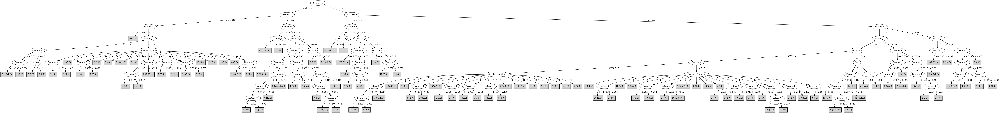

# J48

# SimpleCart Decision Tree

Feature_0 < -3.7375

* Feature_4 < -1.025

*   * Feature_7 < 0.39: 8(5.0/2.0)

*   * Feature_7 >= 0.39: 7(31.0/0.0)

* Feature_4 >= -1.025

*   * Feature_0 < -4.1845

*   *   * Feature_2 < 1.0765

*   *   *   * Feature_3 < -0.5105000000000001

*   *   *   *   * Feature_7 < 0.38249999999999995

*   *   *   *   *   * Feature_1 < 4.3535: 8(6.0/0.0)

*   *   *   *   *   * Feature_1 >= 4.3535: 9(3.0/1.0)

*   *   *   *   * Feature_7 >= 0.38249999999999995: 7(8.0/0.0)

*   *   *   * Feature_3 >= -0.5105000000000001

*   *   *   *   * Feature_1 < 0.4675: 0(3.0/0.0)

*   *   *   *   * Feature_1 >= 0.4675

*   *   *   *   *   * Feature_5 < -0.396: 1(3.0/0.0)

*   *   *   *   *   * Feature_5 >= -0.396

*   *   *   *   *   *   * Feature_0 < -4.3175: 9(38.0/0.0)

*   *   *   *   *   *   * Feature_0 >= -4.3175

*   *   *   *   *   *   *   * Feature_2 < -0.0355: 2(1.0/2.0)

*   *   *   *   *   *   *   * Feature_2 >= -0.0355: 9(4.0/0.0)

*   *   * Feature_2 >= 1.0765: 0(10.0/0.0)

*   * Feature_0 >= -4.1845

*   *   * Feature_3 < 1.0065

*   *   *   * Feature_1 < 3.5934999999999997

*   *   *   *   * Feature_1 < 1.883: 10(3.0/4.0)

*   *   *   *   * Feature_1 >= 1.883: 8(42.0/10.0)

*   *   *   * Feature_1 >= 3.5934999999999997

*   *   *   *   * Feature_3 < -0.096: 7(11.0/0.0)

*   *   *   *   * Feature_3 >= -0.096: 8(3.0/1.0)

*   *   * Feature_3 >= 1.0065

*   *   *   * Feature_1 < 0.927: 0(6.0/0.0)

*   *   *   * Feature_1 >= 0.927

*   *   *   *   * Feature_2 < 0.21200000000000002: 9(10.0/5.0)

*   *   *   *   * Feature_2 >= 0.21200000000000002: 1(6.0/0.0)

Feature_0 >= -3.7375

* Feature_1 < 0.7685

*   * Feature_1 < -0.1235: 0(33.0/0.0)

*   * Feature_1 >= -0.1235

*   *   * Feature_0 < -2.863

*   *   *   * Feature_3 < 1.489

*   *   *   *   * Feature_3 < 0.5405: 10(2.0/1.0)

*   *   *   *   * Feature_3 >= 0.5405: 1(24.0/1.0)

*   *   *   * Feature_3 >= 1.489

*   *   *   *   * Feature_1 < 0.48750000000000004: 0(10.0/0.0)

*   *   *   *   * Feature_1 >= 0.48750000000000004: 1(4.0/1.0)

*   *   * Feature_0 >= -2.863

*   *   *   * Feature_5 < 1.233: 2(18.0/3.0)

*   *   *   * Feature_5 >= 1.233: 1(16.0/1.0)

* Feature_1 >= 0.7685

*   * Feature_0 < -2.317

*   *   * Feature_1 < 2.0235

*   *   *   * Feature_3 < 1.0194999999999999

*   *   *   *   * Feature_0 < -2.9065000000000003

*   *   *   *   *   * Feature_9 < 0.552

*   *   *   *   *   *   * Feature_2 < -1.169: 8(3.0/0.0)

*   *   *   *   *   *   * Feature_2 >= -1.169: 10(27.0/3.0)

*   *   *   *   *   * Feature_9 >= 0.552

*   *   *   *   *   *   * Feature_1 < 1.7855: 3(5.0/0.0)

*   *   *   *   *   *   * Feature_1 >= 1.7855: 5(6.0/0.0)

*   *   *   *   * Feature_0 >= -2.9065000000000003

*   *   *   *   *   * Feature_2 < -0.8160000000000001

*   *   *   *   *   *   * Feature_5 < 0.25849999999999995: 3(8.0/0.0)

*   *   *   *   *   *   * Feature_5 >= 0.25849999999999995: 2(5.0/2.0)

*   *   *   *   *   * Feature_2 >= -0.8160000000000001

*   *   *   *   *   *   * Feature_8 < -1.0225: 10(5.0/0.0)

*   *   *   *   *   *   * Feature_8 >= -1.0225

*   *   *   *   *   *   *   * Feature_6 < -0.21500000000000002

*   *   *   *   *   *   *   *   * Feature_3 < 0.387: 4(5.0/0.0)

*   *   *   *   *   *   *   *   * Feature_3 >= 0.387: 5(3.0/2.0)

*   *   *   *   *   *   *   * Feature_6 >= -0.21500000000000002

*   *   *   *   *   *   *   *   * Feature_1 < 1.0615: 10(2.0/1.0)

*   *   *   *   *   *   *   *   * Feature_1 >= 1.0615: 5(24.0/0.0)

*   *   *   * Feature_3 >= 1.0194999999999999

*   *   *   *   * Sex=(1)

*   *   *   *   *   * Feature_2 < -0.068: 2(14.0/0.0)

*   *   *   *   *   * Feature_2 >= -0.068: 1(5.0/1.0)

*   *   *   *   * Sex!=(1)

*   *   *   *   *   * Feature_2 < -0.3585

*   *   *   *   *   *   * Feature_7 < 0.9484999999999999

*   *   *   *   *   *   *   * Speaker_Number=(2): 8(4.0/0.0)

*   *   *   *   *   *   *   * Speaker_Number!=(2)

*   *   *   *   *   *   *   *   * Feature_3 < 1.5154999999999998: 1(2.0/2.0)

*   *   *   *   *   *   *   *   * Feature_3 >= 1.5154999999999998: 9(3.0/0.0)

*   *   *   *   *   *   * Feature_7 >= 0.9484999999999999: 10(4.0/0.0)

*   *   *   *   *   * Feature_2 >= -0.3585

*   *   *   *   *   *   * Feature_0 < -3.361: 7(4.0/0.0)

*   *   *   *   *   *   * Feature_0 >= -3.361: 6(11.0/0.0)

*   *   * Feature_1 >= 2.0235

*   *   *   * Feature_0 < -3.0069999999999997

*   *   *   *   * Feature_9 < 0.1475

*   *   *   *   *   * Feature_3 < -0.59: 7(6.0/1.0)

*   *   *   *   *   * Feature_3 >= -0.59

*   *   *   *   *   *   * Feature_1 < 2.6340000000000003

*   *   *   *   *   *   *   * Feature_2 < -0.7064999999999999

*   *   *   *   *   *   *   *   * Speaker_Number=(12)|(9)|(7)|(1)|(2)|(3)|(4)|(5)|(6)|(8)|(10)|(11)|(13)|(14): 10(2.0/1.0)

*   *   *   *   *   *   *   *   * Speaker_Number!=(12)|(9)|(7)|(1)|(2)|(3)|(4)|(5)|(6)|(8)|(10)|(11)|(13)|(14): 5(3.0/0.0)

*   *   *   *   *   *   *   * Feature_2 >= -0.7064999999999999: 6(7.0/1.0)

*   *   *   *   *   *   * Feature_1 >= 2.6340000000000003: 6(30.0/0.0)

*   *   *   *   * Feature_9 >= 0.1475

*   *   *   *   *   * Feature_2 < -0.8565: 4(5.0/2.0)

*   *   *   *   *   * Feature_2 >= -0.8565: 10(12.0/1.0)

*   *   *   * Feature_0 >= -3.0069999999999997

*   *   *   *   * Feature_4 < -0.481

*   *   *   *   *   * Feature_8 < -0.976: 5(5.0/2.0)

*   *   *   *   *   * Feature_8 >= -0.976

*   *   *   *   *   *   * Feature_7 < 1.3615: 4(43.0/5.0)

*   *   *   *   *   *   * Feature_7 >= 1.3615: 6(3.0/0.0)

*   *   *   *   * Feature_4 >= -0.481

*   *   *   *   *   * Feature_2 < -1.335: 4(3.0/2.0)

*   *   *   *   *   * Feature_2 >= -1.335: 5(13.0/1.0)

*   * Feature_0 >= -2.317

*   *   * Feature_7 < 0.34199999999999997: 3(33.0/2.0)

*   *   * Feature_7 >= 0.34199999999999997

*   *   *   * Feature_1 < 1.1179999999999999: 2(11.0/1.0)

*   *   *   * Feature_1 >= 1.1179999999999999

*   *   *   *   * Feature_2 < -0.806: 3(6.0/0.0)

*   *   *   *   * Feature_2 >= -0.806

*   *   *   *   *   * Feature_3 < 1.488: 5(6.0/0.0)

*   *   *   *   *   * Feature_3 >= 1.488: 4(3.0/0.0)

# PART

Decision list:

conditions|predicted class
---|---
Feature_0 <= -3.53 AND Feature_1 > 2.236 AND Feature_0 > -4.544 AND Feature_0 <= -3.689 AND Feature_1 > 3.08 AND Feature_7 > 0.383 AND Feature_9 > -0.317| 7 (34.0)
Feature_0 <= -3.53 AND Feature_3 > 0.996 AND Feature_4 > -1.053 AND Feature_1 > 0.632 AND Feature_2 <= 0.996 AND Sex = 0| 9 (21.0/2.0)
Feature_1 <= 1.197 AND Feature_8 <= 0.214 AND Feature_1 <= 0.373 AND Feature_1 <= -0.137| 0 (34.0)
Feature_0 <= -3.53 AND Feature_3 > 1.062 AND Feature_4 > -0.922 AND Feature_8 > -0.34 AND Feature_2 > 0.486| 0 (11.0)
Feature_0 <= -3.53 AND Feature_1 > 2.138 AND Feature_0 <= -4.494| 9 (30.0/3.0)
Feature_1 <= 1.097 AND Feature_8 <= 0.214 AND Feature_1 <= 0.387 AND Feature_0 > -3.371 AND Feature_1 > 0.058| 1 (14.0)
Feature_0 > -3.327 AND Feature_1 <= 1.322 AND Feature_6 > -0.751 AND Feature_1 <= 0.766 AND Feature_8 <= -0.418 AND Feature_1 > 0.217| 1 (14.0)
Feature_0 > -3.327 AND Feature_1 <= 1.322 AND Feature_6 <= -0.751| 6 (8.0)
Feature_0 > -3.327 AND Feature_1 <= 1.322 AND Feature_1 <= 0.305 AND Feature_0 > -2.12| 1 (7.0)
Feature_0 > -3.327 AND Feature_1 > 1.652 AND Feature_0 > -2.411 AND Feature_3 <= 1.245| 3 (22.0/3.0)
Feature_0 > -3.327 AND Feature_1 > 1.652 AND Feature_9 > 0.788 AND Feature_0 > -2.852| 3 (7.0/1.0)
Feature_0 > -3.327 AND Feature_1 > 1.652 AND Feature_0 > -3.012 AND Feature_4 <= -0.484 AND Feature_7 <= 1.192| 4 (60.0/13.0)
Feature_0 <= -3.53 AND Feature_3 <= 1.062 AND Feature_1 > 2.83 AND Feature_0 <= -3.699 AND Feature_3 > -0.096| 8 (26.0/4.0)
Feature_1 > 1.811 AND Feature_0 > -3.689 AND Feature_4 <= -0.159 AND Feature_9 <= -0.29 AND Feature_3 > -0.598| 6 (27.0/2.0)
Feature_0 > -3.327 AND Feature_4 > 0.168 AND Feature_1 <= 1.535 AND Feature_1 > 0.463| 2 (30.0/2.0)
Feature_0 > -3.327 AND Feature_0 > -2.176 AND Feature_1 > 0.819 AND Feature_5 <= 0.518| 3 (22.0)
Feature_1 <= 1.09 AND Feature_0 > -2.544| 2 (18.0/1.0)
Feature_1 <= 0.717 AND Feature_1 <= 0.436| 0 (20.0/2.0)
Feature_1 > 2.85 AND Feature_0 <= -3.337 AND Feature_8 > -1.055| 7 (21.0/2.0)
Feature_0 > -3.482 AND Feature_1 <= 1.021 AND Feature_3 <= 0.597| 10 (8.0)
Feature_0 > -3.482 AND Feature_1 > 1.015 AND Feature_1 > 2.796 AND Feature_9 <= 0.376| 6 (11.0)
Feature_0 > -3.482 AND Feature_6 > -0.353 AND Feature_7 > -0.565 AND Feature_4 <= 0.3 AND Feature_3 <= 0.902 AND Feature_8 > -1.02 AND Feature_0 > -2.92| 5 (35.0/2.0)
Feature_0 <= -3.772 AND Feature_5 <= -0.008 AND Feature_2 > 0.278| 1 (7.0)
Feature_0 <= -3.772 AND Feature_3 <= 1.133 AND Feature_5 > 0.372 AND Feature_3 <= 0.082| 8 (18.0/2.0)
Feature_0 <= -3.772 AND Speaker_Number = 7| 10 (10.0/6.0)
Feature_0 <= -3.772 AND Feature_0 <= -3.941 AND Sex = 1 AND Feature_4 > 0.419| 9 (11.0)
Feature_0 <= -3.772 AND Feature_3 <= 1.139 AND Feature_3 > 0.619| 8 (14.0/1.0)
Speaker_Number = 3| 9 (11.0/6.0)
Feature_9 <= -0.279 AND Feature_0 > -3.818| 10 (34.0/5.0)
Feature_3 <= 0.984 AND Feature_1 <= 1.749 AND Feature_2 <= -0.433| 3 (12.0/2.0)
Feature_3 <= 0.984 AND Feature_2 <= -0.905 AND Feature_3 > -0.092| 5 (15.0/3.0)
Feature_4 <= -0.701 AND Feature_8 <= 0.02| 4 (9.0/5.0)
Feature_4 <= -0.792 AND Feature_1 <= 2.193| 6 (9.0/3.0)
Feature_3 <= 0.984 AND Feature_2 > -1.142 AND Feature_9 > -0.155| 10 (24.0/4.0)
Sex = 1 AND Feature_2 > -1.108 AND Feature_4 > 0.338| 1 (11.0)
Feature_9 <= 0.725 AND Feature_0 > -3.725| 4 (11.0/4.0)
Feature_0 > -3.653| 2 (9.0)
| 7 (8.0/5.0)

# JRip

Decision list:

conditions|predicted class
---|---
(Feature_0 >= -2.316) and (Feature_7 <= 0.336) and (Feature_4 <= 0.223)|3 (32.0/0.0)
(Feature_0 >= -2.795) and (Speaker_Number = 14)|3 (6.0/0.0)
(Feature_0 >= -2.515) and (Feature_1 >= 1.186) and (Feature_2 <= -0.809) and (Feature_1 <= 2.007)|3 (10.0/0.0)
(Feature_1 <= 1.322) and (Feature_0 >= -2.695) and (Feature_1 >= 0.389) and (Feature_4 >= -0.518) and (Feature_3 >= 0.024)|2 (30.0/0.0)
(Feature_1 <= 1.81) and (Feature_5 <= 0.949) and (Feature_2 <= -0.947) and (Sex = 0)|2 (9.0/0.0)
(Feature_9 >= 0.45) and (Feature_1 <= 1.81) and (Feature_2 <= 0.241) and (Feature_7 <= -0.211) and (Feature_4 <= 0.355)|2 (12.0/0.0)
(Feature_1 <= 2.628) and (Feature_3 <= 1.015) and (Feature_0 <= -2.907) and (Feature_0 >= -3.756) and (Feature_2 >= -0.851) and (Feature_4 >= -0.508) and (Feature_1 >= 1.292) and (Feature_5 >= 0.057)|10 (31.0/0.0)
(Feature_1 <= 2.069) and (Feature_0 <= -2.704) and (Feature_3 <= 0.132) and (Feature_5 <= 0.402)|10 (10.0/0.0)
(Feature_7 >= 0.673) and (Feature_1 <= 1.795) and (Feature_1 >= 0.917) and (Feature_2 <= -0.817) and (Feature_0 >= -3.032)|10 (9.0/0.0)
(Feature_1 <= 1.547) and (Feature_3 <= 0.568) and (Feature_2 >= -0.459) and (Feature_2 <= 0.267) and (Feature_8 <= 0.387)|10 (6.0/0.0)
(Feature_1 <= 0.766) and (Feature_1 >= 0.043) and (Feature_0 >= -3.518) and (Feature_2 <= -0.209) and (Feature_5 <= 1.99)|1 (38.0/0.0)
(Feature_4 >= 0.45) and (Feature_5 <= 0.495) and (Feature_1 <= 2.138)|1 (13.0/0.0)
(Feature_0 >= -3.587) and (Feature_0 <= -3.024) and (Feature_1 >= 2.374) and (Feature_1 <= 3.014) and (Feature_6 >= -0.229)|6 (21.0/0.0)
(Feature_0 >= -3.587) and (Feature_1 >= 3.076) and (Feature_0 <= -2.776) and (Feature_6 <= 0.764)|6 (18.0/0.0)
(Feature_6 <= -0.527) and (Feature_0 >= -3.24) and (Feature_2 >= -0.09)|6 (14.0/0.0)
(Feature_0 >= -3.074) and (Feature_1 >= 2.023) and (Feature_8 >= -0.396) and (Feature_4 >= -1.223) and (Feature_3 >= -0.528)|4 (34.0/0.0)
(Feature_0 >= -3.018) and (Feature_1 >= 1.802) and (Feature_3 <= -0.105) and (Feature_0 <= -2.601) and (Sex = 1)|4 (10.0/0.0)
(Feature_4 <= -1.169) and (Feature_0 >= -2.635)|4 (7.0/0.0)
(Feature_0 >= -2.967) and (Feature_1 >= 2.725) and (Feature_5 >= 0.97)|4 (5.0/0.0)
(Feature_1 <= 0.508) and (Feature_3 >= 0.739)|0 (47.0/0.0)
(Feature_2 >= 1.089) and (Sex = 1)|0 (10.0/0.0)
(Feature_1 <= 0.209) and (Feature_6 >= 0.535)|0 (6.0/0.0)
(Feature_1 >= 3.049) and (Feature_7 >= 0.531) and (Feature_9 >= -0.306)|7 (33.0/0.0)
(Feature_1 >= 3.111) and (Feature_6 >= 0.618) and (Feature_3 <= -0.603)|7 (11.0/0.0)
(Feature_4 <= -1.166) and (Feature_3 >= 0.988) and (Feature_2 >= -0.446)|7 (9.0/0.0)
(Feature_1 >= 3.689) and (Feature_0 >= -4.103) and (Feature_9 >= -0.519)|7 (8.0/0.0)
(Feature_0 <= -4.683)|9 (26.0/0.0)
(Feature_0 <= -3.985) and (Feature_3 >= 0.552) and (Feature_9 <= 0.278) and (Feature_1 <= 2.499)|9 (16.0/0.0)
(Feature_0 <= -4.145) and (Feature_9 <= -0.781)|9 (10.0/0.0)
(Feature_5 >= 1.275)|9 (17.0/10.0)
(Feature_0 <= -3.775) and (Feature_7 >= 0.084) and (Feature_6 <= 0.224)|8 (27.0/0.0)
(Feature_0 <= -3.818) and (Feature_3 <= 0.732) and (Feature_3 >= -0.152) and (Feature_1 >= 2.193)|8 (20.0/0.0)
(Feature_0 <= -3.857) and (Feature_4 >= 0.288) and (Feature_6 >= -0.566) and (Feature_0 >= -4.235)|8 (8.0/0.0)
|5 (130.0/65.0)

# Decision Table

Non matches covered by Majority class

sex|feature_0|feature_1|feature_3|feature_4|target
---|---|---|---|---|---
1|(-3.525--2.94]|(1.387-2.1395]|(1.0715-inf)|(0.284-inf)|0
1|(-4.517--3.7375]|(2.1395-3.0655]|(1.0715-inf)|(0.284-inf)|9
0|(-2.94--2.3265]|(0.7165-1.387]|(1.0715-inf)|(0.284-inf)|0
1|(-3.7375--3.525]|(1.387-2.1395]|(1.0715-inf)|(0.284-inf)|0
1|(-3.525--2.94]|(2.1395-3.0655]|(0.149-1.0715]|(0.284-inf)|10
1|(-2.94--2.3265]|(0.7165-1.387]|(1.0715-inf)|(0.284-inf)|2
0|(-4.517--3.7375]|(3.0655-inf)|(0.149-1.0715]|(0.284-inf)|0
1|(-2.3265--1.682]|(0.38-0.7165]|(1.0715-inf)|(0.284-inf)|0
1|(-3.525--2.94]|(0.7165-1.387]|(1.0715-inf)|(0.284-inf)|1
1|(-inf--4.517]|(3.0655-inf)|(0.149-1.0715]|(0.284-inf)|9
1|(-4.517--3.7375]|(1.387-2.1395]|(1.0715-inf)|(0.284-inf)|1
1|(-2.94--2.3265]|(1.387-2.1395]|(1.0715-inf)|(-0.7345-0.284]|0
0|(-2.3265--1.682]|(0.7165-1.387]|(0.149-1.0715]|(0.284-inf)|2
0|(-3.525--2.94]|(1.387-2.1395]|(0.149-1.0715]|(0.284-inf)|10
1|(-2.3265--1.682]|(2.1395-3.0655]|(0.149-1.0715]|(-0.7345-0.284]|3
1|(-2.94--2.3265]|(0.38-0.7165]|(1.0715-inf)|(0.284-inf)|2
1|(-4.517--3.7375]|(2.1395-3.0655]|(0.149-1.0715]|(0.284-inf)|9
1|(-3.7375--3.525]|(0.7165-1.387]|(1.0715-inf)|(0.284-inf)|0
1|(-3.525--2.94]|(3.0655-inf)|(0.149-1.0715]|(-0.7345-0.284]|6
0|(-2.94--2.3265]|(2.1395-3.0655]|(0.149-1.0715]|(-0.7345-0.284]|0
1|(-3.525--2.94]|(2.1395-3.0655]|(-inf-0.149]|(0.284-inf)|0
1|(-4.517--3.7375]|(0.7165-1.387]|(1.0715-inf)|(0.284-inf)|1
1|(-2.94--2.3265]|(2.1395-3.0655]|(0.149-1.0715]|(-0.7345-0.284]|5
1|(-4.517--3.7375]|(3.0655-inf)|(-inf-0.149]|(0.284-inf)|7
0|(-2.3265--1.682]|(1.387-2.1395]|(-inf-0.149]|(0.284-inf)|0
1|(-3.7375--3.525]|(3.0655-inf)|(0.149-1.0715]|(-0.7345-0.284]|6
0|(-2.3265--1.682]|(0.7165-1.387]|(1.0715-inf)|(-0.7345-0.284]|0
0|(-4.517--3.7375]|(2.1395-3.0655]|(1.0715-inf)|(-0.7345-0.284]|9
1|(-3.525--2.94]|(1.387-2.1395]|(1.0715-inf)|(-0.7345-0.284]|2
1|(-3.525--2.94]|(0.38-0.7165]|(1.0715-inf)|(0.284-inf)|1
0|(-2.94--2.3265]|(0.7165-1.387]|(0.149-1.0715]|(0.284-inf)|2
1|(-inf--4.517]|(0.7165-1.387]|(1.0715-inf)|(0.284-inf)|0
0|(-2.94--2.3265]|(0.7165-1.387]|(1.0715-inf)|(-0.7345-0.284]|0
0|(-3.7375--3.525]|(3.0655-inf)|(1.0715-inf)|(-inf--0.7345]|0
0|(-3.525--2.94]|(0.7165-1.387]|(0.149-1.0715]|(0.284-inf)|2
1|(-4.517--3.7375]|(3.0655-inf)|(0.149-1.0715]|(-0.7345-0.284]|0
0|(-3.7375--3.525]|(1.387-2.1395]|(1.0715-inf)|(-0.7345-0.284]|9
1|(-2.3265--1.682]|(1.387-2.1395]|(0.149-1.0715]|(-0.7345-0.284]|0
0|(-1.682-inf)|(1.387-2.1395]|(1.0715-inf)|(-inf--0.7345]|0
1|(-2.94--2.3265]|(3.0655-inf)|(-inf-0.149]|(-0.7345-0.284]|6
0|(-2.94--2.3265]|(2.1395-3.0655]|(1.0715-inf)|(-inf--0.7345]|6
0|(-1.682-inf)|(0.38-0.7165]|(1.0715-inf)|(-0.7345-0.284]|0
1|(-4.517--3.7375]|(1.387-2.1395]|(0.149-1.0715]|(0.284-inf)|8
0|(-4.517--3.7375]|(3.0655-inf)|(0.149-1.0715]|(-0.7345-0.284]|8
1|(-inf--4.517]|(2.1395-3.0655]|(1.0715-inf)|(-0.7345-0.284]|0
1|(-3.525--2.94]|(2.1395-3.0655]|(0.149-1.0715]|(-0.7345-0.284]|10
0|(-2.3265--1.682]|(1.387-2.1395]|(0.149-1.0715]|(-0.7345-0.284]|3
0|(-inf--4.517]|(2.1395-3.0655]|(1.0715-inf)|(-0.7345-0.284]|0
1|(-inf--4.517]|(3.0655-inf)|(-inf-0.149]|(0.284-inf)|8
0|(-2.94--2.3265]|(3.0655-inf)|(0.149-1.0715]|(-inf--0.7345]|0
1|(-3.7375--3.525]|(2.1395-3.0655]|(0.149-1.0715]|(-0.7345-0.284]|0
0|(-4.517--3.7375]|(1.387-2.1395]|(1.0715-inf)|(-0.7345-0.284]|9
0|(-1.682-inf)|(0.7165-1.387]|(0.149-1.0715]|(-0.7345-0.284]|2
1|(-1.682-inf)|(0.7165-1.387]|(0.149-1.0715]|(-0.7345-0.284]|0
1|(-3.525--2.94]|(0.7165-1.387]|(1.0715-inf)|(-0.7345-0.284]|2
0|(-2.3265--1.682]|(0.7165-1.387]|(-inf-0.149]|(0.284-inf)|2
1|(-4.517--3.7375]|(2.1395-3.0655]|(-inf-0.149]|(0.284-inf)|8
0|(-2.3265--1.682]|(-inf--0.1235]|(1.0715-inf)|(0.284-inf)|0
1|(-2.3265--1.682]|(2.1395-3.0655]|(-inf-0.149]|(-0.7345-0.284]|3
1|(-2.3265--1.682]|(0.38-0.7165]|(1.0715-inf)|(-0.7345-0.284]|0
1|(-3.525--2.94]|(-0.1235-0.38]|(1.0715-inf)|(0.284-inf)|1
0|(-3.525--2.94]|(0.7165-1.387]|(1.0715-inf)|(-0.7345-0.284]|0
1|(-4.517--3.7375]|(3.0655-inf)|(1.0715-inf)|(-inf--0.7345]|0
0|(-3.525--2.94]|(3.0655-inf)|(-inf-0.149]|(-0.7345-0.284]|6
0|(-2.3265--1.682]|(1.387-2.1395]|(1.0715-inf)|(-inf--0.7345]|4
1|(-inf--4.517]|(3.0655-inf)|(0.149-1.0715]|(-0.7345-0.284]|9
1|(-4.517--3.7375]|(1.387-2.1395]|(1.0715-inf)|(-0.7345-0.284]|1
0|(-inf--4.517]|(3.0655-inf)|(0.149-1.0715]|(-0.7345-0.284]|9
0|(-2.94--2.3265]|(0.38-0.7165]|(0.149-1.0715]|(0.284-inf)|1
1|(-2.94--2.3265]|(1.387-2.1395]|(0.149-1.0715]|(-0.7345-0.284]|3
1|(-3.525--2.94]|(3.0655-inf)|(-inf-0.149]|(-0.7345-0.284]|7
0|(-2.94--2.3265]|(1.387-2.1395]|(0.149-1.0715]|(-0.7345-0.284]|5
0|(-4.517--3.7375]|(3.0655-inf)|(1.0715-inf)|(-inf--0.7345]|7
0|(-3.525--2.94]|(0.38-0.7165]|(0.149-1.0715]|(0.284-inf)|0
0|(-3.7375--3.525]|(2.1395-3.0655]|(1.0715-inf)|(-inf--0.7345]|0
0|(-2.94--2.3265]|(-inf--0.1235]|(1.0715-inf)|(0.284-inf)|0
1|(-2.3265--1.682]|(0.7165-1.387]|(0.149-1.0715]|(-0.7345-0.284]|0
0|(-3.7375--3.525]|(0.7165-1.387]|(1.0715-inf)|(-0.7345-0.284]|1
0|(-3.525--2.94]|(1.387-2.1395]|(0.149-1.0715]|(-0.7345-0.284]|10
1|(-2.94--2.3265]|(0.38-0.7165]|(1.0715-inf)|(-0.7345-0.284]|2
0|(-2.94--2.3265]|(1.387-2.1395]|(1.0715-inf)|(-inf--0.7345]|6
1|(-4.517--3.7375]|(2.1395-3.0655]|(0.149-1.0715]|(-0.7345-0.284]|8
0|(-4.517--3.7375]|(2.1395-3.0655]|(0.149-1.0715]|(-0.7345-0.284]|10
1|(-inf--4.517]|(1.387-2.1395]|(1.0715-inf)|(-0.7345-0.284]|0
0|(-2.3265--1.682]|(0.7165-1.387]|(0.149-1.0715]|(-0.7345-0.284]|2
1|(-inf--4.517]|(2.1395-3.0655]|(-inf-0.149]|(0.284-inf)|9
0|(-2.94--2.3265]|(0.38-0.7165]|(1.0715-inf)|(-0.7345-0.284]|6
1|(-3.7375--3.525]|(-0.1235-0.38]|(1.0715-inf)|(0.284-inf)|0
1|(-3.525--2.94]|(1.387-2.1395]|(0.149-1.0715]|(-0.7345-0.284]|5
0|(-2.94--2.3265]|(2.1395-3.0655]|(-inf-0.149]|(-0.7345-0.284]|4
0|(-inf--4.517]|(1.387-2.1395]|(1.0715-inf)|(-0.7345-0.284]|0
1|(-2.94--2.3265]|(-inf--0.1235]|(1.0715-inf)|(0.284-inf)|0
1|(-3.7375--3.525]|(3.0655-inf)|(-inf-0.149]|(-0.7345-0.284]|7
1|(-2.94--2.3265]|(2.1395-3.0655]|(-inf-0.149]|(-0.7345-0.284]|5
0|(-4.517--3.7375]|(-0.1235-0.38]|(1.0715-inf)|(0.284-inf)|0
1|(-3.525--2.94]|(-inf--0.1235]|(1.0715-inf)|(0.284-inf)|0
0|(-3.7375--3.525]|(1.387-2.1395]|(0.149-1.0715]|(-0.7345-0.284]|10
1|(-4.517--3.7375]|(1.387-2.1395]|(-inf-0.149]|(0.284-inf)|10
1|(-2.94--2.3265]|(-0.1235-0.38]|(0.149-1.0715]|(0.284-inf)|1
1|(-2.94--2.3265]|(0.7165-1.387]|(0.149-1.0715]|(-0.7345-0.284]|3
0|(-4.517--3.7375]|(3.0655-inf)|(-inf-0.149]|(-0.7345-0.284]|7
1|(-4.517--3.7375]|(0.7165-1.387]|(1.0715-inf)|(-0.7345-0.284]|0
0|(-2.94--2.3265]|(2.1395-3.0655]|(0.149-1.0715]|(-inf--0.7345]|4
0|(-3.525--2.94]|(2.1395-3.0655]|(-inf-0.149]|(-0.7345-0.284]|6
0|(-3.525--2.94]|(-inf--0.1235]|(1.0715-inf)|(0.284-inf)|0
0|(-inf--4.517]|(2.1395-3.0655]|(0.149-1.0715]|(-0.7345-0.284]|9
0|(-2.94--2.3265]|(-0.1235-0.38]|(0.149-1.0715]|(0.284-inf)|1
0|(-3.525--2.94]|(0.38-0.7165]|(1.0715-inf)|(-0.7345-0.284]|1
0|(-3.525--2.94]|(1.387-2.1395]|(1.0715-inf)|(-inf--0.7345]|8
0|(-1.682-inf)|(0.38-0.7165]|(0.149-1.0715]|(-0.7345-0.284]|1
0|(-4.517--3.7375]|(2.1395-3.0655]|(1.0715-inf)|(-inf--0.7345]|7
0|(-2.3265--1.682]|(1.387-2.1395]|(-inf-0.149]|(-0.7345-0.284]|3
1|(-4.517--3.7375]|(-0.1235-0.38]|(1.0715-inf)|(0.284-inf)|0
1|(-3.525--2.94]|(2.1395-3.0655]|(-inf-0.149]|(-0.7345-0.284]|6
0|(-4.517--3.7375]|(0.7165-1.387]|(1.0715-inf)|(-0.7345-0.284]|9
1|(-2.94--2.3265]|(2.1395-3.0655]|(0.149-1.0715]|(-inf--0.7345]|4
1|(-4.517--3.7375]|(3.0655-inf)|(-inf-0.149]|(-0.7345-0.284]|7
0|(-2.94--2.3265]|(0.7165-1.387]|(0.149-1.0715]|(-0.7345-0.284]|5
1|(-4.517--3.7375]|(1.387-2.1395]|(0.149-1.0715]|(-0.7345-0.284]|8
0|(-2.3265--1.682]|(0.38-0.7165]|(0.149-1.0715]|(-0.7345-0.284]|2
1|(-3.7375--3.525]|(2.1395-3.0655]|(-inf-0.149]|(-0.7345-0.284]|0
0|(-3.7375--3.525]|(0.38-0.7165]|(1.0715-inf)|(-0.7345-0.284]|0
1|(-3.525--2.94]|(0.7165-1.387]|(0.149-1.0715]|(-0.7345-0.284]|3
0|(-inf--4.517]|(3.0655-inf)|(-inf-0.149]|(-0.7345-0.284]|0
0|(-1.682-inf)|(-inf--0.1235]|(1.0715-inf)|(-0.7345-0.284]|0
1|(-3.525--2.94]|(-0.1235-0.38]|(0.149-1.0715]|(0.284-inf)|1
0|(-inf--4.517]|(0.7165-1.387]|(1.0715-inf)|(-0.7345-0.284]|9
0|(-4.517--3.7375]|(1.387-2.1395]|(0.149-1.0715]|(-0.7345-0.284]|0
0|(-2.94--2.3265]|(3.0655-inf)|(-inf-0.149]|(-inf--0.7345]|4
0|(-2.94--2.3265]|(1.387-2.1395]|(-inf-0.149]|(-0.7345-0.284]|5
1|(-inf--4.517]|(0.7165-1.387]|(1.0715-inf)|(-0.7345-0.284]|0
1|(-4.517--3.7375]|(3.0655-inf)|(0.149-1.0715]|(-inf--0.7345]|7
1|(-2.94--2.3265]|(1.387-2.1395]|(-inf-0.149]|(-0.7345-0.284]|5
0|(-3.7375--3.525]|(1.387-2.1395]|(1.0715-inf)|(-inf--0.7345]|8
1|(-inf--4.517]|(3.0655-inf)|(-inf-0.149]|(-0.7345-0.284]|9
0|(-3.525--2.94]|(0.7165-1.387]|(0.149-1.0715]|(-0.7345-0.284]|0
0|(-2.94--2.3265]|(0.7165-1.387]|(1.0715-inf)|(-inf--0.7345]|6
0|(-2.3265--1.682]|(1.387-2.1395]|(0.149-1.0715]|(-inf--0.7345]|3
0|(-4.517--3.7375]|(3.0655-inf)|(0.149-1.0715]|(-inf--0.7345]|0
0|(-3.525--2.94]|(2.1395-3.0655]|(0.149-1.0715]|(-inf--0.7345]|5
1|(-3.7375--3.525]|(-inf--0.1235]|(1.0715-inf)|(0.284-inf)|0
1|(-3.525--2.94]|(2.1395-3.0655]|(0.149-1.0715]|(-inf--0.7345]|0
1|(-1.682-inf)|(0.7165-1.387]|(-inf-0.149]|(-0.7345-0.284]|3
0|(-inf--4.517]|(3.0655-inf)|(0.149-1.0715]|(-inf--0.7345]|0
0|(-3.525--2.94]|(3.0655-inf)|(-inf-0.149]|(-inf--0.7345]|6
1|(-3.7375--3.525]|(2.1395-3.0655]|(0.149-1.0715]|(-inf--0.7345]|0
0|(-2.3265--1.682]|(0.7165-1.387]|(-inf-0.149]|(-0.7345-0.284]|2
1|(-2.94--2.3265]|(1.387-2.1395]|(0.149-1.0715]|(-inf--0.7345]|0
0|(-3.7375--3.525]|(0.7165-1.387]|(0.149-1.0715]|(-0.7345-0.284]|10
1|(-4.517--3.7375]|(0.38-0.7165]|(1.0715-inf)|(-0.7345-0.284]|0
0|(-4.517--3.7375]|(2.1395-3.0655]|(-inf-0.149]|(-0.7345-0.284]|0
1|(-3.525--2.94]|(3.0655-inf)|(-inf-0.149]|(-inf--0.7345]|0
0|(-4.517--3.7375]|(-inf--0.1235]|(1.0715-inf)|(0.284-inf)|0
0|(-inf--4.517]|(1.387-2.1395]|(0.149-1.0715]|(-0.7345-0.284]|0
1|(-3.7375--3.525]|(0.7165-1.387]|(0.149-1.0715]|(-0.7345-0.284]|3
0|(-2.94--2.3265]|(0.38-0.7165]|(0.149-1.0715]|(-0.7345-0.284]|2
0|(-2.94--2.3265]|(1.387-2.1395]|(0.149-1.0715]|(-inf--0.7345]|4
0|(-3.525--2.94]|(0.7165-1.387]|(1.0715-inf)|(-inf--0.7345]|7
0|(-3.525--2.94]|(-0.1235-0.38]|(1.0715-inf)|(-0.7345-0.284]|0
1|(-4.517--3.7375]|(2.1395-3.0655]|(-inf-0.149]|(-0.7345-0.284]|8
0|(-3.525--2.94]|(1.387-2.1395]|(-inf-0.149]|(-0.7345-0.284]|10
0|(-3.7375--3.525]|(-0.1235-0.38]|(1.0715-inf)|(-0.7345-0.284]|0
0|(-2.94--2.3265]|(-inf--0.1235]|(1.0715-inf)|(-0.7345-0.284]|0
1|(-3.7375--3.525]|(3.0655-inf)|(-inf-0.149]|(-inf--0.7345]|6
1|(-3.525--2.94]|(1.387-2.1395]|(0.149-1.0715]|(-inf--0.7345]|5
0|(-3.525--2.94]|(0.38-0.7165]|(0.149-1.0715]|(-0.7345-0.284]|1
0|(-3.7375--3.525]|(0.7165-1.387]|(1.0715-inf)|(-inf--0.7345]|7
0|(-4.517--3.7375]|(2.1395-3.0655]|(0.149-1.0715]|(-inf--0.7345]|8
1|(-2.94--2.3265]|(2.1395-3.0655]|(-inf-0.149]|(-inf--0.7345]|4
0|(-2.94--2.3265]|(0.7165-1.387]|(-inf-0.149]|(-0.7345-0.284]|5
0|(-3.525--2.94]|(1.387-2.1395]|(0.149-1.0715]|(-inf--0.7345]|6
0|(-4.517--3.7375]|(0.7165-1.387]|(0.149-1.0715]|(-0.7345-0.284]|9
0|(-4.517--3.7375]|(-0.1235-0.38]|(0.149-1.0715]|(0.284-inf)|0
0|(-2.94--2.3265]|(2.1395-3.0655]|(-inf-0.149]|(-inf--0.7345]|4
1|(-2.94--2.3265]|(0.7165-1.387]|(-inf-0.149]|(-0.7345-0.284]|10
0|(-3.525--2.94]|(-inf--0.1235]|(1.0715-inf)|(-0.7345-0.284]|0
0|(-4.517--3.7375]|(-0.1235-0.38]|(1.0715-inf)|(-0.7345-0.284]|0
1|(-3.7375--3.525]|(-inf--0.1235]|(0.149-1.0715]|(0.284-inf)|0
1|(-3.525--2.94]|(0.7165-1.387]|(-inf-0.149]|(-0.7345-0.284]|0
0|(-2.94--2.3265]|(0.7165-1.387]|(0.149-1.0715]|(-inf--0.7345]|10
0|(-1.682-inf)|(-inf--0.1235]|(0.149-1.0715]|(-0.7345-0.284]|0
0|(-2.3265--1.682]|(0.38-0.7165]|(-inf-0.149]|(-0.7345-0.284]|2
0|(-inf--4.517]|(2.1395-3.0655]|(0.149-1.0715]|(-inf--0.7345]|9
1|(-3.525--2.94]|(2.1395-3.0655]|(-inf-0.149]|(-inf--0.7345]|6
0|(-3.7375--3.525]|(1.387-2.1395]|(0.149-1.0715]|(-inf--0.7345]|8
0|(-3.525--2.94]|(2.1395-3.0655]|(-inf-0.149]|(-inf--0.7345]|6
0|(-4.517--3.7375]|(3.0655-inf)|(-inf-0.149]|(-inf--0.7345]|7
1|(-4.517--3.7375]|(3.0655-inf)|(-inf-0.149]|(-inf--0.7345]|7
0|(-2.3265--1.682]|(-inf--0.1235]|(0.149-1.0715]|(-0.7345-0.284]|0
0|(-3.7375--3.525]|(-inf--0.1235]|(1.0715-inf)|(-0.7345-0.284]|0
1|(-4.517--3.7375]|(1.387-2.1395]|(0.149-1.0715]|(-inf--0.7345]|0
0|(-4.517--3.7375]|(1.387-2.1395]|(0.149-1.0715]|(-inf--0.7345]|8
0|(-3.525--2.94]|(-0.1235-0.38]|(0.149-1.0715]|(-0.7345-0.284]|1
0|(-1.682-inf)|(-0.1235-0.38]|(-inf-0.149]|(-0.7345-0.284]|1
0|(-2.3265--1.682]|(-0.1235-0.38]|(-inf-0.149]|(-0.7345-0.284]|1
0|(-2.94--2.3265]|(-inf--0.1235]|(0.149-1.0715]|(-0.7345-0.284]|0
0|(-4.517--3.7375]|(0.7165-1.387]|(0.149-1.0715]|(-inf--0.7345]|0

