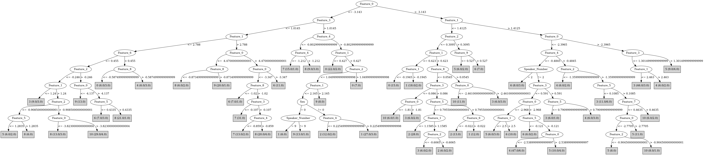

# J48

# SimpleCart Decision Tree

Feature_0 < -3.669

* Feature_4 < -1.025

*   * Feature_1 < 2.041: 8(3.0/0.0)

*   * Feature_1 >= 2.041: 7(29.0/1.0)

* Feature_4 >= -1.025

*   * Feature_0 < -4.2105

*   *   * Feature_2 < 1.036

*   *   *   * Feature_3 < -0.607

*   *   *   *   * Feature_8 < -1.1935: 8(4.0/0.0)

*   *   *   *   * Feature_8 >= -1.1935

*   *   *   *   *   * Feature_0 < -4.73: 9(3.0/0.0)

*   *   *   *   *   * Feature_0 >= -4.73: 7(7.0/0.0)

*   *   *   * Feature_3 >= -0.607

*   *   *   *   * Feature_5 < -0.472: 1(5.0/0.0)

*   *   *   *   * Feature_5 >= -0.472: 9(40.0/3.0)

*   *   * Feature_2 >= 1.036: 0(8.0/0.0)

*   * Feature_0 >= -4.2105

*   *   * Feature_3 < 1.0065

*   *   *   * Feature_1 < 3.5955

*   *   *   *   * Feature_1 < 1.907: 10(6.0/5.0)

*   *   *   *   * Feature_1 >= 1.907

*   *   *   *   *   * Feature_8 < -1.4645000000000001: 6(3.0/0.0)

*   *   *   *   *   * Feature_8 >= -1.4645000000000001: 8(44.0/9.0)

*   *   *   * Feature_1 >= 3.5955: 7(11.0/3.0)

*   *   * Feature_3 >= 1.0065

*   *   *   * Feature_1 < 0.927: 0(8.0/1.0)

*   *   *   * Feature_1 >= 0.927

*   *   *   *   * Feature_2 < -0.055499999999999994: 9(10.0/4.0)

*   *   *   *   * Feature_2 >= -0.055499999999999994: 1(7.0/2.0)

Feature_0 >= -3.669

* Feature_1 < 1.1855

*   * Feature_1 < -0.11900000000000001: 0(25.0/0.0)

*   * Feature_1 >= -0.11900000000000001

*   *   * Feature_1 < 0.519

*   *   *   * Feature_3 < 1.518

*   *   *   *   * Feature_1 < 0.423: 1(22.0/1.0)

*   *   *   *   * Feature_1 >= 0.423

*   *   *   *   *   * Speaker_Number=(2)|(0)|(11): 1(6.0/0.0)

*   *   *   *   *   * Speaker_Number!=(2)|(0)|(11): 2(6.0/1.0)

*   *   *   * Feature_3 >= 1.518: 0(5.0/1.0)

*   *   * Feature_1 >= 0.519

*   *   *   * Feature_2 < -0.2915

*   *   *   *   * Feature_0 < -2.894

*   *   *   *   *   * Feature_5 < 0.8885000000000001: 2(8.0/5.0)

*   *   *   *   *   * Feature_5 >= 0.8885000000000001: 1(12.0/0.0)

*   *   *   *   * Feature_0 >= -2.894: 2(30.0/3.0)

*   *   *   * Feature_2 >= -0.2915

*   *   *   *   * Feature_3 < 0.427

*   *   *   *   *   * Feature_0 < -2.3625: 10(13.0/1.0)

*   *   *   *   *   * Feature_0 >= -2.3625: 3(4.0/1.0)

*   *   *   *   * Feature_3 >= 0.427

*   *   *   *   *   * Feature_2 < 0.6065

*   *   *   *   *   *   * Speaker_Number=(14)|(12): 1(5.0/0.0)

*   *   *   *   *   *   * Speaker_Number!=(14)|(12)

*   *   *   *   *   *   *   * Feature_3 < 1.1139999999999999: 8(4.0/2.0)

*   *   *   *   *   *   *   * Feature_3 >= 1.1139999999999999: 2(4.0/0.0)

*   *   *   *   *   * Feature_2 >= 0.6065: 6(7.0/1.0)

* Feature_1 >= 1.1855

*   * Feature_0 < -2.331

*   *   * Feature_1 < 2.0164999999999997

*   *   *   * Feature_9 < 0.078

*   *   *   *   * Feature_0 < -2.8529999999999998

*   *   *   *   *   * Feature_4 < -0.5965: 8(6.0/1.0)

*   *   *   *   *   * Feature_4 >= -0.5965: 10(17.0/3.0)

*   *   *   *   * Feature_0 >= -2.8529999999999998

*   *   *   *   *   * Feature_2 < -0.8825000000000001

*   *   *   *   *   *   * Feature_0 < -2.5010000000000003: 10(6.0/0.0)

*   *   *   *   *   *   * Feature_0 >= -2.5010000000000003: 3(4.0/0.0)

*   *   *   *   *   * Feature_2 >= -0.8825000000000001

*   *   *   *   *   *   * Feature_6 < -0.20550000000000002: 4(6.0/1.0)

*   *   *   *   *   *   * Feature_6 >= -0.20550000000000002: 5(12.0/1.0)

*   *   *   * Feature_9 >= 0.078

*   *   *   *   * Feature_6 < -0.151

*   *   *   *   *   * Sex=(1): 2(10.0/2.0)

*   *   *   *   *   * Sex!=(1)

*   *   *   *   *   *   * Feature_0 < -3.4145: 7(5.0/0.0)

*   *   *   *   *   *   * Feature_0 >= -3.4145: 6(4.0/2.0)

*   *   *   *   * Feature_6 >= -0.151

*   *   *   *   *   * Feature_8 < -0.68

*   *   *   *   *   *   * Feature_8 < -0.9710000000000001: 10(3.0/1.0)

*   *   *   *   *   *   * Feature_8 >= -0.9710000000000001: 5(6.0/0.0)

*   *   *   *   *   * Feature_8 >= -0.68: 3(17.0/5.0)

*   *   * Feature_1 >= 2.0164999999999997

*   *   *   * Feature_0 < -3.005

*   *   *   *   * Feature_4 < -0.20500000000000002

*   *   *   *   *   * Feature_6 < 0.867: 6(31.0/4.0)

*   *   *   *   *   * Feature_6 >= 0.867: 7(5.0/2.0)

*   *   *   *   * Feature_4 >= -0.20500000000000002

*   *   *   *   *   * Feature_2 < -0.8565: 6(3.0/4.0)

*   *   *   *   *   * Feature_2 >= -0.8565: 10(12.0/0.0)

*   *   *   * Feature_0 >= -3.005

*   *   *   *   * Feature_4 < -0.481

*   *   *   *   *   * Feature_7 < 1.286

*   *   *   *   *   *   * Feature_8 < -1.1400000000000001: 5(3.0/0.0)

*   *   *   *   *   *   * Feature_8 >= -1.1400000000000001: 4(44.0/10.0)

*   *   *   *   *   * Feature_7 >= 1.286: 6(6.0/0.0)

*   *   *   *   * Feature_4 >= -0.481

*   *   *   *   *   * Feature_2 < -1.3599999999999999: 4(3.0/2.0)

*   *   *   *   *   * Feature_2 >= -1.3599999999999999: 5(14.0/0.0)

*   * Feature_0 >= -2.331

*   *   * Feature_3 < 1.3014999999999999

*   *   *   * Feature_1 < 2.9185: 3(43.0/0.0)

*   *   *   * Feature_1 >= 2.9185: 4(3.0/0.0)

*   *   * Feature_3 >= 1.3014999999999999

*   *   *   * Feature_0 < -2.1654999999999998: 4(4.0/0.0)

*   *   *   * Feature_0 >= -2.1654999999999998: 5(5.0/0.0)

# PART

Decision list:

conditions|predicted class
---|---
Feature_0 > -3.145 AND Feature_1 > 1.412 AND Feature_0 <= -2.343 AND Feature_3 <= 0.497 AND Feature_4 <= -0.386 AND Feature_0 > -2.967| 4 (50.0/16.0)
Feature_0 <= -3.665 AND Feature_3 <= 1.024 AND Feature_0 > -4.283 AND Feature_1 > 3.035| 7 (40.0/14.0)
Feature_0 > -3.145 AND Feature_1 <= 1.154 AND Feature_1 > -0.204 AND Feature_8 <= 0.214 AND Feature_3 > 0.088 AND Feature_1 > 0.766| 2 (21.0)
Feature_1 <= 0.777 AND Feature_1 <= -0.106| 0 (25.0)
Feature_0 <= -3.639 AND Feature_3 <= 1.024 AND Feature_0 > -4.283 AND Feature_0 <= -3.76| 8 (38.0/13.0)
Feature_0 <= -3.639 AND Feature_9 > 0.526 AND Feature_2 <= 0.643| 1 (15.0/4.0)
Feature_0 <= -3.639| 9 (71.0/33.0)
Feature_1 <= 0.777 AND Feature_2 <= 0.315 AND Feature_0 <= -2.871| 1 (16.0/3.0)
Feature_0 > -2.411 AND Feature_1 > 0.771| 3 (48.0/10.0)
Feature_1 > 1.993 AND Feature_0 <= -2.959 AND Feature_4 <= -0.148| 6 (36.0/8.0)
Feature_6 <= -0.443 AND Sex = 0 AND Feature_0 > -3| 6 (10.0/1.0)
Feature_6 <= -0.443 AND Sex = 1 AND Feature_4 <= 0.377| 2 (12.0)
Feature_1 <= 0.771 AND Feature_8 <= -0.478| 1 (9.0/1.0)
Feature_3 > 1.333 AND Feature_4 > -0.735| 1 (12.0/2.0)
Feature_1 <= 0.771 AND Feature_6 <= 0.134| 2 (8.0)
Feature_7 > 0.577 AND Feature_0 > -3.049 AND Feature_0 <= -2.505| 10 (9.0)
Feature_7 > 0.577| 8 (26.0/16.0)
Feature_4 > -0.019 AND Feature_2 > -0.915| 10 (22.0/5.0)
Speaker_Number = 13| 3 (9.0/3.0)
Feature_3 <= 0.898 AND Feature_9 <= 0.079| 5 (15.0/3.0)
Feature_5 <= 0.709 AND Feature_6 <= 0.048| 3 (10.0/3.0)
Feature_5 <= 0.709| 5 (10.0/3.0)
| 4 (8.0/1.0)

# JRip

Decision list:

conditions|predicted class
---|---
(Feature_1 <= -0.106)|0 (31.0/0.0)
(Feature_2 >= 1.14)|0 (7.0/0.0)
(Feature_1 <= 0.418) and (Feature_0 <= -3.461)|0 (7.0/0.0)
(Feature_0 <= -4.676)|9 (26.0/0.0)
(Feature_0 <= -3.985) and (Feature_3 >= -0.016) and (Feature_8 <= -0.704)|9 (12.0/0.0)
(Feature_0 <= -4.283) and (Sex = 0)|9 (9.0/0.0)
(Feature_9 <= -0.714) and (Feature_3 >= 1.578)|9 (4.0/0.0)
(Feature_0 <= -4.022) and (Feature_9 <= -1.025)|9 (3.0/0.0)
(Feature_0 >= -2.918) and (Feature_1 >= 1.117) and (Feature_6 >= -0.092) and (Feature_8 >= 0.166)|5 (15.0/3.0)
(Feature_5 <= 0.751) and (Feature_5 >= 0.383) and (Feature_7 <= 0.159) and (Feature_9 >= 0.725)|5 (17.0/5.0)
(Feature_0 >= -2.685) and (Feature_1 >= 1.503) and (Feature_8 <= -0.218) and (Feature_7 >= -0.028) and (Feature_9 >= -0.256)|5 (18.0/4.0)
(Feature_0 >= -3.57) and (Feature_0 <= -2.951) and (Sex = 0) and (Feature_1 >= 2.524)|6 (17.0/0.0)
(Feature_2 >= 0.624) and (Feature_0 >= -3.193) and (Feature_6 <= -0.841)|6 (9.0/0.0)
(Feature_7 >= 1.232) and (Feature_5 <= 0.164) and (Feature_0 >= -3.533)|6 (12.0/0.0)
(Feature_6 >= 0.403) and (Feature_9 >= -0.009) and (Feature_8 <= -0.814)|6 (6.0/0.0)
(Feature_1 >= 2.525) and (Feature_8 <= -0.951) and (Feature_1 <= 3.441)|6 (9.0/2.0)
(Feature_6 >= 0.422) and (Feature_4 <= -1.514)|6 (4.0/0.0)
(Feature_6 >= 0.567) and (Feature_0 >= -3.246) and (Feature_0 <= -3.027)|6 (5.0/1.0)
(Feature_1 >= 3.049) and (Feature_7 >= 0.395)|7 (51.0/8.0)
(Feature_8 >= 0.565) and (Feature_4 <= -1.224)|7 (10.0/0.0)
(Feature_1 >= 3.327) and (Feature_2 <= -1.521)|7 (6.0/0.0)
(Feature_0 <= -2.804) and (Feature_3 <= 1.015) and (Feature_5 <= 0.363) and (Feature_4 >= -0.011)|10 (24.0/1.0)
(Feature_5 >= 0.557) and (Feature_8 >= 0.084) and (Feature_0 >= -3.108) and (Feature_3 >= -0.216)|10 (21.0/5.0)
(Feature_1 >= 1.462) and (Feature_3 >= 0.258) and (Feature_7 >= 0.115) and (Feature_4 >= -0.44) and (Feature_0 >= -3.73) and (Feature_0 <= -3)|10 (17.0/1.0)
(Feature_1 <= 0.716) and (Feature_8 <= -0.431)|1 (25.0/1.0)
(Feature_3 >= 0.832) and (Feature_4 >= 0.38)|1 (25.0/5.0)
(Feature_1 <= 0.387)|1 (10.0/1.0)
(Feature_3 >= 1.266) and (Speaker_Number = 9)|1 (6.0/0.0)
(Feature_2 >= 0.503) and (Feature_0 <= -4.057)|1 (3.0/0.0)
(Feature_1 <= 1.411) and (Feature_4 >= 0.126)|2 (31.0/2.0)
(Feature_1 <= 1.411) and (Feature_3 >= 0.861) and (Feature_0 >= -3.249)|2 (14.0/1.0)
(Feature_2 <= -1.388) and (Feature_1 <= 1.05)|2 (8.0/0.0)
(Feature_5 <= -0.008) and (Feature_9 >= 0.662)|2 (5.0/0.0)
(Feature_1 <= 0.486)|2 (3.0/0.0)
(Feature_4 <= -0.485) and (Feature_3 <= 0.397) and (Feature_1 >= 2.026) and (Feature_0 >= -2.986)|4 (37.0/0.0)
(Feature_6 <= -0.214) and (Feature_4 <= -0.571) and (Feature_5 <= 0.379)|4 (14.0/2.0)
(Feature_7 <= -0.175) and (Feature_3 <= -0.12) and (Feature_2 <= -0.836)|4 (11.0/0.0)
(Feature_0 <= -3.543) and (Feature_1 >= 1.258)|8 (51.0/1.0)
(Feature_8 >= 0.221) and (Feature_4 <= -0.845)|8 (9.0/0.0)
|3 (101.0/33.0)

# Decision Table

Non matches covered by IB1

feature_0|feature_2|feature_3|feature_7|feature_8|feature_9|target
---|---|---|---|---|---|---
(-3.143--2.1755]|(0.2705-inf)|(0.829-inf)|(0.0835-inf)|(0.3405-inf)|all|6
(-3.7685--3.143]|(0.2705-inf)|(0.829-inf)|(0.0835-inf)|(0.3405-inf)|all|7
(-3.143--2.1755]|(-inf-0.2705]|(0.829-inf)|(0.0835-inf)|(0.3405-inf)|all|10
(-4.272--3.7685]|(-inf-0.2705]|(0.829-inf)|(0.0835-inf)|(0.3405-inf)|all|7
(-3.7685--3.143]|(-inf-0.2705]|(0.829-inf)|(0.0835-inf)|(0.3405-inf)|all|8
(-4.272--3.7685]|(0.2705-inf)|(0.1495-0.829]|(0.0835-inf)|(0.3405-inf)|all|8
(-3.143--2.1755]|(0.2705-inf)|(0.1495-0.829]|(0.0835-inf)|(0.3405-inf)|all|5
(-3.7685--3.143]|(0.2705-inf)|(0.1495-0.829]|(0.0835-inf)|(0.3405-inf)|all|8
(-inf--4.6685]|(0.2705-inf)|(0.829-inf)|(-0.69-0.0835]|(0.3405-inf)|all|0
(-3.143--2.1755]|(0.2705-inf)|(0.829-inf)|(-0.69-0.0835]|(0.3405-inf)|all|0
(-3.7685--3.143]|(-inf-0.2705]|(0.1495-0.829]|(0.0835-inf)|(0.3405-inf)|all|6
(-4.272--3.7685]|(-inf-0.2705]|(0.1495-0.829]|(0.0835-inf)|(0.3405-inf)|all|8
(-3.143--2.1755]|(-inf-0.2705]|(0.1495-0.829]|(0.0835-inf)|(0.3405-inf)|all|4
(-4.6685--4.272]|(-inf-0.2705]|(0.1495-0.829]|(0.0835-inf)|(0.3405-inf)|all|9
(-4.272--3.7685]|(0.2705-inf)|(0.829-inf)|(0.0835-inf)|(-inf-0.3405]|all|8
(-4.272--3.7685]|(0.2705-inf)|(-inf-0.1495]|(0.0835-inf)|(0.3405-inf)|all|7
(-4.6685--4.272]|(-inf-0.2705]|(0.829-inf)|(-0.69-0.0835]|(0.3405-inf)|all|9
(-3.143--2.1755]|(0.2705-inf)|(-inf-0.1495]|(0.0835-inf)|(0.3405-inf)|all|6
(-inf--4.6685]|(0.2705-inf)|(0.829-inf)|(0.0835-inf)|(-inf-0.3405]|all|0
(-4.6685--4.272]|(-inf-0.2705]|(0.829-inf)|(0.0835-inf)|(-inf-0.3405]|all|9
(-4.272--3.7685]|(-inf-0.2705]|(0.829-inf)|(0.0835-inf)|(-inf-0.3405]|all|8
(-1.4625-inf)|(-inf-0.2705]|(0.829-inf)|(0.0835-inf)|(-inf-0.3405]|all|0
(-3.143--2.1755]|(-inf-0.2705]|(-inf-0.1495]|(0.0835-inf)|(0.3405-inf)|all|6
(-3.7685--3.143]|(-inf-0.2705]|(-inf-0.1495]|(0.0835-inf)|(0.3405-inf)|all|6
(-1.4625-inf)|(-inf-0.2705]|(-inf-0.1495]|(0.0835-inf)|(0.3405-inf)|all|2
(-4.272--3.7685]|(-inf-0.2705]|(-inf-0.1495]|(0.0835-inf)|(0.3405-inf)|all|7
(-3.143--2.1755]|(-inf-0.2705]|(0.829-inf)|(0.0835-inf)|(-inf-0.3405]|all|1
(-2.1755--1.4625]|(-inf-0.2705]|(0.829-inf)|(0.0835-inf)|(-inf-0.3405]|all|3
(-3.7685--3.143]|(-inf-0.2705]|(0.829-inf)|(0.0835-inf)|(-inf-0.3405]|all|1
(-3.7685--3.143]|(0.2705-inf)|(0.1495-0.829]|(0.0835-inf)|(-inf-0.3405]|all|8
(-4.6685--4.272]|(0.2705-inf)|(0.1495-0.829]|(0.0835-inf)|(-inf-0.3405]|all|9
(-inf--4.6685]|(-inf-0.2705]|(0.1495-0.829]|(-0.69-0.0835]|(0.3405-inf)|all|0
(-4.6685--4.272]|(-inf-0.2705]|(0.1495-0.829]|(-0.69-0.0835]|(0.3405-inf)|all|0
(-3.143--2.1755]|(0.2705-inf)|(0.1495-0.829]|(0.0835-inf)|(-inf-0.3405]|all|4
(-4.272--3.7685]|(0.2705-inf)|(0.1495-0.829]|(0.0835-inf)|(-inf-0.3405]|all|8
(-3.143--2.1755]|(0.2705-inf)|(-inf-0.1495]|(-0.69-0.0835]|(0.3405-inf)|all|5
(-4.6685--4.272]|(0.2705-inf)|(0.829-inf)|(-0.69-0.0835]|(-inf-0.3405]|all|1
(-3.7685--3.143]|(0.2705-inf)|(0.829-inf)|(-0.69-0.0835]|(-inf-0.3405]|all|0
(-4.272--3.7685]|(0.2705-inf)|(0.829-inf)|(-0.69-0.0835]|(-inf-0.3405]|all|1
(-3.143--2.1755]|(0.2705-inf)|(0.829-inf)|(-0.69-0.0835]|(-inf-0.3405]|all|1
(-1.4625-inf)|(-inf-0.2705]|(0.1495-0.829]|(0.0835-inf)|(-inf-0.3405]|all|1
(-2.1755--1.4625]|(-inf-0.2705]|(0.1495-0.829]|(0.0835-inf)|(-inf-0.3405]|all|2
(-3.143--2.1755]|(-inf-0.2705]|(0.1495-0.829]|(0.0835-inf)|(-inf-0.3405]|all|2
(-inf--4.6685]|(0.2705-inf)|(0.829-inf)|(-0.69-0.0835]|(-inf-0.3405]|all|9
(-inf--4.6685]|(-inf-0.2705]|(0.1495-0.829]|(0.0835-inf)|(-inf-0.3405]|all|9
(-4.272--3.7685]|(-inf-0.2705]|(0.1495-0.829]|(0.0835-inf)|(-inf-0.3405]|all|8
(-3.7685--3.143]|(-inf-0.2705]|(0.1495-0.829]|(0.0835-inf)|(-inf-0.3405]|all|10
(-3.143--2.1755]|(-inf-0.2705]|(-inf-0.1495]|(-0.69-0.0835]|(0.3405-inf)|all|0
(-2.1755--1.4625]|(-inf-0.2705]|(0.829-inf)|(-0.69-0.0835]|(-inf-0.3405]|all|0
(-4.6685--4.272]|(0.2705-inf)|(-inf-0.1495]|(0.0835-inf)|(-inf-0.3405]|all|9
(-3.143--2.1755]|(0.2705-inf)|(-inf-0.1495]|(0.0835-inf)|(-inf-0.3405]|all|0
(-4.6685--4.272]|(-inf-0.2705]|(0.829-inf)|(-0.69-0.0835]|(-inf-0.3405]|all|2
(-3.7685--3.143]|(0.2705-inf)|(-inf-0.1495]|(0.0835-inf)|(-inf-0.3405]|all|6
(-3.143--2.1755]|(-inf-0.2705]|(0.829-inf)|(-0.69-0.0835]|(-inf-0.3405]|all|2
(-4.272--3.7685]|(-inf-0.2705]|(0.829-inf)|(-0.69-0.0835]|(-inf-0.3405]|all|9
(-3.7685--3.143]|(-inf-0.2705]|(0.829-inf)|(-0.69-0.0835]|(-inf-0.3405]|all|1
(-inf--4.6685]|(0.2705-inf)|(-inf-0.1495]|(0.0835-inf)|(-inf-0.3405]|all|9
(-4.272--3.7685]|(0.2705-inf)|(-inf-0.1495]|(0.0835-inf)|(-inf-0.3405]|all|7
(-1.4625-inf)|(-inf-0.2705]|(-inf-0.1495]|(0.0835-inf)|(-inf-0.3405]|all|1
(-3.7685--3.143]|(-inf-0.2705]|(-inf-0.1495]|(0.0835-inf)|(-inf-0.3405]|all|7
(-4.272--3.7685]|(0.2705-inf)|(0.1495-0.829]|(-0.69-0.0835]|(-inf-0.3405]|all|0
(-2.1755--1.4625]|(-inf-0.2705]|(-inf-0.1495]|(0.0835-inf)|(-inf-0.3405]|all|3
(-3.143--2.1755]|(-inf-0.2705]|(-inf-0.1495]|(0.0835-inf)|(-inf-0.3405]|all|4
(-inf--4.6685]|(-inf-0.2705]|(-inf-0.1495]|(0.0835-inf)|(-inf-0.3405]|all|9
(-4.6685--4.272]|(-inf-0.2705]|(-inf-0.1495]|(0.0835-inf)|(-inf-0.3405]|all|7
(-4.272--3.7685]|(-inf-0.2705]|(-inf-0.1495]|(0.0835-inf)|(-inf-0.3405]|all|8
(-3.143--2.1755]|(-inf-0.2705]|(0.1495-0.829]|(-0.69-0.0835]|(-inf-0.3405]|all|5
(-2.1755--1.4625]|(-inf-0.2705]|(0.1495-0.829]|(-0.69-0.0835]|(-inf-0.3405]|all|3
(-3.7685--3.143]|(0.2705-inf)|(0.829-inf)|(-inf--0.69]|(-inf-0.3405]|all|0
(-4.272--3.7685]|(-inf-0.2705]|(0.1495-0.829]|(-0.69-0.0835]|(-inf-0.3405]|all|8
(-3.7685--3.143]|(-inf-0.2705]|(0.1495-0.829]|(-0.69-0.0835]|(-inf-0.3405]|all|6
(-inf--4.6685]|(-inf-0.2705]|(0.1495-0.829]|(-0.69-0.0835]|(-inf-0.3405]|all|9
(-3.143--2.1755]|(-inf-0.2705]|(0.829-inf)|(-inf--0.69]|(-inf-0.3405]|all|2
(-3.7685--3.143]|(-inf-0.2705]|(0.829-inf)|(-inf--0.69]|(-inf-0.3405]|all|0
(-3.7685--3.143]|(-inf-0.2705]|(-inf-0.1495]|(-0.69-0.0835]|(-inf-0.3405]|all|4
(-2.1755--1.4625]|(-inf-0.2705]|(-inf-0.1495]|(-0.69-0.0835]|(-inf-0.3405]|all|3
(-4.272--3.7685]|(-inf-0.2705]|(-inf-0.1495]|(-0.69-0.0835]|(-inf-0.3405]|all|7
(-3.143--2.1755]|(-inf-0.2705]|(-inf-0.1495]|(-0.69-0.0835]|(-inf-0.3405]|all|4
(-inf--4.6685]|(-inf-0.2705]|(-inf-0.1495]|(-0.69-0.0835]|(-inf-0.3405]|all|9
(-3.143--2.1755]|(-inf-0.2705]|(0.1495-0.829]|(-inf--0.69]|(-inf-0.3405]|all|3

