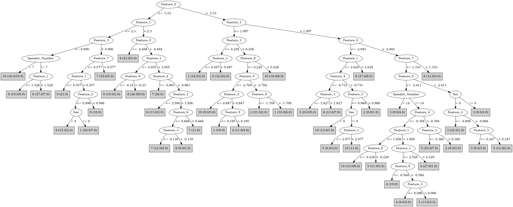

# J48

# SimpleCart Decision Tree

Feature_1 < 0.628

* Feature_1 < -0.1235: 0(31.0/0.0)

* Feature_1 >= -0.1235

*   * Feature_0 < -3.4435000000000002: 0(18.0/1.0)

*   * Feature_0 >= -3.4435000000000002: 1(38.0/12.0)

Feature_1 >= 0.628

* Feature_0 < -3.525

*   * Feature_4 < -1.0325: 7(33.0/7.0)

*   * Feature_4 >= -1.0325

*   *   * Feature_0 < -4.4845

*   *   *   * Feature_2 < 1.0585: 9(26.0/3.0)

*   *   *   * Feature_2 >= 1.0585: 0(10.0/0.0)

*   *   * Feature_0 >= -4.4845

*   *   *   * Feature_3 < 1.1345

*   *   *   *   * Feature_1 < 3.5875

*   *   *   *   *   * Speaker_Number=(7)|(3)

*   *   *   *   *   *   * Feature_4 < 0.0665: 3(4.0/15.0)

*   *   *   *   *   *   * Feature_4 >= 0.0665: 10(6.0/0.0)

*   *   *   *   *   * Speaker_Number!=(7)|(3)

*   *   *   *   *   *   * Feature_0 < -3.7655

*   *   *   *   *   *   *   * Feature_0 < -4.181: 9(6.0/3.0)

*   *   *   *   *   *   *   * Feature_0 >= -4.181: 8(45.0/6.0)

*   *   *   *   *   *   * Feature_0 >= -3.7655

*   *   *   *   *   *   *   * Speaker_Number=(10)|(9)|(1)|(2)|(3)|(6)|(7)|(8)|(11)|(12): 10(6.0/0.0)

*   *   *   *   *   *   *   * Speaker_Number!=(10)|(9)|(1)|(2)|(3)|(6)|(7)|(8)|(11)|(12): 8(3.0/3.0)

*   *   *   *   * Feature_1 >= 3.5875

*   *   *   *   *   * Speaker_Number=(12)|(9)|(7): 8(6.0/2.0)

*   *   *   *   *   * Speaker_Number!=(12)|(9)|(7): 7(17.0/1.0)

*   *   *   * Feature_3 >= 1.1345

*   *   *   *   * Speaker_Number=(14)|(9)|(7)|(5)|(1)|(3)|(4)|(6)|(8)|(10)|(12)

*   *   *   *   *   * Feature_8 < -0.436: 1(10.0/0.0)

*   *   *   *   *   * Feature_8 >= -0.436: 2(4.0/3.0)

*   *   *   *   * Speaker_Number!=(14)|(9)|(7)|(5)|(1)|(3)|(4)|(6)|(8)|(10)|(12): 9(15.0/2.0)

* Feature_0 >= -3.525

*   * Feature_1 < 2.0220000000000002

*   *   * Feature_1 < 1.278

*   *   *   * Feature_2 < -0.292: 2(38.0/13.0)

*   *   *   * Feature_2 >= -0.292

*   *   *   *   * Feature_9 < 0.187: 10(13.0/5.0)

*   *   *   *   * Feature_9 >= 0.187

*   *   *   *   *   * Feature_2 < 0.6495: 3(4.0/8.0)

*   *   *   *   *   * Feature_2 >= 0.6495: 6(6.0/1.0)

*   *   * Feature_1 >= 1.278

*   *   *   * Feature_2 < -0.9704999999999999: 3(23.0/5.0)

*   *   *   * Feature_2 >= -0.9704999999999999

*   *   *   *   * Feature_0 < -2.8979999999999997

*   *   *   *   *   * Feature_9 < 0.2015: 10(14.0/0.0)

*   *   *   *   *   * Feature_9 >= 0.2015

*   *   *   *   *   *   * Feature_6 < 0.032: 2(5.0/8.0)

*   *   *   *   *   *   * Feature_6 >= 0.032: 3(6.0/1.0)

*   *   *   *   * Feature_0 >= -2.8979999999999997

*   *   *   *   *   * Feature_9 < 0.627

*   *   *   *   *   *   * Feature_4 < -1.0695000000000001: 4(7.0/3.0)

*   *   *   *   *   *   * Feature_4 >= -1.0695000000000001: 5(29.0/15.0)

*   *   *   *   *   * Feature_9 >= 0.627: 6(4.0/3.0)

*   * Feature_1 >= 2.0220000000000002

*   *   * Feature_0 < -2.9465000000000003

*   *   *   * Feature_4 < -0.20500000000000002

*   *   *   *   * Speaker_Number=(12)|(8)|(7): 7(4.0/3.0)

*   *   *   *   * Speaker_Number!=(12)|(8)|(7): 6(33.0/2.0)

*   *   *   * Feature_4 >= -0.20500000000000002

*   *   *   *   * Feature_2 < -0.8565: 4(3.0/3.0)

*   *   *   *   * Feature_2 >= -0.8565: 10(12.0/0.0)

*   *   * Feature_0 >= -2.9465000000000003

*   *   *   * Feature_4 < -0.5545

*   *   *   *   * Feature_7 < 1.353

*   *   *   *   *   * Feature_0 < -2.5389999999999997: 4(37.0/5.0)

*   *   *   *   *   * Feature_0 >= -2.5389999999999997: 5(4.0/2.0)

*   *   *   *   * Feature_7 >= 1.353: 6(6.0/1.0)

*   *   *   * Feature_4 >= -0.5545

*   *   *   *   * Feature_5 < 0.33499999999999996: 3(7.0/1.0)

*   *   *   *   * Feature_5 >= 0.33499999999999996

*   *   *   *   *   * Feature_1 < 3.237: 5(15.0/1.0)

*   *   *   *   *   * Feature_1 >= 3.237: 4(5.0/2.0)

# PART

Decision list:

conditions|predicted class
---|---
Feature_0 <= -3.53 AND Feature_1 > 2.3 AND Feature_0 <= -4.494 AND Feature_1 <= 3.749| 9 (15.0)
Feature_0 <= -3.53 AND Feature_1 > 2.3 AND Feature_4 <= -0.989 AND Feature_1 > 3.046| 7 (25.0)
Feature_1 <= 1.272 AND Feature_1 <= 0.624 AND Feature_1 <= -0.137| 0 (31.0)
Feature_0 <= -3.53 AND Feature_3 > 1.012 AND Feature_4 > -1.149 AND Feature_1 <= 0.557| 0 (15.0)
Feature_0 <= -3.53 AND Feature_3 <= 1.012 AND Feature_1 > 3.506 AND Feature_0 > -4.475 AND Feature_6 <= 0.666 AND Feature_3 <= -0.108| 7 (12.0/3.0)
Feature_0 <= -3.53 AND Feature_3 <= 1.012 AND Feature_6 > 0.666 AND Feature_1 > 3.395| 7 (12.0/1.0)
Feature_0 <= -3.642 AND Feature_3 <= 1.133 AND Feature_1 > 2.027 AND Feature_6 <= 0.563 AND Feature_0 > -4.181 AND Feature_7 > 0.142 AND Feature_2 <= 0.172| 8 (28.0)
Feature_0 > -3.105 AND Feature_1 > 1.516 AND Feature_0 > -2.411 AND Feature_3 <= 1.264 AND Feature_1 <= 2.089 AND Feature_0 > -2.308| 3 (16.0)
Feature_0 > -3.105 AND Feature_1 > 1.518 AND Feature_4 <= -0.555 AND Feature_0 > -2.951 AND Feature_7 <= 1.333 AND Feature_6 > -0.403 AND Feature_0 <= -2.432 AND Feature_7 > -0.203 AND Feature_1 > 2.403 AND Feature_0 > -2.8| 4 (17.0)
Feature_0 > -3.379 AND Feature_1 <= 1.272 AND Feature_1 <= 0.613 AND Feature_8 > -0.731 AND Feature_5 > 1.039| 1 (24.0)
Feature_0 > -3.105 AND Feature_1 > 1.518 AND Feature_1 > 2.561 AND Feature_7 > 0.217 AND Feature_0 <= -3| 6 (8.0)
Feature_0 > -3.105 AND Feature_1 > 1.518 AND Feature_7 <= 1.333 AND Feature_6 > 0.213 AND Feature_3 > -0.378 AND Feature_3 > -0.083| 5 (15.0/6.0)
Feature_0 > -3.105 AND Feature_1 > 1.518 AND Feature_7 <= 1.333 AND Feature_1 > 2.916| 4 (13.0/5.0)
Feature_0 > -3.105 AND Feature_1 > 1.516 AND Feature_7 <= 1.333 AND Feature_4 > -0.485 AND Feature_5 > 0.315 AND Feature_0 <= -2.742| 10 (12.0/5.0)
Feature_0 > -3.105 AND Feature_1 > 1.516 AND Feature_7 > 1.333| 6 (12.0/3.0)
Feature_0 > -3.105 AND Feature_1 > 1.516 AND Feature_9 <= 0.65 AND Feature_4 > -0.463 AND Feature_5 > 0.12 AND Feature_0 <= -2.463| 5 (10.0)
Feature_0 > -3.105 AND Feature_1 > 1.516 AND Feature_4 > -0.484 AND Feature_8 <= -0.16| 3 (11.0/2.0)
Feature_0 > -3.105 AND Feature_4 > 0.136 AND Feature_5 <= 0.78 AND Feature_1 <= 1.086| 2 (13.0)
Feature_0 > -3.055 AND Feature_4 > 0.136 AND Feature_1 <= 0.766| 1 (11.0/4.0)
Feature_0 > -3.055 AND Feature_1 > 1.518 AND Feature_2 > -0.867 AND Feature_5 > 0.451| 5 (15.0/2.0)
Feature_0 > -3.055 AND Feature_1 > 1.518 AND Feature_4 <= -0.561 AND Feature_3 <= 0.58 AND Feature_0 <= -2.58 AND Feature_0 > -2.922| 4 (11.0)
Feature_0 > -3.055 AND Feature_1 > 1.516 AND Feature_5 <= 0.981 AND Feature_2 <= -0.358| 3 (14.0/5.0)
Feature_0 > -3.053 AND Feature_1 > 1.518 AND Feature_0 <= -2.489 AND Feature_5 <= 1.057| 4 (12.0/3.0)
Feature_0 > -3.053 AND Feature_0 > -2.176 AND Feature_2 <= -1.424| 2 (10.0)
Feature_3 > 0.996 AND Feature_7 <= 0.577 AND Feature_8 > 0.123 AND Feature_0 <= -3.634| 9 (9.0/4.0)
Feature_3 > 0.996 AND Feature_8 > 0.094 AND Feature_7 > 0.517| 7 (15.0/5.0)
Feature_3 > 0.996 AND Feature_8 <= 0.203 AND Feature_0 <= -3.03 AND Feature_4 > 0.416 AND Feature_0 > -3.828| 1 (17.0)
Feature_0 <= -3.772 AND Feature_5 <= 0.021 AND Feature_2 > 0.224| 1 (14.0/7.0)
Feature_0 <= -3.772 AND Feature_1 > 1.735 AND Feature_5 > 0.411 AND Feature_3 > -0.022 AND Feature_9 > 0.22| 8 (13.0/1.0)
Feature_1 > 2.043 AND Feature_0 <= -3.909 AND Feature_5 > 0.274 AND Feature_3 > -0.022| 9 (14.0/6.0)
Feature_1 > 2.043 AND Feature_0 <= -3.909 AND Feature_5 > 0.287| 8 (13.0/2.0)
Feature_1 > 2.043 AND Feature_0 > -3.941 AND Feature_9 <= 0.663 AND Feature_3 > -0.427 AND Feature_9 <= 0.111 AND Feature_1 > 2.713 AND Feature_0 > -3.337| 6 (11.0)
Feature_0 <= -3.977 AND Feature_3 > 0.277 AND Feature_9 <= 0.495| 9 (14.0/1.0)
Feature_1 > 2.043 AND Feature_9 <= 0.663 AND Feature_6 <= 0.857 AND Feature_6 > 0.064 AND Feature_7 > 0.279| 6 (12.0)
Feature_3 > 0.99 AND Feature_6 > -0.839 AND Sex = 1 AND Feature_0 > -3.406| 2 (16.0)
Feature_3 > 0.99 AND Feature_0 <= -3.097 AND Sex = 0| 1 (11.0/6.0)
Feature_1 > 2.043 AND Feature_1 <= 2.84 AND Feature_4 > -0.293| 10 (12.0/1.0)
Feature_1 > 2.043 AND Feature_1 > 2.84| 6 (14.0/8.0)
Feature_2 > 0.428| 6 (14.0/5.0)
Feature_1 <= 2.043 AND Feature_0 > -2.291 AND Feature_5 <= 0.398| 3 (11.0)
Feature_1 <= 2.043 AND Feature_7 > 0.639 AND Feature_0 > -3.128 AND Feature_9 <= -0.198| 5 (13.0/6.0)
Feature_1 > 2.043| 4 (10.0/1.0)
Feature_7 > 0.639 AND Feature_5 <= 1.007 AND Feature_0 <= -3.141| 10 (8.0/1.0)
Feature_5 <= 1.031 AND Feature_9 <= 0.458 AND Feature_2 > -0.773 AND Feature_0 <= -2.434 AND Feature_6 <= -0.026| 10 (12.0)
Feature_5 <= 1.031 AND Feature_4 <= -0.131 AND Feature_2 <= -0.571| 3 (15.0/6.0)
Feature_8 > -0.13 AND Feature_0 > -2.895| 5 (11.0/1.0)
Feature_8 <= -0.13 AND Feature_6 > -0.342 AND Feature_2 > -0.521| 10 (15.0/4.0)
Feature_8 <= -0.13 AND Feature_1 <= 1.303 AND Feature_0 > -3.053| 2 (11.0)
Feature_8 <= -0.13 AND Feature_6 > -0.342| 5 (10.0/4.0)
Feature_8 <= -0.13| 2 (8.0/4.0)
| 8 (8.0/4.0)

# JRip

Decision list:

conditions|predicted class
---|---
(Feature_0 <= -4.494) and (Feature_2 <= 1.028)|9 (30.0/4.0)
(Feature_0 <= -3.601) and (Feature_6 <= -0.014) and (Feature_9 <= 0.096) and (Feature_4 >= -0.019)|9 (21.0/6.0)
(Feature_7 <= 0.345) and (Feature_0 >= -2.089)|3 (22.0/0.0)
(Feature_5 <= 0.329) and (Feature_0 >= -2.85) and (Feature_1 >= 1.186) and (Feature_1 <= 2.091) and (Feature_2 <= -0.792)|3 (13.0/0.0)
(Feature_2 <= -0.686) and (Feature_4 <= -0.819) and (Feature_1 <= 1.85) and (Feature_5 <= 1.06) and (Feature_3 <= 1.202)|3 (13.0/0.0)
(Feature_1 <= 1.553) and (Feature_1 >= 0.632) and (Feature_2 <= -0.754) and (Feature_0 >= -2.385)|2 (20.0/0.0)
(Feature_1 <= 1.553) and (Feature_5 <= 0.927) and (Feature_2 <= 0.008) and (Feature_7 <= -0.144)|2 (20.0/1.0)
(Feature_4 >= -0.12) and (Feature_0 >= -2.837) and (Feature_5 <= 0.927) and (Feature_1 <= 1.268)|2 (14.0/2.0)
(Feature_1 >= 3.589) and (Feature_7 >= 0.342)|7 (29.0/1.0)
(Feature_4 <= -1.087) and (Feature_0 <= -3.482)|7 (29.0/7.0)
(Feature_3 <= 0.955) and (Feature_4 >= -0.11) and (Feature_5 <= 0.363) and (Feature_2 <= -0.138)|10 (30.0/4.0)
(Feature_0 >= -3.432) and (Feature_6 <= -0.085) and (Feature_5 >= 0.425) and (Feature_3 <= 0.674)|10 (25.0/8.0)
(Feature_1 <= 1.952) and (Feature_1 >= 1.185) and (Feature_5 >= 0.721) and (Feature_6 >= 0.014)|10 (13.0/4.0)
(Feature_1 >= 2.733) and (Feature_0 >= -3.749) and (Feature_0 <= -2.969) and (Feature_3 >= -0.577) and (Feature_9 <= 0.147)|6 (28.0/0.0)
(Feature_4 <= -1.009) and (Feature_5 <= 0.272) and (Feature_7 >= 1.099)|6 (13.0/0.0)
(Feature_8 >= 0.339) and (Feature_2 >= 0.71) and (Feature_0 >= -3.193)|6 (10.0/0.0)
(Feature_0 >= -3.439) and (Feature_1 >= -0.11) and (Feature_8 >= -0.893) and (Feature_1 <= 0.659)|1 (36.0/0.0)
(Feature_3 >= 1.286) and (Feature_8 <= -0.405) and (Feature_1 >= 0.557)|1 (22.0/3.0)
(Feature_1 <= 0.418)|0 (51.0/0.0)
(Feature_2 >= 0.645) and (Sex = 1)|0 (12.0/0.0)
(Feature_0 >= -3.038) and (Feature_1 >= 1.975) and (Feature_4 <= -0.562)|4 (55.0/11.0)
(Feature_0 <= -3.775) and (Feature_5 >= 0.633)|8 (36.0/5.0)
(Feature_0 <= -3.618) and (Feature_8 >= -0.134) and (Feature_8 <= 0.531)|8 (11.0/0.0)
(Feature_0 <= -3.963) and (Feature_5 >= 0.317)|8 (14.0/4.0)
|5 (126.0/70.0)

# Decision Table

Non matches covered by Majority class

feature_0|feature_1|feature_4|target
---|---|---|---
(-inf--4.476]|(3.0645-inf)|(0.286-inf)|8
(-4.476--3.525]|(3.0645-inf)|(0.286-inf)|8
(-inf--4.476]|(2.1435-3.0645]|(0.286-inf)|9
(-2.9435--2.403]|(2.1435-3.0645]|(0.286-inf)|0
(-3.525--2.9435]|(2.1435-3.0645]|(0.286-inf)|10
(-4.476--3.525]|(2.1435-3.0645]|(0.286-inf)|9
(-2.403--1.6655]|(1.4125-2.1435]|(0.286-inf)|3
(-2.403--1.6655]|(3.0645-inf)|(-0.7345-0.286]|4
(-3.525--2.9435]|(1.4125-2.1435]|(0.286-inf)|10
(-3.525--2.9435]|(3.0645-inf)|(-0.7345-0.286]|6
(-inf--4.476]|(3.0645-inf)|(-0.7345-0.286]|9
(-2.9435--2.403]|(3.0645-inf)|(-0.7345-0.286]|4
(-4.476--3.525]|(3.0645-inf)|(-0.7345-0.286]|7
(-4.476--3.525]|(1.4125-2.1435]|(0.286-inf)|1
(-inf--4.476]|(0.628-1.4125]|(0.286-inf)|0
(-3.525--2.9435]|(0.628-1.4125]|(0.286-inf)|1
(-2.403--1.6655]|(0.628-1.4125]|(0.286-inf)|2
(-2.9435--2.403]|(0.628-1.4125]|(0.286-inf)|2
(-4.476--3.525]|(0.628-1.4125]|(0.286-inf)|1
(-inf--4.476]|(2.1435-3.0645]|(-0.7345-0.286]|9
(-3.525--2.9435]|(2.1435-3.0645]|(-0.7345-0.286]|6
(-2.403--1.6655]|(2.1435-3.0645]|(-0.7345-0.286]|3
(-2.9435--2.403]|(2.1435-3.0645]|(-0.7345-0.286]|5
(-4.476--3.525]|(2.1435-3.0645]|(-0.7345-0.286]|8
(-inf--4.476]|(3.0645-inf)|(-inf--0.7345]|9
(-4.476--3.525]|(-0.1235-0.628]|(0.286-inf)|0
(-2.9435--2.403]|(3.0645-inf)|(-inf--0.7345]|4
(-inf--4.476]|(1.4125-2.1435]|(-0.7345-0.286]|9
(-2.9435--2.403]|(-0.1235-0.628]|(0.286-inf)|1
(-3.525--2.9435]|(1.4125-2.1435]|(-0.7345-0.286]|10
(-4.476--3.525]|(3.0645-inf)|(-inf--0.7345]|7
(-3.525--2.9435]|(-0.1235-0.628]|(0.286-inf)|1
(-inf--4.476]|(-0.1235-0.628]|(0.286-inf)|0
(-3.525--2.9435]|(3.0645-inf)|(-inf--0.7345]|6
(-2.403--1.6655]|(1.4125-2.1435]|(-0.7345-0.286]|3
(-2.9435--2.403]|(1.4125-2.1435]|(-0.7345-0.286]|5
(-4.476--3.525]|(1.4125-2.1435]|(-0.7345-0.286]|9
(-inf--4.476]|(2.1435-3.0645]|(-inf--0.7345]|9
(-3.525--2.9435]|(-inf--0.1235]|(0.286-inf)|0
(-2.403--1.6655]|(0.628-1.4125]|(-0.7345-0.286]|2
(-3.525--2.9435]|(2.1435-3.0645]|(-inf--0.7345]|6
(-2.9435--2.403]|(2.1435-3.0645]|(-inf--0.7345]|4
(-4.476--3.525]|(2.1435-3.0645]|(-inf--0.7345]|8
(-4.476--3.525]|(0.628-1.4125]|(-0.7345-0.286]|9
(-3.525--2.9435]|(0.628-1.4125]|(-0.7345-0.286]|2
(-2.9435--2.403]|(0.628-1.4125]|(-0.7345-0.286]|10
(-inf--4.476]|(0.628-1.4125]|(-0.7345-0.286]|0
(-2.9435--2.403]|(-inf--0.1235]|(0.286-inf)|0
(-4.476--3.525]|(-inf--0.1235]|(0.286-inf)|0
(-1.6655-inf)|(0.628-1.4125]|(-0.7345-0.286]|2
(-2.9435--2.403]|(-0.1235-0.628]|(-0.7345-0.286]|2
(-1.6655-inf)|(1.4125-2.1435]|(-inf--0.7345]|0
(-2.403--1.6655]|(-0.1235-0.628]|(-0.7345-0.286]|1
(-4.476--3.525]|(-0.1235-0.628]|(-0.7345-0.286]|0
(-1.6655-inf)|(-0.1235-0.628]|(-0.7345-0.286]|1
(-3.525--2.9435]|(-0.1235-0.628]|(-0.7345-0.286]|1
(-2.9435--2.403]|(1.4125-2.1435]|(-inf--0.7345]|4
(-2.403--1.6655]|(1.4125-2.1435]|(-inf--0.7345]|3
(-4.476--3.525]|(1.4125-2.1435]|(-inf--0.7345]|8
(-3.525--2.9435]|(1.4125-2.1435]|(-inf--0.7345]|3
(-2.9435--2.403]|(-inf--0.1235]|(-0.7345-0.286]|0
(-3.525--2.9435]|(-inf--0.1235]|(-0.7345-0.286]|0
(-4.476--3.525]|(-inf--0.1235]|(-0.7345-0.286]|0
(-2.403--1.6655]|(-inf--0.1235]|(-0.7345-0.286]|0
(-3.525--2.9435]|(0.628-1.4125]|(-inf--0.7345]|8
(-4.476--3.525]|(0.628-1.4125]|(-inf--0.7345]|7
(-2.9435--2.403]|(0.628-1.4125]|(-inf--0.7345]|6
(-1.6655-inf)|(-inf--0.1235]|(-0.7345-0.286]|0

