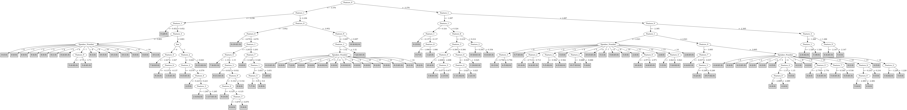

# J48

# SimpleCart Decision Tree

Feature_1 < 0.7175

* Feature_1 < 0.042499999999999996: 0(37.0/4.0)

* Feature_1 >= 0.042499999999999996

*   * Feature_0 < -3.568: 0(13.0/0.0)

*   * Feature_0 >= -3.568

*   *   * Feature_5 < 1.233

*   *   *   * Feature_4 < 0.538: 2(15.0/5.0)

*   *   *   * Feature_4 >= 0.538: 1(14.0/0.0)

*   *   * Feature_5 >= 1.233: 1(30.0/4.0)

Feature_1 >= 0.7175

* Feature_0 < -3.525

*   * Feature_4 < -0.989

*   *   * Feature_7 < 0.431: 8(4.0/5.0)

*   *   * Feature_7 >= 0.431: 7(35.0/4.0)

*   * Feature_4 >= -0.989

*   *   * Feature_0 < -4.283

*   *   *   * Feature_2 < 1.0305

*   *   *   *   * Feature_3 < -0.6675: 7(9.0/5.0)

*   *   *   *   * Feature_3 >= -0.6675: 9(35.0/6.0)

*   *   *   * Feature_2 >= 1.0305: 0(10.0/0.0)

*   *   * Feature_0 >= -4.283

*   *   *   * Feature_3 < 1.1345

*   *   *   *   * Feature_1 < 3.5875

*   *   *   *   *   * Feature_1 < 1.907: 10(8.0/11.0)

*   *   *   *   *   * Feature_1 >= 1.907: 8(42.0/16.0)

*   *   *   *   * Feature_1 >= 3.5875: 7(10.0/3.0)

*   *   *   * Feature_3 >= 1.1345

*   *   *   *   * Feature_3 < 1.4665: 1(8.0/5.0)

*   *   *   *   * Feature_3 >= 1.4665: 9(11.0/3.0)

* Feature_0 >= -3.525

*   * Feature_0 < -2.3045

*   *   * Feature_1 < 2.0220000000000002

*   *   *   * Feature_3 < 1.0194999999999999: 10(32.0/61.0)

*   *   *   * Feature_3 >= 1.0194999999999999

*   *   *   *   * Sex=(1): 2(19.0/3.0)

*   *   *   *   * Sex!=(1): 6(8.0/13.0)

*   *   * Feature_1 >= 2.0220000000000002

*   *   *   * Feature_0 < -3.005

*   *   *   *   * Feature_3 < 0.2495: 6(26.0/8.0)

*   *   *   *   * Feature_3 >= 0.2495: 10(12.0/4.0)

*   *   *   * Feature_0 >= -3.005

*   *   *   *   * Feature_4 < -0.351: 4(44.0/24.0)

*   *   *   *   * Feature_4 >= -0.351: 5(11.0/3.0)

*   * Feature_0 >= -2.3045

*   *   * Feature_7 < 0.34199999999999997: 3(38.0/1.0)

*   *   * Feature_7 >= 0.34199999999999997

*   *   *   * Feature_1 < 1.14: 2(16.0/2.0)

*   *   *   * Feature_1 >= 1.14: 5(7.0/9.0)

# PART

Decision list:

conditions|predicted class
---|---
Feature_0 <= -3.3754999999999997 AND Feature_1 > 2.2385 AND Feature_9 > 0.733 AND Sex != 0| 10 (7.0)
Feature_0 <= -3.3754999999999997 AND Feature_1 > 2.2385 AND Feature_0 > -3.959 AND Feature_1 > 3.3225| 7 (23.0/1.0)
Feature_0 <= -3.4395 AND Feature_1 > 2.2385 AND Feature_0 > -4.6635 AND Feature_0 <= -3.9505 AND Feature_1 > 3.2105 AND Feature_7 > 0.328 AND Speaker_Number != 11| 7 (27.0/3.0)
Feature_0 <= -3.4395 AND Feature_3 <= 1.0150000000000001 AND Feature_9 <= 0.7224999999999999 AND Feature_0 <= -4.1434999999999995| 9 (45.0/12.0)
Feature_1 <= 1.2395 AND Feature_1 <= 0.326 AND Feature_8 <= -0.1235| 0 (58.0/10.0)
Feature_0 > -3.1465 AND Feature_1 <= 1.4165 AND Feature_1 <= 0.764 AND Feature_5 > 1.233| 1 (24.0/1.0)
Feature_0 > -3.1465 AND Feature_1 <= 1.526 AND Feature_2 > 0.28049999999999997 AND Feature_9 <= 0.074| 5 (6.0)
Feature_0 > -3.1465 AND Feature_1 <= 1.526 AND Feature_8 > 0.067 AND Feature_5 > 0.4855| 10 (14.0/2.0)
Feature_0 > -3.1465 AND Feature_1 <= 1.5165 AND Feature_8 <= 0.0545 AND Feature_6 <= 0.461 AND Speaker_Number != 4 AND Feature_1 <= 1.1695| 2 (46.0/3.0)
Feature_0 > -3.1535 AND Feature_0 > -2.3045 AND Feature_3 <= 1.2715| 3 (45.0)
Feature_0 > -3.1535 AND Feature_1 > 1.7985 AND Speaker_Number != 14 AND Feature_4 > -0.184 AND Feature_0 <= -2.8625| 10 (6.0/2.0)
Feature_0 > -3.1535 AND Feature_1 > 1.7985 AND Feature_9 > 0.751 AND Feature_0 <= -2.833| 5 (7.0)
Feature_0 > -3.1535 AND Feature_1 > 1.7985 AND Speaker_Number = 14 AND Feature_1 <= 2.834| 3 (6.0/1.0)
Feature_0 > -3.1535 AND Feature_1 > 1.7985 AND Speaker_Number != 13 AND Feature_0 > -2.5949999999999998 AND Feature_4 > -1.063 AND Feature_1 <= 2.6065| 5 (15.0)
Feature_0 > -3.4395 AND Feature_1 > 1.7985 AND Feature_4 <= -0.239 AND Feature_0 <= -3.0045 AND Feature_1 > 2.593| 6 (21.0)
Feature_0 > -3.1479999999999997 AND Feature_1 > 1.7985 AND Speaker_Number != 13 AND Feature_7 <= 1.371 AND Feature_1 <= 3.2655000000000003| 4 (62.0/12.0)
Feature_3 <= 0.83 AND Feature_1 > 2.005 AND Feature_0 <= -3.738| 8 (42.0/8.0)
Feature_3 <= 0.83 AND Feature_1 > 2.005 AND Feature_7 > -0.0735 AND Feature_4 <= -0.3185| 6 (15.0/1.0)
Feature_8 > 0.098 AND Feature_5 > 0.6385000000000001| 8 (20.0/7.0)
Feature_3 <= 0.83 AND Feature_1 > 2.2474999999999996 AND Feature_4 <= -0.246| 4 (10.0)
Feature_3 <= 0.83 AND Speaker_Number != 10 AND Feature_1 <= 2.04 AND Feature_9 <= 0.08549999999999999 AND Feature_0 <= -2.661| 10 (21.0/3.0)
Feature_8 > -0.07350000000000001 AND Speaker_Number != 7 AND Feature_0 <= -3.504 AND Feature_4 <= -1.177| 7 (11.0/2.0)
Feature_3 <= 0.83 AND Feature_1 <= 2.04 AND Speaker_Number != 10 AND Sex != 0 AND Feature_8 <= -0.375| 5 (15.0/5.0)
Feature_8 > -0.07350000000000001 AND Sex = 0 AND Feature_0 > -3.4085 AND Feature_6 <= -0.5449999999999999| 6 (11.0)
Feature_2 > 0.644 AND Sex != 0| 0 (15.0/2.0)
Feature_4 > -0.32599999999999996 AND Feature_3 <= 0.7615 AND Feature_0 <= -3.0940000000000003| 10 (11.0/3.0)
Feature_4 > -0.2985 AND Feature_5 <= 0.5105 AND Speaker_Number != 13 AND Feature_6 > -0.6595| 2 (26.0/5.0)
Feature_4 > -0.2985 AND Feature_1 <= 2.1645000000000003 AND Feature_5 <= 1.4935| 1 (28.0/3.0)
Feature_0 <= -3.633| 9 (23.0/3.0)
Feature_8 > -0.41300000000000003 AND Feature_2 <= -0.6775 AND Feature_5 <= 0.688| 3 (8.0)
Feature_0 > -2.8985000000000003| 5 (12.0/5.0)
Feature_1 > 1.1365| 10 (7.0/3.0)
| 1 (6.0)

# JRip

Decision list:

conditions|predicted class
---|---
(Feature_1 >= 2.563) and (Feature_0 >= -3.661) and (Feature_0 <= -2.951) and (Sex = 0)|6 (16.0/0.0)
(Feature_4 <= -0.416) and (Feature_2 >= 0.532) and (Feature_0 >= -3.439) and (Feature_0 <= -2.708)|6 (12.0/0.0)
(Feature_1 >= 2.621) and (Feature_0 >= -3.661) and (Feature_6 >= 0.364) and (Feature_6 <= 0.824)|6 (13.0/0.0)
(Feature_7 >= 1.232) and (Feature_5 <= 0.12) and (Feature_0 >= -3.587)|6 (7.0/0.0)
(Feature_0 <= -4.494) and (Sex = 0)|9 (17.0/0.0)
(Feature_9 <= -0.913) and (Feature_0 <= -4.188)|9 (9.0/0.0)
(Feature_0 <= -3.972) and (Feature_8 <= -0.783) and (Feature_5 <= 0.515) and (Feature_3 >= -0.536)|9 (11.0/0.0)
(Feature_0 <= -3.601) and (Feature_5 >= 1.275) and (Feature_8 >= -0.106) and (Feature_4 >= -0.561)|9 (7.0/0.0)
(Feature_3 <= 1.015) and (Feature_0 <= -2.907) and (Feature_0 >= -3.756) and (Feature_2 >= -0.866) and (Feature_6 <= 0.418) and (Feature_1 >= 1.779) and (Feature_2 <= -0.26)|10 (23.0/0.0)
(Feature_7 >= 0.673) and (Feature_1 <= 1.795) and (Feature_0 <= -2.52) and (Feature_5 <= 1.39) and (Feature_9 <= -0.682)|10 (11.0/0.0)
(Feature_3 <= 0.402) and (Feature_0 <= -2.704) and (Feature_1 <= 1.033)|10 (8.0/0.0)
(Feature_1 <= 1.992) and (Feature_3 <= 0.402) and (Feature_0 <= -2.812) and (Feature_6 <= 0.353) and (Feature_4 >= -0.011)|10 (7.0/0.0)
(Feature_2 >= -0.167) and (Feature_0 >= -3.088) and (Feature_5 >= 0.595) and (Feature_9 >= -0.134) and (Sex = 0)|10 (5.0/0.0)
(Feature_1 >= 3.049) and (Feature_7 >= 0.42) and (Feature_4 <= -0.994)|7 (30.0/0.0)
(Feature_1 >= 3.203) and (Feature_6 >= 0.73)|7 (13.0/0.0)
(Feature_1 >= 3.605) and (Feature_7 >= 0.342) and (Feature_9 >= -0.301)|7 (8.0/0.0)
(Feature_8 >= 0.565) and (Feature_4 <= -1.262)|7 (5.0/0.0)
(Feature_1 >= 1.102) and (Feature_0 >= -3.206) and (Feature_8 <= -0.37) and (Feature_5 <= 0.683) and (Feature_5 >= 0.383) and (Feature_9 >= -0.084)|5 (19.0/0.0)
(Feature_0 >= -2.906) and (Feature_8 >= 0.166) and (Feature_2 >= -0.184) and (Feature_4 >= -0.645)|5 (8.0/0.0)
(Feature_4 <= -0.612) and (Feature_0 >= -2.696) and (Feature_4 >= -1.05) and (Feature_2 >= -0.955) and (Feature_8 <= -0.094)|5 (12.0/0.0)
(Feature_3 <= 0.843) and (Feature_0 <= -2.291) and (Feature_0 >= -2.58) and (Feature_8 >= 0.253)|5 (6.0/0.0)
(Feature_3 <= 0.843) and (Feature_0 <= -2.434) and (Feature_1 <= 2.391) and (Feature_6 >= -0.017) and (Feature_4 <= 0.03) and (Feature_0 >= -2.826) and (Feature_5 >= 0.217)|5 (7.0/0.0)
(Feature_0 >= -2.304) and (Feature_1 >= 1.186) and (Feature_3 <= 1.202)|3 (39.0/0.0)
(Feature_5 <= 0.625) and (Feature_2 <= -0.619) and (Feature_9 >= 0.595) and (Feature_8 >= -0.322)|3 (10.0/0.0)
(Feature_0 >= -2.493) and (Feature_5 <= 0.002) and (Feature_1 <= 1.382)|3 (5.0/0.0)
(Feature_2 <= -0.619) and (Feature_5 <= 0.451) and (Feature_1 <= 1.472) and (Feature_2 >= -0.958) and (Feature_1 >= 0.835)|3 (7.0/0.0)
(Feature_4 <= -0.485) and (Feature_0 >= -2.942) and (Feature_1 >= 1.802) and (Feature_6 <= 0.202)|4 (35.0/0.0)
(Feature_1 >= 1.873) and (Feature_0 >= -3.141) and (Feature_5 <= 0.789)|4 (17.0/0.0)
(Feature_3 <= 0.367) and (Feature_7 <= -0.075) and (Feature_4 <= -0.131)|4 (8.0/0.0)
(Feature_0 >= -2.965) and (Feature_5 <= 0.786) and (Feature_4 >= -0.04)|2 (25.0/0.0)
(Feature_6 <= -0.012) and (Feature_0 >= -2.255)|2 (12.0/0.0)
(Feature_9 >= 0.616) and (Feature_2 <= 0.157) and (Feature_3 >= 1.024) and (Feature_4 <= 0.424) and (Feature_6 >= -0.647)|2 (19.0/0.0)
(Feature_0 >= -2.693) and (Feature_5 <= 1.204) and (Feature_1 <= 0.772) and (Feature_9 <= -0.109)|2 (6.0/0.0)
(Feature_1 >= 1.703) and (Feature_7 >= 0.399) and (Feature_3 >= -0.602) and (Feature_3 <= 1.133)|8 (34.0/0.0)
(Feature_1 >= 1.373) and (Feature_7 >= 0.157) and (Feature_8 >= 0.129) and (Feature_6 <= 0.133)|8 (12.0/0.0)
(Feature_1 >= 2.133) and (Feature_4 >= 0.117) and (Feature_2 >= -0.823) and (Feature_6 >= -0.49)|8 (11.0/0.0)
(Feature_1 >= 3.147) and (Feature_3 >= -0.038) and (Feature_0 <= -3.828)|8 (6.0/0.0)
(Feature_1 <= 0.406) and (Feature_3 >= 1.072) and (Feature_5 >= 0.542)|0 (40.0/0.0)
(Feature_2 >= 0.645) and (Feature_0 <= -4.275)|0 (12.0/0.0)
(Feature_1 <= -0.137)|0 (9.0/0.0)
|1 (132.0/61.0)

# Decision Table

Non matches covered by IB1

feature_0|feature_1|feature_3|feature_9|target
---|---|---|---|---
(-4.6635--3.7375]|(3.182-inf)|(1.0165-inf)|all|7
(-4.6635--3.7375]|(2.6285-3.182]|(1.0165-inf)|all|0
(-3.7375--3.3755]|(2.6285-3.182]|(1.0165-inf)|all|0
(-3.7375--3.3755]|(3.182-inf)|(0.1015-1.0165]|all|0
(-5.0925--4.6635]|(1.2395-2.6285]|(1.0165-inf)|all|0
(-inf--5.0925]|(1.2395-2.6285]|(1.0165-inf)|all|0
(-5.0925--4.6635]|(3.182-inf)|(0.1015-1.0165]|all|9
(-1.5625-inf)|(1.2395-2.6285]|(1.0165-inf)|all|0
(-4.6635--3.7375]|(1.2395-2.6285]|(1.0165-inf)|all|9
(-3.3755--3.0065]|(1.2395-2.6285]|(1.0165-inf)|all|2
(-4.6635--3.7375]|(3.182-inf)|(0.1015-1.0165]|all|8
(-3.7375--3.3755]|(1.2395-2.6285]|(1.0165-inf)|all|1
(-3.0065--2.3045]|(1.2395-2.6285]|(1.0165-inf)|all|2
(-2.3045--1.5625]|(1.2395-2.6285]|(1.0165-inf)|all|5
(-2.3045--1.5625]|(0.4245-1.2395]|(1.0165-inf)|all|2
(-5.0925--4.6635]|(0.4245-1.2395]|(1.0165-inf)|all|9
(-5.0925--4.6635]|(2.6285-3.182]|(0.1015-1.0165]|all|9
(-3.0065--2.3045]|(2.6285-3.182]|(0.1015-1.0165]|all|4
(-4.6635--3.7375]|(2.6285-3.182]|(0.1015-1.0165]|all|9
(-3.3755--3.0065]|(2.6285-3.182]|(0.1015-1.0165]|all|10
(-3.7375--3.3755]|(0.4245-1.2395]|(1.0165-inf)|all|1
(-4.6635--3.7375]|(0.4245-1.2395]|(1.0165-inf)|all|2
(-3.0065--2.3045]|(0.4245-1.2395]|(1.0165-inf)|all|2
(-3.3755--3.0065]|(0.4245-1.2395]|(1.0165-inf)|all|1
(-5.0925--4.6635]|(-0.1235-0.4245]|(1.0165-inf)|all|0
(-5.0925--4.6635]|(1.2395-2.6285]|(0.1015-1.0165]|all|0
(-4.6635--3.7375]|(-0.1235-0.4245]|(1.0165-inf)|all|0
(-3.0065--2.3045]|(-0.1235-0.4245]|(1.0165-inf)|all|0
(-3.7375--3.3755]|(-0.1235-0.4245]|(1.0165-inf)|all|0
(-5.0925--4.6635]|(3.182-inf)|(-inf-0.1015]|all|9
(-2.3045--1.5625]|(1.2395-2.6285]|(0.1015-1.0165]|all|3
(-3.3755--3.0065]|(3.182-inf)|(-inf-0.1015]|all|6
(-3.0065--2.3045]|(3.182-inf)|(-inf-0.1015]|all|4
(-3.7375--3.3755]|(3.182-inf)|(-inf-0.1015]|all|7
(-4.6635--3.7375]|(3.182-inf)|(-inf-0.1015]|all|7
(-3.3755--3.0065]|(-0.1235-0.4245]|(1.0165-inf)|all|1
(-3.3755--3.0065]|(1.2395-2.6285]|(0.1015-1.0165]|all|10
(-3.7375--3.3755]|(1.2395-2.6285]|(0.1015-1.0165]|all|10
(-4.6635--3.7375]|(1.2395-2.6285]|(0.1015-1.0165]|all|8
(-3.0065--2.3045]|(1.2395-2.6285]|(0.1015-1.0165]|all|5
(-2.3045--1.5625]|(-inf--0.1235]|(1.0165-inf)|all|0
(-4.6635--3.7375]|(-inf--0.1235]|(1.0165-inf)|all|0
(-4.6635--3.7375]|(0.4245-1.2395]|(0.1015-1.0165]|all|9
(-3.7375--3.3755]|(0.4245-1.2395]|(0.1015-1.0165]|all|3
(-1.5625-inf)|(-inf--0.1235]|(1.0165-inf)|all|0
(-3.3755--3.0065]|(0.4245-1.2395]|(0.1015-1.0165]|all|1
(-3.0065--2.3045]|(-inf--0.1235]|(1.0165-inf)|all|0
(-3.3755--3.0065]|(-inf--0.1235]|(1.0165-inf)|all|0
(-3.7375--3.3755]|(-inf--0.1235]|(1.0165-inf)|all|0
(-4.6635--3.7375]|(2.6285-3.182]|(-inf-0.1015]|all|8
(-3.7375--3.3755]|(2.6285-3.182]|(-inf-0.1015]|all|6
(-3.3755--3.0065]|(2.6285-3.182]|(-inf-0.1015]|all|6
(-1.5625-inf)|(0.4245-1.2395]|(0.1015-1.0165]|all|1
(-3.0065--2.3045]|(0.4245-1.2395]|(0.1015-1.0165]|all|2
(-2.3045--1.5625]|(0.4245-1.2395]|(0.1015-1.0165]|all|2
(-3.0065--2.3045]|(2.6285-3.182]|(-inf-0.1015]|all|4
(-3.7375--3.3755]|(1.2395-2.6285]|(-inf-0.1015]|all|0
(-2.3045--1.5625]|(-0.1235-0.4245]|(0.1015-1.0165]|all|0
(-5.0925--4.6635]|(1.2395-2.6285]|(-inf-0.1015]|all|9
(-4.6635--3.7375]|(1.2395-2.6285]|(-inf-0.1015]|all|8
(-3.3755--3.0065]|(1.2395-2.6285]|(-inf-0.1015]|all|6
(-4.6635--3.7375]|(-0.1235-0.4245]|(0.1015-1.0165]|all|0
(-2.3045--1.5625]|(1.2395-2.6285]|(-inf-0.1015]|all|3
(-3.3755--3.0065]|(-0.1235-0.4245]|(0.1015-1.0165]|all|1
(-3.0065--2.3045]|(-0.1235-0.4245]|(0.1015-1.0165]|all|1
(-1.5625-inf)|(-0.1235-0.4245]|(0.1015-1.0165]|all|1
(-3.0065--2.3045]|(1.2395-2.6285]|(-inf-0.1015]|all|5
(-3.3755--3.0065]|(-inf--0.1235]|(0.1015-1.0165]|all|0
(-3.0065--2.3045]|(-inf--0.1235]|(0.1015-1.0165]|all|0
(-1.5625-inf)|(-inf--0.1235]|(0.1015-1.0165]|all|0
(-2.3045--1.5625]|(-inf--0.1235]|(0.1015-1.0165]|all|0
(-2.3045--1.5625]|(0.4245-1.2395]|(-inf-0.1015]|all|3
(-1.5625-inf)|(0.4245-1.2395]|(-inf-0.1015]|all|0
(-3.0065--2.3045]|(0.4245-1.2395]|(-inf-0.1015]|all|10
(-3.3755--3.0065]|(0.4245-1.2395]|(-inf-0.1015]|all|10
(-1.5625-inf)|(-0.1235-0.4245]|(-inf-0.1015]|all|1
(-2.3045--1.5625]|(-0.1235-0.4245]|(-inf-0.1015]|all|1

