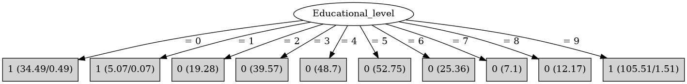

# J48

# SimpleCart Decision Tree

Educational_level=(0)|(1)|(9)

* Sex=(0): 1(75.0/0.0)

* Sex!=(0)

*   * DVRT < 84.5: 1(2.0/0.41)

*   * DVRT >= 84.5

*   *   * Prestige_score < 65.5

*   *   *   * Prestige_score < 22.5

*   *   *   *   * DVRT < 115.0: 1(2.25/0.0)

*   *   *   *   * DVRT >= 115.0: 1(3.17/0.41)

*   *   *   * Prestige_score >= 22.5

*   *   *   *   * DVRT < 107.5

*   *   *   *   *   * DVRT < 106.5: 1(15.74/0.0)

*   *   *   *   *   * DVRT >= 106.5: 1(3.0/0.41)

*   *   *   *   * DVRT >= 107.5: 1(30.96/0.0)

*   *   * Prestige_score >= 65.5

*   *   *   * Prestige_score < 67.5: 0(0.41/0.03)

*   *   *   * Prestige_score >= 67.5

*   *   *   *   * DVRT < 119.5: 1(10.66/0.0)

*   *   *   *   * DVRT >= 119.5: 0(0.41/0.16)

Educational_level!=(0)|(1)|(9): 0(204.92/0.0)

# PART

Decision list:

conditions|predicted class
---|---
Educational_level = 9| 1 (105.51/1.51)
Educational_level = 5| 0 (52.75)
Educational_level = 4| 0 (48.7)
Educational_level = 3| 0 (39.57)
Educational_level = 0| 1 (34.49/0.49)
Educational_level = 6| 0 (25.36)
Educational_level = 2| 0 (19.28)
Educational_level = 8| 0 (12.17)
Educational_level = 7| 0 (7.1)
| 1 (5.07/0.07)

# JRip

Decision list:

conditions|predicted class
---|---
(Educational_level = 9)|1 (104.0/0.0)
(Educational_level = 0)|1 (34.0/0.0)
(Educational_level = 1)|1 (5.0/0.0)
|0 (207.0/0.0)

# Decision Table

Non matches covered by Majority class

educational_level|target
---|---
?|0
1|1
7|0
0|1
9|1
3|0
2|0
5|0
8|0
6|0
4|0

