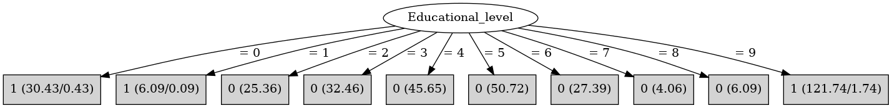

# J48

# SimpleCart Decision Tree

Educational_level=(0)|(1)|(9): 1(156.0/2.26)

Educational_level!=(0)|(1)|(9): 0(191.73/0.0)

# PART

Decision list:

conditions|predicted class
---|---
Educational_level = 5| 0 (50.72)
Educational_level = 4| 0 (45.65)
Educational_level = 3| 0 (32.46)
Educational_level = 6| 0 (27.39)
Educational_level = 2| 0 (25.36)
Educational_level = 0 AND Sex = 0| 1 (17.0)
Educational_level = 9 AND Sex = 0| 1 (70.0)
Educational_level = 9 AND DVRT <= 120 AND DVRT <= 112 AND DVRT <= 107 AND DVRT > 93| 1 (15.3/0.3)
Educational_level = 0| 1 (13.43/0.43)
Type_school = 1 AND DVRT > 90 AND DVRT <= 114 AND DVRT > 109| 1 (9.0)
Type_school = 1 AND DVRT > 90 AND DVRT > 112 AND Prestige_score <= 40| 1 (9.9/1.38)
Type_school = 1 AND DVRT > 90 AND DVRT > 112| 1 (9.25/0.77)
Type_school = 1 AND DVRT <= 90| 1 (8.38/3.38)
Type_school = 1| 1 (8.14/0.14)
| 0 (8.0/2.0)

# JRip

Decision list:

conditions|predicted class
---|---
(Educational_level = 9)|1 (120.0/0.0)
(Educational_level = 0)|1 (30.0/0.0)
(Educational_level = 1)|1 (6.0/0.0)
|0 (194.0/0.0)

# Decision Table

Non matches covered by Majority class

educational_level|target
---|---
1|1
7|0
0|1
9|1
?|0
2|0
8|0
6|0
5|0
3|0
4|0

