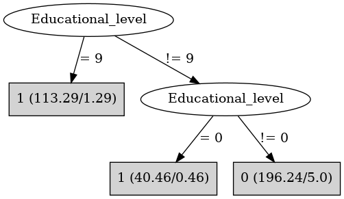

# J48

# SimpleCart Decision Tree

Educational_level=(0)|(1)|(9)

* Sex=(0): 1(86.0/0.0)

* Sex!=(0)

*   * DVRT < 106.5: 1(24.0/0.0)

*   * DVRT >= 106.5

*   *   * DVRT < 116.5: 1(24.0/1.81)

*   *   * DVRT >= 116.5: 1(23.0/0.0)

Educational_level!=(0)|(1)|(9): 0(191.18/0.0)

# PART

Decision list:

conditions|predicted class
---|---
Educational_level = 9 AND Sex = 0| 1 (66.0)
Educational_level = 9 AND Type_school = 1| 1 (43.66/0.66)
Educational_level = 0 AND Sex != 0| 1 (22.56/0.56)
Educational_level != 0 AND Educational_level != 1 AND Educational_level != 9| 0 (191.44)
Sex = 0| 1 (20.0)
DVRT <= 119.0| 1 (3.34/0.34)
| 1 (3.0)

# JRip

Decision list:

conditions|predicted class
---|---
(Educational_level = 9)|1 (112.0/0.0)
(Educational_level = 0)|1 (40.0/0.0)
(Educational_level = 1)|1 (5.0/0.0)
|0 (193.0/0.0)

# Decision Table

Non matches covered by Majority class

educational_level|target
---|---
?|0
8|0
2|0
3|0
5|0
4|0
7|0
6|0
1|1
0|1
9|1

