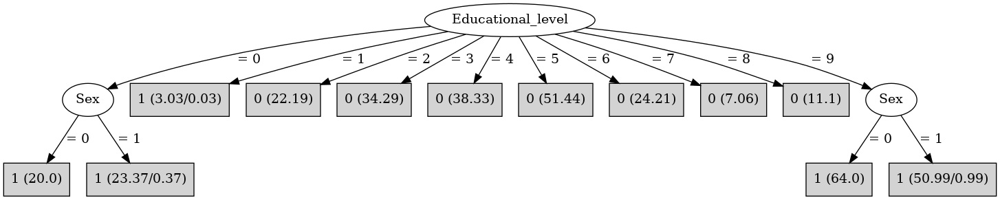

# J48

# SimpleCart Decision Tree

Educational_level=(0)|(1)|(9): 1(160.0/1.38)

Educational_level!=(0)|(1)|(9): 0(188.61/0.0)

# PART

Decision list:

conditions|predicted class
---|---
Educational_level = 9 AND Sex = 0| 1 (64.0)
Educational_level = 9| 1 (50.53/0.53)
Educational_level = 0 AND Sex != 0| 1 (23.46/0.46)
Educational_level != 0 AND Type_school != 1| 0 (120.0)
Educational_level != 0 AND Educational_level = 4| 0 (38.85)
Educational_level != 0 AND Educational_level = 2| 0 (22.49)
Educational_level = 0| 1 (20.45/0.45)
| 0 (10.22/3.0)

# JRip

Decision list:

conditions|predicted class
---|---
(Educational_level = 9)|1 (114.0/0.0)
(Educational_level = 0)|1 (43.0/0.0)
|0 (193.0/3.0)

# Decision Table

Non matches covered by Majority class

educational_level|target
---|---
1|1
9|1
0|1
?|0
7|0
6|0
8|0
4|0
3|0
2|0
5|0

