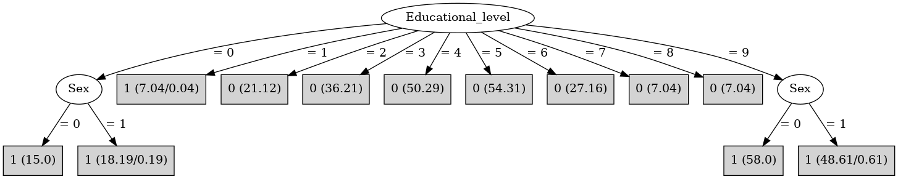

# J48

# SimpleCart Decision Tree

Educational_level=(0)|(1)|(9): 1(146.0/0.83)

Educational_level!=(0)|(1)|(9): 0(203.16/0.0)

# PART

Decision list:

conditions|predicted class
---|---
Educational_level = 5| 0 (54.31)
Educational_level = 4| 0 (50.29)
Educational_level = 3| 0 (36.21)
Educational_level = 6| 0 (27.16)
Educational_level = 2| 0 (21.12)
Educational_level = 0 AND Sex = 1| 1 (18.19/0.19)
Educational_level = 9 AND Sex = 0| 1 (58.0)
Educational_level = 9| 1 (48.42/0.42)
Educational_level = 0| 1 (15.13/0.13)
Educational_level = 1| 1 (7.06/0.06)
| 0 (14.12)

# JRip

Decision list:

conditions|predicted class
---|---
(Educational_level = 9)|1 (106.0/0.0)
(Educational_level = 0)|1 (33.0/0.0)
|0 (211.0/7.0)

# Decision Table

Non matches covered by IB1

educational_level|target
---|---
8|0
0|1
1|1
9|1
7|0
4|0
6|0
?|0
5|0
3|0
2|0

