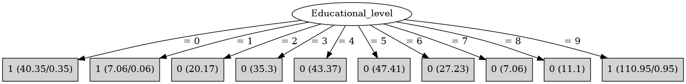

# J48

# SimpleCart Decision Tree

Educational_level=(0)|(1)|(9)

* DVRT < 84.5: 1(9.0/0.45)

* DVRT >= 84.5

*   * Prestige_score < 42.5: 1(77.69/0.0)

*   * Prestige_score >= 42.5

*   *   * Sex=(0): 1(31.39/0.0)

*   *   * Sex!=(0)

*   *   *   * Prestige_score < 44.5: 1(7.37/0.45)

*   *   *   * Prestige_score >= 44.5

*   *   *   *   * DVRT < 114.5: 1(20.15/0.0)

*   *   *   *   * DVRT >= 114.5: 1(11.38/0.45)

Educational_level!=(0)|(1)|(9): 0(191.64/0.0)

# PART

Decision list:

conditions|predicted class
---|---
Educational_level != 9 AND Educational_level != 0 AND Educational_level != 1| 0 (128.09)
| 1 (105.91/0.91)

# JRip

Decision list:

conditions|predicted class
---|---
(Educational_level = 9)|1 (110.0/0.0)
(Educational_level = 0)|1 (40.0/0.0)
|0 (200.0/7.0)

# Decision Table

Non matches covered by Majority class

educational_level|target
---|---
1|1
?|0
7|0
0|1
9|1
8|0
6|0
3|0
2|0
5|0
4|0

