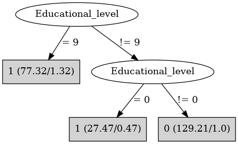

# J48

# SimpleCart Decision Tree

Educational_level=(0)|(1)|(9)

* Sex=(0): 1(79.0/0.0)

* Sex!=(0): 1(76.0/2.7)

Educational_level!=(0)|(1)|(9): 0(192.29/0.0)

# PART

Decision list:

conditions|predicted class
---|---
Educational_level != 9 AND Educational_level != 0| 0 (98.69/3.0)
| 1 (76.31/1.31)

# JRip

Decision list:

conditions|predicted class
---|---
(Educational_level = 9)|1 (112.0/0.0)
(Educational_level = 0)|1 (40.0/0.0)
|0 (198.0/3.0)

# Decision Table

Non matches covered by Majority class

educational_level|target
---|---
1|1
0|1
9|1
?|0
8|0
3|0
2|0
7|0
6|0
4|0
5|0

