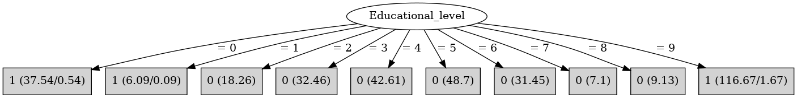

# J48

# SimpleCart Decision Tree

Educational_level=(0)|(1)|(9): 1(158.0/2.28)

Educational_level!=(0)|(1)|(9): 0(189.71/0.0)

# PART

Decision list:

conditions|predicted class
---|---
Educational_level = 9| 1 (105.34/1.34)
Educational_level = 5| 0 (41.53)
Educational_level = 4| 0 (40.51)
Educational_level = 0| 1 (34.44/0.44)
Educational_level = 3| 0 (30.39)
Educational_level = 6| 0 (25.32)
Educational_level = 2| 0 (17.22)
Educational_level = 8| 0 (9.12)
Educational_level = 7| 0 (7.09)
| 1 (4.05/0.05)

# JRip

Decision list:

conditions|predicted class
---|---
(Educational_level = 9)|1 (115.0/0.0)
(Educational_level = 0)|1 (37.0/0.0)
|0 (198.0/6.0)

# Decision Table

Non matches covered by Majority class

educational_level|type_school|target
---|---|---
8|2|0
3|2|0
5|2|0
9|2|1
7|1|0
2|1|0
?|1|0
4|1|0
1|1|1
9|1|1
0|1|1
6|0|0

