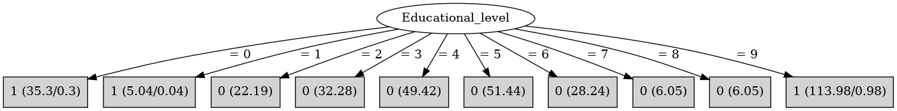

# J48

# SimpleCart Decision Tree

Educational_level=(0)|(1)|(9)

* Prestige_score < 73.0

*   * DVRT < 84.5: 1(8.0/0.44)

*   * DVRT >= 84.5

*   *   * Prestige_score < 65.5: 1(131.2/0.0)

*   *   * Prestige_score >= 65.5: 1(11.66/0.44)

* Prestige_score >= 73.0: 1(2.13/0.44)

Educational_level!=(0)|(1)|(9): 0(195.67/0.0)

# PART

Decision list:

conditions|predicted class
---|---
Educational_level = 9| 1 (95.64/0.64)
Educational_level = 5| 0 (45.3)
Educational_level = 4| 0 (42.28)
Educational_level = 0| 1 (32.21/0.21)
| 0 (84.56/5.0)

# JRip

Decision list:

conditions|predicted class
---|---
(Educational_level = 9)|1 (113.0/0.0)
(Educational_level = 0)|1 (35.0/0.0)
(Educational_level = 1)|1 (5.0/0.0)
|0 (197.0/0.0)

# Decision Table

Non matches covered by Majority class

educational_level|target
---|---
1|1
0|1
9|1
8|0
7|0
6|0
5|0
3|0
2|0
?|0
4|0

