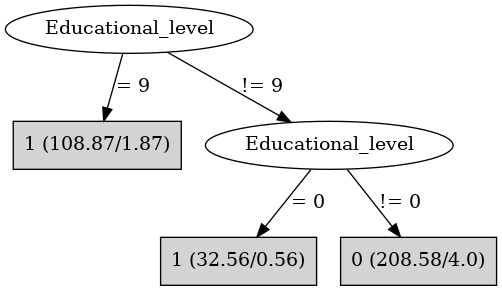

# J48

# SimpleCart Decision Tree

Educational_level=(0)|(1)|(9)

* Sex=(0): 1(77.0/0.0)

* Sex!=(0): 1(66.0/2.49)

Educational_level!=(0)|(1)|(9): 0(204.5/0.0)

# PART

Decision list:

conditions|predicted class
---|---
Educational_level != 9 AND Educational_level != 0 AND Educational_level != 1| 0 (204.51)
| 1 (145.49/2.49)

# JRip

Decision list:

conditions|predicted class
---|---
(Educational_level = 9)|1 (107.0/0.0)
(Educational_level = 0)|1 (32.0/0.0)
|0 (211.0/4.0)

# Decision Table

Non matches covered by Majority class

educational_level|target
---|---
?|0
7|0
8|0
2|0
5|0
6|0
4|0
3|0
1|1
9|1
0|1

