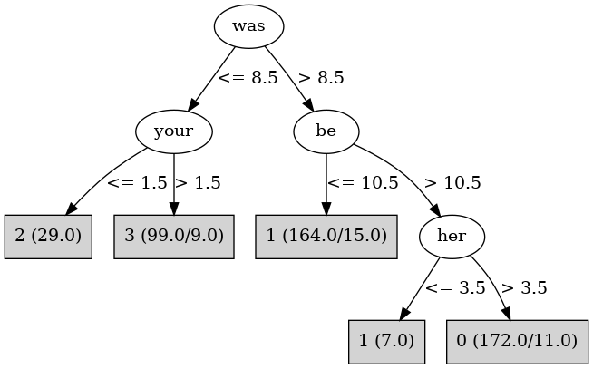

# J48

# SimpleCart Decision Tree

the < 87.5

* was < 8.5

*   * it < 6.5: 2(41.0/6.0)

*   * it >= 6.5: 3(105.0/6.0)

* was >= 8.5

*   * not < 9.5: 1(24.0/2.0)

*   * not >= 9.5

*   *   * be < 8.5: 1(11.0/5.0)

*   *   * be >= 8.5: 0(201.0/7.0)

the >= 87.5: 1(168.0/12.0)

# PART

Decision list:

conditions|predicted class
---|---
was <= 8 AND your <= 1 AND would <= 3| 2 (34.0)
was <= 8 AND it > 3 AND has <= 5 AND will > 2 AND who <= 7| 3 (109.0)
be > 12 AND her > 3 AND to > 35| 0 (191.0)
was > 10 AND the > 63 AND BookID <= 6 AND such <= 4 AND her <= 42 AND their <= 14| 1 (192.0)
an <= 1 AND BookID <= 5| 2 (11.0)
BookID <= 7 AND her > 14 AND such > 0 AND now > 0 AND our <= 2| 0 (26.0)
or <= 13 AND had > 6 AND now <= 3| 1 (12.0)
its <= 2 AND also <= 0| 3 (9.0)
a <= 20| 1 (2.0/1.0)
| 0 (2.0/1.0)

# JRip

Decision list:

conditions|predicted class
---|---
(it <= 6) and (BookID <= 1)|2 (37.0/0.0)
(a <= 15) and (from >= 8) and (an <= 2)|2 (7.0/0.0)
(was <= 8) and (at <= 8)|3 (103.0/0.0)
(was <= 10) and (only <= 1) and (any <= 3)|3 (12.0/0.0)
(be <= 9) and (the >= 87)|1 (153.0/0.0)
(not <= 11) and (her <= 18)|1 (31.0/0.0)
(to <= 41) and (should <= 1)|1 (12.0/0.0)
(be <= 8)|1 (14.0/8.0)
|0 (219.0/5.0)

# Decision Table

Non matches covered by Majority class

who|will|bookid|target
---|---|---|---
(4.5-8.5]|(5.5-inf)|(7.5-inf)|3
(-inf-4.5]|(5.5-inf)|(7.5-inf)|3
(4.5-8.5]|(2.5-5.5]|(7.5-inf)|0
(-inf-4.5]|(2.5-5.5]|(7.5-inf)|3
(-inf-4.5]|(5.5-inf)|(6.5-7.5]|0
(4.5-8.5]|(5.5-inf)|(6.5-7.5]|0
(-inf-4.5]|(-inf-2.5]|(7.5-inf)|0
(4.5-8.5]|(2.5-5.5]|(6.5-7.5]|0
(-inf-4.5]|(2.5-5.5]|(6.5-7.5]|0
(4.5-8.5]|(-inf-2.5]|(6.5-7.5]|0
(-inf-4.5]|(-inf-2.5]|(6.5-7.5]|0
(4.5-8.5]|(5.5-inf)|(5.5-6.5]|0
(-inf-4.5]|(5.5-inf)|(5.5-6.5]|0
(4.5-8.5]|(2.5-5.5]|(5.5-6.5]|0
(-inf-4.5]|(2.5-5.5]|(5.5-6.5]|0
(4.5-8.5]|(5.5-inf)|(4.5-5.5]|0
(4.5-8.5]|(-inf-2.5]|(5.5-6.5]|0
(-inf-4.5]|(-inf-2.5]|(5.5-6.5]|1
(-inf-4.5]|(5.5-inf)|(4.5-5.5]|0
(4.5-8.5]|(2.5-5.5]|(4.5-5.5]|1
(-inf-4.5]|(2.5-5.5]|(4.5-5.5]|1
(8.5-inf)|(5.5-inf)|(3.5-4.5]|0
(8.5-inf)|(-inf-2.5]|(4.5-5.5]|0
(4.5-8.5]|(-inf-2.5]|(4.5-5.5]|1
(4.5-8.5]|(5.5-inf)|(3.5-4.5]|0
(-inf-4.5]|(-inf-2.5]|(4.5-5.5]|1
(-inf-4.5]|(5.5-inf)|(3.5-4.5]|0
(8.5-inf)|(2.5-5.5]|(3.5-4.5]|0
(-inf-4.5]|(2.5-5.5]|(3.5-4.5]|0
(4.5-8.5]|(2.5-5.5]|(3.5-4.5]|0
(8.5-inf)|(5.5-inf)|(1.5-3.5]|0
(4.5-8.5]|(5.5-inf)|(1.5-3.5]|1
(8.5-inf)|(-inf-2.5]|(3.5-4.5]|1
(4.5-8.5]|(-inf-2.5]|(3.5-4.5]|0
(-inf-4.5]|(-inf-2.5]|(3.5-4.5]|1
(-inf-4.5]|(5.5-inf)|(1.5-3.5]|3
(8.5-inf)|(2.5-5.5]|(1.5-3.5]|0
(4.5-8.5]|(2.5-5.5]|(1.5-3.5]|1
(-inf-4.5]|(2.5-5.5]|(1.5-3.5]|1
(4.5-8.5]|(-inf-2.5]|(1.5-3.5]|1
(8.5-inf)|(-inf-2.5]|(1.5-3.5]|2
(8.5-inf)|(5.5-inf)|(-inf-1.5]|2
(4.5-8.5]|(5.5-inf)|(-inf-1.5]|1
(-inf-4.5]|(-inf-2.5]|(1.5-3.5]|1
(-inf-4.5]|(5.5-inf)|(-inf-1.5]|0
(4.5-8.5]|(2.5-5.5]|(-inf-1.5]|2
(8.5-inf)|(2.5-5.5]|(-inf-1.5]|2
(-inf-4.5]|(2.5-5.5]|(-inf-1.5]|0
(8.5-inf)|(-inf-2.5]|(-inf-1.5]|2
(4.5-8.5]|(-inf-2.5]|(-inf-1.5]|2
(-inf-4.5]|(-inf-2.5]|(-inf-1.5]|1

