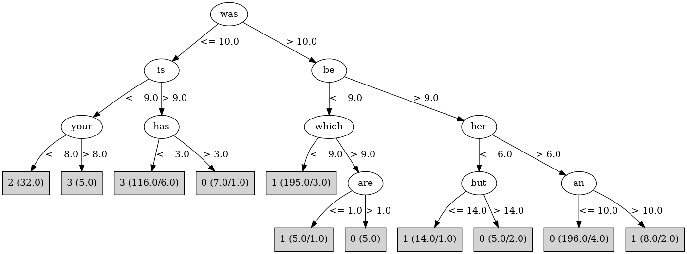

# J48

# SimpleCart Decision Tree

the < 80.5

* was < 10.5

*   * is < 9.5

*   *   * from < 7.0: 3(5.0/0.0)

*   *   * from >= 7.0: 2(29.0/0.0)

*   * is >= 9.5

*   *   * to < 48.5: 3(101.0/1.0)

*   *   * to >= 48.5

*   *   *   * has < 0.5: 3(5.0/1.0)

*   *   *   * has >= 0.5: 0(9.0/0.0)

* was >= 10.5

*   * be < 8.5: 1(17.0/3.0)

*   * be >= 8.5

*   *   * not < 9.5: 1(5.0/1.0)

*   *   * not >= 9.5: 0(183.0/4.0)

the >= 80.5

* be < 15.5

*   * was < 10.0

*   *   * a < 14.5: 2(3.0/0.0)

*   *   * a >= 14.5: 3(5.0/0.0)

*   * was >= 10.0: 1(194.0/7.0)

* be >= 15.5

*   * as < 10.0: 1(3.0/0.0)

*   * as >= 10.0: 0(12.0/0.0)

# PART

Decision list:

conditions|predicted class
---|---
was > 10.5 AND be <= 9.5 AND which <= 9.5 AND such <= 4.5 AND even <= 3.5| 1 (178.0)
was > 10.5 AND her > 6.5 AND not > 9.5 AND to > 41.5 AND down <= 3.5| 0 (180.0)
was <= 8.5 AND your <= 1.5 AND been <= 0.5| 2 (18.0)
was <= 10.5 AND or <= 12.5 AND its <= 0.5 AND a > 15.5 AND be <= 20.5| 3 (102.0)
BookID > 7.5| 3 (13.0)
it <= 8.5 AND also > 0.5| 2 (10.0)
from <= 10.0 AND the <= 68.5 AND even <= 1.5| 0 (17.0)
from <= 10.0 AND the > 65.0 AND be <= 13.5| 1 (34.0)
an > 2.5 AND which > 4.5| 0 (15.0)
from <= 9.0| 1 (12.0/4.0)
| 2 (9.0/1.0)

# JRip

Decision list:

conditions|predicted class
---|---
(it <= 6) and (or >= 7)|2 (32.0/0.0)
(was <= 10) and (this >= 9)|3 (95.0/2.0)
(was <= 6)|3 (22.0/1.0)
(be >= 10) and (her >= 17)|0 (174.0/2.0)
(not >= 18) and (any >= 3)|0 (31.0/2.0)
|1 (234.0/18.0)

# Decision Table

Non matches covered by IB1

are|be|target
---|---|---
(-inf-2.5]|(18.5-inf)|0
(5.5-inf)|(18.5-inf)|0
(2.5-5.5]|(18.5-inf)|0
(5.5-inf)|(14.5-18.5]|3
(-inf-2.5]|(14.5-18.5]|0
(2.5-5.5]|(14.5-18.5]|0
(2.5-5.5]|(9.5-14.5]|3
(-inf-2.5]|(9.5-14.5]|0
(5.5-inf)|(9.5-14.5]|3
(-inf-2.5]|(5.5-9.5]|1
(5.5-inf)|(5.5-9.5]|3
(2.5-5.5]|(5.5-9.5]|1
(2.5-5.5]|(-inf-5.5]|1
(5.5-inf)|(-inf-5.5]|1
(-inf-2.5]|(-inf-5.5]|1

