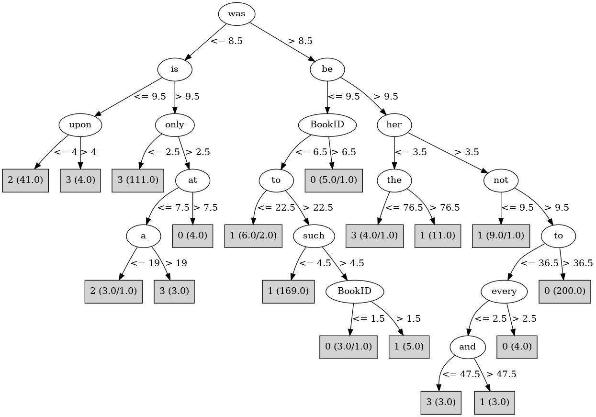

# J48

# SimpleCart Decision Tree

the < 80.5

* was < 8.5

*   * is < 9.5: 2(38.0/4.0)

*   * is >= 9.5: 3(113.0/6.0)

* was >= 8.5

*   * be < 8.5: 1(18.0/3.0)

*   * be >= 8.5

*   *   * to < 35.5: 1(4.0/4.0)

*   *   * to >= 35.5: 0(188.0/5.0)

the >= 80.5

* be < 12.5: 1(169.0/10.0)

* be >= 12.5

*   * her < 8.0: 1(8.0/1.0)

*   * her >= 8.0: 0(17.0/0.0)

# PART

Decision list:

conditions|predicted class
---|---
was <= 8 AND is > 9 AND only <= 2| 3 (111.0)
was <= 8 AND from > 7 AND any <= 0| 2 (35.0)
be <= 9 AND was > 10 AND which <= 6 AND to > 24| 1 (155.0)
a > 13 AND the > 89 AND must <= 3 AND such <= 2| 1 (27.0)
a > 14 AND her > 3 AND to > 36 AND an <= 9 AND down <= 3| 0 (197.0)
a > 14 AND not > 9 AND any <= 2| 3 (17.0/5.0)
it > 8 AND not > 9 AND any <= 4| 0 (13.0/6.0)
any > 4| 0 (12.0/1.0)
or <= 6| 1 (11.0)
| 2 (10.0)

# JRip

Decision list:

conditions|predicted class
---|---
(it <= 6) and (BookID <= 2)|2 (43.0/2.0)
(was <= 10) and (only <= 2) and (be <= 25) and (been <= 5)|3 (120.0/1.0)
(be <= 9) and (it >= 12)|1 (166.0/3.0)
(the >= 90)|1 (35.0/7.0)
|0 (224.0/18.0)

# Decision Table

Non matches covered by Majority class

be|even|it|was|target
---|---|---|---|---
(7.5-9.5]|all|(14.5-inf)|(37.5-inf)|1
(9.5-12.5]|all|(14.5-inf)|(37.5-inf)|1
(12.5-18.5]|all|(14.5-inf)|(37.5-inf)|0
(18.5-inf)|all|(14.5-inf)|(37.5-inf)|0
(-inf-7.5]|all|(14.5-inf)|(37.5-inf)|1
(12.5-18.5]|all|(6.5-14.5]|(37.5-inf)|0
(-inf-7.5]|all|(6.5-14.5]|(37.5-inf)|1
(7.5-9.5]|all|(6.5-14.5]|(37.5-inf)|0
(12.5-18.5]|all|(14.5-inf)|(17.5-37.5]|0
(18.5-inf)|all|(14.5-inf)|(17.5-37.5]|0
(7.5-9.5]|all|(14.5-inf)|(17.5-37.5]|1
(9.5-12.5]|all|(14.5-inf)|(17.5-37.5]|0
(-inf-7.5]|all|(14.5-inf)|(17.5-37.5]|1
(-inf-7.5]|all|(-inf-6.5]|(37.5-inf)|0
(9.5-12.5]|all|(6.5-14.5]|(17.5-37.5]|0
(12.5-18.5]|all|(6.5-14.5]|(17.5-37.5]|0
(18.5-inf)|all|(6.5-14.5]|(17.5-37.5]|0
(7.5-9.5]|all|(6.5-14.5]|(17.5-37.5]|0
(-inf-7.5]|all|(6.5-14.5]|(17.5-37.5]|1
(12.5-18.5]|all|(14.5-inf)|(8.5-17.5]|0
(18.5-inf)|all|(14.5-inf)|(8.5-17.5]|0
(9.5-12.5]|all|(14.5-inf)|(8.5-17.5]|0
(7.5-9.5]|all|(14.5-inf)|(8.5-17.5]|1
(-inf-7.5]|all|(14.5-inf)|(8.5-17.5]|1
(-inf-7.5]|all|(-inf-6.5]|(17.5-37.5]|0
(18.5-inf)|all|(6.5-14.5]|(8.5-17.5]|0
(12.5-18.5]|all|(6.5-14.5]|(8.5-17.5]|0
(7.5-9.5]|all|(6.5-14.5]|(8.5-17.5]|0
(9.5-12.5]|all|(6.5-14.5]|(8.5-17.5]|3
(-inf-7.5]|all|(6.5-14.5]|(8.5-17.5]|0
(-inf-7.5]|all|(14.5-inf)|(-inf-8.5]|3
(7.5-9.5]|all|(14.5-inf)|(-inf-8.5]|3
(18.5-inf)|all|(14.5-inf)|(-inf-8.5]|0
(9.5-12.5]|all|(14.5-inf)|(-inf-8.5]|3
(12.5-18.5]|all|(14.5-inf)|(-inf-8.5]|3
(-inf-7.5]|all|(-inf-6.5]|(8.5-17.5]|1
(9.5-12.5]|all|(-inf-6.5]|(8.5-17.5]|0
(12.5-18.5]|all|(6.5-14.5]|(-inf-8.5]|3
(9.5-12.5]|all|(6.5-14.5]|(-inf-8.5]|3
(7.5-9.5]|all|(6.5-14.5]|(-inf-8.5]|3
(-inf-7.5]|all|(6.5-14.5]|(-inf-8.5]|3
(18.5-inf)|all|(6.5-14.5]|(-inf-8.5]|3
(7.5-9.5]|all|(-inf-6.5]|(-inf-8.5]|2
(12.5-18.5]|all|(-inf-6.5]|(-inf-8.5]|3
(9.5-12.5]|all|(-inf-6.5]|(-inf-8.5]|2
(-inf-7.5]|all|(-inf-6.5]|(-inf-8.5]|2

