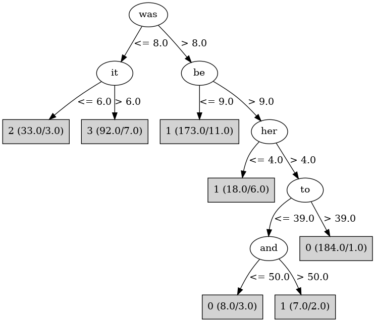

# J48

# SimpleCart Decision Tree

the < 89.5

* was < 9.5

*   * it < 6.5: 2(33.0/3.0)

*   * it >= 6.5: 3(101.0/10.0)

* was >= 9.5

*   * be < 9.5: 1(38.0/9.0)

*   * be >= 9.5

*   *   * to < 36.5: 3(5.0/7.0)

*   *   * to >= 36.5: 0(208.0/1.0)

the >= 89.5: 1(164.0/9.0)

# PART

Decision list:

conditions|predicted class
---|---
was <= 8 AND it <= 6 AND a <= 24| 2 (29.0)
was > 8 AND be > 9 AND our <= 6 AND her > 3| 0 (202.0/7.0)
was > 8 AND BookID <= 6| 1 (182.0/5.0)
had <= 7| 3 (101.0/6.0)
| 0 (9.0/1.0)

# JRip

Decision list:

conditions|predicted class
---|---
(it <= 6) and (their >= 5)|2 (32.0/0.0)
(or >= 12) and (any <= 0)|2 (5.0/0.0)
(was <= 9) and (only <= 1) and (and >= 32)|3 (90.0/0.0)
(was <= 8) and (up >= 2)|3 (13.0/0.0)
(this >= 15) and (at <= 5)|3 (5.0/0.0)
(in <= 17) and (to <= 34) and (an <= 8)|3 (4.0/0.0)
(be <= 9) and (the >= 87)|1 (152.0/0.0)
(not <= 11) and (BookID <= 5) and (from <= 12)|1 (41.0/0.0)
(the >= 76) and (that >= 24) and (any <= 4)|1 (10.0/0.0)
|0 (236.0/4.0)

# Decision Table

Non matches covered by Majority class

a|at|be|target
---|---|---|---
(10.5-15.5]|(7.5-inf)|(17.5-inf)|0
(33.5-inf)|(7.5-inf)|(17.5-inf)|0
(15.5-33.5]|(7.5-inf)|(17.5-inf)|0
(33.5-inf)|(3.5-7.5]|(17.5-inf)|0
(15.5-33.5]|(3.5-7.5]|(17.5-inf)|0
(10.5-15.5]|(7.5-inf)|(9.5-17.5]|0
(15.5-33.5]|(-inf-3.5]|(17.5-inf)|0
(10.5-15.5]|(-inf-3.5]|(17.5-inf)|3
(15.5-33.5]|(7.5-inf)|(9.5-17.5]|0
(33.5-inf)|(7.5-inf)|(9.5-17.5]|0
(-inf-10.5]|(3.5-7.5]|(9.5-17.5]|2
(10.5-15.5]|(3.5-7.5]|(9.5-17.5]|0
(15.5-33.5]|(3.5-7.5]|(9.5-17.5]|3
(33.5-inf)|(3.5-7.5]|(9.5-17.5]|3
(10.5-15.5]|(-inf-3.5]|(9.5-17.5]|2
(10.5-15.5]|(7.5-inf)|(3.5-9.5]|2
(15.5-33.5]|(-inf-3.5]|(9.5-17.5]|3
(33.5-inf)|(-inf-3.5]|(9.5-17.5]|3
(-inf-10.5]|(7.5-inf)|(3.5-9.5]|2
(33.5-inf)|(7.5-inf)|(3.5-9.5]|1
(15.5-33.5]|(7.5-inf)|(3.5-9.5]|1
(-inf-10.5]|(3.5-7.5]|(3.5-9.5]|2
(10.5-15.5]|(3.5-7.5]|(3.5-9.5]|2
(15.5-33.5]|(3.5-7.5]|(3.5-9.5]|1
(33.5-inf)|(3.5-7.5]|(3.5-9.5]|1
(-inf-10.5]|(-inf-3.5]|(3.5-9.5]|2
(10.5-15.5]|(7.5-inf)|(-inf-3.5]|0
(33.5-inf)|(-inf-3.5]|(3.5-9.5]|1
(10.5-15.5]|(-inf-3.5]|(3.5-9.5]|0
(33.5-inf)|(7.5-inf)|(-inf-3.5]|1
(15.5-33.5]|(-inf-3.5]|(3.5-9.5]|3
(15.5-33.5]|(7.5-inf)|(-inf-3.5]|1
(10.5-15.5]|(3.5-7.5]|(-inf-3.5]|0
(15.5-33.5]|(3.5-7.5]|(-inf-3.5]|1
(33.5-inf)|(3.5-7.5]|(-inf-3.5]|1
(33.5-inf)|(-inf-3.5]|(-inf-3.5]|0
(15.5-33.5]|(-inf-3.5]|(-inf-3.5]|1

