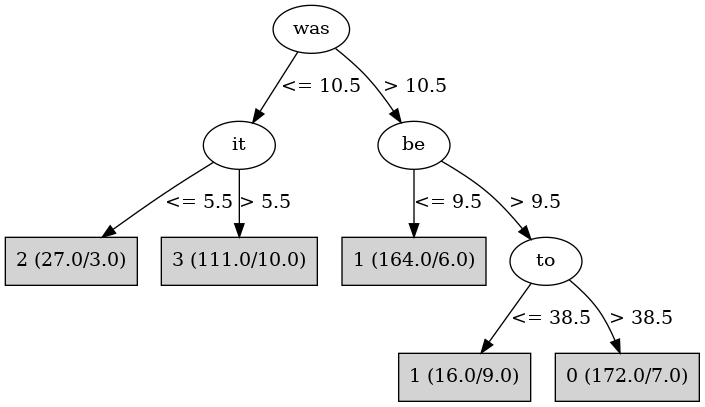

# J48

# SimpleCart Decision Tree

be < 9.5

* was < 8.5

*   * is < 11.5: 2(25.0/2.0)

*   * is >= 11.5: 3(27.0/0.0)

* was >= 8.5: 1(188.0/8.0)

be >= 9.5

* was < 8.5

*   * from < 14.0: 3(91.0/5.0)

*   * from >= 14.0: 2(5.0/0.0)

* was >= 8.5

*   * to < 38.5

*   *   * the < 66.5: 3(9.0/4.0)

*   *   * the >= 66.5: 1(12.0/2.0)

*   * to >= 38.5: 0(203.0/7.0)

# PART

Decision list:

conditions|predicted class
---|---
was <= 8 AND your > 1| 3 (127.0/8.0)
was > 8 AND be <= 9| 1 (196.0/8.0)
was > 8 AND to > 38 AND not > 11| 0 (193.0)
was <= 8| 2 (28.0/1.0)
the > 66 AND BookID <= 5| 1 (20.0/1.0)
our <= 2| 0 (14.0)
| 3 (10.0/1.0)

# JRip

Decision list:

conditions|predicted class
---|---
(it <= 6) and (to >= 32)|2 (28.0/0.0)
(was <= 10) and (to <= 47) and (my >= 8)|3 (114.0/0.0)
(was <= 4)|3 (12.0/2.0)
(be <= 9)|1 (198.0/10.0)
(not <= 11) and (BookID <= 5)|1 (15.0/0.0)
|0 (221.0/9.0)

# Decision Table

Non matches covered by IB1

be|it|was|target
---|---|---|---
(9.5-17.5]|(15.5-inf)|(44.5-inf)|0
(5.5-9.5]|(15.5-inf)|(44.5-inf)|1
(-inf-5.5]|(15.5-inf)|(44.5-inf)|1
(-inf-5.5]|(5.5-15.5]|(44.5-inf)|1
(5.5-9.5]|(5.5-15.5]|(44.5-inf)|1
(17.5-25.5]|(15.5-inf)|(30.5-44.5]|0
(25.5-inf)|(15.5-inf)|(30.5-44.5]|0
(5.5-9.5]|(15.5-inf)|(30.5-44.5]|1
(9.5-17.5]|(15.5-inf)|(30.5-44.5]|0
(-inf-5.5]|(15.5-inf)|(30.5-44.5]|1
(17.5-25.5]|(5.5-15.5]|(30.5-44.5]|0
(5.5-9.5]|(5.5-15.5]|(30.5-44.5]|1
(25.5-inf)|(5.5-15.5]|(30.5-44.5]|0
(9.5-17.5]|(5.5-15.5]|(30.5-44.5]|0
(-inf-5.5]|(5.5-15.5]|(30.5-44.5]|1
(5.5-9.5]|(-inf-5.5]|(30.5-44.5]|0
(9.5-17.5]|(-inf-5.5]|(30.5-44.5]|0
(9.5-17.5]|(15.5-inf)|(17.5-30.5]|0
(25.5-inf)|(15.5-inf)|(17.5-30.5]|0
(17.5-25.5]|(15.5-inf)|(17.5-30.5]|0
(-inf-5.5]|(15.5-inf)|(17.5-30.5]|1
(5.5-9.5]|(15.5-inf)|(17.5-30.5]|1
(9.5-17.5]|(5.5-15.5]|(17.5-30.5]|0
(17.5-25.5]|(5.5-15.5]|(17.5-30.5]|0
(5.5-9.5]|(5.5-15.5]|(17.5-30.5]|1
(-inf-5.5]|(5.5-15.5]|(17.5-30.5]|1
(-inf-5.5]|(15.5-inf)|(8.5-17.5]|1
(25.5-inf)|(15.5-inf)|(8.5-17.5]|0
(17.5-25.5]|(15.5-inf)|(8.5-17.5]|0
(9.5-17.5]|(15.5-inf)|(8.5-17.5]|0
(5.5-9.5]|(15.5-inf)|(8.5-17.5]|1
(5.5-9.5]|(5.5-15.5]|(8.5-17.5]|3
(17.5-25.5]|(5.5-15.5]|(8.5-17.5]|0
(-inf-5.5]|(5.5-15.5]|(8.5-17.5]|0
(9.5-17.5]|(5.5-15.5]|(8.5-17.5]|3
(-inf-5.5]|(-inf-5.5]|(8.5-17.5]|0
(17.5-25.5]|(15.5-inf)|(-inf-8.5]|3
(5.5-9.5]|(15.5-inf)|(-inf-8.5]|3
(9.5-17.5]|(15.5-inf)|(-inf-8.5]|3
(-inf-5.5]|(5.5-15.5]|(-inf-8.5]|3
(17.5-25.5]|(5.5-15.5]|(-inf-8.5]|3
(5.5-9.5]|(5.5-15.5]|(-inf-8.5]|3
(9.5-17.5]|(5.5-15.5]|(-inf-8.5]|3
(17.5-25.5]|(-inf-5.5]|(-inf-8.5]|0
(9.5-17.5]|(-inf-5.5]|(-inf-8.5]|2
(5.5-9.5]|(-inf-5.5]|(-inf-8.5]|2
(-inf-5.5]|(-inf-5.5]|(-inf-8.5]|2

