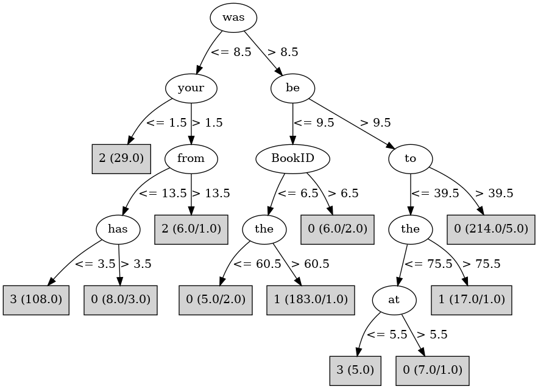

# J48

# SimpleCart Decision Tree

be < 9.5

* was < 9.5

*   * BookID < 2.5: 2(26.0/2.0)

*   * BookID >= 2.5: 3(26.0/0.0)

* was >= 9.5: 1(183.0/10.0)

be >= 9.5

* was < 8.5: 3(85.0/13.0)

* was >= 8.5

*   * to < 39.5

*   *   * the < 75.5: 0(6.0/6.0)

*   *   * the >= 75.5: 1(16.0/1.0)

*   * to >= 39.5: 0(209.0/5.0)

# PART

Decision list:

conditions|predicted class
---|---
was > 10.5 AND be > 9.5 AND to > 39.5| 0 (141.0/5.0)
was > 10.5 AND not <= 23| 1 (137.0/7.0)
from <= 9.5 AND had <= 7.5 AND to <= 47.5| 3 (79.0/2.0)
has <= 1.5 AND your <= 2.5| 2 (19.0)
has > 1.5| 0 (11.0)
| 3 (5.0/2.0)

# JRip

Decision list:

conditions|predicted class
---|---
(it <= 5) and (from >= 8)|2 (30.0/0.0)
(was <= 8) and (to <= 48) and (all <= 17)|3 (106.0/0.0)
(be <= 9) and (the >= 89) and (a >= 13)|1 (144.0/0.0)
(not <= 9) and (and <= 65)|1 (33.0/0.0)
(which <= 2) and (the >= 68) and (it >= 13)|1 (20.0/0.0)
|0 (255.0/27.0)

# Decision Table

Non matches covered by IB1

also|an|at|by|target
---|---|---|---|---
(0.5-inf)|(11.5-inf)|(7.5-inf)|all|1
(-inf-0.5]|(11.5-inf)|(7.5-inf)|all|1
(0.5-inf)|(2.5-11.5]|(7.5-inf)|all|1
(-inf-0.5]|(2.5-11.5]|(7.5-inf)|all|0
(-inf-0.5]|(11.5-inf)|(5.5-7.5]|all|1
(0.5-inf)|(1.5-2.5]|(7.5-inf)|all|1
(0.5-inf)|(11.5-inf)|(5.5-7.5]|all|1
(-inf-0.5]|(1.5-2.5]|(7.5-inf)|all|0
(0.5-inf)|(-inf-1.5]|(7.5-inf)|all|1
(0.5-inf)|(2.5-11.5]|(5.5-7.5]|all|1
(-inf-0.5]|(-inf-1.5]|(7.5-inf)|all|0
(-inf-0.5]|(2.5-11.5]|(5.5-7.5]|all|0
(0.5-inf)|(11.5-inf)|(-inf-5.5]|all|0
(-inf-0.5]|(11.5-inf)|(-inf-5.5]|all|1
(0.5-inf)|(1.5-2.5]|(5.5-7.5]|all|1
(-inf-0.5]|(1.5-2.5]|(5.5-7.5]|all|0
(0.5-inf)|(-inf-1.5]|(5.5-7.5]|all|2
(-inf-0.5]|(-inf-1.5]|(5.5-7.5]|all|2
(-inf-0.5]|(2.5-11.5]|(-inf-5.5]|all|3
(0.5-inf)|(2.5-11.5]|(-inf-5.5]|all|1
(0.5-inf)|(1.5-2.5]|(-inf-5.5]|all|1
(-inf-0.5]|(1.5-2.5]|(-inf-5.5]|all|3
(0.5-inf)|(-inf-1.5]|(-inf-5.5]|all|2
(-inf-0.5]|(-inf-1.5]|(-inf-5.5]|all|3

