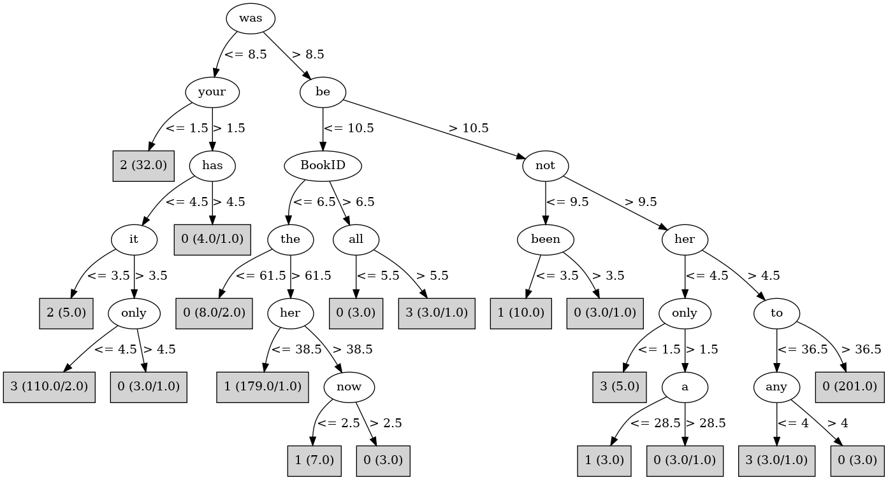

# J48

# SimpleCart Decision Tree

the < 89.5

* was < 10.5

*   * it < 6.5

*   *   * do < 5.5: 2(36.0/0.0)

*   *   * do >= 5.5: 3(3.0/0.0)

*   * it >= 6.5

*   *   * to < 48.5: 3(102.0/0.0)

*   *   * to >= 48.5

*   *   *   * has < 0.5

*   *   *   *   * can < 3.0: 3(7.0/0.0)

*   *   *   *   * can >= 3.0: 2(2.0/0.0)

*   *   *   * has >= 0.5: 0(10.0/0.0)

* was >= 10.5

*   * be < 9.5

*   *   * which < 5.5: 1(39.0/0.0)

*   *   * which >= 5.5

*   *   *   * her < 15.0: 1(2.0/1.0)

*   *   *   * her >= 15.0: 0(9.0/0.0)

*   * be >= 9.5

*   *   * not < 7.5: 1(4.0/0.0)

*   *   * not >= 7.5

*   *   *   * this < 16.5

*   *   *   *   * her < 3.0: 2(1.0/1.0)

*   *   *   *   * her >= 3.0: 0(204.0/2.0)

*   *   *   * this >= 16.5: 3(2.0/0.0)

the >= 89.5

* or < 9.5

*   * be < 18.5: 1(155.0/1.0)

*   * be >= 18.5: 0(3.0/1.0)

* or >= 9.5: 2(2.0/1.0)

# PART

Decision list:

conditions|predicted class
---|---
was <= 8.5 AND your > 1.5 AND it > 3.5 AND only <= 4.5 AND has <= 3.5 AND have > 4.5| 3 (100.0)
it <= 6.5 AND BookID <= 3| 2 (38.0)
be <= 9.5 AND BookID <= 6.5 AND the > 60.5 AND such <= 4.5 AND a > 18.5| 1 (172.0)
BookID <= 7.5 AND the <= 89.5 AND to > 35.5 AND was > 7.5 AND not > 9.5 AND has <= 9.5| 0 (212.0)
to <= 55 AND the <= 66 AND and <= 59.5| 3 (13.0)
to <= 55 AND from <= 10 AND the > 69.5 AND with <= 17.5| 1 (26.0)
there <= 5.5 AND be > 11.5| 0 (13.0)
were <= 4.5| 3 (8.0/3.0)
| 1 (6.0/1.0)

# JRip

Decision list:

conditions|predicted class
---|---
(it <= 6) and (from >= 8)|2 (40.0/2.0)
(with >= 24) and (then >= 5)|2 (4.0/1.0)
(was <= 8) and (only <= 5)|3 (110.0/3.0)
(BookID >= 8)|3 (6.0/0.0)
(be <= 9) and (the >= 83)|1 (159.0/0.0)
(not <= 9) and (at <= 15)|1 (28.0/1.0)
(be <= 10) and (now <= 2)|1 (8.0/1.0)
(the >= 90)|1 (8.0/3.0)
|0 (225.0/6.0)

# Decision Table

Non matches covered by Majority class

be|was|target
---|---|---
(13.5-17.5]|(44.5-inf)|0
(17.5-inf)|(44.5-inf)|0
(9.5-13.5]|(44.5-inf)|1
(5.5-9.5]|(44.5-inf)|1
(-inf-5.5]|(44.5-inf)|1
(5.5-9.5]|(31.5-44.5]|1
(-inf-5.5]|(31.5-44.5]|1
(17.5-inf)|(31.5-44.5]|0
(9.5-13.5]|(31.5-44.5]|0
(13.5-17.5]|(31.5-44.5]|0
(-inf-5.5]|(17.5-31.5]|1
(5.5-9.5]|(17.5-31.5]|1
(13.5-17.5]|(17.5-31.5]|0
(9.5-13.5]|(17.5-31.5]|0
(17.5-inf)|(17.5-31.5]|0
(5.5-9.5]|(8.5-17.5]|1
(9.5-13.5]|(8.5-17.5]|3
(-inf-5.5]|(8.5-17.5]|1
(13.5-17.5]|(8.5-17.5]|0
(17.5-inf)|(8.5-17.5]|0
(-inf-5.5]|(-inf-8.5]|2
(5.5-9.5]|(-inf-8.5]|3
(13.5-17.5]|(-inf-8.5]|3
(9.5-13.5]|(-inf-8.5]|3
(17.5-inf)|(-inf-8.5]|3

