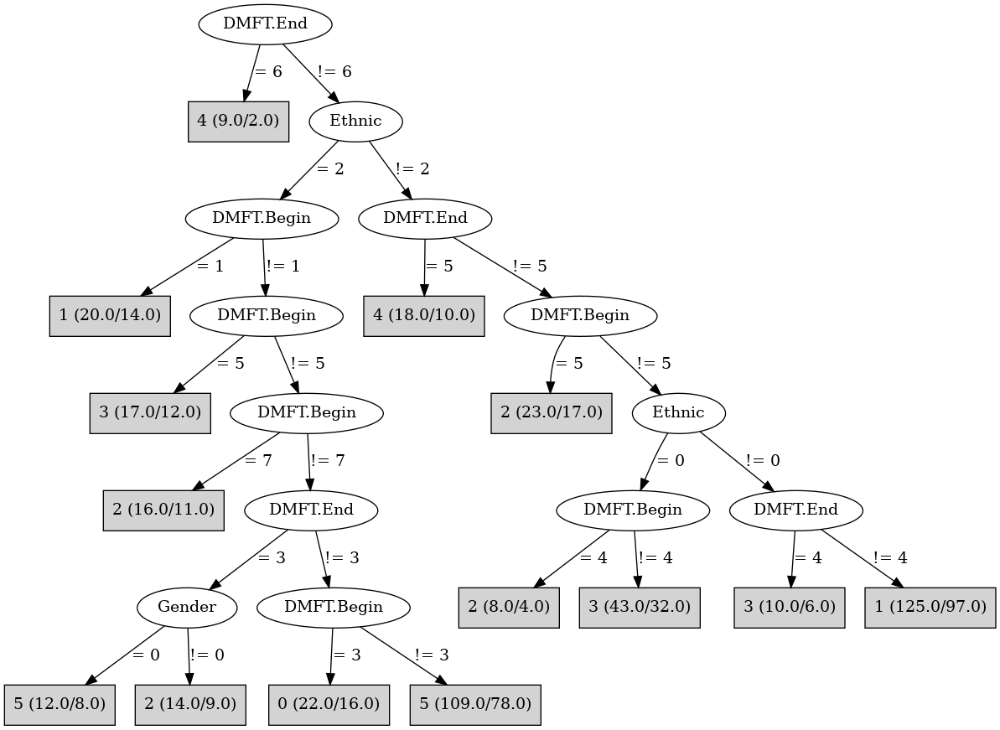

# J48

# SimpleCart Decision Tree

Ethnic=(2)

* DMFT.Begin=(5)|(8)|(4)|(6)|(7)|(1)

*   * DMFT.Begin=(5)|(8)|(4)|(6)|(7)|(0)|(2)|(3)

*   *   * DMFT.End=(0): 2(6.0/10.0)

*   *   * DMFT.End!=(0): 3(24.0/86.0)

*   * DMFT.Begin!=(5)|(8)|(4)|(6)|(7)|(0)|(2)|(3): 3(7.0/18.0)

* DMFT.Begin!=(5)|(8)|(4)|(6)|(7)|(1)

*   * DMFT.End=(5)|(3)|(2)|(1)|(4)|(6)

*   *   * Gender=(1): 5(11.0/14.0)

*   *   * Gender!=(1): 5(12.0/29.0)

*   * DMFT.End!=(5)|(3)|(2)|(1)|(4)|(6)

*   *   * DMFT.Begin=(3)|(2): 0(7.0/8.0)

*   *   * DMFT.Begin!=(3)|(2)

*   *   *   * Gender=(1): 3(7.0/9.0)

*   *   *   * Gender!=(1): 3(5.0/10.0)

Ethnic!=(2)

* DMFT.Begin=(5)|(8)|(4)|(6)

*   * DMFT.End=(0)|(4)|(2)|(1)

*   *   * Gender=(1)

*   *   *   * DMFT.Begin=(6)|(5)|(0)|(1)|(2)|(3)|(7): 2(11.0/10.0)

*   *   *   * DMFT.Begin!=(6)|(5)|(0)|(1)|(2)|(3)|(7): 4(5.0/12.0)

*   *   * Gender!=(1): 4(8.0/21.0)

*   * DMFT.End!=(0)|(4)|(2)|(1): 4(20.0/26.0)

* DMFT.Begin!=(5)|(8)|(4)|(6)

*   * DMFT.End=(5)|(3)|(2)|(1)|(6)

*   *   * DMFT.Begin=(7)|(0)|(2)|(3)|(4)|(5)|(6)|(8)

*   *   *   * DMFT.Begin=(7)|(2): 0(11.0/29.0)

*   *   *   * DMFT.Begin!=(7)|(2): 1(9.0/32.0)

*   *   * DMFT.Begin!=(7)|(0)|(2)|(3)|(4)|(5)|(6)|(8): 1(5.0/8.0)

*   * DMFT.End!=(5)|(3)|(2)|(1)|(6)

*   *   * Gender=(1)

*   *   *   * DMFT.Begin=(7)|(0)|(2)|(4)|(5)|(6)|(8): 0(8.0/22.0)

*   *   *   * DMFT.Begin!=(7)|(0)|(2)|(4)|(5)|(6)|(8): 0(4.0/8.0)

*   *   * Gender!=(1): 3(18.0/27.0)

# PART

Decision list:

conditions|predicted class
---|---
DMFT.Begin = 1 AND DMFT.End = 0| 5 (12.0/7.0)
DMFT.Begin = 1 AND Gender = 0 AND Ethnic = 1| 4 (3.0/1.0)
DMFT.Begin = 1| 1 (9.0/5.0)
DMFT.End = 3 AND DMFT.Begin = 5| 1 (7.0/5.0)
DMFT.Begin = 8 AND DMFT.End = 5| 1 (3.0/2.0)
DMFT.End = 5 AND DMFT.Begin = 7| 0 (5.0/2.0)
DMFT.End = 3 AND DMFT.Begin = 6| 4 (7.0/3.0)
DMFT.Begin = 6 AND DMFT.End = 2| 2 (7.0/4.0)
DMFT.Begin = 6 AND DMFT.End = 4| 2 (6.0/3.0)
DMFT.End = 5| 4 (7.0/4.0)
DMFT.Begin = 5| 2 (17.0/12.0)
DMFT.End = 6| 4 (5.0/3.0)
DMFT.Begin = 6| 2 (4.0/2.0)
DMFT.End = 4 AND DMFT.Begin = 2| 0 (3.0/2.0)
DMFT.End = 4 AND DMFT.Begin = 4 AND Gender = 1| 0 (3.0/2.0)
DMFT.End = 4| 0 (9.0/7.0)
Ethnic = 1 AND DMFT.Begin = 0| 0 (27.0/17.0)
Ethnic = 0| 3 (23.0/17.0)
DMFT.Begin = 0 AND DMFT.End = 0| 3 (17.0/11.0)
Ethnic = 2 AND DMFT.Begin = 3 AND Gender = 0| 1 (6.0/2.0)
Ethnic = 2 AND DMFT.Begin = 2 AND DMFT.End = 1| 5 (8.0/4.0)
DMFT.Begin = 8| 2 (6.0/4.0)
DMFT.End = 1 AND DMFT.Begin = 0| 5 (4.0/2.0)
DMFT.End = 1 AND DMFT.Begin = 2| 0 (3.0/2.0)
DMFT.End = 1 AND Ethnic = 1 AND DMFT.Begin = 3 AND Gender = 0| 0 (2.0/1.0)
DMFT.End = 1| 5 (13.0/8.0)
Ethnic = 2 AND DMFT.End = 0 AND DMFT.Begin = 2 AND Gender = 0| 0 (3.0/2.0)
Ethnic = 2 AND DMFT.End = 0 AND DMFT.Begin = 2| 2 (3.0/1.0)
Ethnic = 2 AND DMFT.End = 0 AND Gender = 0| 2 (2.0/1.0)
Ethnic = 2| 2 (20.0/13.0)
DMFT.Begin = 4| 3 (10.0/6.0)
| 1 (25.0/17.0)

# JRip

Decision list:

conditions|predicted class
---|---
(DMFT.End = 6)|4 (12.0/5.0)
|3 (545.0/431.0)

# Decision Table

Non matches covered by IB1

gender|target
---|---
1|4
0|3

