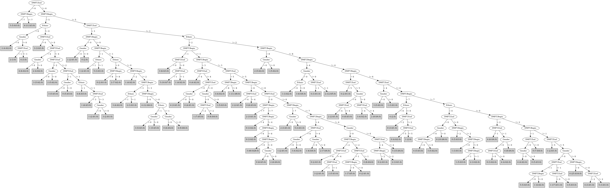

# J48

# SimpleCart Decision Tree

DMFT.End=(6)|(3)|(5)

* DMFT.Begin=(5)|(8)|(4)|(6)|(7)|(3)|(1)

*   * DMFT.Begin=(5)|(8)

*   *   * DMFT.End=(5): 3(5.0/9.0)

*   *   * DMFT.End!=(5)

*   *   *   * Ethnic=(2): 1(5.0/9.0)

*   *   *   * Ethnic!=(2): 4(9.0/5.0)

*   * DMFT.Begin!=(5)|(8)

*   *   * Ethnic=(2)|(1)

*   *   *   * Gender=(1)

*   *   *   *   * DMFT.Begin=(4)|(6)|(7)|(0)|(2)|(5)|(8)

*   *   *   *   *   * DMFT.Begin=(6): 4(5.0/5.0)

*   *   *   *   *   * DMFT.Begin!=(6)

*   *   *   *   *   *   * Ethnic=(2)|(0): 4(5.0/11.0)

*   *   *   *   *   *   * Ethnic!=(2)|(0): 1(3.0/7.0)

*   *   *   *   * DMFT.Begin!=(4)|(6)|(7)|(0)|(2)|(5)|(8): 4(4.0/5.0)

*   *   *   * Gender!=(1)

*   *   *   *   * DMFT.Begin=(4): 3(3.0/4.0)

*   *   *   *   * DMFT.Begin!=(4)

*   *   *   *   *   * DMFT.Begin=(7)|(3)|(0)|(2)|(4)|(5)|(8): 2(3.0/6.0)

*   *   *   *   *   * DMFT.Begin!=(7)|(3)|(0)|(2)|(4)|(5)|(8): 4(4.0/3.0)

*   *   * Ethnic!=(2)|(1): 2(5.0/4.0)

* DMFT.Begin!=(5)|(8)|(4)|(6)|(7)|(3)|(1): 1(5.0/6.0)

DMFT.End!=(6)|(3)|(5)

* DMFT.Begin=(5)|(8)|(4)|(6)

*   * Ethnic=(2)|(1)

*   *   * DMFT.Begin=(5)

*   *   *   * Gender=(1): 3(6.0/10.0)

*   *   *   * Gender!=(1): 3(7.0/10.0)

*   *   * DMFT.Begin!=(5)

*   *   *   * DMFT.End=(4)|(2)|(1)|(3)|(5)|(6)

*   *   *   *   * Ethnic=(2)|(0)

*   *   *   *   *   * DMFT.Begin=(6): 5(5.0/8.0)

*   *   *   *   *   * DMFT.Begin!=(6)

*   *   *   *   *   *   * Gender=(1): 2(3.0/10.0)

*   *   *   *   *   *   * Gender!=(1): 1(3.0/7.0)

*   *   *   *   * Ethnic!=(2)|(0)

*   *   *   *   *   * Gender=(1)

*   *   *   *   *   *   * DMFT.End=(2): 1(4.0/4.0)

*   *   *   *   *   *   * DMFT.End!=(2): 0(3.0/7.0)

*   *   *   *   *   * Gender!=(1): 2(3.0/9.0)

*   *   *   * DMFT.End!=(4)|(2)|(1)|(3)|(5)|(6): 0(6.0/12.0)

*   * Ethnic!=(2)|(1): 2(11.0/7.0)

* DMFT.Begin!=(5)|(8)|(4)|(6)

*   * Ethnic=(2)

*   *   * DMFT.End=(1)

*   *   *   * DMFT.Begin=(0)|(7)|(3)|(1)|(4)|(5)|(6)|(8): 5(9.0/18.0)

*   *   *   * DMFT.Begin!=(0)|(7)|(3)|(1)|(4)|(5)|(6)|(8): 5(6.0/4.0)

*   *   * DMFT.End!=(1)

*   *   *   * DMFT.Begin=(0)|(7)|(3)|(1)|(4)|(5)|(6)|(8)

*   *   *   *   * DMFT.Begin=(7): 2(4.0/3.0)

*   *   *   *   * DMFT.Begin!=(7)

*   *   *   *   *   * DMFT.Begin=(3): 0(6.0/15.0)

*   *   *   *   *   * DMFT.Begin!=(3)

*   *   *   *   *   *   * DMFT.Begin=(1): 3(4.0/6.0)

*   *   *   *   *   *   * DMFT.Begin!=(1): 3(12.0/31.0)

*   *   *   * DMFT.Begin!=(0)|(7)|(3)|(1)|(4)|(5)|(6)|(8): 0(7.0/17.0)

*   * Ethnic!=(2)

*   *   * DMFT.End=(2)

*   *   *   * DMFT.Begin=(0)|(7)|(3)|(4)|(5)|(6)|(8)

*   *   *   *   * Gender=(1): 4(4.0/6.0)

*   *   *   *   * Gender!=(1): 3(3.0/4.0)

*   *   *   * DMFT.Begin!=(0)|(7)|(3)|(4)|(5)|(6)|(8): 4(7.0/8.0)

*   *   * DMFT.End!=(2)

*   *   *   * Gender=(1)

*   *   *   *   * DMFT.Begin=(0)|(7)|(3)|(1)|(4)|(5)|(6)|(8): 0(16.0/37.0)

*   *   *   *   * DMFT.Begin!=(0)|(7)|(3)|(1)|(4)|(5)|(6)|(8): 4(3.0/6.0)

*   *   *   * Gender!=(1)

*   *   *   *   * Ethnic=(1)|(2): 1(11.0/32.0)

*   *   *   *   * Ethnic!=(1)|(2): 3(5.0/8.0)

# PART

Decision list:

conditions|predicted class
---|---
DMFT.End != 6 AND DMFT.Begin = 5| 3 (53.0/37.0)
DMFT.End = 6| 4 (15.0/7.0)
Ethnic = 0 AND DMFT.End = 0 AND Gender != 0| 0 (13.0/8.0)
Ethnic = 0| 2 (43.0/31.0)
Ethnic = 1 AND DMFT.Begin != 8 AND DMFT.Begin != 7 AND DMFT.Begin = 2| 4 (20.0/12.0)
DMFT.Begin != 2 AND DMFT.End = 3| 2 (45.0/35.0)
DMFT.Begin = 2| 5 (32.0/20.0)
DMFT.Begin = 3 AND DMFT.End != 2| 0 (27.0/19.0)
| 0 (254.0/207.0)

# JRip

Decision list:

conditions|predicted class
---|---
(Ethnic = 2) and (DMFT.Begin = 2)|5 (39.0/26.0)
(Ethnic = 0) and (DMFT.Begin = 5)|2 (10.0/5.0)
(DMFT.Begin = 4) and (Ethnic = 0)|2 (10.0/5.0)
(Ethnic = 0) and (DMFT.Begin = 6)|2 (7.0/3.0)
(DMFT.End = 0) and (Gender = 1)|0 (66.0/47.0)
(DMFT.End = 0)|3 (81.0/60.0)
|4 (344.0/269.0)

# Decision Table

Non matches covered by IB1

ethnic|target
---|---
2|5
0|2
1|4

