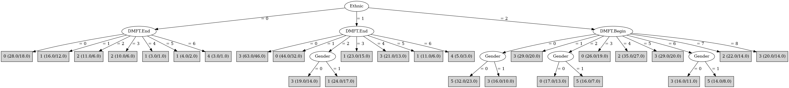

# J48

# SimpleCart Decision Tree

Ethnic=(1)

* DMFT.End=(0)|(1)|(4)|(2)

*   * DMFT.End=(2)|(1)|(3)|(5)|(6)

*   *   * DMFT.Begin=(8)|(5)

*   *   *   * Gender=(1): 1(4.0/4.0)

*   *   *   * Gender!=(1): 3(3.0/4.0)

*   *   * DMFT.Begin!=(8)|(5)

*   *   *   * DMFT.Begin=(0)|(1)|(6)

*   *   *   *   * DMFT.Begin=(6): 0(4.0/4.0)

*   *   *   *   * DMFT.Begin!=(6)

*   *   *   *   *   * DMFT.Begin=(1): 1(3.0/3.0)

*   *   *   *   *   * DMFT.Begin!=(1)

*   *   *   *   *   *   * Gender=(1): 0(5.0/5.0)

*   *   *   *   *   *   * Gender!=(1): 1(2.0/5.0)

*   *   *   * DMFT.Begin!=(0)|(1)|(6)

*   *   *   *   * DMFT.Begin=(4): 4(5.0/5.0)

*   *   *   *   * DMFT.Begin!=(4): 0(7.0/24.0)

*   * DMFT.End!=(2)|(1)|(3)|(5)|(6)

*   *   * DMFT.Begin=(5)|(1)|(0)|(6)|(8)

*   *   *   * DMFT.Begin=(5): 3(4.0/5.0)

*   *   *   * DMFT.Begin!=(5)

*   *   *   *   * DMFT.End=(4): 1(3.0/3.0)

*   *   *   *   * DMFT.End!=(4): 3(13.0/33.0)

*   *   * DMFT.Begin!=(5)|(1)|(0)|(6)|(8)

*   *   *   * Gender=(1): 2(3.0/4.0)

*   *   *   * Gender!=(1)

*   *   *   *   * DMFT.Begin=(7)|(4): 5(3.0/3.0)

*   *   *   *   * DMFT.Begin!=(7)|(4): 1(3.0/7.0)

* DMFT.End!=(0)|(1)|(4)|(2)

*   * DMFT.Begin=(8)|(5)|(1)|(4)|(6)|(2): 4(11.0/18.0)

*   * DMFT.Begin!=(8)|(5)|(1)|(4)|(6)|(2): 1(5.0/5.0)

Ethnic!=(1)

* DMFT.Begin=(8)|(5)|(1)|(0)

*   * DMFT.End=(0)

*   *   * Gender=(1): 3(11.0/17.0)

*   *   * Gender!=(1)

*   *   *   * DMFT.Begin=(8)|(1): 3(5.0/5.0)

*   *   *   * DMFT.Begin!=(8)|(1)

*   *   *   *   * Ethnic=(2)|(1): 5(7.0/18.0)

*   *   *   *   * Ethnic!=(2)|(1): 0(2.0/4.0)

*   * DMFT.End!=(0)

*   *   * DMFT.Begin=(8)|(5)|(1)|(2)|(3)|(4)|(6)|(7)

*   *   *   * DMFT.End=(6): 4(4.0/4.0)

*   *   *   * DMFT.End!=(6)

*   *   *   *   * Ethnic=(2)|(1)

*   *   *   *   *   * DMFT.Begin=(8)

*   *   *   *   *   *   * DMFT.End=(5): 1(2.0/3.0)

*   *   *   *   *   *   * DMFT.End!=(5): 2(3.0/6.0)

*   *   *   *   *   * DMFT.Begin!=(8): 3(14.0/32.0)

*   *   *   *   * Ethnic!=(2)|(1)

*   *   *   *   *   * DMFT.Begin=(5): 2(3.0/4.0)

*   *   *   *   *   * DMFT.Begin!=(5): 1(4.0/4.0)

*   *   * DMFT.Begin!=(8)|(5)|(1)|(2)|(3)|(4)|(6)|(7)

*   *   *   * Gender=(1): 5(4.0/3.0)

*   *   *   * Gender!=(1): 1(4.0/6.0)

* DMFT.Begin!=(8)|(5)|(1)|(0)

*   * DMFT.End=(0)|(1)|(4)

*   *   * DMFT.Begin=(2)|(6)|(3)|(4)|(0)|(1)|(5)|(8)

*   *   *   * DMFT.End=(4)|(1)|(2)|(3)|(5)|(6)

*   *   *   *   * DMFT.Begin=(6)|(4): 2(5.0/20.0)

*   *   *   *   * DMFT.Begin!=(6)|(4)

*   *   *   *   *   * DMFT.End=(4): 0(3.0/5.0)

*   *   *   *   *   * DMFT.End!=(4)

*   *   *   *   *   *   * DMFT.Begin=(3): 1(2.0/5.0)

*   *   *   *   *   *   * DMFT.Begin!=(3): 0(4.0/10.0)

*   *   *   * DMFT.End!=(4)|(1)|(2)|(3)|(5)|(6): 0(9.0/18.0)

*   *   * DMFT.Begin!=(2)|(6)|(3)|(4)|(0)|(1)|(5)|(8): 5(3.0/5.0)

*   * DMFT.End!=(0)|(1)|(4)

*   *   * Ethnic=(2)|(1)

*   *   *   * DMFT.Begin=(2)|(6)|(3)|(0)|(1)|(5)|(8)

*   *   *   *   * Gender=(1)

*   *   *   *   *   * DMFT.End=(5)|(3)|(0)|(1)|(4)|(6): 2(3.0/9.0)

*   *   *   *   *   * DMFT.End!=(5)|(3)|(0)|(1)|(4)|(6): 5(6.0/2.0)

*   *   *   *   * Gender!=(1)

*   *   *   *   *   * DMFT.End=(3): 5(3.0/5.0)

*   *   *   *   *   * DMFT.End!=(3)

*   *   *   *   *   *   * DMFT.Begin=(3): 5(2.0/3.0)

*   *   *   *   *   *   * DMFT.Begin!=(3): 2(4.0/8.0)

*   *   *   * DMFT.Begin!=(2)|(6)|(3)|(0)|(1)|(5)|(8)

*   *   *   *   * DMFT.End=(6)|(3): 0(3.0/11.0)

*   *   *   *   * DMFT.End!=(6)|(3)

*   *   *   *   *   * DMFT.Begin=(7)|(0)|(1)|(2)|(3)|(5)|(6)|(8): 2(6.0/5.0)

*   *   *   *   *   * DMFT.Begin!=(7)|(0)|(1)|(2)|(3)|(5)|(6)|(8): 4(2.0/3.0)

*   *   * Ethnic!=(2)|(1): 2(8.0/6.0)

# PART

Decision list:

conditions|predicted class
---|---
Ethnic = 1 AND DMFT.Begin != 8 AND DMFT.End != 5 AND DMFT.Begin = 7 AND DMFT.End != 2| 3 (10.0/6.0)
DMFT.End = 6 AND DMFT.Begin = 8| 4 (7.0/2.0)
Ethnic = 1 AND DMFT.Begin != 7 AND DMFT.Begin != 8 AND DMFT.End != 5 AND DMFT.End = 3 AND DMFT.Begin != 3 AND DMFT.Begin != 4| 4 (11.0/5.0)
Ethnic = 1 AND DMFT.End = 3| 1 (11.0/5.0)
Ethnic != 2 AND DMFT.Begin = 8| 1 (11.0/6.0)
DMFT.End = 6 AND Gender = 0| 5 (3.0)
Ethnic = 1 AND DMFT.End = 5| 1 (8.0/4.0)
Ethnic = 1 AND DMFT.Begin != 7 AND DMFT.Begin = 4 AND Gender = 0 AND DMFT.End != 2| 3 (4.0/2.0)
Ethnic = 1 AND DMFT.Begin != 7 AND DMFT.Begin = 4 AND DMFT.End != 0| 4 (11.0/5.0)
Ethnic = 1 AND DMFT.Begin != 7 AND DMFT.Begin != 4 AND DMFT.End = 4| 3 (15.0/8.0)
Ethnic = 1 AND DMFT.Begin != 4 AND DMFT.Begin != 7 AND DMFT.Begin != 6 AND DMFT.Begin = 5| 3 (13.0/9.0)
Ethnic = 1 AND DMFT.Begin != 4 AND DMFT.Begin != 7 AND DMFT.Begin = 6| 0 (11.0/6.0)
DMFT.End = 5 AND DMFT.Begin != 8 AND DMFT.Begin != 7| 4 (11.0/7.0)
Ethnic = 1 AND DMFT.Begin != 4 AND DMFT.Begin != 7 AND DMFT.End = 1 AND DMFT.Begin != 1 AND Gender != 0 AND DMFT.Begin = 0| 0 (7.0/3.0)
DMFT.End = 5 AND DMFT.Begin = 7| 2 (9.0/5.0)
DMFT.End != 5 AND DMFT.End = 0 AND Ethnic = 1 AND DMFT.Begin != 4 AND DMFT.Begin != 2| 3 (48.0/34.0)
DMFT.End != 5 AND DMFT.Begin != 8 AND DMFT.Begin = 5 AND Ethnic != 0 AND DMFT.End != 2 AND DMFT.End != 4| 1 (17.0/11.0)
DMFT.Begin = 5 AND Ethnic != 0| 3 (8.0/4.0)
DMFT.End != 5 AND DMFT.End = 0 AND DMFT.Begin != 6 AND Gender != 0 AND DMFT.Begin != 2 AND DMFT.Begin != 3 AND DMFT.Begin != 1 AND DMFT.Begin != 4| 3 (24.0/13.0)
DMFT.Begin != 5 AND DMFT.End != 5 AND DMFT.Begin = 8| 3 (11.0/7.0)
DMFT.Begin != 8 AND DMFT.Begin != 5 AND DMFT.Begin = 7 AND Ethnic != 1 AND DMFT.End != 3 AND DMFT.End != 1| 2 (7.0/2.0)
Ethnic != 2 AND DMFT.Begin != 7 AND DMFT.End != 4 AND DMFT.End = 3 AND Gender != 0| 2 (6.0/2.0)
DMFT.Begin != 5 AND Ethnic = 2 AND DMFT.Begin != 8 AND DMFT.Begin = 1| 3 (28.0/19.0)
DMFT.Begin != 8 AND DMFT.Begin != 5 AND DMFT.Begin = 7 AND DMFT.End != 1| 0 (7.0/3.0)
DMFT.Begin != 7 AND DMFT.Begin != 8 AND DMFT.Begin != 5 AND Ethnic = 2 AND DMFT.Begin = 3 AND DMFT.End != 3| 0 (22.0/15.0)
Ethnic = 2 AND DMFT.End != 5 AND DMFT.Begin != 3 AND DMFT.Begin != 7 AND DMFT.Begin = 6 AND DMFT.End != 0| 5 (24.0/17.0)
DMFT.Begin != 7 AND DMFT.Begin != 8 AND DMFT.Begin != 5 AND DMFT.End = 4| 1 (13.0/8.0)
DMFT.Begin != 7 AND DMFT.Begin = 8| 1 (5.0/3.0)
DMFT.Begin = 7| 4 (4.0/2.0)
DMFT.Begin = 6 AND Ethnic = 0| 0 (3.0/1.0)
DMFT.Begin != 6 AND DMFT.Begin != 5 AND DMFT.Begin = 1| 1 (15.0/10.0)
DMFT.Begin != 6 AND DMFT.Begin != 5 AND Ethnic = 2 AND DMFT.End = 2 AND Gender = 0| 2 (7.0/4.0)
DMFT.Begin != 6 AND DMFT.Begin != 5 AND Ethnic = 2 AND DMFT.Begin != 3 AND DMFT.Begin = 2 AND DMFT.End != 3 AND Gender != 0| 5 (14.0/5.0)
DMFT.Begin != 6 AND DMFT.Begin != 5 AND DMFT.Begin != 2 AND DMFT.End = 3| 2 (14.0/9.0)
DMFT.Begin != 6 AND DMFT.Begin = 5| 2 (5.0/2.0)
DMFT.Begin != 6 AND Ethnic = 2 AND DMFT.End != 3 AND DMFT.Begin = 2 AND DMFT.End = 0| 0 (4.0/1.0)
DMFT.Begin != 6 AND Ethnic = 2| 5 (54.0/36.0)
DMFT.Begin != 6 AND DMFT.Begin = 4 AND DMFT.End != 1| 2 (6.0/2.0)
DMFT.Begin != 6 AND DMFT.Begin != 4 AND Gender = 0 AND DMFT.Begin != 3 AND DMFT.End != 2| 0 (24.0/18.0)
DMFT.Begin != 6 AND DMFT.End != 0 AND DMFT.Begin != 4 AND DMFT.Begin = 2| 4 (16.0/11.0)
DMFT.Begin != 6 AND Ethnic = 0 AND DMFT.Begin != 3| 1 (7.0/3.0)
Gender = 0 AND DMFT.Begin = 3| 2 (10.0/7.0)
Gender != 0| 4 (8.0/4.0)
| 3 (4.0/1.0)

# JRip

Decision list:

conditions|predicted class
---|---
(Ethnic = 2) and (DMFT.Begin = 2) and (Gender = 1)|5 (16.0/7.0)
|3 (541.0/431.0)

# Decision Table

Non matches covered by Majority class

ethnic|target
---|---
1|1
0|2
2|5

